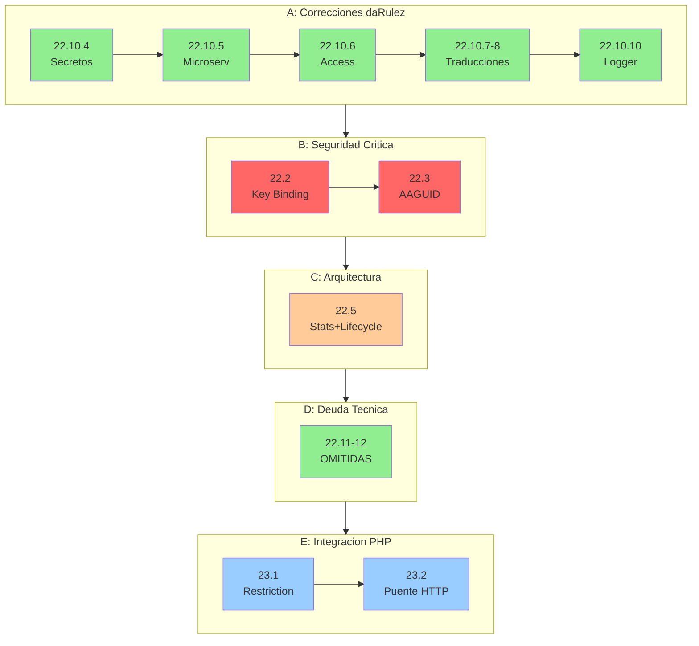

# ROADMAP - Fuente de Verdad del Proyecto

> Ultima actualizacion: 2025-12-18
> Base: main consolidado desde fase-22.10.3
> Build: OK | Tests: 155/155 pasando

---

## Resumen de Estado

| Fase | Descripcion | Estado |
|------|-------------|--------|
| 1-18 | Fundamentos, FIDO2, QR, Pipeline, SoC, Access Gateway | COMPLETADA |
| 19-20 | Separacion Dominios y Limpieza Legacy | COMPLETADA |
| 21.1-21.3 | Unificar Frontend, Access Gateway, Eliminar guest/ | COMPLETADA |
| 22.1 | Validacion TOTP | COMPLETADA |
| 22.4 | Extraer Persistencia | COMPLETADA |
| 22.6-22.9 | Inyeccion SessionKeyQuery, QR Ports, Participation, /dev/ | COMPLETADA |
| 22.10-22.10.3 | Mover WebSocketAuth, JWT, Emojis, Zod | COMPLETADA |
| 22.10.4-22.10.10 | Correcciones Auditoria daRulez (secretos, access, traducciones, logger) | COMPLETADA |
| ~~22.10.9~~ | ~~Traducir tests (AAA ya es estándar)~~ | **OMITIDA** |
| **22.2** | **Session Key Binding (CRITICO)** | **PENDIENTE** |
| **22.3** | **Validar AAGUID (CRITICO)** | **PENDIENTE** |
| **22.5** | **Stats + QR Lifecycle** | **PENDIENTE** |
| ~~22.11-22.12~~ | ~~Deuda Tecnica Opcional~~ | **OMITIDAS** |
| **23** | **Integracion PHP (Restriction + Puente)** | **PENDIENTE** |
| 24 | Infraestructura y Operaciones | PENDIENTE |
| 25 | Testing E2E y Calidad | PENDIENTE |

---

## Politica de Seleccion de Modelo IA

| Modelo | Usar cuando |
|--------|-------------|
| Sonnet | Tareas bien especificadas, patrones existentes, refactoring mecanico |
| Opus | Decisiones arquitectonicas, ambiguedad, razonamiento complejo, seguridad, criptografia |

---

## Orden de Ejecucion



**Leyenda:** Rojo oscuro = CRITICO, Rojo claro = MAYOR, Naranja = Arquitectura, Verde = Omitida/Completada, Azul = Integracion

---

## Arquitectura Objetivo

Segun `spec-architecture.md` y `Caracterizacion del Ecosistema`:

```
backend/
├── access/          # Gateway lectura (4 capas: domain, application, infrastructure, presentation)
├── attendance/      # Validacion QR (Pipeline 12 stages, Stats, Fraud Metrics)
├── auth/            # JWT validation (solo valida, nunca emite)
├── enrollment/      # FIDO2 devices (Orchestrator, Policy 1:1)
├── session/         # ECDH login (session_key con credentialId binding)
├── restriction/     # Integracion PHP (stub → real)
└── shared/ports/    # Interfaces cross-domain
```

---

## BLOQUE A: Correcciones Auditoria daRulez

### Fase 22.10.4: Centralizar secretos en .env y validar en runtime

**Rama:** `fase-22.10.4-centralize-secrets`
**Modelo:** Sonnet
**Severidad:** MAYOR (viola daRulez 6.6)
**Referencia:** daRulez.md seccion 6.6 - "Los secretos nunca se documentan con valores reales"
**Estado:** COMPLETADA (2025-12-18)
**Commit:** e3172f9

**Situación actual:**

1. `.env.example` existe pero le falta `SERVER_MASTER_SECRET`
2. `compose.yaml` tiene valores hardcodeados en lugar de usar `${VAR}` de `.env`
3. `config/index.ts` tiene defaults inseguros que permiten iniciar sin `.env`

**Archivos a modificar:**

- `.env.example` - Agregar variable faltante
- `.env` - Mantener sincronizado con `.env.example`
- `compose.yaml` - Usar variables de entorno sin defaults
- `node-service/src/shared/config/index.ts` - Validar variables críticas

**Tareas:**

- [x] Agregar `SERVER_MASTER_SECRET` a `.env.example` con documentación
- [x] Actualizar `compose.yaml`: agregar `env_file: .env` y usar `${VAR}` sin defaults
- [x] Modificar `config/index.ts`: eliminar defaults y agregar `validateRequiredEnvVars()`
- [x] Verificar build y tests: 155/155 pasando
- [x] Commit atómico: e3172f9

**Criterio de exito:** CUMPLIDO
- Aplicación falla al iniciar sin `.env` con mensaje claro
- `.env.example` contiene TODAS las variables con valores de referencia
- `compose.yaml` usa `env_file` y no tiene secrets hardcodeados

---

### Fase 22.10.5: Eliminar mencion de microservicios

**Rama:** `fase-22.10.5-remove-microservices-mention`
**Modelo:** Sonnet
**Severidad:** MAYOR (viola daRulez 2.1)
**Referencia:** daRulez.md seccion 2.1 - "Microservicios estan prohibidos"
**Estado:** COMPLETADA (2025-12-18)
**Commit:** f36ed52

**Archivo:** `node-service/src/shared/ports/index.ts`

**Tareas:**

- [x] Modificar comentario L11: eliminar "Preparacion para microservicios"
- [x] Reemplazar por beneficios reales: desacoplamiento, testing, cambio de implementaciones
- [x] Verificar: `grep -r "microservicio" node-service/` → 0 resultados
- [x] Build y tests: 155/155 [OK]
- [x] Commit atómico: f36ed52

**Criterio de exito:** CUMPLIDO - Cero menciones de microservicios en codigo.

---

### Fase 22.10.6: Completar segmentacion vertical modulo access

**Rama:** `fase-22.10.6-access-vertical-slicing`
**Modelo:** Opus
**Severidad:** MAYOR (viola daRulez 2.2)
**Referencia:** daRulez.md seccion 2.2 - "Cada modulo contiene: dominio, aplicacion, infraestructura, presentacion"
**Estado:** COMPLETADA (2025-12-18)
**Commit:** d7b863b

**Directorio:** `node-service/src/backend/access/`

**Estructura final:**

```
access/
├── domain/                  # [OK] CREADO
│   ├── models.ts            # AccessState, AccessStateType, AccessAction, AccessDeviceInfo
│   └── index.ts
├── application/services/    # [OK] Actualizado imports
├── infrastructure/          # [OK] CREADO (reservado)
│   └── index.ts
├── presentation/            # Existente
└── __tests__/               # Existente
```

**Tareas:**

- [x] Crear `access/domain/models.ts` con tipos inmutables
- [x] Crear `access/domain/index.ts` con exports
- [x] Crear `access/infrastructure/index.ts` (reservado para futuros adaptadores)
- [x] Mover `AccessState` de application/ a domain/
- [x] Actualizar imports en access-gateway.service.ts
- [x] Re-exportar tipos en application/services/index.ts para compatibilidad
- [x] Build y tests: 155/155 [OK]
- [x] Commit atómico: d7b863b

**Criterio de exito:** CUMPLIDO - Modulo access tiene las 4 capas.

---

### Fases 22.10.7 + 22.10.8: Traducir comentarios (restriction + enrollment)

**Rama:** `fase-22.10.7-8-translate-comments`
**Modelo:** Sonnet
**Severidad:** MENOR (viola daRulez 7.4.1)
**Referencia:** daRulez.md seccion 7.4.1 - "Comentarios solo en espanol"
**Estado:** COMPLETADA (2025-12-18)
**Commit:** c0260dc

**Archivos modificados:**

- `restriction/application/services/restriction.service.ts`
- `enrollment/domain/services/one-to-one-policy.service.ts`
- `enrollment/application/orchestrators/enrollment-flow.orchestrator.ts`

**Tareas:**

- [x] restriction.service.ts: traducir JSDoc completo y comentarios inline
- [x] one-to-one-policy.service.ts: traducir metodos validate() y revokeViolations()
- [x] enrollment-flow.orchestrator.ts: traducir metodo attemptAccess() y flujo
- [x] Build y tests: 155/155 pasando
- [x] Commit atomico agrupado: c0260dc

**Criterio de exito:** CUMPLIDO - Comentarios de logica de negocio en espanol

---

### Fase 22.10.9: Traducir comentarios - access tests

**Rama:** `fase-22.10.9-translate-access-tests`
**Modelo:** Sonnet
**Severidad:** MENOR (viola daRulez 7.4.1)
**Estado:** ~~PENDIENTE~~ → **OMITIDA**

**Justificación de omisión:** Los comentarios `// Arrange`, `// Act`, `// Assert`, `// Verify` son convención estándar de testing (patrón AAA) y no requieren traducción. No hay comentarios de lógica de negocio en inglés.

---

### Fase 22.10.10: Reemplazar console.log por logger

**Rama:** `fase-22.10.10-use-structured-logger`
**Modelo:** Sonnet
**Severidad:** MENOR
**Estado:** COMPLETADA (2025-12-18)
**Commit:** 831c58d

**Archivo:** `node-service/src/backend/enrollment/presentation/routes.ts`

**Tareas:**

- [x] Importar logger desde `shared/infrastructure/logger`
- [x] L118-L130: Reemplazar console.log por logger.info/logger.warn/logger.error
- [x] Formato estructurado: `logger.info({ userId, userAgent }, 'Client logs received')`
- [x] Usar switch para mapear niveles: error → logger.error, warn → logger.warn, default → logger.info
- [x] Build y tests: 155/155 pasando
- [x] Commit atómico: 831c58d

**Criterio de exito:** CUMPLIDO - No hay console.log en endpoint client-log, logging estructurado implementado

---

## BLOQUE B: Seguridad Critica

### Fase 22.2: Session Key Binding con credentialId

**Rama:** `fase-22.2-session-binding`
**Modelo:** Opus
**Severidad:** CRITICA
**Referencia:** 
- `Caracterizacion.md` seccion 5: "session_key derivada de ECDH + vinculacion de dispositivo"
- `14-decision-totp-session-key.md`: "La session_key debe estar ligada al dispositivo"

**Problema actual:**

La `session_key` se deriva solo de ECDH shared secret. Si un atacante obtiene el shared secret, puede usarlo en cualquier dispositivo.

**Verificacion:**

```bash
grep -n "credentialId" node-service/src/backend/session/
# Resultado: NO encontrado en HKDF derivation
```

**Arquitectura objetivo:**

```typescript
// Actual (inseguro)
session_key = HKDF(shared_secret, info: "session")

// Objetivo (seguro)
session_key = HKDF(shared_secret, info: "session:" + credentialId)
```

**Nota arquitectónica:** `HkdfService` está actualmente en `enrollment/infrastructure/crypto/` pero debería estar en `session/` ya que `session_key` es su responsabilidad principal. Considerar mover como parte de esta fase.

**Tareas:**

- [ ] **OPCIONAL:** Mover `HkdfService` de `enrollment/infrastructure/crypto/` a `session/infrastructure/crypto/`
- [ ] Modificar `HkdfService.deriveSessionKey()` para incluir credentialId en info:
  ```typescript
  // Antes
  async deriveSessionKey(sharedSecret: Buffer): Promise<Buffer>
  // Después  
  async deriveSessionKey(sharedSecret: Buffer, credentialId: string): Promise<Buffer>
  ```
- [ ] Actualizar info de HKDF: `'attendance-session-key-v1:' + credentialId`
- [ ] Actualizar `LoginEcdhUseCase` para pasar credentialId
- [ ] Actualizar frontend `session-key.store.ts` para derivar igual
- [ ] Invalidar sesiones existentes (requieren re-login)
- [ ] Agregar tests de binding
- [ ] Verificar build y tests
- [ ] Commit: `feat(session): agregar binding de session_key con credentialId`

**Dependencias:** Requiere BLOQUE A completado.

**Criterio de exito:** session_key diferente para diferentes credentialId.

---

### Fase 22.3: Validar AAGUID de dispositivo

**Rama:** `fase-22.3-aaguid-validation`
**Modelo:** Opus
**Severidad:** CRITICA
**Referencia:** `Caracterizacion.md` seccion 4: "Subsistema de Enrolamiento - vinculacion fisica mediante FIDO2"

**Estado actual:**

- Columna `aaguid` en tabla `devices` existe
- Se almacena durante enrollment
- NO se valida contra whitelist

**Problema:**

Cualquier dispositivo FIDO2 puede enrollarse, incluyendo emuladores o dispositivos no autorizados.

**Arquitectura objetivo:**

```typescript
// config/aaguid-whitelist.ts
export const ALLOWED_AAGUIDS = [
  'de1e552d-db1d-4423-a619-566b625cdc84', // Windows Hello
  '6028b017-b1d4-4c02-b4b3-afcdafc96bb2', // Android Keystore
  // etc.
];

// Durante enrollment
if (!ALLOWED_AAGUIDS.includes(aaguid)) {
  throw new Error('Dispositivo no autorizado');
}
```

**Tareas:**

- [ ] Crear `shared/config/aaguid-whitelist.ts` con lista inicial
- [ ] Crear `enrollment/domain/services/aaguid-validator.service.ts`
- [ ] Integrar validacion en `FinishEnrollmentController`
- [ ] Agregar variable de entorno `AAGUID_VALIDATION_ENABLED` (default: true en prod)
- [ ] Crear tests
- [ ] Documentar como agregar nuevos AAGUIDs
- [ ] Commit: `feat(enrollment): validar AAGUID contra whitelist`

**Dependencias:** Requiere 22.2 completada.

**Criterio de exito:** Dispositivos con AAGUID no autorizado son rechazados.

---

## BLOQUE C: Arquitectura

### Fase 22.5: Extraer Stats + QR Lifecycle

**Rama:** `fase-22.5-stats-qr-lifecycle`
**Modelo:** Opus
**Severidad:** MAYOR
**Referencia:** 
- `spec-qr-validation.md` seccion "Calculo de Certeza"
- `Caracterizacion.md` seccion 8: "Pipeline de Validacion - Response Time y certeza"

**Problema actual:**

`CompleteScanUseCase` tiene acoplamiento directo con:
- `calculateStats()` - importa funcion directamente
- `generateNextQR()` - recibe callback, pero logica interna

**Arquitectura objetivo:**

```
CompleteScanUseCase
  → IAttendanceStatsService (calcular certeza)
  → IQRLifecycleService (generar siguiente QR via ports)
```

**Tareas:**

- [ ] Crear `attendance/domain/services/stats.service.ts` con `IAttendanceStatsService`
- [ ] Crear `shared/ports/attendance-stats.port.ts` con interface
- [ ] Crear `attendance/application/services/qr-lifecycle.service.ts`
- [ ] Usar `IQRGenerator` y `IPoolBalancer` existentes (22.7)
- [ ] Refactorizar `CompleteScanUseCase` para usar servicios inyectados
- [ ] Actualizar `complete-scan-deps.factory.ts`
- [ ] Crear tests unitarios para cada servicio
- [ ] Verificar build y tests
- [ ] Commit: `refactor(attendance): extraer stats y lifecycle a servicios (SoC)`

**Dependencias:** Requiere BLOQUE B completado.

**Criterio de exito:** CompleteScanUseCase no importa directamente de qr-projection/.

---

## BLOQUE D: Deuda Tecnica Opcional

### Fases 22.11-22.12

**Modelo:** Sonnet
**Estado:** ~~PENDIENTE~~ → **OMITIDAS** (verificado 2025-12-18)

**Justificación de omisión:**

- **22.11:** Búsqueda de `isDevelopment|isProduction` en backend/ retornó 0 resultados. No hay feature flags legacy.
- **22.12:** No hay container DI legacy detectado. La composición manual actual es intencional y funciona correctamente.

**Resultado:** Estas fases pueden eliminarse del roadmap activo.

---

## BLOQUE E: Integracion PHP (FINAL)

### Fase 23.1: Implementar Restriction Service

**Rama:** `fase-23.1-restriction-integration`
**Modelo:** Opus
**Referencia:** 
- `spec-architecture.md` seccion "Dominio: Restriction (stub)"
- `Caracterizacion.md` seccion 3: "Control de Acceso - estado BLOCKED"

**Estado actual:** Stub que siempre retorna `{ blocked: false }`

**Arquitectura objetivo:**

```typescript
// Conectar con PHP via HTTP interno
async isBlocked(userId: number): Promise<RestrictionResult> {
  const response = await fetch(`http://php-service/api/restrictions/${userId}`);
  return response.json();
}
```

**Tareas:**

- [ ] Definir contrato HTTP con PHP: `GET /api/restrictions/{userId}`
- [ ] Implementar `RestrictionService.checkRestrictions()` real
- [ ] Agregar timeout y fallback (si PHP no responde: no bloquear)
- [ ] Agregar cache en Valkey (TTL 5 min)
- [ ] Tests con mock de PHP
- [ ] Documentar endpoints requeridos en PHP
- [ ] Commit: `feat(restriction): implementar integracion con PHP`

**Dependencias:** Requiere BLOQUE C completado + coordinacion con equipo PHP.

---

### Fase 23.2: Puente HTTP Node-PHP

**Rama:** `fase-23.2-node-php-bridge`
**Modelo:** Opus
**Referencia:** `spec-architecture.md` seccion 2.3: "PHP: autenticacion, usuarios, cursos, proxy HTTP"

**Objetivo:** Establecer comunicacion bidireccional Node ↔ PHP para:
- Restricciones (PHP → Node)
- Notificaciones de asistencia (Node → PHP)
- Sincronizacion de cursos/sesiones

**Tareas:**

- [ ] Documentar todos los endpoints requeridos
- [ ] Implementar cliente HTTP en Node con retry logic
- [ ] Implementar autenticacion interna (JWT interno o API key)
- [ ] Tests de integracion
- [ ] Runbook de troubleshooting

---

## Fases Futuras (24-25)

### Fase 24: Infraestructura y Operaciones

- [ ] Configuracion de produccion (secrets management)
- [ ] Monitoring y alertas
- [ ] Backup y recuperacion
- [ ] Documentacion de despliegue

### Fase 25: Testing E2E y Calidad

- [ ] Tests E2E con Playwright
- [ ] Tests de carga
- [ ] Auditoria de seguridad final
- [ ] Documentacion de usuario

---

## Documentos de Referencia

| Documento | Proposito | Ubicacion |
|-----------|-----------|-----------|
| `daRulez.md` | Reglas de desarrollo (FUENTE DE VERDAD) | Raiz |
| `spec-architecture.md` | Arquitectura y dominios | Raiz |
| `spec-qr-validation.md` | Flujo de validacion QR | Raiz |
| `Caracterizacion del Ecosistema.md` | Vision completa del sistema | documents/04-caracterizacion/ |
| `14-decision-totp-session-key.md` | Derivacion de claves TOTP | documents/03-especificaciones-tecnicas/ |
| `db-schema.md` | Esquema de base de datos | Raiz |

---

## Ramas a Limpiar

```bash
# Ejecutar despues de merge a main
git branch -d fase-22.10.4-centralize-secrets
git branch -d fase-22.10.5-remove-microservices-mention
git branch -d fase-22.10.6-access-vertical-slicing
git branch -d fase-22.10.7-8-translate-comments
git branch -d fase-22.10.3-resolve-zod-todos
git branch -d fase-22.10.2-remove-emoji-logs
git branch -d fase-22.10.1-remove-jwt-generation
git branch -d fase-22.10-move-websocket-auth
git branch -d fase-22.4-extract-persistence
git branch -d fase-22.8-decompose-participation
git branch -d fase-22.9-remove-dev-endpoints
git branch -d fase-22.7-qr-projection-ports
git branch -d fase-22.6-inject-session-query
git branch -d fase-22.1-totp-validation
git branch -d fase-21.3-eliminar-guest
git branch -d fase-21.2-qr-reader-access-gateway
git branch -d fase-21.1.3-auto-revoke-enrollment
git branch -d fase-21.1.2-access-gateway-orchestrator
git branch -d fase-21.1.1-fix-login-service-authclient
git branch -d fase-21.1-shared-enrollment-services
git branch -D fase-22.5-extract-stats-and-qr-lifecycle  # Incompatible
```

---

## Proxima Accion

Ejecutar en orden estricto:

**BLOQUE A - Compliance daRulez:** [OK] COMPLETADO
1. [OK] **22.10.4** - Centralizar secretos (commit e3172f9)
2. [OK] **22.10.5** - Eliminar microservicios (commit f36ed52)
3. [OK] **22.10.6** - Completar modulo access (commit d7b863b)
4. [OK] **22.10.7-8** - Traducir comentarios (commit c0260dc)
5. [OMITIDA] **22.10.9** - Tests ya usan convención AAA
6. [OK] **22.10.10** - Logger estructurado (commit 831c58d)

**BLOQUE B - Seguridad Crítica (2-3 días):**
6. **22.2** - Session Key Binding con credentialId (CRÍTICO)
7. **22.3** - AAGUID Validation con whitelist (CRÍTICO)

**BLOQUE C - Arquitectura (1 día):**
8. **22.5** - Stats + QR Lifecycle extraction

**BLOQUE E - Integración PHP (FINAL):**
9. **23.1** - Restriction Integration
10. **23.2** - Puente HTTP Node-PHP

**Fases omitidas:**
- ~~22.10.9~~ - Comentarios tests ya usan convención AAA estándar
- ~~22.11-22.12~~ - No hay flags legacy ni DI container

---

*Este documento es la fuente de verdad para tareas pendientes del proyecto.*
