# ROADMAP - Plan de Implementacion

> Fuente de verdad para tareas pendientes.
> Ultima actualizacion: 2025-12-18

**Ultimo commit consolidado:** b9d7583 (fase-22.10.3-resolve-zod-todos)

**Estado actual del proyecto:**
- COMPLETADA: Todas las fases 21 completadas (21.1→21.1.3→21.2→21.3)
- COMPLETADA: Fase 22 BLOQUE A completado (22.6→22.7→22.9)
- COMPLETADA: Fase 22.1 (TOTP validation) completada
- COMPLETADA: Fase 22.4 (AttendancePersistenceService) completada
- COMPLETADA: Fase 22.8 (Decompose ParticipationService) completada
- COMPLETADA: Fase 22.10 (mover WebSocketAuthMiddleware a auth/presentation)
- COMPLETADA: Fase 22.10.1 (Eliminar generacion JWT - daRulez 6.2)
- COMPLETADA: Fase 22.10.2 (Eliminar emojis en logs - daRulez 7.3.1)
- COMPLETADA: Fase 22.10.3 (Resolver TODO de Zod)
- EN PROGRESO: Pendiente merge de branches 22.x a main
- **SIGUIENTE: Fase 22.5 AMPLIADA (stats + QR lifecycle)**
- Tests: 155 pasando
- **Cumplimiento daRulez.md:** 100% (todas las violaciones resueltas)

---

## Resumen de Estado

| Fase | Descripcion | Estado |
|------|-------------|--------|
| 1-18 | Fundamentos, FIDO2, QR, Pipeline, SoC, Access Gateway | COMPLETADA |
| 19-20 | Separacion Dominios y Limpieza Legacy | COMPLETADA |
| **21.1** | **Servicios compartidos enrollment** | COMPLETADA |
| **21.1.1** | **Fix: LoginService sin authClient** | COMPLETADA |
| **21.1.2** | **Access Gateway con Orchestrator** | COMPLETADA |
| **21.1.3** | **Revocación automática 1:1** | COMPLETADA |
| **21.2** | **qr-reader usa Access Gateway** | COMPLETADA |
| **21.3** | **Eliminar feature guest/** | COMPLETADA |
| **22.1** | **Validar TOTPu en Pipeline** | COMPLETADA |
| **22.2** | **Session Key Binding con credentialId** | PENDIENTE |
| **22.3** | **Validar AAGUID de dispositivo** | PENDIENTE |
| **22.4** | **Extraer Persistencia de CompleteScanUseCase** | COMPLETADA |
| **22.5** | **Extraer Stats + QR Lifecycle** | PENDIENTE (AMPLIADA) |
| **22.6** | **Inyectar ISessionKeyQuery en Pipeline** | COMPLETADA |
| **22.7** | **Crear Puertos para QR-Projection** | COMPLETADA |
| **22.8** | **Descomponer ParticipationService** | COMPLETADA |
| **22.9** | **Eliminar endpoints /dev/** | COMPLETADA |
| **22.10** | **Mover WebSocketAuthMiddleware** | COMPLETADA |
| **22.10.1** | **Eliminar generacion JWT (CRITICA)** | COMPLETADA |
| **22.10.2** | **Eliminar emoji en logs** | COMPLETADA |
| **22.10.3** | **Resolver TODO de Zod** | COMPLETADA |
| **22.11** | **Refactorizar ValidationErrorCode** | PENDIENTE (opcional) |
| **22.12** | **Refactorizar FinishEnrollmentController** | PENDIENTE (opcional) |
| **23** | **Puente PHP Produccion** | PENDIENTE |
| **24** | **Infraestructura y Operaciones** | PENDIENTE |
| **25** | **Testing E2E y Calidad** | PENDIENTE |

---

## Politica de Seleccion de Modelo IA

| Modelo | Usar cuando |
|--------|-------------|
| **Sonnet** | Tareas bien especificadas, patrones existentes, refactoring mecanico |
| **Opus** | Decisiones arquitectonicas, ambiguedad, razonamiento complejo, bloqueos |

---

## Arquitectura Actual

Ver `spec-architecture.md` para diagramas completos.

```
backend/
├── access/          # Gateway lectura 
├── attendance/      # Validacion QR 
├── auth/            # JWT 
├── enrollment/      # Solo FIDO2 devices 
├── session/         # ECDH login 
├── restriction/     # Stub PHP 
└── shared/ports/    # Interfaces cross-domain 

frontend/features/
├── enrollment/      # UI registro 
├── qr-reader/       # Lector (refactorizar - 21.2)
├── qr-host/         # Proyector 
└── guest/           # ELIMINAR (21.3)

frontend/shared/services/enrollment/  # Servicios unificados 
```

---

## Fases 1-18: Fundamentos del Sistema - COMPLETADAS

**Trabajo realizado:**

- **Fases 1-16:** Sistema base con FIDO2, QR criptografico, pipeline de validacion
- **Fase 17:** SoC Enrollment con automatas (EnrollmentFlowOrchestrator), OneToOnePolicyService
- **Fase 18:** Access Gateway backend y simplificacion frontend

**Arquitectura lograda:** Sistema funcional con enrollment FIDO2, validacion QR, y gateway de lectura.

---

## Fases 19-20: Separacion de Dominios y Limpieza Legacy - COMPLETADAS

**Estado:** COMPLETADAS
**Commits principales:** b208425, 0391c98, e9dc8e1, f21adc0, 2308b52, 7ce6b8f, c372c2f, 9bc38b5

**Trabajo realizado:**

- **Fase 19:** Separacion de dominios session/ y restriction/ de enrollment/
  - Creado `shared/ports/` con interfaces cross-domain (IDeviceQuery, ISessionQuery, IRestrictionQuery)
  - Dominio `session/` con LoginEcdhUseCase, SessionStateMachine, SessionKeyRepository
  - Dominio `restriction/` con RestrictionService (stub) y adapters
  - Endpoint `POST /api/session/login` registrado
  - Tests: 134/134 pasando

- **Fase 20:** Limpieza de codigo legacy y endpoints obsoletos
  - Eliminado endpoint `/api/enrollment/status`, reemplazado por `GET /api/enrollment/devices`
  - Eliminados controllers duplicados y codigo muerto
  - Access Gateway actualizado para importar desde session/ y restriction/
  - Actualizado spec-qr-validation.md con endpoints correctos
  - Eliminados re-exports legacy en enrollment/
  - Compilacion y tests exitosos

**Arquitectura resultante:**

```
backend/
├── access/          # Gateway lectura (usa shared/ports/)
├── session/         # ECDH login (POST /api/session/login)
├── restriction/     # Stub PHP (listo para implementacion)
├── enrollment/      # Solo FIDO2 devices (limpio)
├── attendance/      # Validacion QR
├── auth/            # JWT
└── shared/ports/    # Interfaces cross-domain
```

---

## Fase 21: Unificar Frontend

**Objetivo:** Eliminar duplicacion de servicios y features obsoletos.
**Rama base:** `fase-21-unify-frontend`
**Modelo recomendado global:** Sonnet (excepto 21.3)

---

### 21.1: Crear servicios compartidos de enrollment

**Rama:** `fase-21.1-shared-enrollment-services`
**Modelo:** Sonnet
**Dificultad:** Media

**Justificacion:** EnrollmentService, LoginService, SessionKeyStore estan duplicados en enrollment/ y guest/. Deben estar en shared/.

**Estructura a crear:**

```
frontend/shared/services/enrollment/
├── enrollment.service.ts
├── login.service.ts
├── session-key.store.ts
├── access.service.ts
└── index.ts
```

**Tareas:**

- [x] Crear carpeta `frontend/shared/services/enrollment/`
- [x] Unificar `enrollment/services/enrollment.service.ts` y `guest/modules/enrollment/enrollment.service.ts`
- [x] Unificar `enrollment/services/login.service.ts` y `guest/modules/enrollment/login.service.ts`
- [x] Unificar `enrollment/services/session-key.store.ts` y `guest/modules/enrollment/session-key.store.ts`
- [x] Crear `index.ts` con exports
- [x] Actualizar imports en `enrollment/main.ts` para usar shared/
- [x] Actualizar imports en `guest/main.ts` para usar shared/
- [x] Actualizar imports en `qr-reader/main.ts` para usar shared/
- [x] Eliminar servicios duplicados de `enrollment/services/`
- [x] Eliminar carpeta completa `guest/modules/enrollment/`
- [x] Verificar compilacion: `npm run build` (exitoso)
- [x] Verificar tests: `npm run test` (134/134 passed)

**Criterio de exito:** COMPLETADO - Un solo lugar para servicios de enrollment. Features activas (qr-host, qr-reader) compilan correctamente.

**Nota:** El feature `guest/` tiene codigo legacy con imports obsoletos pero NO esta en `vite.config.ts` y NO se compila. Sera eliminado en fase 21.3 segun planificacion.

---

### 21.1.1: Fix LoginService sin authClient

**Rama:** `fase-21.1.1-fix-login-service-authclient`
**Modelo:** Sonnet
**Dificultad:** Baja

**Justificacion:** Durante la unificacion de servicios (21.1), las instanciaciones de `LoginService` en `enrollment/main.ts` y `qr-reader/main.ts` quedaron sin pasar el parametro `authClient`. Esto causa que `getAuthToken()` retorne `null` y el login ECDH falle con "No se encontró token de autenticación".

**Archivos afectados:**

- `frontend/features/enrollment/main.ts` (linea ~54)
- `frontend/features/qr-reader/main.ts` (linea ~70)

**Problema actual:**

```typescript
// enrollment/main.ts
this.loginService = new LoginService();  // ERROR: Sin authClient

// login.service.ts
private getAuthToken(): string | null {
  return this.authClient?.getToken() ?? null;  // Retorna null!
}
```

**Solucion:**

```typescript
// enrollment/main.ts
this.loginService = new LoginService(this.authClient);  // CORRECTO: Con authClient

// qr-reader/main.ts
this.loginService = new LoginService(this.authClient);  // CORRECTO: Con authClient
```

**Flujo Git:**

1. Verificar estado: `git status`
2. Crear rama: `git checkout -b fase-21.1.1-fix-login-service-authclient`
3. Realizar cambios
4. Commit atomico: `git commit -m "fix(frontend): pasar authClient a LoginService en enrollment y qr-reader"`
5. Merge a rama base cuando tests pasen

**Tareas:**

- [x] Verificar estado del repositorio: `git status`
- [x] Crear rama de trabajo: `git checkout -b fase-21.1.1-fix-login-service-authclient`
- [x] Modificar `enrollment/main.ts`: cambiar `new LoginService()` a `new LoginService(this.authClient)`
- [x] Modificar `qr-reader/main.ts`: cambiar `new LoginService()` a `new LoginService(this.authClient)`
- [x] Verificar compilacion: `npm run build` (exitoso)
- [x] Verificar tests: `npm run test` (134/134 passed)
- [x] Probar flujo manualmente en navegador (pendiente validacion usuario)
- [x] Commit con mensaje descriptivo

**Dependencias:** Requiere 21.1 completada (YA COMPLETADA).

**Criterio de exito:** COMPLETADA - El boton "Iniciar Sesion" en enrollment debe ejecutar login ECDH exitosamente sin error "No se encontró token de autenticación".

**Commit:** bb0d90a

---

### 21.1.2: Refactorizar Access Gateway para usar EnrollmentFlowOrchestrator

**Rama:** `fase-21.1.2-access-gateway-orchestrator`
**Modelo:** Opus
**Dificultad:** Alta
**Recordatorio:** Comandos npm DEBEN ejecutarse dentro del contenedor Node (daRulez.md Art. 3.2)
**Estado:** COMPLETADA
**Commit:** 04a8df6

**Justificacion:** Access Gateway tiene validacion manual que duplica logica del automata EnrollmentFlowOrchestrator. Esto causa bug critico donde multiples usuarios en el mismo dispositivo NO son detectados porque Access Gateway no valida deviceFingerprint (politica 1:1). El orchestrator YA implementa el automata completo con validacion de deviceFingerprint pero NO se esta usando.

**Problema actual (RESUELTO):**

- Access Gateway hace queries directas sin validar deviceFingerprint
- EnrollmentFlowOrchestrator.attemptAccess() existe pero no se llama
- Bug: Multiples usuarios en mismo dispositivo bypasean enrollment

**Arquitectura lograda:**

```
Access Gateway → EnrollmentFlowOrchestrator.attemptAccess(userId, deviceFingerprint)
                 ↓
                 ACCESS_GRANTED | REQUIRES_ENROLLMENT | REQUIRES_REENROLLMENT
```

**Cambios realizados:**

- [x] Refactorizado `AccessGatewayService` para recibir `EnrollmentFlowOrchestrator`
- [x] Agregado parámetro `deviceFingerprint` a `getState()`
- [x] Mapeado resultados del orchestrator a estados del Gateway:
  - `ACCESS_GRANTED` → verificar sesion → `READY` o `ENROLLED_NO_SESSION`
  - `REQUIRES_ENROLLMENT` → `NOT_ENROLLED`
  - `REQUIRES_REENROLLMENT` → `NOT_ENROLLED` (forzar reenrolamiento)
- [x] Actualizado `routes.ts` para inyectar orchestrator
- [x] Actualizado `AccessStateController` para recibir deviceFingerprint desde query params
- [x] Implementado `DeviceFingerprintGenerator` en frontend
- [x] Actualizado `AccessService` para generar y enviar deviceFingerprint
- [x] Reescrito todos los tests de Access Gateway
- [x] Verificado: `podman exec asistencia-node npm run build` (exitoso)
- [x] Verificado: `podman exec asistencia-node npm run test` (136/136 passed)
- [x] Commit atomico: `04a8df6` con mensaje descriptivo

**Dependencias:** Requiere 21.1.1 completada (LoginService fix).

**Criterio de exito:** COMPLETADO 
- Access Gateway usa orchestrator para toda validacion de enrollment
- Multiples usuarios en mismo dispositivo son detectados y bloqueados correctamente
- deviceFingerprint fluye correctamente frontend → backend
- Tests comprueban mapeo correcto de AccessResult → AccessState
- Build y tests exitosos

---

### 21.1.3: Implementar revocación automática 1:1 en enrollment

**Rama:** `fase-21.1.3-auto-revoke-enrollment`
**Modelo:** Opus
**Dificultad:** Alta
**Recordatorio:** Comandos npm DEBEN ejecutarse dentro del contenedor Node (daRulez.md Art. 3.2)
**Estado:** COMPLETADA
**Commits:** d0ff3a6, 9bb4a19

**Justificacion:** Actualmente `FinishEnrollmentController` NO ejecuta `OneToOnePolicyService.revokeViolations()`. Esto causa que múltiples usuarios puedan enrollarse en el mismo dispositivo sin desenrolamiento automático, violando la política 1:1. El comentario en `FinishEnrollmentUseCase` (línea 37) indica que "el orchestrator DEBE llamar a revokeViolations() ANTES", pero nadie lo hace.

**Problema actual (RESUELTO):**

- `POST /api/enrollment/finish` persiste nuevo dispositivo sin revocar conflictos
- `processEnrollmentConsent()` solo retorna información, no ejecuta revocación
- Base de datos queda con múltiples deviceId activos para mismo deviceFingerprint
- Política 1:1 se viola silenciosamente

**Arquitectura lograda:**

```
POST /api/enrollment/finish
  ↓
FinishEnrollmentController:
  1. Validar WebAuthn ✓
  2. OneToOnePolicyService.revokeViolations(userId, deviceFingerprint) ✓
  3. FinishEnrollmentUseCase.execute() (persiste) ✓
  4. Retornar éxito ✓
```

**Cambios realizados:**

- [x] Verificado estado del repositorio: `git status`
- [x] Creada rama: `git checkout -b fase-21.1.3-auto-revoke-enrollment`
- [x] Modificado `routes.ts`: instanciar `OneToOnePolicyService` y pasarlo a `FinishEnrollmentController`
- [x] Modificado `FinishEnrollmentController`:
  - [x] Agregado `OneToOnePolicyService` como dependencia del constructor
  - [x] ANTES de llamar a `useCase.execute()`: ejecutar `policyService.revokeViolations(userId, deviceFingerprint)`
  - [x] Capturar y loggear información de revocación (previousUserUnlinked, ownDevicesRevoked)
- [x] Actualizado tests de `FinishEnrollmentController`:
  - [x] Mockeado `OneToOnePolicyService.revokeViolations()`
  - [x] Verificado que se llama ANTES de persistir
  - [x] Test: revocación de dispositivos del mismo usuario
  - [x] Test: revocación de dispositivos de otros usuarios (mismo fingerprint)
- [x] Agregado `DeviceRepository.findActiveByDeviceFingerprint()` para buscar conflictos
- [x] Optimizado `DeviceFingerprintGenerator` para dispositivos móviles (Android/iOS)
- [x] Corregido bug de inconsistencia de hash: AccessService usaba `generate()` (8 chars) en lugar de `generateAsync()` (32 chars SHA-256)
- [x] Verificada compilacion: `podman exec asistencia-node npm run build` (exitoso)
- [x] Verificados tests: `podman exec asistencia-node npm run test` (136/136 passed)
- [x] Commits atomicos: 
  - `d0ff3a6`: feat(enrollment): implementar revocación automática 1:1 con deviceFingerprint
  - `9bb4a19`: fix(frontend): usar mismo algoritmo de hash para deviceFingerprint

**Dependencias:** Requiere 21.1.2 completada (Access Gateway con orchestrator).

**Criterio de exito:** COMPLETADO 
- `FinishEnrollmentController` ejecuta `revokeViolations()` automáticamente
- Base de datos mantiene política 1:1 (un deviceFingerprint por usuario activo)
- Tests verifican revocación automática (136/136 passed)
- `DeviceFingerprintGenerator` optimizado para estabilidad en móviles
- Hash consistente (SHA-256) entre AccessService y EnrollmentService

---

### 21.2: Refactorizar qr-reader para usar Access Gateway

**Rama:** `fase-21.2-qr-reader-access-gateway`
**Modelo:** Sonnet
**Dificultad:** Media
**Recordatorio:** Comandos npm DEBEN ejecutarse dentro del contenedor Node (daRulez.md Art. 3.2)
**Estado:** COMPLETADA

**Justificacion:** qr-reader hace verificación local con `sessionKeyStore.hasSessionKey()` y **NO consulta Access Gateway** como requiere `spec-qr-validation.md` Fase 0. Esto permite que múltiples usuarios usen el mismo dispositivo sin revalidación, violando la política 1:1.

**Problema actual (RESUELTO):**

- `checkEnrollmentStatus()` revisa sessionStorage **localmente**
- NO consulta `/api/access/state` con `deviceFingerprint`
- NO valida que el dispositivo actual pertenece al usuario logueado
- Usuario B puede reutilizar session_key de usuario A sin revalidación

**Arquitectura lograda:**

```
qr-reader.checkEnrollmentStatus()
  ↓
1. Generar deviceFingerprint (DeviceFingerprintGenerator)
2. GET /api/access/state?deviceFingerprint={fingerprint}
3. Switch según state:
   - NOT_ENROLLED → window.location.href = '/features/enrollment/'
   - ENROLLED_NO_SESSION → window.location.href = '/features/enrollment/'
   - READY → showScannerUI()
   - BLOCKED → showBlockedMessage()
```

**Archivos afectados:**

- `frontend/features/qr-reader/main.ts` (método `checkEnrollmentStatus()`)
- `frontend/features/qr-reader/index.html` (eliminar secciones enrollment/login inline si existen)

**Flujo Git:**

1. Verificar estado: `git status`
2. Crear rama: `git checkout -b fase-21.2-qr-reader-access-gateway`
3. Realizar cambios atomicos
4. Commit: `git commit -m "refactor(qr-reader): delegar validacion a Access Gateway"`
5. Merge a main cuando tests pasen

**Cambios realizados:**

- [x] Verificado estado del repositorio: `git status`
- [x] Creada rama: `git checkout -b fase-21.2-qr-reader-access-gateway`
- [x] Verificado que `AccessService` existe en `shared/services/enrollment/` (creado en 21.1)
- [x] Modificado `qr-reader/main.ts`:
  - [x] Importado `AccessService` y `AccessState` desde `shared/services/enrollment/`
  - [x] En `checkEnrollmentStatus()`: reemplazada lógica local con llamada a Access Gateway
  - [x] Llamada a `accessService.getState()` (genera deviceFingerprint internamente)
  - [x] Switch según `state`:
    * `NOT_ENROLLED` → `showEnrollmentSection()` (permite enrollment inline)
    * `ENROLLED_NO_SESSION` → `showLoginSection(device)` (permite login inline)
    * `READY` → `showReadyState()` (permitir registro)
    * `BLOCKED` → `showEnrollmentSection()` con mensaje de bloqueo
  - [x] Actualizado `showLoginSection()` para aceptar device del AccessState
  - [x] Mantenidas secciones inline de enrollment/login (por diseño UX)
- [x] Verificada compilacion: `podman exec asistencia-node npm run build` (exitoso)
- [x] Verificados tests: `podman exec asistencia-node npm run test` (136/136 passed)
- [x] Probado flujo completo manualmente con múltiples usuarios 

**Bugs corregidos durante testing manual:**

- [x] **Fix: AccessService no enviaba JWT** - Agregado `Authorization: Bearer` header a `getState()` (commit 8613fbb)
- [x] **Fix: Detección de cambio de usuario** - AuthClient extrae userId del token guardado en `initialize()` para detectar cambios (commit d8e2480)
- [x] **Fix: Race condition en postMessage** - `onAuthenticated()` ya no dispara inmediatamente si hay token; siempre espera AUTH_TOKEN del host PHP (commit d8e2480)
- [x] **Fix: Limpieza granular de sessionStorage** - `clearAuthState()` solo elimina `session_key`, no todo el storage (commit d8e2480)
- [x] **Cleanup: Logs de debug removidos** - Eliminados `console.log` temporales del AccessGatewayService (commit 1c97230)

**Commits de la fase:**
- `cde1149`: refactor(qr-reader): delegar validación a Access Gateway
- `8613fbb`: fix(access-service): enviar JWT en header Authorization
- `d8e2480`: fix(auth): detectar cambio de usuario y esperar postMessage
- `1c97230`: refactor(access-gateway): remover logs de debug

**Dependencias:** 
- Requiere 21.1.2 completada (Access Gateway con orchestrator) 
- Requiere 21.1.3 completada (revocación automática en backend) 

**Criterio de exito:** COMPLETADO 
- qr-reader consulta Access Gateway con deviceFingerprint
- Valida política 1:1 antes de permitir acceso
- Múltiples usuarios en mismo dispositivo son detectados correctamente
- Tests pasan sin regresiones (136/136)
- **Cambio rápido de usuario Carlos→Ana requiere re-enrollment correctamente**

**Criterio de exito:** 
- qr-reader **NO tiene lógica de enrollment propia**
- qr-reader **SIEMPRE** consulta Access Gateway antes de permitir escaneo
- qr-reader redirige a `/features/enrollment/` si estado no es `READY`
- Flujo manual: Usuario B en dispositivo de Usuario A → forzado a re-enrollar → Usuario A desenrolado

---

### 21.3: Eliminar feature guest/

**Rama:** `fase-21.3-eliminar-guest`
**Modelo utilizado:** Sonnet
**Dificultad:** Baja (tras análisis)
**Estado:** COMPLETADA
**Commit:** 5afe4b4
**Recordatorio:** Comandos npm DEBEN ejecutarse dentro del contenedor Node (daRulez.md Art. 3.2)

**Análisis realizado (2025-12-16):**

Tras análisis exhaustivo de guest/ vs enrollment/main.ts y qr-reader:
- guest/ tenía 528 líneas con state machine de 12 estados (legacy)
- ParentMessenger enviaba postMessage a PHP (ENROLLMENT_COMPLETE, ATTENDANCE_COMPLETE)
- PHP modal-reader.php carga `/asistencia/reader/` (qr-reader), NO `/asistencia/guest/`
- vite.config.ts solo incluye qr-host y qr-reader, guest/ NO compila
- Servicios ya unificados en `shared/services/enrollment/` (fase 21.1)

**Conclusión:** guest/ era código 100% legacy sin uso actual.

**Trabajo realizado:**

- [x] Análisis de diferencias guest/ vs enrollment/main.ts
- [x] Verificación: NO hay referencias a guest/ en PHP (grep exhaustivo)
- [x] Verificación: guest/ no está en vite.config.ts (no compila)
- [x] Verificación: ParentMessenger no se usa (qr-reader funciona sin él)
- [x] Eliminada carpeta completa `frontend/features/guest/` (10 archivos, 1,974 líneas)
- [x] Verificación build: `podman exec asistencia-node npm run build` (exitoso, 302 módulos)
- [x] Verificación tests: `podman exec asistencia-node npm run test` (136/136 passed)
- [x] Commit: `5afe4b4` - refactor(frontend): eliminar feature guest/ legacy

**Archivos eliminados:**

```
node-service/src/frontend/features/guest/
├── index.html
├── main.ts (528 líneas, state machine 12 estados)
├── modules/
│   ├── attendance/ (duplicaba qr-reader)
│   ├── communication/parent-messenger.ts (postMessage no usado)
│   ├── scanner/ (duplicaba qr-reader)
└── styles/guest.css
```

**Dependencias:** Requiere 21.1 (servicios compartidos) y 21.2 (qr-reader usa Access Gateway) completadas.

**Criterio de exito:** COMPLETADO 
- Solo existe enrollment/ y qr-reader para flujo de estudiante
- Build y tests exitosos sin guest/
- Sistema más limpio y mantenible

---

## Fase 22: Hardening Criptografico

**Objetivo:** Completar validaciones de seguridad pendientes.
**Rama base:** `fase-22-hardening`
**Modelo recomendado global:** Opus (excepto 22.1 - ver justificacion individual)
**Recordatorio:** Comandos npm DEBEN ejecutarse dentro del contenedor Node (daRulez.md Art. 3.2)

### Diagrama de Dependencias - Orden de Ejecución

**Justificación:** Constitution Article 2.3 (Separation of Concerns) es principio INMUTABLE. Las fases se ejecutan en orden optimizado para lograr arquitectura limpia ANTES de agregar lógica crítica.

```mermaid
graph TD
    %% BLOQUE A: Eliminar Violations SoC
    22.1[22.1 TOTP Validation]
    22.6[22.6 ISessionKeyQuery en Pipeline]
    22.7[22.7 Puertos QR-Projection]
    22.9[22.9 Eliminar /dev/]
    
    %% BLOQUE B: Refactorizar Attendance
    22.4[22.4 Extraer Persistencia]
    22.5[22.5 Stats + QR Lifecycle]
    22.8[22.8 Descomponer ParticipationService]
    
    %% BLOQUE C: Auditoria daRulez
    22.10[22.10 Mover WebSocketAuth]
    22.10.1[22.10.1 Eliminar JWT generation]
    22.10.2[22.10.2 Eliminar emojis]
    22.10.3[22.10.3 Resolver TODO Zod]
    
    %% BLOQUE D: Features Criptográficas
    22.2[22.2 Session Key Binding]
    22.3[22.3 Validar AAGUID]
    
    %% BLOQUE E: Deudas Técnicas Opcionales
    22.11[22.11 ValidationErrorCode]
    22.12[22.12 FinishEnrollmentController]
    
    %% Dependencias BLOQUE A
    22.1 --> 22.6
    22.6 --> 22.7
    22.7 --> 22.9
    
    %% Dependencias BLOQUE B
    22.9 --> 22.4
    22.4 --> 22.8
    
    %% Dependencias BLOQUE C (después de arquitectura limpia)
    22.8 --> 22.10
    22.10 --> 22.10.1
    22.10.1 --> 22.10.2
    22.10.2 --> 22.10.3
    
    %% BLOQUE D depende de arquitectura limpia
    22.10.3 --> 22.5
    22.5 --> 22.2
    22.2 --> 22.3
    
    %% BLOQUE E es opcional y puede ejecutarse después
    22.3 -.-> 22.11
    22.11 -.-> 22.12
    
    style 22.1 fill:#90EE90
    style 22.4 fill:#90EE90
    style 22.6 fill:#90EE90
    style 22.7 fill:#90EE90
    style 22.8 fill:#90EE90
    style 22.9 fill:#90EE90
    style 22.10 fill:#90EE90
    style 22.10.1 fill:#90EE90
    style 22.10.2 fill:#90EE90
    style 22.10.3 fill:#90EE90
    style 22.2 fill:#FFE4B5
    style 22.3 fill:#FFE4B5
    style 22.5 fill:#FFE4B5
    style 22.11 fill:#E0E0E0
    style 22.12 fill:#E0E0E0
```



**Leyenda:**
- Verde: Completadas
- Naranja: Pendientes (próximas)
- Gris: Opcionales (pueden postergarse)

---

## BLOQUE A: Validacion TOTPu

### 22.1: Validar TOTPu en Pipeline

**Rama:** `fase-22.1-totp-validation`
**Modelo:** Sonnet
**Dificultad:** Media

**Justificacion:** Actualmente el backend no valida que el TOTPu enviado por el cliente sea correcto.

**Analisis pre-implementacion (2025-12-17):**
- Patron Stage bien establecido: 11 stages existentes con interfaz clara (`execute(ctx) → Promise<boolean>`)
- `SessionKeyRepository.findByUserId()` ya implementado en dominio session/
- Especificacion TOTP definida en `documents/03-especificaciones-tecnicas/14-decision-totp-session-key.md`
- `DecryptStage` ya usa SessionKeyRepository como ejemplo de stage con I/O
- Tests en `stages.test.ts` con patron claro (20 tests)
- Libreria TOTP probada (otplib) - no implementacion custom

**Escalacion a Opus si:** Problemas de timing attacks, clock skew en produccion, o cambios frontend requeridos.

**Archivo:** `backend/attendance/application/validation-pipeline/stages/`

**Flujo Git:**

1. Verificar estado: `git status`
2. Crear rama: `git checkout -b fase-22.1-totp-validation`
3. Implementar stage de validacion
4. Commit: `git commit -m "feat(attendance): agregar validacion de TOTPu en pipeline"`
5. Merge a main cuando tests pasen

**Tareas:**

- [x] Verificar estado del repositorio: `git status`
- [x] Crear `totp-validation.stage.ts`
- [x] Obtener session_key del usuario desde Valkey
- [x] Generar TOTP esperado con session_key
- [x] Comparar con TOTPu del payload
- [x] Configurar ventana de tolerancia (+/-30 segundos) - `totp.options = { window: 1 }`
- [x] Agregar stage al pipeline en posicion correcta (despues de decrypt)
- [x] Crear tests unitarios (7 tests)
- [x] Verificar tests (dentro del contenedor): `podman exec asistencia-node npm run test` - 143/143 pasando
- [x] Commit con mensaje descriptivo - `42a035c`

**Criterio de exito:** Payload con TOTPu incorrecto es rechazado. Test confirma rechazo

---

## BLOQUE B: Features Criptograficas (Post-Arquitectura Limpia)

### 22.2: Session Key Binding con credentialId

**Rama:** `fase-22.2-session-binding`
**Modelo:** Opus
**Dificultad:** Alta

**Justificacion:** La session_key debe estar ligada al dispositivo especifico para prevenir replay.

**Archivo:** `session/infrastructure/services/hkdf.service.ts` (despues de moverlo)

**Flujo Git:**

1. Verificar estado: `git status`
2. Crear rama: `git checkout -b fase-22.2-session-binding`
3. Implementar binding
4. Commit: `git commit -m "feat(session): agregar binding de session_key con credentialId"`
5. Merge a main cuando tests pasen

**Tareas:**

- [ ] Verificar estado del repositorio: `git status`
- [ ] Modificar `deriveSessionKey()` para incluir credentialId en info HKDF
- [ ] Actualizar frontend para derivar igual
- [ ] Considerar migracion de sesiones existentes
- [ ] Agregar tests
- [ ] Verificar tests (dentro del contenedor): `podman exec asistencia-node npm run test`
- [ ] Commit con mensaje descriptivo

**Consideraciones de migracion:**

- Opcion A: Forzar re-login para todos (simple)
- Opcion B: Periodo de transicion con ambos metodos (complejo)

**Criterio de exito:** session_key diferente para diferentes credentialId.

---


---

### 22.3: Validar AAGUID de dispositivo

**Rama:** `fase-22.3-aaguid-validation`
**Modelo:** Opus
**Dificultad:** Media

**Justificacion:** AAGUID identifica el modelo de autenticador. Puede usarse para whitelist/blacklist.

**Flujo Git:**

1. Verificar estado: `git status`
2. Crear rama: `git checkout -b fase-22.3-aaguid-validation`
3. Implementar extraccion y almacenamiento
4. Commit: `git commit -m "feat(enrollment): extraer y almacenar AAGUID de dispositivo"`
5. Merge a main cuando tests pasen

**Tareas:**

- [ ] Verificar estado del repositorio: `git status`
- [ ] Extraer AAGUID en FinishEnrollmentUseCase
- [ ] Almacenar AAGUID en tabla devices
- [ ] (Opcional) Crear whitelist de AAGUIDs permitidos
- [ ] Agregar tests
- [ ] Verificar tests (dentro del contenedor): `podman exec asistencia-node npm run test`
- [ ] Commit con mensaje descriptivo

**Criterio de exito:** AAGUID almacenado en BD para cada dispositivo.

---

## BLOQUE C: Refactorizar Attendance

### 22.4: Extraer Persistencia de CompleteScanUseCase

**Rama:** `fase-22.4-extract-persistence`
**Modelo:** Sonnet
**Dificultad:** Media
**Estado:** COMPLETADA
**Commit:** 2a91b21
**Tests:** 155 pasando (12 nuevos)
**Fecha:** 2025-12-17
**Recordatorio:** Comandos npm DEBEN ejecutarse dentro del contenedor Node (daRulez.md Art. 3.2)

**Justificacion:** `CompleteScanUseCase.execute()` tiene 477 lineas con 3 metodos de persistencia inline (~167 lineas). Extraer a servicio dedicado aplicando Facade Pattern reduce complejidad y mejora testabilidad.

**Problema actual:**
- UseCase mezcla orquestacion, logica de negocio y persistencia
- Metodos privados `persistValidation()`, `persistResult()`, `persistRegistration()` embebidos
- Dificil mockear persistencia en tests unitarios

**Arquitectura objetivo:**
```
CompleteScanUseCase → AttendancePersistenceService
                      ↓
                      ValidationRepository
                      ResultRepository
                      RegistrationRepository
```

**Archivos a crear:**

- `backend/attendance/application/services/attendance-persistence.service.ts`
- `backend/attendance/application/services/__tests__/attendance-persistence.service.test.ts`

**Archivos a modificar:**

- `backend/attendance/application/complete-scan.usecase.ts`
- `backend/attendance/application/services/index.ts`
- `backend/attendance/presentation/routes.ts`

**Flujo Git:**

1. Verificar estado: `git status`
2. Crear rama: `git checkout -b fase-22.4-extract-persistence`
3. Implementar servicio
4. Commit: `git commit -m "refactor(attendance): extraer persistencia a AttendancePersistenceService (fase 22.4)"`
5. Merge a main cuando tests pasen

**Tareas:**

- [x] Verificar estado del repositorio: `git status`
- [x] Crear rama: `git checkout -b fase-22.4-extract-persistence`
- [x] Crear `AttendancePersistenceService` con metodos:
  - `saveValidationAttempt(params)`: INSERT en validation_attempts
  - `saveAttendanceResult(params)`: INSERT en attendance_results (idempotente)
  - `markRegistrationComplete(studentId, sessionId)`: UPDATE registrations
  - `saveCompleteAttendance(validation, result)`: operacion atomica
- [x] Migrar logica de `persistValidation()` al servicio
- [x] Migrar logica de `persistResult()` al servicio
- [x] Migrar logica de `persistRegistration()` al servicio
- [x] Agregar manejo de duplicados (UNIQUE constraint en attendance_results)
- [x] Exportar en `application/services/index.ts`
- [x] Modificar `CompleteScanUseCase`:
  - Inyectar `AttendancePersistenceService` en `PersistenceDependencies`
  - Reemplazar llamadas a metodos privados por `persistenceService.saveX()`
  - Eliminar metodos privados de persistencia
- [x] Actualizar factory: instanciar servicio y pasar a UseCase
- [x] Crear tests unitarios (12 tests):
  - Test: saveValidationAttempt llama validationRepo correctamente
  - Test: saveAttendanceResult maneja duplicados (UNIQUE constraint)
  - Test: markRegistrationComplete actualiza registrations
  - Test: saveCompleteAttendance ejecuta 3 operaciones en orden
  - Test: errores de BD se propagan correctamente
- [x] Actualizar tests de CompleteScanUseCase (servicio inyectado)
- [x] Verificar tests: `podman exec asistencia-node npm run test` (155 total)
- [x] Verificar build: `podman exec asistencia-node npm run build`
- [x] Commit con mensaje descriptivo

**Criterio de exito:**
- `CompleteScanUseCase.execute()` reducido de 477 a 371 lineas (22% reducción)
- `AttendancePersistenceService` encapsula toda logica PostgreSQL (215 lineas)
- Tests de servicio cubren casos exito, idempotencia, errores (12 tests)
- Tests existentes de UseCase siguen pasando (155 total)
- Build exitoso sin warnings
- SoC mejorado: application/ orquesta, service persiste

**Resultados alcanzados:**
- Servicio con 4 métodos públicos y Facade Pattern aplicado
- Idempotencia garantizada en `saveAttendanceResult()` (verifica duplicados)
- Operación atómica `saveCompleteAttendance()` ejecuta 3 operaciones en secuencia
- 12 tests nuevos con cobertura de casos normales, edge cases y errores
- Factory actualizado con inyección de dependencias correcta

---


---

### 22.5: Extraer Cálculo de Estadísticas y QR Lifecycle

**Rama:** `fase-22.5-extract-stats-and-qr-lifecycle`
**Modelo:** Opus (cambio por complejidad adicional)
**Dificultad:** Alta
**Recordatorio:** Comandos npm DEBEN ejecutarse dentro del contenedor Node (daRulez.md Art. 3.2)

**Justificacion:** `CompleteScanUseCase` tiene responsabilidades de attendance Y qr-projection mezcladas. Debe extraerse:
1. Cálculo de estadísticas (attendance concern)
2. Generación de siguiente QR (qr-projection concern)

**Problema actual:**
- UseCase importa `calculateStats()` directamente (acoplamiento estructural)
- UseCase tiene lógica de `generateNextQR()` y `updatePoolQR()` (violation SoC)
- CompleteScanDependencies incluye responsabilidades de qr-projection:
  ```typescript
  generateNextQR: (...) => Promise<{...}>;  // ← qr-projection concern
  updatePoolQR: (...) => Promise<void>;     // ← qr-projection concern
  ```

**Arquitectura objetivo:**
```
CompleteScanUseCase
  ├──► IAttendanceStatsService (stats)
  └──► IQRLifecycleService (generar siguiente QR, actualizar pool)
       ↓
       QRLifecycleService (implementación via adapters)
```

**Archivos a crear:**

- `backend/attendance/domain/services/attendance-stats.service.ts`
- `backend/attendance/domain/services/__tests__/attendance-stats.service.test.ts`
- `shared/ports/attendance-stats.interface.ts`
- `shared/ports/qr-lifecycle.interface.ts` ← **NUEVO**
- `backend/attendance/infrastructure/adapters/qr-lifecycle.adapter.ts` ← **NUEVO**

**Archivos a modificar:**

- `backend/attendance/application/complete-scan.usecase.ts`
- `backend/attendance/domain/services/index.ts`
- `backend/attendance/presentation/routes.ts`
- `shared/ports/index.ts`

**Flujo Git:**

1. Verificar estado: `git status`
2. Crear rama: `git checkout -b fase-22.5-extract-stats-and-qr-lifecycle`
3. Implementar servicios (2 fases: stats primero, lifecycle segundo)
4. Commit 1: `git commit -m "refactor(attendance): extraer stats a domain service"`
5. Commit 2: `git commit -m "refactor(attendance): delegar QR lifecycle a puerto compartido"`
6. Merge a main cuando tests pasen

**Tareas PARTE 1 - Stats (como estaba planeado):**

- [ ] Verificar estado del repositorio: `git status`
- [ ] Crear rama: `git checkout -b fase-22.5-extract-stats-and-qr-lifecycle`
- [ ] Crear interfaz `IAttendanceStatsService` en `shared/ports/`
- [ ] Crear `AttendanceStatsService` en domain/services/
- [ ] Migrar lógica de `stats-calculator.ts` a método `calculate()`
- [ ] Agregar cálculo de desviación estándar
- [ ] Exportar en `domain/services/index.ts` y `shared/ports/index.ts`
- [ ] Modificar `CompleteScanUseCase`: inyectar y usar statsService
- [ ] Actualizar `routes.ts`: instanciar y pasar servicio
- [ ] Crear tests unitarios (6+ tests de stats)
- [ ] Verificar tests: `podman exec asistencia-node npm run test`
- [ ] Commit: stats extraction

**Tareas PARTE 2 - QR Lifecycle (NUEVO):**

- [ ] Crear interfaz `IQRLifecycleService` en `shared/ports/`:
  ```typescript
  interface IQRLifecycleService {
    generateNextQR(sessionId: string, studentId: number, round: number): Promise<{
      encrypted: string;
      nonce: string;
    }>;
    updatePool(sessionId: string, studentId: number, encrypted: string, round: number): Promise<void>;
  }
  ```
- [ ] Crear `QRLifecycleAdapter` en `infrastructure/adapters/`:
  - Inyecta `IQRGenerator`, `IQRPayloadRepository`, `IPoolBalancer`
  - Implementa métodos delegando a puertos existentes
- [ ] Modificar `CompleteScanDependencies`:
  - Eliminar `generateNextQR`, `updatePoolQR` directos
  - Agregar `qrLifecycleService: IQRLifecycleService`
- [ ] Actualizar `routes.ts`: instanciar adapter y pasar a UseCase
- [ ] Actualizar `complete-scan-deps.factory.ts` si existe
- [ ] Crear tests de QRLifecycleAdapter (mock de puertos)
- [ ] Verificar tests: `podman exec asistencia-node npm run test` (165+)
- [ ] Commit: QR lifecycle delegation

**Criterio de exito:**
- `CompleteScanUseCase` reduce de ~371 a ~180 lineas (51% reducción)
- `AttendanceStatsService` en domain/ con lógica pura
- `QRLifecycleAdapter` delega a puertos de qr-projection
- CompleteScanDependencies SIN referencias directas a qr-projection
- Tests pasan (165+ nuevos incluyendo lifecycle)
- Build exitoso
- **SoC perfecto**: attendance NO conoce implementación de qr-projection

---

## BLOQUE D: Eliminar Violations SoC

### 22.6: Inyectar ISessionKeyQuery en Pipeline

**Rama:** `fase-22.6-inject-session-query`
**Modelo:** Sonnet
**Dificultad:** Media
**Estado:** COMPLETADA
**Commit:** 210fa26

**Justificacion:** `DecryptStage` y `TotpValidationStage` (domain/) importan directamente de `session/infrastructure/`. Esto viola arquitectura limpia. Deben recibir dependencia via interfaz.

**Archivos creados:**

- `shared/ports/session-key-query.interface.ts`
- `backend/attendance/infrastructure/adapters/session-key-query.adapter.ts`

**Archivos modificados:**

- `backend/attendance/domain/validation-pipeline/stages/decrypt.stage.ts`
- `backend/attendance/domain/validation-pipeline/stages/totp-validation.stage.ts`
- `backend/attendance/domain/validation-pipeline/pipeline.factory.ts`
- `backend/attendance/application/validate-scan.usecase.ts`
- `backend/attendance/infrastructure/adapters/complete-scan-deps.factory.ts`
- `backend/attendance/presentation/routes.ts`
- `shared/ports/index.ts`

**Tareas:**

- [x] Verificar estado del repositorio: `git status`
- [x] Crear rama: `git checkout -b fase-22.6-inject-session-query`
- [x] Crear interfaz `ISessionKeyQuery` en `shared/ports/`:

```typescript
interface ISessionKeyQuery {
  findByUserId(userId: number): Promise<SessionKeyData | null>;
}
```

- [x] Crear `SessionKeyQueryAdapter` que implementa interfaz usando `SessionKeyRepository`
- [x] Modificar `DecryptStage` para recibir `ISessionKeyQuery` en constructor
- [x] Modificar `TotpValidationStage` para recibir `ISessionKeyQuery` en constructor
- [x] Eliminar lazy loading (`await import()`) de ambos stages
- [x] Actualizar `pipeline.factory.ts` para recibir e inyectar dependencia
- [x] Actualizar `routes.ts` para crear adapter y pasarlo al factory
- [x] Actualizar `shared/ports/index.ts` con export
- [x] Verificar tests: `podman exec asistencia-node npm run test` (143/143)
- [x] Commit: `refactor(attendance): inyectar ISessionKeyQuery en pipeline stages`

**Criterio de exito:** COMPLETADO

- Stages en domain/ NO importan de infrastructure/
- No hay `await import()` en stages
- Tests pasan sin cambios (143/143)

---


---

### 22.7: Crear Puertos para QR-Projection

**Rama:** `fase-22.7-qr-projection-ports`
**Modelo:** Sonnet
**Dificultad:** Media
**Estado:** COMPLETADA
**Commit:** c0dc4ea

**Justificacion:** `ParticipationService` importa directamente de `qr-projection/` (domain, infrastructure, application). Debe usar interfaces de `shared/ports/` para desacoplamiento.

**Trabajo realizado:**

- [x] Analizar que interfaces ya existen en shared/ports/: `IQRGenerator`, `IPoolBalancer`, `IQRPayloadRepository`
- [x] Crear `QRGeneratorAdapter` en `infrastructure/adapters/`
- [x] Crear `PoolBalancerAdapter` en `infrastructure/adapters/`
- [x] Crear `QRPayloadRepositoryAdapter` en `infrastructure/adapters/`
- [x] Refactorizar `ParticipationService` constructor para inyectar interfaces
- [x] Eliminar imports directos de `qr-projection/domain/`, `/infrastructure/`, `/application/`
- [x] Actualizar `routes.ts` para instanciar adapters e inyectar dependencias
- [x] Actualizar `infrastructure/adapters/index.ts` con exports nuevos
- [x] Verificar tests: `podman exec asistencia-node npm run test` (143/143 pasando)
- [x] Commit atomico: `refactor(attendance): crear puertos para qr-projection (fase 22.7)`

**Criterio de exito:** COMPLETADO

- `attendance/application/` NO importa directamente de `qr-projection/`
- ParticipationService es agnóstica a la implementación concreta de generación/balanceo de QR
- Tests pasan sin cambios (143/143)
- SoC mejorado: attendance depende solo de interfaces públicas

---


---

### 22.8: Descomponer ParticipationService

**Rama:** `fase-22.8-decompose-participation`
**Modelo:** Opus
**Dificultad:** Alta

**Justificacion:** `ParticipationService` tiene múltiples responsabilidades. Aplicar patrón Facade para delegar a servicios especializados.

**Archivos a crear:**

- `backend/attendance/application/services/student-state.service.ts`
- `backend/attendance/application/services/qr-lifecycle.service.ts`
- `backend/attendance/application/services/index.ts`

**Archivos a modificar:**

- `backend/attendance/application/participation.service.ts`
- `backend/attendance/presentation/routes.ts`

**Tareas:**

- [x] Verificar estado del repositorio
- [x] Crear rama: `git checkout -b fase-22.8-decompose-participation`
- [x] Crear `StudentStateService` extrayendo lógica de estado
- [x] Crear `QRLifecycleService` extrayendo lógica de generación/almacenamiento
- [x] Refactorizar `ParticipationService` como Facade (inyecta servicios)
- [x] Verificar tests: `podman exec asistencia-node npm run test` (143/143)
- [x] Commit con mensaje descriptivo (`refactor(attendance): descomponer ParticipationService (fase 22.8)`, f0c73e9)

**Criterio de exito:**

- `ParticipationService` delega a servicios especializados (estado y ciclo de vida QR)
- Servicios nuevos encapsulan responsabilidades únicas
- Build y tests verdes (143/143)

---


---

### 22.9: Eliminar Endpoints de Desarrollo

**Rama:** `fase-22.9-remove-dev-endpoints`
**Modelo:** Sonnet
**Dificultad:** Baja
**Estado:** COMPLETADA
**Commit:** c8da2fd

**Justificacion:** Endpoints `/dev/` en `routes.ts` facilitan bypass de validaciones. Deben eliminarse antes de producción. Los tests deben estar en test suites, no en API pública.

**Trabajo realizado:**

- [x] Identificar bloque de endpoints `/dev/` (líneas ~375-543)
- [x] Eliminar endpoints:
  - `/asistencia/api/attendance/dev/fakes`
  - `/asistencia/api/attendance/dev/balance`
  - `/asistencia/api/attendance/dev/pool/:sessionId`
  - `/asistencia/api/attendance/dev/fraud/:sessionId`
  - `/asistencia/api/attendance/dev/config`
- [x] Eliminar import de `FraudMetricsRepository` (no se necesita sin endpoints)
- [x] Agregar comentario aclarando que testing debe estar en test suites
- [x] Verificar build: `podman exec asistencia-node npm run build` (exitoso)
- [x] Verificar tests: `podman exec asistencia-node npm run test` (143/143 pasando)
- [x] Verificar grep: `grep -r "'/dev/" node-service/src/backend/` (sin resultados)
- [x] Commit atomico: `security(attendance): eliminar endpoints /dev/ (fase 22.9)`

**Criterio de exito:** COMPLETADO

- Todos los endpoints `/dev/` eliminados
- No hay imports innecesarios
- Build y tests exitosos
- API más segura: sin backdoors de testing en producción

---

## BLOQUE E: Auditoria daRulez

### 22.10: Mover WebSocketAuthMiddleware a Auth Domain

**Rama:** `fase-22.10-move-websocket-auth`
**Modelo:** Sonnet
**Dificultad:** Media
**Estado:** COMPLETADA
**Commit:** 91f8d24
**Recordatorio:** Comandos npm DEBEN ejecutarse dentro del contenedor Node (daRulez.md Art. 3.2)

**Justificacion:** `WebSocketAuthMiddleware` en `middleware/` importa directamente de `backend/auth/domain/`. Un middleware transversal NO DEBE depender de módulos específicos. Viola arquitectura hexagonal y Separation of Concerns.

**Problema actual:**
- `middleware/websocket-auth.middleware.ts` importa:
  - `JWTUtils` desde `backend/auth/domain/jwt-utils`
  - `UserId` desde `backend/auth/domain/user-id`
  - `AuthenticatedUser` desde `backend/auth/domain/models`
- Si auth/ cambia, middleware/ se rompe
- Viola daRulez.md Art. 2.2 (Segmentación vertical)

**Arquitectura objetivo:**
```
backend/auth/presentation/
  ├── auth-middleware.ts (HTTP)
  └── websocket-auth.middleware.ts (WebSocket) ← MOVER AQUÍ
```

**Alternativa (si se necesita en otros módulos):**
```
shared/ports/
  └── auth.interface.ts ← Interfaz genérica
backend/auth/infrastructure/adapters/
  └── websocket-auth.adapter.ts ← Implementación
```

**Archivos a modificar:**

- `middleware/websocket-auth.middleware.ts` → MOVER a `backend/auth/presentation/`
- `middleware/index.ts` → Eliminar export de WebSocketAuthMiddleware
- `backend/auth/presentation/index.ts` → Agregar export
- `backend/qr-projection/presentation/websocket-controller.ts` → Actualizar import
- `app.ts` → Actualizar import

**Flujo Git:**

1. Verificar estado: `git status`
2. Crear rama: `git checkout -b fase-22.10-move-websocket-auth`
3. Mover archivo y actualizar imports
4. Commit: `git commit -m "refactor(auth): mover WebSocketAuthMiddleware a auth/presentation (fase 22.10)"`
5. Merge a main cuando tests pasen

**Tareas:**

- [x] Verificar estado del repositorio: `git status`
- [x] Crear rama: `git checkout -b fase-22.10-move-websocket-auth`
- [x] Mover `middleware/websocket-auth.middleware.ts` a `backend/auth/presentation/`
- [x] Actualizar `middleware/index.ts`: eliminar export
- [x] Actualizar `backend/auth/presentation/index.ts`: agregar export (creado nuevo)
- [x] Actualizar `websocket-controller.ts`: cambiar import path
- [x] Actualizar `app.ts`: cambiar import path
- [x] Verificar que NO hay otros imports del middleware antiguo: `grep -r "middleware/websocket-auth" node-service/src/`
- [x] Verificar tests: `podman exec asistencia-node npm run test` (155/155)
- [x] Verificar build: `podman exec asistencia-node npm run build` (302 modulos)
- [x] Commit con mensaje descriptivo: 91f8d24

**Criterio de exito:**
- `middleware/` NO contiene lógica de dominio específica
- WebSocketAuthMiddleware vive en `auth/presentation/` (cohesión modular)
- Imports actualizados correctamente
- Tests pasan sin regresiones (155/155)
- Build exitoso

---


---

### 22.10.1: Eliminar generacion de JWT en Node.js (Auditoria Critica)

**Rama:** `fase-22.10.1-remove-jwt-generation`
**Modelo:** Opus
**Dificultad:** Critica
**Estado:** COMPLETADA
**Commit:** 562328f
**Recordatorio:** Comandos npm DEBEN ejecutarse dentro del contenedor Node (daRulez.md Art. 3.2)

**Justificacion:** Auditoria de cumplimiento de daRulez.md detecto que el modulo `auth/` en Node.js contenia metodos `generate()` y `generateToken()` que violan **daRulez.md Seccion 6.2**: "El modulo Node solo valida fichas JWT (tokens JSON Web), nunca las emite."

**Problema detectado:**
- `JWTUtils.generate()` existia en `node-service/src/backend/auth/domain/jwt-utils.ts:49-55`
- `AuthService.generateToken()` existia en `node-service/src/backend/auth/application/auth.service.ts:26-28`
- Violacion directa: Node.js podia emitir tokens, rompiendo el modelo de seguridad
- Riesgo arquitectonico: Dos fuentes de verdad para emision de JWT

**Analisis realizado:**
- Busqueda de invocaciones en codigo de produccion: 0 encontradas
- Busqueda de usos en tests: 0 encontradas
- Conclusion: Metodos eran codigo muerto pero representaban riesgo de seguridad

**Tareas:**

- [x] Verificar estado del repositorio: `git status`
- [x] Crear rama: `git checkout -b fase-22.10.1-remove-jwt-generation`
- [x] Buscar usos de `generateToken` en produccion: ninguno encontrado
- [x] Buscar usos de `jwtUtils.generate` en produccion: ninguno encontrado
- [x] Eliminar metodo `generate()` de `JWTUtils` en jwt-utils.ts
- [x] Eliminar metodo `generateToken()` de `AuthService` en auth.service.ts
- [x] Verificar compilacion: `podman exec asistencia-node npm run build` (exitoso, 302 modulos)
- [x] Verificar tests: `podman exec asistencia-node npm run test` (155/155 passed)
- [x] Commit: 562328f

**Criterio de exito:** COMPLETADO
- Node.js solo puede validar JWT (metodo `verify()`)
- Node.js NO puede emitir JWT (metodo `generate()` eliminado)
- Cumplimiento daRulez.md Seccion 6.2: 100%
- Tests pasan sin regresiones (155/155)

---


---

### 22.10.2: Eliminar emojis en logs

**Rama:** `fase-22.10.2-remove-emoji-logs`
**Modelo:** Sonnet
**Dificultad:** Baja
**Estado:** COMPLETADA
**Commit:** a3dd9a3
**Recordatorio:** Comandos npm DEBEN ejecutarse dentro del contenedor Node (daRulez.md Art. 3.2)

**Justificacion:** Auditoria de cumplimiento de daRulez.md detecto uso de emojis y emoticones en logs, violando **daRulez.md Seccion 7.3.1**: "Los emojis y emoticones estan prohibidos."

**Archivos modificados:**
- `node-service/src/frontend/features/enrollment/main.ts` (8 ocurrencias)
- `node-service/src/frontend/features/enrollment/services/remote-logger.service.ts` (prefijos en consola)
- `node-service/src/backend/enrollment/presentation/routes.ts` (prefijos en logs remotos)

**Cambios realizados:**
- Eliminados emojis: rocket, checkmarks, warning, success checkmarks
- Reemplazados prefijos emoji por texto: [ERROR], [WARN], [OK], [INFO]
- Mensajes simplificados sin decoracion visual

**Tareas:**

- [x] Verificar estado del repositorio: `git status`
- [x] Crear rama: `git checkout -b fase-22.10.2-remove-emoji-logs`
- [x] Buscar emojis en logs: 3 archivos encontrados
- [x] Eliminar emojis de enrollment/main.ts (8 lineas)
- [x] Eliminar emojis de remote-logger.service.ts (prefijos consola)
- [x] Eliminar emojis de routes.ts (prefijos logs remotos)
- [x] Verificar que no quedan emojis: `find` retorna 0 resultados
- [x] Verificar compilacion: `podman exec asistencia-node npm run build` (302 modulos)
- [x] Verificar tests: `podman exec asistencia-node npm run test` (155/155 passed)
- [x] Commit: a3dd9a3

**Criterio de exito:** COMPLETADO
- Logs sin emojis ni emoticones
- Prefijos de nivel reemplazados por texto plano
- Cumplimiento daRulez.md Seccion 7.3.1: 100%
- Tests pasan sin regresiones (155/155)

---


---

### 22.10.3: Resolver TODO de Zod

**Rama:** `fase-22.10.3-resolve-zod-todos`
**Modelo:** Sonnet
**Dificultad:** Baja
**Estado:** COMPLETADA
**Commit:** b9d7583
**Recordatorio:** Comandos npm DEBEN ejecutarse dentro del contenedor Node (daRulez.md Art. 3.2)

**Justificacion:** Comentario TODO obsoleto en validation.middleware.ts indicaba instalar Zod, pero el sistema funciona correctamente sin esa dependencia usando schemas manuales.

**Archivo modificado:**
- `node-service/src/middleware/validation.middleware.ts` (linea 118)

**Analisis realizado:**
- TODO encontrado: "Instalar Zod: npm install zod (dentro del contenedor)"
- Verificacion de instalacion: Zod NO esta instalado (confirmado con `npm list zod`)
- Busqueda de uso: `validateRequest` exportado pero NO usado en produccion
- Conclusion: Sistema funciona con schemas manuales (CommonSchemas) sin necesitar Zod

**Cambios realizados:**
- Eliminado comentario TODO obsoleto
- Agregada nota clarificando funcionamiento sin Zod
- Documentado que Zod es opcional para uso futuro

**Tareas:**

- [x] Verificar estado del repositorio: `git status`
- [x] Crear rama: `git checkout -b fase-22.10.3-resolve-zod-todos`
- [x] Buscar TODOs relacionados con Zod: 1 encontrado
- [x] Verificar instalacion de Zod: NO instalado
- [x] Verificar uso de validateRequest: NO usado en produccion
- [x] Resolver TODO: eliminar comentario y clarificar funcionamiento
- [x] Verificar compilacion: `podman exec asistencia-node npm run build` (302 modulos)
- [x] Verificar tests: `podman exec asistencia-node npm run test` (155/155 passed)
- [x] Commit: b9d7583

**Criterio de exito:** COMPLETADO
- TODO de Zod resuelto
- Documentacion clarificada sobre funcionamiento sin dependencia
- Sistema mantiene compatibilidad con schemas manuales
- Tests pasan sin regresiones (155/155)

---

## BLOQUE F: Deudas Tecnicas Opcionales

**Objetivo:** Resolver deudas técnicas no críticas identificadas en auditoría.
**Prioridad:** Baja (pueden postergarse a Fase 25 si hay presión de tiempo)

### 22.11: Refactorizar ValidationErrorCode

**Rama:** `fase-22.11-validation-error-code`
**Modelo:** Sonnet
**Dificultad:** Baja
**Estado:** PENDIENTE (opcional, puede postergarse)

**Justificacion:** `ValidationErrorCode` está definido en `attendance/domain/models.ts` pero se usa en contratos públicos (API responses). Debe estar en capa compartida para evitar acoplamiento.

**Problema actual:**
- Enum local se expone en contrato público
- Si se agregan errores, impacta múltiples capas
- Frontend debe importar desde domain interno

**Arquitectura objetivo:**
```
shared/types/validation-errors.ts
  └── ValidationErrorCode (enum compartido)
```

**Archivos a crear:**
- `shared/types/validation-errors.ts`

**Archivos a modificar:**
- `backend/attendance/domain/models.ts` → Re-exportar desde shared
- `frontend/features/qr-reader/types.ts` → Importar desde shared types

**Tareas:**

- [ ] Mover `ValidationErrorCode` a `shared/types/validation-errors.ts`
- [ ] Actualizar imports en attendance/domain/models.ts
- [ ] Actualizar imports en frontend (si existen)
- [ ] Verificar tests: `podman exec asistencia-node npm run test`
- [ ] Commit: `refactor(shared): mover ValidationErrorCode a tipos compartidos`

**Criterio de exito:** Enum compartido, sin duplicación.

---


---

### 22.12: Refactorizar FinishEnrollmentController

**Rama:** `fase-22.12-finish-enrollment-controller-soc`
**Modelo:** Sonnet
**Dificultad:** Baja
**Estado:** PENDIENTE (opcional, puede postergarse)

**Justificacion:** `FinishEnrollmentController` instancia `OneToOnePolicyService` directamente. Debe recibir por inyección de dependencias para mejorar testabilidad.

**Problema actual:**
```typescript
// routes.ts
const policyService = new OneToOnePolicyService(deviceRepository);
const controller = new FinishEnrollmentController(useCase, policyService);
```

**Arquitectura objetivo:**
```typescript
// Controller no conoce implementación, solo contrato
class FinishEnrollmentController {
  constructor(
    private readonly useCase: FinishEnrollmentUseCase,
    private readonly orchestrator: IEnrollmentOrchestrator  // ← Usa orchestrator
  ) {}
}
```

**Archivos a modificar:**
- `backend/enrollment/presentation/controllers/finish-enrollment.controller.ts`
- `backend/enrollment/presentation/routes.ts`

**Tareas:**

- [ ] Modificar controller para recibir orchestrator en lugar de policyService
- [ ] Delegar revocación a `orchestrator.revokeViolations()` (si no existe, agregarlo)
- [ ] Actualizar routes.ts para inyectar orchestrator
- [ ] Actualizar tests de controller (mock orchestrator)
- [ ] Verificar tests: `podman exec asistencia-node npm run test`
- [ ] Commit: `refactor(enrollment): mejorar SoC en FinishEnrollmentController`

**Criterio de exito:** Controller agnóstico a implementación de política 1:1.

---


## Fase 23: Puente PHP Produccion

**Objetivo:** Integrar con el sistema PHP existente para produccion.
**Rama base:** `fase-23-php-bridge`
**Modelo recomendado global:** Sonnet (integracion bien definida)
**Recordatorio:** Comandos npm DEBEN ejecutarse dentro del contenedor Node (daRulez.md Art. 3.2)

---

### 23.1: Endpoint interno para marcar asistencia

**Rama:** `fase-23.1-internal-attendance`
**Modelo:** Sonnet
**Dificultad:** Media

**Justificacion:** El sistema Node valida QR, pero PHP debe registrar la asistencia en su BD.

**Estructura:**

```
backend/attendance/presentation/routes/
  internal.routes.ts
```

**Flujo Git:**

1. Verificar estado: `git status`
2. Crear rama: `git checkout -b fase-23.1-internal-attendance`
3. Implementar endpoint
4. Commit: `git commit -m "feat(attendance): agregar endpoint interno para marcar asistencia"`
5. Merge a main preservando ultimos 4 commits sin mergear

**Tareas:**

- [ ] Verificar estado del repositorio: `git status`
- [ ] Crear `POST /api/internal/mark-attendance`
- [ ] Schema: `{ codigo, rut, ip, certainty, encuesta? }`
- [ ] Validar header `X-Node-Signature` (secreto compartido)
- [ ] Retornar resultado de validacion
- [ ] Agregar tests
- [ ] Verificar tests (dentro del contenedor): `podman exec asistencia-node npm run test`
- [ ] Commit con mensaje descriptivo

**Criterio de exito:** PHP puede llamar a Node para marcar asistencia.

---

### 23.2: Controller PHP para recibir

**Rama:** `fase-23.2-php-controller`
**Modelo:** Sonnet
**Dificultad:** Media

**Ubicacion:** `php-service/src/asistencia-node-integration/`

**Flujo Git:**

1. Verificar estado: `git status`
2. Crear rama: `git checkout -b fase-23.2-php-controller`
3. Implementar controller PHP
4. Commit: `git commit -m "feat(php): agregar controller para recibir asistencia de Node"`
5. Merge a main preservando ultimos 4 commits sin mergear

**Tareas:**

- [ ] Verificar estado del repositorio: `git status`
- [ ] Crear `MarkAttendanceController.php`
- [ ] Agregar ruta en Router (si existe)
- [ ] Validar firma de Node
- [ ] Insertar en BD de PHP
- [ ] Retornar confirmacion
- [ ] Probar flujo manualmente
- [ ] Commit con mensaje descriptivo

**Criterio de exito:** Asistencia aparece en sistema PHP.

---

### 23.3: Encuesta post-validacion

**Rama:** `fase-23.3-survey`
**Modelo:** Sonnet
**Dificultad:** Baja

**Justificacion:** El sistema legacy requiere encuesta despues de marcar asistencia.

**Flujo Git:**

1. Verificar estado: `git status`
2. Crear rama: `git checkout -b fase-23.3-survey`
3. Implementar componente de encuesta
4. Commit: `git commit -m "feat(frontend): agregar componente de encuesta post-validacion"`
5. Merge a main preservando ultimos 4 commits sin mergear

**Tareas:**

- [ ] Verificar estado del repositorio: `git status`
- [ ] Crear componente `SurveyForm.ts` en frontend
- [ ] Mostrar tras validacion exitosa
- [ ] Enviar respuestas a Node
- [ ] Node envia a PHP junto con asistencia
- [ ] Verificar compilacion: `podman exec asistencia-node npm run build`
- [ ] Commit con mensaje descriptivo

**Criterio de exito:** Encuesta se muestra y guarda.

---

### 23.4: Notificacion al parent (postMessage)

**Rama:** `fase-23.4-parent-notification`
**Modelo:** Sonnet
**Dificultad:** Baja

**Justificacion:** El iframe debe notificar al parent PHP cuando termina.

**Flujo Git:**

1. Verificar estado: `git status`
2. Crear rama: `git checkout -b fase-23.4-parent-notification`
3. Implementar postMessage
4. Commit: `git commit -m "feat(frontend): agregar notificacion postMessage al parent PHP"`
5. Merge a main preservando ultimos 4 commits sin mergear

**Tareas:**

- [ ] Verificar estado del repositorio: `git status`
- [ ] Implementar `postMessage({ type: 'ATTENDANCE_COMPLETE' })`
- [ ] Implementar `postMessage({ type: 'CLOSE_IFRAME' })`
- [ ] PHP listener para cerrar modal
- [ ] Verificar compilacion: `podman exec asistencia-node npm run build`
- [ ] Verificar flujo completo manualmente
- [ ] Commit con mensaje descriptivo

**Criterio de exito:** Modal se cierra automaticamente tras exito.

---

## Fase 24: Infraestructura y Operaciones

**Objetivo:** Preparar el sistema para despliegue en produccion con configuracion robusta.
**Rama base:** `fase-24-infrastructure`
**Modelo recomendado global:** Sonnet (tareas de configuracion bien definidas)
**Recordatorio:** Comandos npm DEBEN ejecutarse dentro del contenedor Node (daRulez.md Art. 3.2)

---

### 24.1: Consolidar y ejecutar migraciones de base de datos

**Rama:** `fase-24.1-run-migrations`
**Modelo:** Sonnet
**Dificultad:** Baja

**Justificacion:** Las migraciones 001, 002 y 003 estan fragmentadas. Para simplificar el mantenimiento y evitar errores de orden, se consolidaron en un solo archivo `001-schema.sql` con todas las columnas y indices necesarios. Los archivos 002 y 003 originales deben eliminarse.

**Archivos modificados/creados:**

- `database/migrations/001-schema.sql` (consolidado - YA CREADO)
- `database/init.sh` (sin emoticones - YA ACTUALIZADO)

**Archivos a eliminar:**

- `database/migrations/001-initial-schema.sql` (obsoleto)
- `database/migrations/002-add-transports.sql` (consolidado en 001)
- `database/migrations/003-add-enrollment-status.sql` (consolidado en 001)

**Estrategia de migracion:**

1. **Desarrollo**: Eliminar volumen existente y recrear desde cero
2. **Produccion**: Si ya hay datos, ejecutar 002 y 003 manualmente antes de consolidar

**Flujo Git:**

1. Verificar estado: `git status`
2. Crear rama: `git checkout -b fase-24.1-consolidate-migrations`
3. Eliminar archivos obsoletos
4. Commit: `git commit -m "refactor(database): consolidar migraciones en 001-schema.sql"`
5. Merge a main preservando ultimos 4 commits sin mergear

**Tareas:**

- [x] Verificar estado del repositorio: `git status`
- [x] Crear `database/migrations/001-schema.sql` consolidado v2.0.0
- [x] Actualizar `database/init.sh` sin emoticones
- [x] Actualizar `database/README.md` documentando consolidacion
- [x] Actualizar `db-schema.md` con columnas faltantes (transports, status)
- [ ] Eliminar `database/migrations/001-initial-schema.sql`
- [ ] Eliminar `database/migrations/002-add-transports.sql`
- [ ] Eliminar `database/migrations/003-add-enrollment-status.sql`
- [ ] Detener contenedores: `podman compose -f compose.dev.yaml down`
- [ ] Eliminar volumen de BD: `podman volume rm asistencia_postgres-data` (si existe)
- [ ] Recrear contenedores: `podman compose -f compose.dev.yaml up -d`
- [ ] Verificar tablas: `podman exec asistencia-db psql -U postgres -d asistencia -c '\dt enrollment.*'`
- [ ] Verificar columnas: `podman exec asistencia-db psql -U postgres -d asistencia -c '\d enrollment.devices'`
- [ ] Commit eliminacion de archivos legacy

**Estado:** PARCIALMENTE COMPLETADA - Archivos consolidados creados, falta eliminar archivos legacy y recrear volumen.

**Criterio de exito:** Consulta `SELECT status, transports FROM enrollment.devices` ejecuta sin error, mostrando que ambas columnas existen.

---

### 24.2: Configurar variables de entorno para produccion

**Rama:** `fase-24.2-env-production`
**Modelo:** Sonnet
**Dificultad:** Baja

**Justificacion:** Los archivos `compose.*.yaml.example` deben documentarse y los valores sensibles (JWT_SECRET, DB passwords) deben manejarse correctamente.

**Archivos a revisar/crear:**

- `compose.prod.yaml` (crear desde example)
- `.env.example` (documentar variables requeridas)

**Flujo Git:**

1. Verificar estado: `git status`
2. Crear rama: `git checkout -b fase-24.2-env-production`
3. Realizar cambios
4. Commit: `git commit -m "config(env): documentar variables de entorno para produccion"`
5. Merge a main preservando ultimos 4 commits sin mergear

**Tareas:**

- [ ] Verificar estado del repositorio: `git status`
- [ ] Crear `.env.example` con todas las variables necesarias documentadas
- [ ] Documentar diferencias entre dev y prod en README.md
- [ ] Verificar que secrets no esten hardcodeados en codigo (grep para passwords, secrets)
- [ ] Agregar validacion de variables requeridas al arranque de Node
- [ ] Verificar compilacion: `podman exec asistencia-node npm run build`
- [ ] Commit con mensaje descriptivo

**Criterio de exito:** Sistema arranca correctamente con variables de `.env` en produccion.

---

### 24.3: Health checks y monitoreo basico

**Rama:** `fase-24.3-health-checks`
**Modelo:** Sonnet
**Dificultad:** Media

**Justificacion:** Los contenedores necesitan health checks para orquestadores (Podman, Kubernetes) y para detectar fallos de conectividad a PostgreSQL/Valkey.

**Endpoints a crear:**

```
GET /api/health          -> { status: 'ok', timestamp }
GET /api/health/ready    -> { db: 'ok', valkey: 'ok', ... }
GET /api/health/live     -> { status: 'ok' }
```

**Flujo Git:**

1. Verificar estado: `git status`
2. Crear rama: `git checkout -b fase-24.3-health-checks`
3. Implementar endpoints
4. Commit: `git commit -m "feat(health): agregar endpoints de health check"`
5. Merge a main preservando ultimos 4 commits sin mergear

**Tareas:**

- [ ] Verificar estado del repositorio: `git status`
- [ ] Crear `backend/shared/health/health.routes.ts`
- [ ] Implementar verificacion de conexion a PostgreSQL
- [ ] Implementar verificacion de conexion a Valkey
- [ ] Verificar tests: `podman exec asistencia-node npm run test`
- [ ] Agregar health checks en `compose.prod.yaml`
- [ ] Documentar endpoints en README.md
- [ ] Commit con mensaje descriptivo

**Criterio de exito:** `curl localhost:3000/api/health/ready` retorna estado de todos los servicios.

---

### 24.4: Logging estructurado

**Rama:** `fase-24.4-structured-logging`
**Modelo:** Sonnet
**Dificultad:** Media

**Justificacion:** Los logs actuales usan `console.log` sin estructura. Para produccion se requiere JSON estructurado con niveles (info, warn, error) y correlacion de requests.

**Archivos a modificar:**

- `backend/shared/logging/` (crear)
- Todos los archivos que usan `console.log`

**Flujo Git:**

1. Verificar estado: `git status`
2. Crear rama: `git checkout -b fase-24.4-structured-logging`
3. Implementar servicio de logging
4. Commit: `git commit -m "feat(logging): implementar logging estructurado con Pino"`
5. Merge a main preservando ultimos 4 commits sin mergear

**Tareas:**

- [ ] Verificar estado del repositorio: `git status`
- [ ] Crear servicio de logging con Pino (ya incluido en Fastify)
- [ ] Configurar formato JSON en produccion, pretty en desarrollo
- [ ] Agregar request-id a cada request para correlacion
- [ ] Reemplazar `console.log` criticos por logger estructurado
- [ ] Configurar rotacion de logs si aplica
- [ ] Verificar tests: `podman exec asistencia-node npm run test`
- [ ] Commit con mensaje descriptivo

**Criterio de exito:** Logs en produccion son JSON parseables con request-id.

---

## Fase 25: Testing E2E y Calidad

**Objetivo:** Asegurar calidad del sistema con tests automatizados y validacion de flujos completos.
**Rama base:** `fase-25-testing-quality`
**Modelo recomendado global:** Opus (requiere diseno de estrategia de testing)
**Recordatorio:** Comandos npm DEBEN ejecutarse dentro del contenedor Node (daRulez.md Art. 3.2)

---

### 25.1: Tests de integracion para Access Gateway

**Rama:** `fase-25.1-access-gateway-integration-tests`
**Modelo:** Sonnet
**Dificultad:** Media

**Justificacion:** Access Gateway es el punto central de lectura de estado. Debe tener tests que verifiquen todos los estados posibles: NOT_ENROLLED, ENROLLED_NO_SESSION, READY, BLOCKED.

**Archivo a crear:**

- `backend/access/__tests__/access-gateway.integration.test.ts`

**Flujo Git:**

1. Verificar estado: `git status`
2. Crear rama: `git checkout -b fase-25.1-access-gateway-integration-tests`
3. Crear tests
4. Commit: `git commit -m "test(access): agregar tests de integracion para Access Gateway"`
5. Merge a main preservando ultimos 4 commits sin mergear

**Tareas:**

- [ ] Verificar estado del repositorio: `git status`
- [ ] Test: Usuario sin dispositivo -> `state: NOT_ENROLLED`
- [ ] Test: Usuario con dispositivo sin sesion -> `state: ENROLLED_NO_SESSION`
- [ ] Test: Usuario con dispositivo y sesion -> `state: READY`
- [ ] Test: Usuario bloqueado -> `state: BLOCKED`
- [ ] Test: JWT invalido -> `401 Unauthorized`
- [ ] Verificar tests (dentro del contenedor): `podman exec asistencia-node npm run test`
- [ ] Commit con mensaje descriptivo

**Criterio de exito:** 100% de cobertura de estados en Access Gateway.

---

### 25.2: Tests E2E para flujo de enrollment

**Rama:** `fase-25.2-e2e-enrollment`
**Modelo:** Opus
**Dificultad:** Alta

**Justificacion:** El flujo enrollment -> login ECDH -> session_key es critico y debe probarse end-to-end con un navegador real (Playwright).

**Dependencias externas:**

- Playwright
- Contenedores corriendo (PostgreSQL, Valkey, Node)

**Flujo Git:**

1. Verificar estado: `git status`
2. Crear rama: `git checkout -b fase-25.2-e2e-enrollment`
3. Implementar tests
4. Commit: `git commit -m "test(e2e): agregar tests E2E para flujo de enrollment"`
5. Merge a main preservando ultimos 4 commits sin mergear

**Tareas:**

- [ ] Verificar estado del repositorio: `git status`
- [ ] Instalar Playwright (dentro del contenedor): `podman exec asistencia-node npm install -D @playwright/test`
- [ ] Crear `tests/e2e/enrollment.spec.ts`
- [ ] Test: Enrollment completo con WebAuthn mock
- [ ] Test: Login ECDH genera session_key valida
- [ ] Test: Revocacion de dispositivo
- [ ] Agregar script `npm run test:e2e` en package.json
- [ ] Documentar como ejecutar tests E2E
- [ ] Commit con mensaje descriptivo

**Consideraciones:**

- WebAuthn requiere mock de `navigator.credentials.create()`
- Usar virtual authenticators de Playwright si disponible

**Criterio de exito:** Test E2E pasa en CI sin intervencion manual.

---

### 25.3: Tests E2E para flujo de asistencia QR

**Rama:** `fase-25.3-e2e-attendance`
**Modelo:** Opus
**Dificultad:** Alta

**Justificacion:** El flujo completo QR host -> scan -> validacion -> registro es el objetivo final del sistema.

**Flujo Git:**

1. Verificar estado: `git status`
2. Crear rama: `git checkout -b fase-25.3-e2e-attendance`
3. Implementar tests
4. Commit: `git commit -m "test(e2e): agregar tests E2E para flujo de asistencia QR"`
5. Merge a main preservando ultimos 4 commits sin mergear

**Tareas:**

- [ ] Verificar estado del repositorio: `git status`
- [ ] Crear `tests/e2e/attendance.spec.ts`
- [ ] Test: QR host genera codigo valido cada 30s
- [ ] Test: QR reader escanea y valida correctamente
- [ ] Test: Payload con TOTPu incorrecto es rechazado
- [ ] Test: Replay attack es detectado
- [ ] Verificar tests (dentro del contenedor): `podman exec asistencia-node npm run test:e2e`
- [ ] Commit con mensaje descriptivo

**Criterio de exito:** Flujo completo de asistencia funciona en test automatizado.

---

### 25.4: Cobertura de codigo y reporte

**Rama:** `fase-25.4-code-coverage`
**Modelo:** Sonnet
**Dificultad:** Baja

**Justificacion:** Medir cobertura de tests permite identificar areas no probadas.

**Flujo Git:**

1. Verificar estado: `git status`
2. Crear rama: `git checkout -b fase-25.4-code-coverage`
3. Configurar cobertura
4. Commit: `git commit -m "config(test): agregar reporte de cobertura de codigo"`
5. Merge a main preservando ultimos 4 commits sin mergear

**Tareas:**

- [ ] Verificar estado del repositorio: `git status`
- [ ] Configurar Vitest para generar reporte de cobertura
- [ ] Agregar script `npm run test:coverage` en package.json
- [ ] Establecer umbral minimo de cobertura (ej: 70%)
- [ ] Generar badge de cobertura para README.md
- [ ] Identificar archivos con baja cobertura
- [ ] Verificar (dentro del contenedor): `podman exec asistencia-node npm run test:coverage`
- [ ] Commit con mensaje descriptivo

**Criterio de exito:** Reporte de cobertura disponible en `coverage/index.html`.

---

## Diagrama de Dependencias

```
Fase 19.1 (shared/ports)
    │
    ├──► Fase 19.2 (session domain)
    │         │
    │         ├──► Fase 20.5 (fix access imports)
    │         │
    │         └──► Fase 22.2 (session binding)
    │
    └──► Fase 19.3 (restriction domain)
              │
              └──► Fase 20.5 (fix access imports)

Fase 20.1-20.4 (cleanup) ──┐
Fase 20.5 (fix imports)    ├──► Fase 20.7 (remove reexports) ──► Fase 21 (unify frontend)
Fase 20.6 (update spec)    ┘                                           │
                                                                        ▼
                                                                  Fase 21.1 (shared services)
                                                                        │
                                                                        ├──► Fase 21.1.1 (fix LoginService)
                                                                        │
                                                                        ├──► Fase 21.2 (qr-reader refactor)
                                                                        │
                                                                        └──► Fase 21.3 (remove guest)

Fase 22.1 (TOTP) ✓
    │
    ▼
BLOQUE A: SoC Crítico ✓ (COMPLETADO)
    22.6 ✓ (ISessionKeyQuery) ──► 22.7 ✓ (QR-Projection ports) ──► 22.9 ✓ (remove /dev/)
                                                                      │
                                                                      ▼
BLOQUE B: Refactorizar Attendance (PRIORIDAD: Deuda Técnica)
    22.10 (WebSocketAuthMiddleware) ──► 22.4 ✓ (extract persistence) ──► 22.5 AMPLIADA (stats + QR lifecycle) ──► 22.8 ✓ (facade)
                                                                                                                            │
                                                                                                                            ▼
BLOQUE C: Features Criptográficas (sobre código limpio)
    22.2 (session binding) ──► 22.3 (AAGUID)
                                    │
                                    ▼
BLOQUE D: Deudas Técnicas Menores (opcional, puede ser Fase 25)
    22.11 (ValidationErrorCode) ──► 22.12 (FinishEnrollmentController SoC)
                                                │
                                                ▼
                                          Fase 23 (PHP bridge)
                                                │
                                                └──► Fase 24 (infrastructure)
                                                        │
                                                        └──► Fase 25 (testing E2E)

Fase 24.1 (migrations) ◄── Independiente, puede ejecutarse en cualquier momento
Fase 24.2 (env vars)   ◄── Independiente, puede ejecutarse en cualquier momento
```

---

## Criterios de Aceptacion Global

1. **Dominios Independientes:** Cada carpeta en backend/ tiene una sola responsabilidad
2. **Access Gateway:** Unico punto de lectura de estado
3. **Sin Inferencia Frontend:** Frontend solo renderiza segun backend
4. **Sin Codigo Legacy:** No existe /api/enrollment/status, guest/, controller duplicado
5. **Tests Pasan:** `npm run test` sin errores
6. **Documentacion Actualizada:** spec-architecture.md refleja realidad
7. **SoC Estricto (post-22.9):**
   - Domain NO importa de Infrastructure
   - Dependencias cross-module via `shared/ports/`
   - UseCases < 100 lineas (solo orquestacion)
   - Sin endpoints `/dev/` en produccion

---

## Referencias

- `spec-architecture.md` - Arquitectura de dominios (fuente de verdad)
- `spec-qr-validation.md` - Flujo de validacion QR
- `daRulez.md` - Principios arquitectonicos
- `daRulez.md` - Reglas de desarrollo
