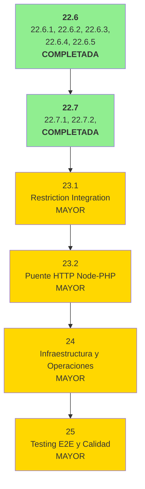

# ROADMAP - Fuente de Verdad del Proyecto

> Ultima actualizacion: 2025-12-22
> Base: fase-22.7.2-silence-decoy-logging (f37f1d6)
> Build: OK | Tests: 241/241 pasando
> Siguiente: fase-23.1-restriction-integration

---

## Resumen de Estado

| Fase | Descripcion | Estado |
| ---- | ----------- | ------ |
| 1-18 | Fundamentos, FIDO2, QR, Pipeline, SoC, Access Gateway | COMPLETADA |
| 19-20 | Separacion Dominios y Limpieza Legacy | COMPLETADA |
| 21.1-21.3 | Unificar Frontend, Access Gateway, Eliminar guest/ | COMPLETADA |
| 22.1 | Validacion TOTP | COMPLETADA |
| **22.2** | **Session Key Binding (CRITICO)** | **COMPLETADA** |
| **22.3** | **Validar AAGUID (CRITICO)** | **COMPLETADA** |
| **22.3.1** | **Test Login ECDH Use Case (CRITICO)** | **COMPLETADA** |
| **22.3.2** | **Test QR Generator (MAYOR)** | **COMPLETADA** |
| **22.3.3** | **Test HKDF Compatibility (CRITICO)** | **COMPLETADA** |
| **22.3.4** | **Test Decrypt Stage (MAYOR)** | **COMPLETADA** |
| 22.4 | Extraer Persistencia | COMPLETADA |
| **22.5** | **Stats + QR Lifecycle** | **COMPLETADA** |
| **22.6** | **Fix Session Key Encryption (CRITICO)** | **COMPLETADA** |
| **22.6.1** | **Fix Escaneo + uid + TOTPu Integration (MAYOR)** | **COMPLETADA** |
| **22.6.2** | **Unificar Validacion TOTP con handshakeSecret (CRITICO)** | **COMPLETADA** |
| **22.6.3** | **Alinear TOTPu con diseño session_key (CRITICO)** | **COMPLETADA** |
| **22.6.4** | **Completar responsabilidad QRLifecycleService (MAYOR)** | **COMPLETADA** |
| **22.6.5** | **Limpiar pool al completar asistencia (MENOR)** | **COMPLETADA** |
| **22.7** | **Unificar Singleton SessionKeyStore (MENOR)** | **COMPLETADA** |
| **22.7.1** | **Fix Login totpu Check (CRITICO)** | **COMPLETADA** |
| **22.7.2** | **Silenciar Logging Decoys (MENOR)** | **COMPLETADA** |
| 22.8-22.9 | Inyeccion SessionKeyQuery, QR Ports, Participation, /dev/ | COMPLETADA |
| 22.10.1-22.10.3 | Mover WebSocketAuth, JWT, Emojis, Zod | COMPLETADA |
| 22.10.4 | Centralizar secretos en .env | COMPLETADA |
| 22.10.5 | Eliminar mencion microservicios | COMPLETADA |
| 22.10.6 | Completar segmentacion modulo access | COMPLETADA |
| 22.10.7-22.10.8 | Traducir comentarios restriction + enrollment | COMPLETADA |
| ~~22.10.9~~ | ~~Traducir tests (AAA ya es estándar)~~ | **OMITIDA** |
| 22.10.10 | Reemplazar console.log por logger | COMPLETADA |
| ~~22.11-22.12~~ | ~~Deuda Tecnica Opcional~~ | **OMITIDAS** |
| **23** | **Integracion PHP (Restriction + Puente)** | **PENDIENTE** |
| 24 | Infraestructura y Operaciones | PENDIENTE |
| 25 | Testing E2E y Calidad | PENDIENTE |

---

## Politica de Seleccion de Modelo IA

| Modelo | Usar cuando |
| ------ | ----------- |
| Sonnet | Tareas bien especificadas, patrones existentes, refactoring mecanico |
| Opus | Decisiones arquitectonicas, ambiguedad, razonamiento complejo, seguridad, criptografia |

---

## Orden de Ejecucion



**Leyenda:** Verde claro = MENOR, Amarillo = MAYOR, Rojo = CRITICO

**Prioridad:**

1. **23.1** (MAYOR) - Integración crítica con PHP para restricciones
2. **23.2** (MAYOR) - Completa comunicación bidireccional Node↔PHP
3. **24** (MAYOR) - Preparación para producción
4. **25** (MAYOR) - Validación final de calidad

---

## Arquitectura Objetivo

Segun `spec-architecture.md` y `Caracterizacion del Ecosistema`:

```bash
backend/
├── access/          # Gateway lectura (4 capas: domain, application, infrastructure, presentation)
├── attendance/      # Validacion QR (Pipeline 12 stages, Stats, Fraud Metrics)
├── auth/            # JWT validation (solo valida, nunca emite)
├── enrollment/      # FIDO2 devices (Orchestrator, Policy 1:1)
├── session/         # ECDH login (session_key con credentialId binding)
├── restriction/     # Integracion PHP (stub → real)
└── shared/ports/    # Interfaces cross-domain
```

---

## Fases Completadas (Resumen)

### Fase 22.2: Session Key Binding con credentialId

**Estado:** COMPLETADA (2025-12-18) | **Commit:** 5c2c473

Vincula session_key al dispositivo físico incluyendo credentialId en derivación HKDF. Info string: `'attendance-session-key-v1:' + credentialId`. Build: 161/161 pasando.

---

### Fase 22.3: Validar AAGUID de dispositivo

**Estado:** COMPLETADA (2025-12-18) | **Commit:** 0844ede, 1296c0a

Rechaza enrollment de dispositivos FIDO2 no autorizados. Whitelist ~20 AAGUIDs. Modo permisivo `AAGUID_ALLOW_UNKNOWN`. Build: 178/178 pasando.

---

### Fases 22.3.1-22.3.4: Tests Unitarios Críticos

**Estado:** COMPLETADA (2025-12-18)

| Fase | Componente | Tests | Commit |
| ---- | ---------- | ----- | ------ |
| 22.3.1 | Login ECDH Use Case | 15 | 65f0168 |
| 22.3.2 | QR Generator | 29 | b8b3f1d |
| 22.3.3 | HKDF Compatibility | 9 | 9a2a24a |
| 22.3.4 | Decrypt Stage | 12 | 1f1fcdf |

---

### Fase 22.5: Stats + QR Lifecycle

**Estado:** COMPLETADA (2025-12-18)

Desacopla estadísticas y QR de `CompleteScanUseCase`. Ports: `IAttendanceStatsCalculator`, `IQRLifecycleManager`. Build: 262/262 pasando.

---

### Fase 22.6: Fix Session Key Encryption

**Estado:** COMPLETADA (2025-12-19) | **Commit:** 9a7d544

Corrige encriptación QRs con session_key real. Soluciona error exportKey con dual-key (AES + HMAC). Build: 262/262 pasando.

---

### Fase 22.6.1: Fix Escaneo + uid + TOTPu

**Estado:** COMPLETADA (2025-12-19) | **Commits:** e44be7a, a88ce29

Corrige race condition setTimeout, uid correcto (studentId), integra TOTPu. Build: 263/263 pasando.

---

### Fase 22.6.2: Unificar Validacion TOTP

**Estado:** COMPLETADA (2025-12-20) | **Commit:** 6a4d987

Port `ITotpValidator` encapsula validación TOTP. Reutiliza `HkdfService.validateTotp()`. Elimina duplicación otplib. Build: 263/263 pasando.

---

### Fase 22.6.3: Alinear TOTPu con session_key

**Estado:** COMPLETADA (2025-12-20) | **Commits:** 8250e9b, 13e4328, 3f0ff5a

Cliente genera TOTP en tiempo real con hmacKey. Servidor deriva hmacKey desde session_key. E2E: Round 1→2→3 sin expiración. Build: 241/241 pasando.

---

### Fase 22.6.4: Completar QRLifecycleService

**Estado:** COMPLETADA (2025-12-20) | **Commit:** dce46e5

`generateAndPublish()` llama `setActiveQR()` internamente. Elimina bug WRONG_QR en Round 2+. Build: 241/241 pasando.

---

### Fase 22.6.5: Limpiar pool al completar

**Estado:** COMPLETADA (2025-12-20) | **Commit:** fa10726

`removeFromPool()` implementado. Pool limpiado al completar asistencia. Build pasando.

---

### Fase 22.7: Unificar Singleton SessionKeyStore

**Estado:** COMPLETADA (2025-12-20) | **Commit:** 3b4595b

Uso consistente de `getSessionKeyStore()`. Elimina instanciación directa. Build: 241/241 pasando.

---

### Fase 22.7.1: Fix Login totpu Check

**Estado:** COMPLETADA (2025-12-21) | **Commit:** 616fa74

Elimina verificación incorrecta de `!result.totpu`. Login exitoso muestra estado READY. Build: 241/241 pasando.

---

### Fases 22.10.4-22.10.10: Limpieza Arquitectónica

**Estado:** COMPLETADA (2025-12-18)

Centralización secretos, eliminación microservicios, segmentación access, traducción comentarios, logger estructurado.

---

## Fases Pendientes

### Fase 22.7.2: Silenciar Logging de Decoys Esperados

**Objetivo:** Reducir ruido en consola cambiando nivel de log para errores de desencriptación esperados (QRs decoy).

**Rama:** `fase-22.7.2-silence-decoy-logging`
**Modelo:** Sonnet
**Severidad:** MENOR
**Referencia:** daRulez §7.1.1 (cohesión - logging apropiado al contexto)
**Estado:** COMPLETADA (2025-12-22)
**Commit:** f37f1d6

**Situación resuelta:**

- QRs decoy están diseñados para fallar desencriptación (clave aleatoria)
- Generaban 100+ `console.warn` en consola durante escaneo normal
- Cambio: `console.warn` → `console.debug` para errores de desencriptación
- Ahora solo visible con nivel "Verbose/Debug" en consola del navegador

**Criterio de éxito verificable:**

- [x] Escanear QRs decoy no genera `console.warn`
- [x] Errores de desencriptación usan `console.debug`
- [x] Comentario explicativo agregado: "(decoy o inválido)"
- [x] Build y tests: 241/241 pasando
- [x] E2E: consola limpia durante escaneo normal

**Archivos modificados:**

- `frontend/features/qr-reader/services/qr-scan.service.ts` - Cambio de nivel de log

**Tareas:**

- [x] Cambiar `console.warn` a `console.debug` en catch de desencriptación
- [x] Actualizar comentario explicando decoys esperados
- [x] Mejorar mensaje de log: "(decoy o inválido)"
- [x] Build y tests en contenedor (dev-1.md)
- [x] E2E: verificar consola limpia
- [x] Commit atómico: f37f1d6

**Dependencias:** Requiere Fase 22.7.1 COMPLETADA

- [ ] Agregar comentario explicativo indicando que los errores de desencriptación son esperados para QRs decoy
- [ ] Verificar que errores inesperados (ej: network, timeout) mantienen nivel de log apropiado
- [ ] Build pasando
- [ ] Commit atómico

**Dependencias:** Ninguna (independiente de 22.7.1)

**Referencias:** logse2e.md, spec-qr-validation.md (sección decoys)

---

### Fase 23.1: Implementar Restriction Service

**Objetivo:** Conectar RestrictionService (actualmente stub) con PHP via HTTP para consultar restricciones reales de usuarios, con cache y fallback fail-open.

**Rama:** `fase-23.1-restriction-integration`
**Modelo:** Opus
**Severidad:** MAYOR

**Criterio de éxito verificable:**

- [ ] `RestrictionService.checkRestrictions()` hace request HTTP a PHP (no es stub)
- [ ] Cache en Valkey reduce requests repetidos (observable en logs)
- [ ] Si PHP no responde (timeout 3s), retorna `{ blocked: false }` (fail-open)
- [ ] Tests con mock HTTP verifican: cache hit, cache miss, timeout, error
- [ ] Contrato HTTP documentado y acordado con equipo PHP
- [ ] Build y tests: X/X pasando

**Restricciones arquitectónicas:**

- Endpoint PHP: `GET /api/restrictions/{userId}` (acordar con equipo PHP)
- Cache TTL: 5 minutos (configurar en Valkey)
- Fallback: fail-open (si PHP cae, no bloquear usuarios)
- Autenticación interna: API key en header (compartida Node↔PHP)

**Entregables mínimos:**

- RestrictionService real que consulta PHP
- Cache en Valkey para reducir carga
- Fallback que permite acceso si PHP no responde
- Documentación del contrato HTTP (request/response)

**Dependencias:** Requiere BLOQUE C + coordinación con equipo PHP

**Referencias:** `spec-architecture.md` sección "Dominio: Restriction"

---

### Fase 23.2: Puente HTTP Node-PHP

**Objetivo:** Establecer comunicación bidireccional completa Node↔PHP: notificar asistencias a PHP, consultar datos maestros desde PHP, health checks mutuos.

**Rama:** `fase-23.2-node-php-bridge`
**Modelo:** Opus
**Severidad:** MAYOR

**Criterio de éxito verificable:**

- [ ] Al completar asistencia, Node notifica a PHP (fire-and-forget)
- [ ] Node puede consultar detalles de sesión desde PHP (con cache)
- [ ] Endpoint `/health` en Node verifica conectividad con PHP
- [ ] Cliente HTTP tiene retry logic y timeouts configurables
- [ ] Documentación completa de todos los endpoints Node↔PHP
- [ ] Build y tests: X/X pasando

**Restricciones arquitectónicas:**

- Notificación: fire-and-forget (no bloquear pipeline de attendance)
- Master data sync: cachear en Valkey (sesiones no cambian frecuentemente)
- Autenticación: misma API key que 23.1
- Retry: backoff exponencial (500ms, 1s, 2s)

**Entregables mínimos:**

- Servicio notificador de asistencia (Node→PHP)
- Repository de datos maestros (PHP→Node con cache)
- Cliente HTTP robusto con retry y timeout
- Health check bidireccional
- Documentación de integración y runbook de troubleshooting

**Dependencias:** Requiere 23.1 + endpoints PHP implementados

**Referencias:** `spec-architecture.md` sección 2.3

---

## Fases Futuras (24-25)

### Fase 24: Infraestructura y Operaciones

**Objetivo:** Preparar sistema para producción con gestión de secretos, monitoreo y procedimientos de recuperación.

**Modelo:** Opus
**Severidad:** MAYOR

**Criterio de éxito verificable:**

- [ ] Secretos gestionados via vault o equivalente (no en archivos)
- [ ] Alertas configuradas para errores críticos
- [ ] Procedimiento de backup probado y documentado
- [ ] Runbook de despliegue completo

---

### Fase 25: Testing E2E y Calidad

**Objetivo:** Validar flujos completos end-to-end, medir rendimiento bajo carga, y completar auditoría de seguridad.

**Modelo:** Opus
**Severidad:** MAYOR

**Criterio de éxito verificable:**

- [ ] Tests E2E cubren: enrollment → login → escaneo → asistencia registrada
- [ ] Tests de carga: sistema soporta X usuarios concurrentes sin degradación
- [ ] Auditoría de seguridad: 0 vulnerabilidades críticas
- [ ] Documentación de usuario completa

---

## Documentos de Referencia

| Documento | Proposito | Ubicacion |
| --------- | --------- | --------- |
| `daRulez.md` | Reglas de desarrollo (FUENTE DE VERDAD) | Raiz |
| `spec-architecture.md` | Arquitectura y dominios | Raiz |
| `spec-qr-validation.md` | Flujo de validacion QR | Raiz |
| `Caracterizacion del Ecosistema.md` | Vision completa del sistema | documents/04-caracterizacion/ |
| `14-decision-totp-session-key.md` | Derivacion de claves TOTP | documents/03-especificaciones-tecnicas/ |
| `db-schema.md` | Esquema de base de datos | Raiz |

---

## Proxima Accion

Ejecutar en orden de prioridad:

### Pendientes por Completar

1. **[MENOR]** **22.7.2** - Silenciar Logging de Decoys
   - Impacto: Bajo, mejora experiencia de debugging
   - Esfuerzo: ~30 minutos
   - Riesgo: Mínimo
   - Dependencias: Ninguna (independiente)

2. **[MAYOR]** **23.1** - Implementar Restriction Service
   - Impacto: Alto, integracion critica con PHP
   - Esfuerzo: ~1-2 dias
   - Riesgo: Medio (requiere coordinacion con equipo PHP)

3. **[MAYOR]** **23.2** - Puente HTTP Node-PHP
   - Impacto: Alto, completa comunicacion bidireccional
   - Esfuerzo: ~2-3 dias
   - Riesgo: Medio
   - Dependencias: 23.1 completado

4. **[MAYOR]** **24** - Infraestructura y Operaciones
   - Impacto: Alto, preparacion para produccion
   - Esfuerzo: ~3-5 dias
   - Riesgo: Bajo-Medio
   - Dependencias: 23.2 completado

5. **[MAYOR]** **25** - Testing E2E y Calidad
   - Impacto: Alto, validacion final
   - Esfuerzo: ~3-5 dias
   - Riesgo: Bajo
   - Dependencias: 24 completado

---

*Este documento es la fuente de verdad para tareas pendientes del proyecto.*
