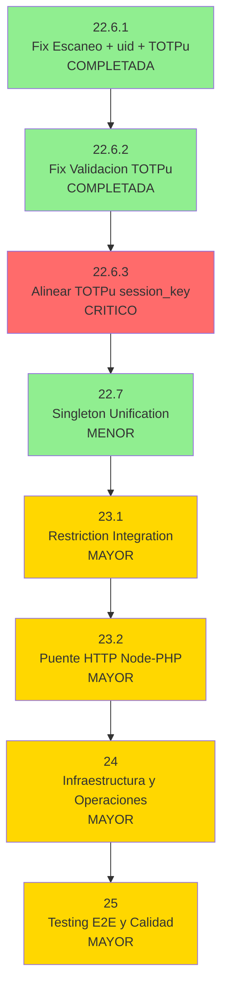

# ROADMAP - Fuente de Verdad del Proyecto

> Ultima actualizacion: 2025-12-20
> Base: fase-22.6.3-totp-session-key
> Build: OK | Tests: 241/241 pasando
> Siguiente: fase-22.6.4-qr-multiround-projection

---

## Resumen de Estado

| Fase | Descripcion | Estado |
|------|-------------|--------|
| 1-18 | Fundamentos, FIDO2, QR, Pipeline, SoC, Access Gateway | COMPLETADA |
| 19-20 | Separacion Dominios y Limpieza Legacy | COMPLETADA |
| 21.1-21.3 | Unificar Frontend, Access Gateway, Eliminar guest/ | COMPLETADA |
| 22.1 | Validacion TOTP | COMPLETADA |
| **22.2** | **Session Key Binding (CRITICO)** | **COMPLETADA** |
| **22.3** | **Validar AAGUID (CRITICO)** | **COMPLETADA** |
| **22.3.1** | **Test Login ECDH Use Case (CRITICO)** | **COMPLETADA** |
| **22.3.2** | **Test QR Generator (MAYOR)** | **COMPLETADA** |
| **22.3.3** | **Test HKDF Compatibility (CRITICO)** | **COMPLETADA** |
| **22.3.4** | **Test Decrypt Stage (MAYOR)** | **COMPLETADA** |
| 22.4 | Extraer Persistencia | COMPLETADA |
| **22.5** | **Stats + QR Lifecycle** | **COMPLETADA** |
| **22.6** | **Fix Session Key Encryption (CRITICO)** | **COMPLETADA** |
| **22.6.1** | **Fix Escaneo + uid + TOTPu Integration (MAYOR)** | **COMPLETADA** |
| **22.6.2** | **Unificar Validacion TOTP con handshakeSecret (CRITICO)** | **COMPLETADA** |
| **22.6.3** | **Alinear TOTPu con diseño session_key (CRITICO)** | **COMPLETADA** |
| **22.6.4** | **Fix proyección QR multi-round sin falsos (MAYOR)** | **PENDIENTE** |
| **22.7** | **Unificar Singleton SessionKeyStore (MENOR)** | **PENDIENTE** |
| 22.8-22.9 | Inyeccion SessionKeyQuery, QR Ports, Participation, /dev/ | COMPLETADA |
| 22.10.1-22.10.3 | Mover WebSocketAuth, JWT, Emojis, Zod | COMPLETADA |
| 22.10.4 | Centralizar secretos en .env | COMPLETADA |
| 22.10.5 | Eliminar mencion microservicios | COMPLETADA |
| 22.10.6 | Completar segmentacion modulo access | COMPLETADA |
| 22.10.7-22.10.8 | Traducir comentarios restriction + enrollment | COMPLETADA |
| ~~22.10.9~~ | ~~Traducir tests (AAA ya es estándar)~~ | **OMITIDA** |
| 22.10.10 | Reemplazar console.log por logger | COMPLETADA |
| ~~22.11-22.12~~ | ~~Deuda Tecnica Opcional~~ | **OMITIDAS** |
| **23** | **Integracion PHP (Restriction + Puente)** | **PENDIENTE** |
| 24 | Infraestructura y Operaciones | PENDIENTE |
| 25 | Testing E2E y Calidad | PENDIENTE |

---

## Politica de Seleccion de Modelo IA

| Modelo | Usar cuando |
|--------|-------------|
| Sonnet | Tareas bien especificadas, patrones existentes, refactoring mecanico |
| Opus | Decisiones arquitectonicas, ambiguedad, razonamiento complejo, seguridad, criptografia |

---

## Orden de Ejecucion



**Leyenda:** Verde claro = MENOR, Amarillo = MAYOR, Rojo = CRITICO

**Prioridad:**
1. **22.6.3** (CRITICO) - Alinear TOTPu con diseño session_key, bloquea testing E2E
2. **22.7** (MENOR) - Mejora arquitectónica de bajo riesgo, desbloquea consistencia
3. **23.1** (MAYOR) - Integración crítica con PHP para restricciones
4. **23.2** (MAYOR) - Completa comunicación bidireccional Node↔PHP
5. **24** (MAYOR) - Preparación para producción
6. **25** (MAYOR) - Validación final de calidad

---

## Arquitectura Objetivo

Segun `spec-architecture.md` y `Caracterizacion del Ecosistema`:

```
backend/
├── access/          # Gateway lectura (4 capas: domain, application, infrastructure, presentation)
├── attendance/      # Validacion QR (Pipeline 12 stages, Stats, Fraud Metrics)
├── auth/            # JWT validation (solo valida, nunca emite)
├── enrollment/      # FIDO2 devices (Orchestrator, Policy 1:1)
├── session/         # ECDH login (session_key con credentialId binding)
├── restriction/     # Integracion PHP (stub → real)
└── shared/ports/    # Interfaces cross-domain
```

---

### Fase 22.2: Session Key Binding con credentialId

**Objetivo:** Vincular la session_key al dispositivo físico incluyendo credentialId en la derivación HKDF, previniendo replay attacks con shared_secret robado.

**Rama:** `fase-22.2-session-binding`
**Modelo:** Opus
**Severidad:** CRITICA
**Estado:** COMPLETADA (2025-12-18)
**Commit:** 5c2c473

**Criterio de éxito verificable:**

- [x] `grep -n "credentialId" node-service/src/backend/session/` encuentra derivación HKDF
- [x] Test: mismo sharedSecret + diferente credentialId → session_keys diferentes
- [x] Test: mismo sharedSecret + mismo credentialId → session_key idéntica
- [x] Frontend y backend derivan session_key con mismo algoritmo
- [x] Build y tests: 161/161 pasando (6 nuevos)

**Restricciones arquitectónicas:**

- Info string HKDF debe incluir versión: `'attendance-session-key-v1:' + credentialId`
- credentialId viene del enrollment, no se genera nuevo
- Sesiones existentes deben invalidarse (re-login requerido)

**Entregables mínimos:**

- Derivación HKDF modificada para incluir credentialId en backend
- Derivación HKDF equivalente en frontend
- Tests que verifiquen binding correcto

**Referencias:** `14-decision-totp-session-key.md`, `Caracterizacion.md` sección 5

---

### Fase 22.3: Validar AAGUID de dispositivo

**Objetivo:** Rechazar enrollment de dispositivos FIDO2 no autorizados validando AAGUID contra whitelist configurable.

**Rama:** `fase-22.3-aaguid-validation`
**Modelo:** Opus
**Severidad:** CRITICA
**Estado:** COMPLETADA (2025-12-18)
**Commit:** 0844ede, 1296c0a (expansión whitelist + modo permisivo)

**Criterio de éxito verificable:**

- [x] Enrollment con AAGUID no listado retorna HTTP 403
- [x] Enrollment con AAGUID válido procede normalmente
- [x] Variable de entorno `AAGUID_VALIDATION_ENABLED` permite desactivar (dev)
- [x] Logs muestran AAGUID rechazado/aceptado
- [x] Build y tests: 178/178 pasando

**Restricciones arquitectónicas:**

- [x] Whitelist debe ser configurable (no hardcodeada en código) - via config + env vars
- [x] Validación debe ocurrir ANTES de persistir dispositivo - paso 4 del flujo
- [x] Default: habilitado en producción, deshabilitado en desarrollo - AAGUID_VALIDATION_ENABLED

**Entregables mínimos:**

- [x] Whitelist de AAGUIDs autorizados (~20: Windows Hello, Google, Apple, Samsung, Huawei, 1Password, Bitwarden, etc.)
- [x] Validación integrada en flujo de finish-enrollment (paso 4)
- [x] Tests de aceptación y rechazo (17 tests)
- [x] Modo permisivo `AAGUID_ALLOW_UNKNOWN` para fase de transición
- [x] Documentación: cómo agregar nuevos AAGUIDs (en aaguid-validation.service.ts)

**Archivos creados/modificados:**

- `node-service/src/backend/enrollment/domain/services/aaguid-validation.service.ts` (NUEVO)
- `node-service/src/backend/enrollment/domain/services/index.ts` (export)
- `node-service/src/backend/enrollment/application/use-cases/finish-enrollment.use-case.ts` (integración)
- `node-service/src/backend/enrollment/presentation/controllers/finish-enrollment.controller.ts` (HTTP 403)
- `node-service/src/backend/enrollment/presentation/routes.ts` (instanciación)
- `node-service/src/shared/config/index.ts` (config.aaguid)
- `.env.example` (AAGUID_VALIDATION_ENABLED, AAGUID_ALLOW_NULL)
- `domain/services/__tests__/aaguid-validation.service.test.ts` (14 tests)

**Referencias:** `Caracterizacion.md` sección 4, FIDO2 spec para AAGUIDs conocidos

---

### Fase 22.3.1: Test unitario Login ECDH Use Case

**Rama:** `fase-22.3.1-test-login-ecdh`
**Modelo:** Sonnet
**Severidad:** CRITICA
**Referencia:** daRulez 7.1.1 - "Cada unidad tiene una unica razon para cambiar" (SoC)
**Estado:** COMPLETADA (2025-12-18)
**Commit:** 65f0168

**Situacion resuelta:**

El LoginEcdhUseCase ahora tiene cobertura completa de tests unitarios que verifican derivacion HKDF, almacenamiento en Valkey, manejo de errores y vinculacion 1:1.

**Archivos creados:**

- `node-service/src/backend/session/application/use-cases/__tests__/login-ecdh.use-case.test.ts` (15 tests)

**Tareas:**

- [x] Crear test: dispositivo no encontrado retorna error DEVICE_NOT_FOUND
- [x] Crear test: dispositivo de otro usuario retorna error DEVICE_NOT_OWNED
- [x] Crear test: dispositivo revocado retorna error SESSION_NOT_ALLOWED
- [x] Crear test: flujo exitoso guarda session_key en Valkey con TTL 7200
- [x] Crear test: mismo sharedSecret + diferente credentialId genera session_keys diferentes
- [x] Crear test: actualiza last_used_at del dispositivo
- [x] Validar estado del dispositivo: solo enrolled puede hacer login
- [x] Verificar integracion ECDH + HKDF: sharedSecret -> session_key
- [x] Verificar binding 1:1: session_key vinculada a userId + deviceId
- [x] Build y tests: 202/202 pasando (15 nuevos)
- [x] Commit atomico: 65f0168

**Cobertura de tests:**

| Categoria | Tests |
|-----------|-------|
| Casos de error | 4 |
| Flujo exitoso | 6 |
| Integracion ECDH+HKDF | 2 |
| Validacion de estado | 2 |
| Timestamps | 1 |

**Criterio de exito:** CUMPLIDO - LoginEcdhUseCase tiene cobertura completa de errores y flujo exitoso.

---

### Fase 22.3.2: Test unitario QR Generator

**Rama:** `fase-22.3.2-test-qr-generator`
**Modelo:** Sonnet
**Severidad:** MAYOR
**Referencia:** daRulez 7.1.1 - "Operaciones de escritura deben producir el mismo resultado" (Idempotencia)
**Estado:** COMPLETADA (2025-12-18)
**Commit:** b8b3f1d

**Situacion resuelta:**

El QRGenerator ahora tiene cobertura completa de tests unitarios que verifican generacion de nonce, estructura de payload, round counter, encriptacion AES-GCM y QRs decoy.

**Archivos creados:**

- `node-service/src/backend/qr-projection/domain/__tests__/qr-generator.test.ts` (29 tests)

**Tareas:**

- [x] Crear test: buildPayloadV1 genera estructura correcta (v, sid, uid, r, ts, n)
- [x] Crear test: nonce es string hexadecimal de 32 caracteres
- [x] Crear test: nonces generados son unicos
- [x] Crear test: round counter incrementa por sesion
- [x] Crear test: round counters son independientes por sessionId
- [x] Crear test: resetRoundCounter reinicia contador
- [x] Crear test: encryptPayload genera formato iv.ciphertext.authTag
- [x] Crear test: encryptPayloadWithRandomKey genera formato valido pero indescifrable
- [x] Crear test: generateForStudent genera payload con round especifico
- [x] Crear test: toQRString encripta y retorna formato iv.ciphertext.authTag
- [x] Crear test: generateV1 integra nonce, payload, encriptacion
- [x] Crear test: QRs decoy son indistinguibles de reales (mismo formato)
- [x] Build y tests: 231/231 pasando (29 nuevos)
- [x] Commit atomico: b8b3f1d

**Cobertura de tests:**

| Categoria | Tests |
|-----------|-------|
| Generacion de nonce | 2 |
| Construccion de payload V1 | 7 |
| Round counter | 4 |
| Conversion a string JSON | 2 |
| Encriptacion con AES-GCM | 3 |
| Encriptacion con clave aleatoria/decoys | 3 |
| generateV1 metodo principal | 4 |
| generateForStudent implementacion | 4 |

**Criterio de exito:** CUMPLIDO - QR Generator tiene cobertura completa de generacion, encriptacion y decoys.

---

### Fase 22.3.3: Test compatibilidad HKDF Frontend-Backend

**Rama:** `fase-22.3.3-test-hkdf-compatibility`
**Modelo:** Opus
**Severidad:** CRITICA
**Referencia:** daRulez 1.4.1 - "Seguridad primero: no debilitar el modelo criptografico"
**Estado:** COMPLETADA (2025-12-18)
**Commit:** 9a2a24a

**Situacion resuelta:**

El frontend (`login.service.ts`) y backend (`hkdf.service.ts`) derivan `session_key` independientemente usando HKDF. Se creo test que verifica compatibilidad con vectores fijos.

**Archivos creados:**

- `node-service/src/backend/enrollment/infrastructure/crypto/__tests__/hkdf-compatibility.test.ts` (9 tests)

**Tareas:**

- [x] Crear test: dado sharedSecret fijo (hex) y credentialId fijo, derivar session_key en backend
- [x] Documentar el resultado esperado (bytes hex de la session_key)
- [x] Verificar que frontend usa mismo algoritmo: P-256 ECDH -> 256 bits -> HKDF-SHA256 -> AES-256-GCM
- [x] Crear test: verificar que salt vacio y misma info producen clave identica
- [x] Cubrir edge cases: credentialId largo, caracteres especiales Base64
- [x] Build y tests: 187/187 pasando (9 nuevos)
- [x] Commit atomico: 9a2a24a

**Vector de compatibilidad documentado:**

```
sharedSecret (hex): a1b2c3d4e5f6071829304150617283940a1b2c3d4e5f6071829304150617283
credentialId:       dGVzdC1jcmVkZW50aWFsLWZvci1oZGtmLWNvbXBhdA==
info:               attendance-session-key-v1:dGVzdC1jcmVkZW50aWFsLWZvci1oZGtmLWNvbXBhdA==
session_key (hex):  769ffc0d428712e1713c472d96ac321b43c8dc172e7d8a1e0cf2f3afdff99af9
```

**Criterio de exito:** CUMPLIDO - Test demuestra que backend deriva session_key deterministica y compatible.

---

### Fase 22.3.4: Test unitario Decrypt Stage

**Rama:** `fase-22.3.4-test-decrypt-stage`
**Modelo:** Sonnet
**Severidad:** MAYOR
**Referencia:** daRulez 7.1.1 - "Efectos secundarios (I/O, persistencia) se aislan en infraestructura"
**Estado:** COMPLETADA (2025-12-18)
**Commit:** 1f1fcdf

**Situacion resuelta:

El DecryptStage ahora tiene cobertura completa de tests unitarios que verifican desencriptacion con session_key real, fallback a mock key, manejo de errores y modo STUB_MODE.

**Archivos creados:**

- `node-service/src/backend/attendance/domain/validation-pipeline/stages/__tests__/decrypt.stage.test.ts` (12 tests)

**Tareas:**

- [x] Crear test: con session_key valida, desencripta correctamente
- [x] Crear test: sin session_key, usa fallback mock key
- [x] Crear test: formato invalido retorna error INVALID_FORMAT
- [x] Crear test: desencriptacion fallida retorna error DECRYPTION_FAILED
- [x] Crear test: JSON no parseable retorna error DECRYPTION_FAILED
- [x] Crear test: en STUB_MODE, convierte QRPayloadV1 a StudentResponse
- [x] Crear test: verifica llamada a findByUserId con studentId correcto
- [x] Crear test: crea AesGcmService con session_key especifica
- [x] Build y tests: 243/243 pasando (12 nuevos)
- [x] Commit atomico: 1f1fcdf

**Cobertura de tests:**

| Categoria | Tests |
|-----------|-------|
| Desencriptacion con session_key real | 2 |
| Fallback a mock key | 2 |
| Manejo de errores | 3 |
| Modo STUB_MODE | 3 |
| Integracion SessionKeyQuery | 2 |

**Criterio de exito:** CUMPLIDO - Decrypt Stage tiene cobertura completa de desencriptacion, fallback y errores.

---

### Fase 22.5: Extraer Stats + QR Lifecycle - COMPLETADO ✅

**Objetivo:** Desacoplar cálculo de estadísticas y generación de QR de `CompleteScanUseCase`, delegando a servicios dedicados que usen ports existentes.

**Rama:** `fase-22.5-stats-qr-lifecycle`
**Modelo:** Opus
**Severidad:** MAYOR
**Fecha completado:** 2025-12-18

**Criterio de éxito verificable:**

- [x] `grep -n "calculateStats\|generateNextQR" node-service/src/backend/attendance/application/complete-scan` no encuentra imports directos ✅
- [x] `CompleteScanUseCase` recibe servicios por inyección, no los instancia ✅
- [x] Tests de UseCase mockean servicios (no lógica real) ✅
- [x] Tests unitarios existen para cada servicio extraído ✅ (19 tests)
- [x] Build y tests: 262/262 pasando ✅

**Entregables completados:**

| Artefacto | Ubicación |
|-----------|-----------|
| IAttendanceStatsCalculator port | shared/ports/attendance-stats.port.ts |
| IQRLifecycleManager port | shared/ports/qr-lifecycle.port.ts |
| AttendanceStatsCalculator service | attendance/domain/services/attendance-stats-calculator.service.ts |
| QRLifecycleService (actualizado) | attendance/application/services/qr-lifecycle.service.ts |
| Tests stats calculator | 11 tests en domain/services/__tests__/ |
| Tests QR lifecycle | 8 tests en application/services/__tests__/ |

**Cambios arquitectónicos:**

- `CompleteScanUseCase` ahora recibe `ServiceDependencies` en constructor
- Factory `createCompleteScanDepsWithPersistence` crea e inyecta servicios
- Stats calculation delegado a `IAttendanceStatsCalculator`
- QR generation/storage/projection delegado a `IQRLifecycleManager`

---

### Fase 22.6: Fix Session Key Encryption

**Objetivo:** Corregir la encriptación de QRs y el flujo de login para usar session_key real del estudiante en lugar de mock key, solucionando errores de exportKey y duplicación de escritura.

**Rama:** `fase-22.6-fix-session-key-encryption`
**Modelo:** Opus
**Severidad:** CRITICA
**Estado:** COMPLETADA (2025-12-19)
**Commit:** 9a7d544

**Problemas resueltos:**

1. **QR encriptado con MOCK_KEY en backend vs session_key real en frontend**
   - `QRLifecycleService` generaba QRs con mock key porque no tenía `StudentEncryptionService`
   - Backend: encriptaba con mock, Frontend: desencriptaba con session_key real → fallo
   - Solución: Inyectar `StudentEncryptionService` en `QRLifecycleService` (routes.ts)

2. **Error exportKey en qr-reader login**
   - `qr-reader/main.ts` llamaba `storeSessionKey()` duplicadamente con parámetros incorrectos
   - `LoginService` ya guardaba internamente la session_key
   - Solución: Eliminar llamada duplicada

3. **Soporte dual-key (AES + HMAC) para evitar exportKey**
   - `StoredSession` ahora almacena `sessionKey` y `hmacKey` derivadas de HKDF
   - `LoginService` deriva ambas claves desde shared secret ECDH
   - Solución al error "key is not extractable"

**Archivos principales modificados:**

- `backend/attendance/presentation/routes.ts`: inyección StudentEncryptionService
- `backend/attendance/services/student-encryption.service.ts`: nuevo servicio
- `frontend/qr-reader/main.ts`: fix login duplicado
- `frontend/enrollment/login.service.ts`: derivación dual-key HKDF
- `frontend/enrollment/session-key.store.ts`: almacenamiento dual-key

**Criterio de éxito verificable:**

- [x] `QRLifecycleService` recibe `encryptionService` no-null
- [x] Backend encripta QRs con session_key real del estudiante desde Valkey
- [x] Frontend desencripta correctamente con session_key derivada
- [x] Error `exportKey` eliminado con derivación dual-key
- [x] Login no tiene escritura duplicada de session_key
- [x] Build y tests: 262/262 pasando

---

### Fase 22.6.1: Fix Escaneo + uid + TOTPu Integration

**Objetivo:** Corregir el flujo de captura de QR para que reanude correctamente después del cooldown, use el uid correcto (studentId) e integre TOTPu en la respuesta.

**Rama:** `fase-22.6.1-fix-scan-resume`
**Modelo:** Sonnet
**Severidad:** MAYOR
**Referencia:** spec-qr-validation.md, daRulez §7.1.1 (SoC)
**Estado:** COMPLETADA (2025-12-19)
**Commits:** e44be7a (setTimeout fix), a88ce29 (uid + TOTPu)

**Problemas resueltos:**

1. **Race condition en cooldown** - setTimeout anidado impedía reanudación
2. **uid incorrecto en QR** - Usaba hostUserId (profesor) en lugar de studentId
3. **Falta TOTPu en respuesta** - Cliente no enviaba TOTP para validación

**Archivos modificados:**

- `qr-scan.service.ts`: eliminar setTimeout, integrar TOTPu del SessionKeyStore
- `payload-builder.service.ts`: cambiar hostUserId → studentId
- `qr-generator.ts`: usar options.userId para uid
- `pool-feeder.service.ts`: remover hostUserId de FeedStudentInput
- `qr-generator.test.ts`: actualizar tests

**Criterio de éxito verificable:**

- [x] setTimeout race condition eliminado
- [x] uid del QR = studentId (no hostUserId)
- [x] Respuesta del cliente incluye TOTPu
- [x] Escaneo reanuda después de cooldown
- [x] Build y tests: 263/263 pasando

---

### Fase 22.6.2: Unificar Validacion TOTP con handshakeSecret

**Objetivo:** Corregir el stage TOTP para validar usando `handshakeSecret` (fuente correcta del enrolamiento), eliminando duplicacion de codigo TOTP y cumpliendo daRulez DRY/SoC.

**Rama:** `fase-22.6.2-fix-totp-validation`
**Modelo:** Opus
**Severidad:** CRITICO
**Referencia:** daRulez §7.1.1 (DRY, SoC, Acoplamiento Bajo), §1.4.1 (seguridad)
**Estado:** COMPLETADA (2025-12-20)
**Commit:** 6a4d987

**Causa raiz identificada (auditoria 2025-12-19):**

| Componente | Fuente del TOTP | Estado |
|------------|-----------------|--------|
| Login backend | `handshakeSecret` (BD) | CORRECTO - genera TOTP |
| Frontend store | `data.totpu` (estatico) | CORRECTO - almacena del servidor |
| Validacion backend | `sessionKey` (Valkey) | INCORRECTO - debe usar handshakeSecret |

**Problemas arquitectonicos adicionales:**

| Problema | Ubicacion | Violacion daRulez |
|----------|-----------|-------------------|
| Codigo TOTP duplicado | `otplib` en stage vs `HkdfService.validateTotp()` | DRY §7.1.1 |
| Dependencia directa a libreria | `import { totp } from 'otplib'` en stage | Acoplamiento §7.1.1 |
| Stage conoce detalles de secret | Obtiene sessionKey y convierte a base64 | SoC §7.1.1 |

**Solucion: Opcion C - Abstraccion ITotpValidator**

Crear port `ITotpValidator` que encapsula la logica de validacion TOTP, reutilizando `HkdfService.validateTotp()` existente.

```
shared/ports/
  totp-validator.port.ts           # Interface ITotpValidator

enrollment/infrastructure/adapters/
  totp-validator.adapter.ts        # Implementa ITotpValidator
                                   # Usa DeviceRepository + HkdfService

attendance/domain/validation-pipeline/stages/
  totp-validation.stage.ts         # Recibe ITotpValidator (no ISessionKeyQuery)
                                   # Elimina import de otplib
```

**Flujo corregido:**

```
1. Login: genera TOTP con handshakeSecret, envia al frontend
2. Frontend: almacena TOTP estatico, lo envia en cada escaneo
3. Backend stage: llama ITotpValidator.validate(userId, totp)
4. Adaptador: busca device por userId, obtiene handshakeSecret, valida con HkdfService
```

**Criterio de exito verificable:**

- [x] `grep -rn "otplib" node-service/src/backend/attendance/` retorna 0 resultados
- [x] `grep -rn "ITotpValidator" node-service/src/shared/ports/` retorna 1+ resultados
- [x] Stage TOTP recibe ITotpValidator, no ISessionKeyQuery
- [x] HkdfService.validateTotp() es la unica implementacion TOTP en backend
- [x] Test: TOTP generado en login valida correctamente en pipeline
- [ ] Flujo E2E: Round 1 -> Round 2 -> Round 3 -> asistencia registrada (ver 22.6.3)
- [x] Build y tests: 263/263 pasando

**Restricciones arquitectonicas:**

- Pipeline mantiene estructura de stages (daRulez §7.1.2)
- Adaptador vive en enrollment/infrastructure/ (donde esta DeviceRepository)
- Port vive en shared/ports/ (comunicacion cross-domain)
- No modificar HkdfService.validateTotp() - ya funciona correctamente
- Ventana de tolerancia: +/- 30 segundos (window=1, ya implementado)

**Archivos a crear:**

- `shared/ports/totp-validator.port.ts` - Interface ITotpValidator
- `enrollment/infrastructure/adapters/totp-validator.adapter.ts` - Implementacion

**Archivos a modificar:**

- `shared/ports/index.ts` - Export del nuevo port
- `attendance/domain/validation-pipeline/stages/totp-validation.stage.ts` - Usar ITotpValidator
- `attendance/domain/validation-pipeline/pipeline.factory.ts` - Inyectar ITotpValidator
- `attendance/presentation/routes.ts` - Crear adaptador e inyectar
- `attendance/__tests__/totp-validation.stage.test.ts` - Mockear ITotpValidator

**Tareas:**

- [x] Crear `shared/ports/totp-validator.port.ts` con interface ITotpValidator
- [x] Crear `enrollment/infrastructure/adapters/totp-validator.adapter.ts`
- [x] Exportar ITotpValidator en `shared/ports/index.ts`
- [x] Modificar `totp-validation.stage.ts`: recibir ITotpValidator, eliminar otplib
- [x] Modificar `pipeline.factory.ts`: agregar ITotpValidator a PipelineDependencies
- [x] Modificar `attendance/presentation/routes.ts`: instanciar adaptador
- [x] Actualizar tests del stage para mockear ITotpValidator
- [x] Verificar que HkdfService.validateTotp() tiene tests (ya existen)
- [ ] E2E: Completar 3 rounds de asistencia (pendiente - ver 22.6.3)
- [x] Build y tests pasando (263/263)
- [x] Commit atomico: 6a4d987

**Beneficios de esta solucion:**

| Aspecto | Antes | Despues |
|---------|-------|---------|
| DRY | 2 implementaciones TOTP | 1 (HkdfService) |
| SoC | Stage conoce detalles crypto | Stage solo llama validate() |
| Acoplamiento | Import directo otplib | Depende de abstraccion |
| Testabilidad | Mock de ISessionKeyQuery | Mock simple de ITotpValidator |
| Pipeline | Intacto | Intacto |

**Dependencias:** Requiere 22.6.1 COMPLETADA

**Referencias:** 
- daRulez §7.1.1 (DRY, SoC, Acoplamiento)
- daRulez §7.1.2 (Pipeline pattern)
- `enrollment/infrastructure/crypto/hkdf.service.ts` - validateTotp() existente

---

### Fase 22.6.3: Alinear TOTPu con diseño session_key (CRITICO)

**Objetivo:** Corregir la implementación de TOTPu para que ambos lados (cliente y servidor) generen el TOTP independientemente usando la session_key derivada del ECDH handshake, alineando con el diseño original en `14-decision-totp-session-key.md`.

**Rama:** `fase-22.6.3-totp-session-key`
**Modelo:** Opus (decisión criptográfica)
**Severidad:** CRITICO
**Referencia:** `documents/03-especificaciones-tecnicas/14-decision-totp-session-key.md`
**Estado:** COMPLETADA
**Commits:** 8250e9b, 13e4328, 3f0ff5a

**Problema detectado (auditoria 2025-12-20):**

Discrepancia fundamental entre diseño e implementación:

| Aspecto | Diseño (14-decision) | Implementación actual |
|---------|----------------------|----------------------|
| TOTPu base | `session_key` (ECDH) | `handshake_secret` (BD enrollment) |
| Cliente genera | Sí, con hmacKey | No, recibe valor fijo del servidor |
| Servidor genera | Sí, con session_key | Sí, pero con secreto equivocado |
| Sincronización | Ambos calculan independientemente | Cliente tiene valor estático que expira |

**Evidencia del fallo:**

```
[TotpValidator] userId=186875052, received=862478, expected=881322
[Validate] Pipeline failed: code=TOTP_INVALID, trace=decrypt: OK -> totp-validation: FAIL
```

- Round 1 funciona (TOTP recién generado)
- Round 2+ fallan (~60 segundos después, TOTP expirado)

**Análisis de flujo actual (incorrecto):**

```
Login:
  Server: totpu = TOTP(handshake_secret) → envia a cliente como valor fijo
  Client: almacena totpu en sessionKeyStore (nunca cambia)

Scan (30s después):
  Client: envia totpu almacenado (valor de hace 30s)
  Server: regenera expected = TOTP(handshake_secret) con timestamp actual
  Result: received ≠ expected → FAIL
```

**Flujo corregido (según diseño):**

```
Login:
  Server: NO envia totpu
  Client: deriva hmacKey = HKDF(sharedSecret, 'attendance-hmac-key-v1:' + credentialId)
  Client: almacena hmacKey (ya lo hace pero no lo usa)

Scan:
  Client: totpu = TOTP(hmacKey) en tiempo real
  Server: session_key = Valkey.get(userId)
  Server: hmacKey = HKDF(session_key, 'attendance-hmac-key-v1:' + credentialId)
  Server: validates TOTP(hmacKey) con window ±30s
  Result: ambos calculan con mismo secreto y tiempo → PASS
```

**Criterio de éxito verificable:**

- [ ] Cliente genera TOTP en tiempo real con hmacKey (no usa valor almacenado)
- [ ] Servidor deriva hmacKey desde session_key de Valkey
- [ ] Login response NO incluye campo `totpu`
- [ ] E2E: Round 1 → Round 2 → Round 3 → asistencia registrada (sin expiración)
- [ ] Tests unitarios para generación TOTP en cliente
- [ ] Build y tests pasando

**Archivos a crear:**

- `frontend/shared/crypto/totp.ts` - Generación TOTP cliente con hmacKey

**Archivos a modificar:**

- `session/application/use-cases/login-ecdh.use-case.ts` - Eliminar generación/envío de totpu
- `enrollment/infrastructure/adapters/totp-validator.adapter.ts` - Derivar hmacKey desde session_key
- `frontend/features/qr-reader/services/qr-scan.service.ts` - Generar TOTP en tiempo real
- `frontend/shared/stores/session-key.store.ts` - Exponer hmacKey para TOTP
- `session/domain/models.ts` - Eliminar campo totpu de SessionKey (revertir ad-hoc)
- `session/infrastructure/repositories/session-key.repository.ts` - Eliminar persistencia totpu

**Tareas:**

- [ ] Crear `frontend/shared/crypto/totp.ts` con función `generateTotp(hmacKey: CryptoKey): string`
- [ ] Modificar `session-key.store.ts`: exponer método `getHmacKey(): CryptoKey | null`
- [ ] Modificar `qr-scan.service.ts`: llamar `generateTotp(hmacKey)` en cada escaneo
- [ ] Modificar `login-ecdh.use-case.ts`: eliminar generación de totpu en respuesta
- [ ] Modificar `totp-validator.adapter.ts`: obtener session_key de Valkey, derivar hmacKey
- [ ] Revertir `session/domain/models.ts`: eliminar campo `totpu?: string`
- [ ] Revertir `session-key.repository.ts`: eliminar lógica de totpu
- [ ] Agregar tests para `frontend/shared/crypto/totp.ts`
- [ ] E2E: Verificar 3 rounds consecutivos funcionan
- [ ] Build y tests pasando
- [ ] Commit atómico

**Dependencias:** Requiere 22.6.2 COMPLETADA

**Referencias:**
- `documents/03-especificaciones-tecnicas/14-decision-totp-session-key.md`
- daRulez §7.1.1 (Consistencia diseño-implementación)
- RFC 6238 (TOTP)
- Web Crypto API (HMAC key derivation)

---

### Fase 22.6.4: Fix proyección QR multi-round sin falsos

**Objetivo:** Asegurar que cuando un estudiante completa Round N, el QR de Round N+1 se proyecte inmediatamente en la pantalla del profesor, incluso sin QRs falsos en el pool.

**Rama:** `fase-22.6.4-qr-multiround-projection`
**Modelo:** Sonnet
**Severidad:** MAYOR
**Referencia:** spec-qr-validation.md, daRulez §7.1.1 (SoC)
**Estado:** PENDIENTE

**Situación actual:**

- `qr-emitter.service.ts:175-185` - `emitNext()` obtiene entrada del pool con round-robin
- `projection-pool.repository.ts:78-98` - `upsertStudentQR()` reemplaza entrada existente
- Pool con 1 estudiante: mismo QR se emite repetidamente
- Cuando se hace upsert, el QR en pantalla no cambia (imagen idéntica hasta próximo ciclo)
- El estudiante escanea QR de Round 1 cuando el servidor espera Round 2

**Evidencia del fallo:**

```
[QRLifecycle] Generando QR para student=186875052, round=2
[ProjectionPool] Upserted student=186875052 round=2 in session=session-...
[Validate] Pipeline failed: code=WRONG_QR, trace=...validateStudentOwnsQR: FAIL
```

**Criterio de éxito verificable:**

- [ ] E2E: Round 1 → Round 2 → Round 3 sin error WRONG_QR
- [ ] El QR proyectado cambia visualmente después de cada validación exitosa
- [ ] Funciona con pool de 1 estudiante (sin QRs falsos)
- [ ] Build y tests pasando

**Archivos a modificar:**

- `qr-projection/application/services/qr-emitter.service.ts` - Detectar cambio de round y forzar re-render
- `shared/infrastructure/valkey/projection-pool.repository.ts` - Posible: señal de invalidación

**Tareas:**

- [ ] Analizar por qué el QR no cambia visualmente en pantalla
- [ ] Implementar mecanismo de refresh cuando round cambia
- [ ] Verificar que WebSocket envía nuevo QR cuando pool se actualiza
- [ ] E2E: Completar 3 rounds consecutivos
- [ ] Build y tests pasando
- [ ] Commit atómico

**Dependencias:** Requiere 22.6.3 COMPLETADA

**Referencias:**
- spec-qr-validation.md
- daRulez §7.1.1 (Flujo coherente)

---

### Fase 22.7: Unificar uso de singleton SessionKeyStore

**Objetivo:** Eliminar instanciación directa de SessionKeyStore en favor del patrón singleton existente para garantizar consistencia de estado en toda la aplicación.

**Rama:** `fase-22.7-unify-sessionkeystore-singleton`
**Modelo:** Sonnet
**Severidad:** MENOR
**Referencia:** daRulez.md §7.1.2 - "Singleton mutable (estado global compartido)" prohibido cuando es mutable
**Estado:** PENDIENTE

**Situación actual:**

Tres componentes instancian `SessionKeyStore` directamente con `new SessionKeyStore()` en lugar de usar la función singleton `getSessionKeyStore()`, violando el patrón establecido y creando potencialmente múltiples instancias con cachés desincronizadas.

**Criterio de éxito verificable:**

- [ ] `grep -rn "new SessionKeyStore()" node-service/src/frontend/` retorna solo 1 resultado (singleton factory)
- [ ] `grep -rn "getSessionKeyStore()" node-service/src/frontend/` muestra uso consistente
- [ ] Todas las features usan la misma instancia singleton
- [ ] Build y tests: 262/262 pasando

**Restricciones arquitectónicas:**

- Mantener compatibilidad con inyección opcional en `LoginService` (para testing)
- No cambiar la API pública de `SessionKeyStore`
- Singleton debe ser inmutable en estructura (no viola daRulez §7.1.2)

**Archivos a modificar:**

- `node-service/src/frontend/shared/crypto/aes-gcm.ts` (L39)
- `node-service/src/frontend/features/qr-reader/main.ts` (L79)
- `node-service/src/frontend/features/enrollment/main.ts` (L55)

**Tareas:**

- [ ] Importar `getSessionKeyStore` en aes-gcm.ts
- [ ] Reemplazar `new SessionKeyStore()` por `getSessionKeyStore()` en aes-gcm.ts
- [ ] Importar `getSessionKeyStore` en qr-reader/main.ts
- [ ] Reemplazar `new SessionKeyStore()` por `getSessionKeyStore()` en qr-reader/main.ts
- [ ] Importar `getSessionKeyStore` en enrollment/main.ts
- [ ] Reemplazar `new SessionKeyStore()` por `getSessionKeyStore()` en enrollment/main.ts
- [ ] Verificar que LoginService mantiene inyección opcional para tests
- [ ] Build y tests: 262/262 pasando
- [ ] Commit atómico

**Entregables mínimos:**

- Uso consistente del patrón singleton en todos los componentes frontend
- Eliminación de instanciación directa excepto en singleton factory
- Zero regresiones en tests existentes

**Impacto:** Bajo - mejora consistencia arquitectónica sin cambiar funcionalidad.

---

### Fase 22.10.4: Centralizar secretos en .env y validar en runtime

**Rama:** `fase-22.10.4-centralize-secrets`
**Modelo:** Sonnet
**Severidad:** MAYOR (viola daRulez 6.6)
**Referencia:** daRulez.md seccion 6.6 - "Los secretos nunca se documentan con valores reales"
**Estado:** COMPLETADA (2025-12-18)
**Commit:** e3172f9

**Situación actual:**

1. `.env.example` existe pero le falta `SERVER_MASTER_SECRET`
2. `compose.yaml` tiene valores hardcodeados en lugar de usar `${VAR}` de `.env`
3. `config/index.ts` tiene defaults inseguros que permiten iniciar sin `.env`

**Archivos a modificar:**

- `.env.example` - Agregar variable faltante
- `.env` - Mantener sincronizado con `.env.example`
- `compose.yaml` - Usar variables de entorno sin defaults
- `node-service/src/shared/config/index.ts` - Validar variables críticas

**Tareas:**

- [x] Agregar `SERVER_MASTER_SECRET` a `.env.example` con documentación
- [x] Actualizar `compose.yaml`: agregar `env_file: .env` y usar `${VAR}` sin defaults
- [x] Modificar `config/index.ts`: eliminar defaults y agregar `validateRequiredEnvVars()`
- [x] Verificar build y tests: 155/155 pasando
- [x] Commit atómico: e3172f9

**Criterio de exito:** CUMPLIDO
- Aplicación falla al iniciar sin `.env` con mensaje claro
- `.env.example` contiene TODAS las variables con valores de referencia
- `compose.yaml` usa `env_file` y no tiene secrets hardcodeados

---

### Fase 22.10.5: Eliminar mencion de microservicios

**Rama:** `fase-22.10.5-remove-microservices-mention`
**Modelo:** Sonnet
**Severidad:** MAYOR (viola daRulez 2.1)
**Referencia:** daRulez.md seccion 2.1 - "Microservicios estan prohibidos"
**Estado:** COMPLETADA (2025-12-18)
**Commit:** f36ed52

**Archivo:** `node-service/src/shared/ports/index.ts`

**Tareas:**

- [x] Modificar comentario L11: eliminar "Preparacion para microservicios"
- [x] Reemplazar por beneficios reales: desacoplamiento, testing, cambio de implementaciones
- [x] Verificar: `grep -r "microservicio" node-service/` → 0 resultados
- [x] Build y tests: 155/155 [OK]
- [x] Commit atómico: f36ed52

**Criterio de exito:** CUMPLIDO - Cero menciones de microservicios en codigo.

---

### Fase 22.10.6: Completar segmentacion vertical modulo access

**Rama:** `fase-22.10.6-access-vertical-slicing`
**Modelo:** Opus
**Severidad:** MAYOR (viola daRulez 2.2)
**Referencia:** daRulez.md seccion 2.2 - "Cada modulo contiene: dominio, aplicacion, infraestructura, presentacion"
**Estado:** COMPLETADA (2025-12-18)
**Commit:** d7b863b

**Directorio:** `node-service/src/backend/access/`

**Estructura final:**

```
access/
├── domain/                  # [OK] CREADO
│   ├── models.ts            # AccessState, AccessStateType, AccessAction, AccessDeviceInfo
│   └── index.ts
├── application/services/    # [OK] Actualizado imports
├── infrastructure/          # [OK] CREADO (reservado)
│   └── index.ts
├── presentation/            # Existente
└── __tests__/               # Existente
```

**Tareas:**

- [x] Crear `access/domain/models.ts` con tipos inmutables
- [x] Crear `access/domain/index.ts` con exports
- [x] Crear `access/infrastructure/index.ts` (reservado para futuros adaptadores)
- [x] Mover `AccessState` de application/ a domain/
- [x] Actualizar imports en access-gateway.service.ts
- [x] Re-exportar tipos en application/services/index.ts para compatibilidad
- [x] Build y tests: 155/155 [OK]
- [x] Commit atómico: d7b863b

**Criterio de exito:** CUMPLIDO - Modulo access tiene las 4 capas.

---

### Fases 22.10.7 + 22.10.8: Traducir comentarios (restriction + enrollment)

**Rama:** `fase-22.10.7-8-translate-comments`
**Modelo:** Sonnet
**Severidad:** MENOR (viola daRulez 7.4.1)
**Referencia:** daRulez.md seccion 7.4.1 - "Comentarios solo en espanol"
**Estado:** COMPLETADA (2025-12-18)
**Commit:** c0260dc

**Archivos modificados:**

- `restriction/application/services/restriction.service.ts`
- `enrollment/domain/services/one-to-one-policy.service.ts`
- `enrollment/application/orchestrators/enrollment-flow.orchestrator.ts`

**Tareas:**

- [x] restriction.service.ts: traducir JSDoc completo y comentarios inline
- [x] one-to-one-policy.service.ts: traducir metodos validate() y revokeViolations()
- [x] enrollment-flow.orchestrator.ts: traducir metodo attemptAccess() y flujo
- [x] Build y tests: 155/155 pasando
- [x] Commit atomico agrupado: c0260dc

**Criterio de exito:** CUMPLIDO - Comentarios de logica de negocio en espanol

---

### Fase 22.10.9: Traducir comentarios - access tests

**Rama:** `fase-22.10.9-translate-access-tests`
**Modelo:** Sonnet
**Severidad:** MENOR (viola daRulez 7.4.1)
**Estado:** ~~PENDIENTE~~ → **OMITIDA**

**Justificación de omisión:** Los comentarios `// Arrange`, `// Act`, `// Assert`, `// Verify` son convención estándar de testing (patrón AAA) y no requieren traducción. No hay comentarios de lógica de negocio en inglés.

---

### Fase 22.10.10: Reemplazar console.log por logger

**Rama:** `fase-22.10.10-use-structured-logger`
**Modelo:** Sonnet
**Severidad:** MENOR
**Estado:** COMPLETADA (2025-12-18)
**Commit:** 831c58d

**Archivo:** `node-service/src/backend/enrollment/presentation/routes.ts`

**Tareas:**

- [x] Importar logger desde `shared/infrastructure/logger`
- [x] L118-L130: Reemplazar console.log por logger.info/logger.warn/logger.error
- [x] Formato estructurado: `logger.info({ userId, userAgent }, 'Client logs received')`
- [x] Usar switch para mapear niveles: error → logger.error, warn → logger.warn, default → logger.info
- [x] Build y tests: 155/155 pasando
- [x] Commit atómico: 831c58d

**Criterio de exito:** CUMPLIDO - No hay console.log en endpoint client-log, logging estructurado implementado

---

### Fases 22.11-22.12

**Modelo:** Sonnet
**Estado:** ~~PENDIENTE~~ → **OMITIDAS** (verificado 2025-12-18)

**Justificación de omisión:**

- **22.11:** Búsqueda de `isDevelopment|isProduction` en backend/ retornó 0 resultados. No hay feature flags legacy.
- **22.12:** No hay container DI legacy detectado. La composición manual actual es intencional y funciona correctamente.

**Resultado:** Estas fases pueden eliminarse del roadmap activo.

---

### Fase 23.1: Implementar Restriction Service

**Objetivo:** Conectar RestrictionService (actualmente stub) con PHP via HTTP para consultar restricciones reales de usuarios, con cache y fallback fail-open.

**Rama:** `fase-23.1-restriction-integration`
**Modelo:** Opus
**Severidad:** MAYOR

**Criterio de éxito verificable:**

- [ ] `RestrictionService.checkRestrictions()` hace request HTTP a PHP (no es stub)
- [ ] Cache en Valkey reduce requests repetidos (observable en logs)
- [ ] Si PHP no responde (timeout 3s), retorna `{ blocked: false }` (fail-open)
- [ ] Tests con mock HTTP verifican: cache hit, cache miss, timeout, error
- [ ] Contrato HTTP documentado y acordado con equipo PHP
- [ ] Build y tests: X/X pasando

**Restricciones arquitectónicas:**

- Endpoint PHP: `GET /api/restrictions/{userId}` (acordar con equipo PHP)
- Cache TTL: 5 minutos (configurar en Valkey)
- Fallback: fail-open (si PHP cae, no bloquear usuarios)
- Autenticación interna: API key en header (compartida Node↔PHP)

**Entregables mínimos:**

- RestrictionService real que consulta PHP
- Cache en Valkey para reducir carga
- Fallback que permite acceso si PHP no responde
- Documentación del contrato HTTP (request/response)

**Dependencias:** Requiere BLOQUE C + coordinación con equipo PHP

**Referencias:** `spec-architecture.md` sección "Dominio: Restriction"

---

### Fase 23.2: Puente HTTP Node-PHP

**Objetivo:** Establecer comunicación bidireccional completa Node↔PHP: notificar asistencias a PHP, consultar datos maestros desde PHP, health checks mutuos.

**Rama:** `fase-23.2-node-php-bridge`
**Modelo:** Opus
**Severidad:** MAYOR

**Criterio de éxito verificable:**

- [ ] Al completar asistencia, Node notifica a PHP (fire-and-forget)
- [ ] Node puede consultar detalles de sesión desde PHP (con cache)
- [ ] Endpoint `/health` en Node verifica conectividad con PHP
- [ ] Cliente HTTP tiene retry logic y timeouts configurables
- [ ] Documentación completa de todos los endpoints Node↔PHP
- [ ] Build y tests: X/X pasando

**Restricciones arquitectónicas:**

- Notificación: fire-and-forget (no bloquear pipeline de attendance)
- Master data sync: cachear en Valkey (sesiones no cambian frecuentemente)
- Autenticación: misma API key que 23.1
- Retry: backoff exponencial (500ms, 1s, 2s)

**Entregables mínimos:**

- Servicio notificador de asistencia (Node→PHP)
- Repository de datos maestros (PHP→Node con cache)
- Cliente HTTP robusto con retry y timeout
- Health check bidireccional
- Documentación de integración y runbook de troubleshooting

**Dependencias:** Requiere 23.1 + endpoints PHP implementados

**Referencias:** `spec-architecture.md` sección 2.3

---

## Fases Futuras (24-25)

### Fase 24: Infraestructura y Operaciones

**Objetivo:** Preparar sistema para producción con gestión de secretos, monitoreo y procedimientos de recuperación.

**Modelo:** Opus
**Severidad:** MAYOR

**Criterio de éxito verificable:**

- [ ] Secretos gestionados via vault o equivalente (no en archivos)
- [ ] Alertas configuradas para errores críticos
- [ ] Procedimiento de backup probado y documentado
- [ ] Runbook de despliegue completo

---

### Fase 25: Testing E2E y Calidad

**Objetivo:** Validar flujos completos end-to-end, medir rendimiento bajo carga, y completar auditoría de seguridad.

**Modelo:** Opus
**Severidad:** MAYOR

**Criterio de éxito verificable:**

- [ ] Tests E2E cubren: enrollment → login → escaneo → asistencia registrada
- [ ] Tests de carga: sistema soporta X usuarios concurrentes sin degradación
- [ ] Auditoría de seguridad: 0 vulnerabilidades críticas
- [ ] Documentación de usuario completa

---

## Documentos de Referencia

| Documento | Proposito | Ubicacion |
|-----------|-----------|-----------|
| `daRulez.md` | Reglas de desarrollo (FUENTE DE VERDAD) | Raiz |
| `spec-architecture.md` | Arquitectura y dominios | Raiz |
| `spec-qr-validation.md` | Flujo de validacion QR | Raiz |
| `Caracterizacion del Ecosistema.md` | Vision completa del sistema | documents/04-caracterizacion/ |
| `14-decision-totp-session-key.md` | Derivacion de claves TOTP | documents/03-especificaciones-tecnicas/ |
| `db-schema.md` | Esquema de base de datos | Raiz |

---

## Proxima Accion

Ejecutar en orden de prioridad:

### Pendientes por Completar

1. **[CRITICO]** **22.6.3** - Fix Generacion QR Round 2+ (NUEVO)
   - Impacto: Alto, bloquea flujo E2E completo
   - Esfuerzo: ~2-4 horas (diagnosticar flujo de generacion QR post-round)
   - Riesgo: Medio (requiere analisis de QRLifecycleService)
   - Problema: Round 1 valida OK pero Round 2 falla desencriptacion
   - **SIGUIENTE TAREA - BLOQUEANTE**

2. **[MENOR]** **22.7** - Unificar Singleton SessionKeyStore
   - Impacto: Bajo, mejora consistencia arquitectónica
   - Esfuerzo: ~1-2 horas
   - Riesgo: Minimo
   - Dependencias: 22.6.3 completado

3. **[MAYOR]** **23.1** - Implementar Restriction Service
   - Impacto: Alto, integracion critica con PHP
   - Esfuerzo: ~1-2 dias
   - Riesgo: Medio (requiere coordinacion con equipo PHP)
   - Dependencias: 22.7 completado

4. **[MAYOR]** **23.2** - Puente HTTP Node-PHP
   - Impacto: Alto, completa comunicacion bidireccional
   - Esfuerzo: ~2-3 dias
   - Riesgo: Medio
   - Dependencias: 23.1 completado

5. **[MAYOR]** **24** - Infraestructura y Operaciones
   - Impacto: Alto, preparacion para produccion
   - Esfuerzo: ~3-5 dias
   - Riesgo: Bajo-Medio
   - Dependencias: 23.2 completado

6. **[MAYOR]** **25** - Testing E2E y Calidad
   - Impacto: Alto, validacion final
   - Esfuerzo: ~3-5 dias
   - Riesgo: Bajo
   - Dependencias: 24 completado

---

*Este documento es la fuente de verdad para tareas pendientes del proyecto.*
