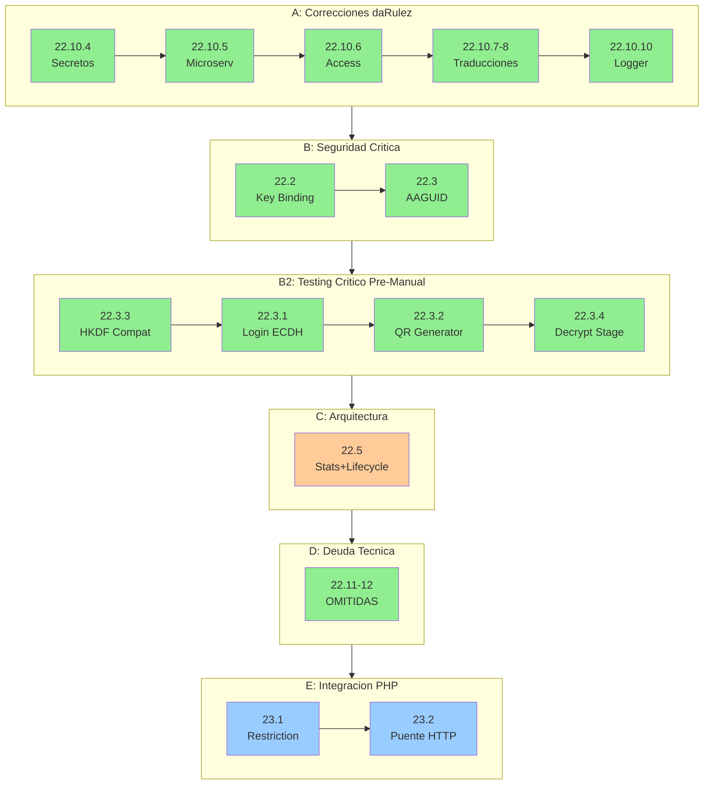

# ROADMAP - Fuente de Verdad del Proyecto

> Ultima actualizacion: 2025-12-18
> Base: main consolidado desde fase-22.10.3
> Build: OK | Tests: 243/243 pasando

---

## Resumen de Estado

| Fase | Descripcion | Estado |
|------|-------------|--------|
| 1-18 | Fundamentos, FIDO2, QR, Pipeline, SoC, Access Gateway | COMPLETADA |
| 19-20 | Separacion Dominios y Limpieza Legacy | COMPLETADA |
| 21.1-21.3 | Unificar Frontend, Access Gateway, Eliminar guest/ | COMPLETADA |
| 22.1 | Validacion TOTP | COMPLETADA |
| 22.4 | Extraer Persistencia | COMPLETADA |
| 22.6-22.9 | Inyeccion SessionKeyQuery, QR Ports, Participation, /dev/ | COMPLETADA |
| 22.10-22.10.3 | Mover WebSocketAuth, JWT, Emojis, Zod | COMPLETADA |
| 22.10.4-22.10.10 | Correcciones Auditoria daRulez (secretos, access, traducciones, logger) | COMPLETADA |
| ~~22.10.9~~ | ~~Traducir tests (AAA ya es estándar)~~ | **OMITIDA** |
| **22.2** | **Session Key Binding (CRITICO)** | **COMPLETADA** |
| **22.3** | **Validar AAGUID (CRITICO)** | **COMPLETADA** |
| **22.3.3** | **Test HKDF Compatibility (CRITICO)** | **COMPLETADA** |
| **22.3.1** | **Test Login ECDH Use Case (CRITICO)** | **COMPLETADA** |
| **22.3.2** | **Test QR Generator (MAYOR)** | **COMPLETADA** |
| **22.3.4** | **Test Decrypt Stage (MAYOR)** | **COMPLETADA** |
| **22.5** | **Stats + QR Lifecycle** | **PENDIENTE** |
| ~~22.11-22.12~~ | ~~Deuda Tecnica Opcional~~ | **OMITIDAS** |
| **23** | **Integracion PHP (Restriction + Puente)** | **PENDIENTE** |
| 24 | Infraestructura y Operaciones | PENDIENTE |
| 25 | Testing E2E y Calidad | PENDIENTE |

---

## Politica de Seleccion de Modelo IA

| Modelo | Usar cuando |
|--------|-------------|
| Sonnet | Tareas bien especificadas, patrones existentes, refactoring mecanico |
| Opus | Decisiones arquitectonicas, ambiguedad, razonamiento complejo, seguridad, criptografia |

---

## Orden de Ejecucion



**Leyenda:** Rojo oscuro = CRITICO, Rojo claro = MAYOR, Naranja = Arquitectura, Verde = Omitida/Completada, Azul = Integracion

---

## Arquitectura Objetivo

Segun `spec-architecture.md` y `Caracterizacion del Ecosistema`:

```
backend/
├── access/          # Gateway lectura (4 capas: domain, application, infrastructure, presentation)
├── attendance/      # Validacion QR (Pipeline 12 stages, Stats, Fraud Metrics)
├── auth/            # JWT validation (solo valida, nunca emite)
├── enrollment/      # FIDO2 devices (Orchestrator, Policy 1:1)
├── session/         # ECDH login (session_key con credentialId binding)
├── restriction/     # Integracion PHP (stub → real)
└── shared/ports/    # Interfaces cross-domain
```

---

## BLOQUE A: Correcciones Auditoria daRulez

### Fase 22.10.4: Centralizar secretos en .env y validar en runtime

**Rama:** `fase-22.10.4-centralize-secrets`
**Modelo:** Sonnet
**Severidad:** MAYOR (viola daRulez 6.6)
**Referencia:** daRulez.md seccion 6.6 - "Los secretos nunca se documentan con valores reales"
**Estado:** COMPLETADA (2025-12-18)
**Commit:** e3172f9

**Situación actual:**

1. `.env.example` existe pero le falta `SERVER_MASTER_SECRET`
2. `compose.yaml` tiene valores hardcodeados en lugar de usar `${VAR}` de `.env`
3. `config/index.ts` tiene defaults inseguros que permiten iniciar sin `.env`

**Archivos a modificar:**

- `.env.example` - Agregar variable faltante
- `.env` - Mantener sincronizado con `.env.example`
- `compose.yaml` - Usar variables de entorno sin defaults
- `node-service/src/shared/config/index.ts` - Validar variables críticas

**Tareas:**

- [x] Agregar `SERVER_MASTER_SECRET` a `.env.example` con documentación
- [x] Actualizar `compose.yaml`: agregar `env_file: .env` y usar `${VAR}` sin defaults
- [x] Modificar `config/index.ts`: eliminar defaults y agregar `validateRequiredEnvVars()`
- [x] Verificar build y tests: 155/155 pasando
- [x] Commit atómico: e3172f9

**Criterio de exito:** CUMPLIDO
- Aplicación falla al iniciar sin `.env` con mensaje claro
- `.env.example` contiene TODAS las variables con valores de referencia
- `compose.yaml` usa `env_file` y no tiene secrets hardcodeados

---

### Fase 22.10.5: Eliminar mencion de microservicios

**Rama:** `fase-22.10.5-remove-microservices-mention`
**Modelo:** Sonnet
**Severidad:** MAYOR (viola daRulez 2.1)
**Referencia:** daRulez.md seccion 2.1 - "Microservicios estan prohibidos"
**Estado:** COMPLETADA (2025-12-18)
**Commit:** f36ed52

**Archivo:** `node-service/src/shared/ports/index.ts`

**Tareas:**

- [x] Modificar comentario L11: eliminar "Preparacion para microservicios"
- [x] Reemplazar por beneficios reales: desacoplamiento, testing, cambio de implementaciones
- [x] Verificar: `grep -r "microservicio" node-service/` → 0 resultados
- [x] Build y tests: 155/155 [OK]
- [x] Commit atómico: f36ed52

**Criterio de exito:** CUMPLIDO - Cero menciones de microservicios en codigo.

---

### Fase 22.10.6: Completar segmentacion vertical modulo access

**Rama:** `fase-22.10.6-access-vertical-slicing`
**Modelo:** Opus
**Severidad:** MAYOR (viola daRulez 2.2)
**Referencia:** daRulez.md seccion 2.2 - "Cada modulo contiene: dominio, aplicacion, infraestructura, presentacion"
**Estado:** COMPLETADA (2025-12-18)
**Commit:** d7b863b

**Directorio:** `node-service/src/backend/access/`

**Estructura final:**

```
access/
├── domain/                  # [OK] CREADO
│   ├── models.ts            # AccessState, AccessStateType, AccessAction, AccessDeviceInfo
│   └── index.ts
├── application/services/    # [OK] Actualizado imports
├── infrastructure/          # [OK] CREADO (reservado)
│   └── index.ts
├── presentation/            # Existente
└── __tests__/               # Existente
```

**Tareas:**

- [x] Crear `access/domain/models.ts` con tipos inmutables
- [x] Crear `access/domain/index.ts` con exports
- [x] Crear `access/infrastructure/index.ts` (reservado para futuros adaptadores)
- [x] Mover `AccessState` de application/ a domain/
- [x] Actualizar imports en access-gateway.service.ts
- [x] Re-exportar tipos en application/services/index.ts para compatibilidad
- [x] Build y tests: 155/155 [OK]
- [x] Commit atómico: d7b863b

**Criterio de exito:** CUMPLIDO - Modulo access tiene las 4 capas.

---

### Fases 22.10.7 + 22.10.8: Traducir comentarios (restriction + enrollment)

**Rama:** `fase-22.10.7-8-translate-comments`
**Modelo:** Sonnet
**Severidad:** MENOR (viola daRulez 7.4.1)
**Referencia:** daRulez.md seccion 7.4.1 - "Comentarios solo en espanol"
**Estado:** COMPLETADA (2025-12-18)
**Commit:** c0260dc

**Archivos modificados:**

- `restriction/application/services/restriction.service.ts`
- `enrollment/domain/services/one-to-one-policy.service.ts`
- `enrollment/application/orchestrators/enrollment-flow.orchestrator.ts`

**Tareas:**

- [x] restriction.service.ts: traducir JSDoc completo y comentarios inline
- [x] one-to-one-policy.service.ts: traducir metodos validate() y revokeViolations()
- [x] enrollment-flow.orchestrator.ts: traducir metodo attemptAccess() y flujo
- [x] Build y tests: 155/155 pasando
- [x] Commit atomico agrupado: c0260dc

**Criterio de exito:** CUMPLIDO - Comentarios de logica de negocio en espanol

---

### Fase 22.10.9: Traducir comentarios - access tests

**Rama:** `fase-22.10.9-translate-access-tests`
**Modelo:** Sonnet
**Severidad:** MENOR (viola daRulez 7.4.1)
**Estado:** ~~PENDIENTE~~ → **OMITIDA**

**Justificación de omisión:** Los comentarios `// Arrange`, `// Act`, `// Assert`, `// Verify` son convención estándar de testing (patrón AAA) y no requieren traducción. No hay comentarios de lógica de negocio en inglés.

---

### Fase 22.10.10: Reemplazar console.log por logger

**Rama:** `fase-22.10.10-use-structured-logger`
**Modelo:** Sonnet
**Severidad:** MENOR
**Estado:** COMPLETADA (2025-12-18)
**Commit:** 831c58d

**Archivo:** `node-service/src/backend/enrollment/presentation/routes.ts`

**Tareas:**

- [x] Importar logger desde `shared/infrastructure/logger`
- [x] L118-L130: Reemplazar console.log por logger.info/logger.warn/logger.error
- [x] Formato estructurado: `logger.info({ userId, userAgent }, 'Client logs received')`
- [x] Usar switch para mapear niveles: error → logger.error, warn → logger.warn, default → logger.info
- [x] Build y tests: 155/155 pasando
- [x] Commit atómico: 831c58d

**Criterio de exito:** CUMPLIDO - No hay console.log en endpoint client-log, logging estructurado implementado

---

## BLOQUE B: Seguridad Critica

### Fase 22.2: Session Key Binding con credentialId

**Objetivo:** Vincular la session_key al dispositivo físico incluyendo credentialId en la derivación HKDF, previniendo replay attacks con shared_secret robado.

**Rama:** `fase-22.2-session-binding`
**Modelo:** Opus
**Severidad:** CRITICA
**Estado:** COMPLETADA (2025-12-18)
**Commit:** 5c2c473

**Criterio de éxito verificable:**

- [x] `grep -n "credentialId" node-service/src/backend/session/` encuentra derivación HKDF
- [x] Test: mismo sharedSecret + diferente credentialId → session_keys diferentes
- [x] Test: mismo sharedSecret + mismo credentialId → session_key idéntica
- [x] Frontend y backend derivan session_key con mismo algoritmo
- [x] Build y tests: 161/161 pasando (6 nuevos)

**Restricciones arquitectónicas:**

- Info string HKDF debe incluir versión: `'attendance-session-key-v1:' + credentialId`
- credentialId viene del enrollment, no se genera nuevo
- Sesiones existentes deben invalidarse (re-login requerido)

**Entregables mínimos:**

- Derivación HKDF modificada para incluir credentialId en backend
- Derivación HKDF equivalente en frontend
- Tests que verifiquen binding correcto

**Referencias:** `14-decision-totp-session-key.md`, `Caracterizacion.md` sección 5

---

### Fase 22.3: Validar AAGUID de dispositivo

**Objetivo:** Rechazar enrollment de dispositivos FIDO2 no autorizados validando AAGUID contra whitelist configurable.

**Rama:** `fase-22.3-aaguid-validation`
**Modelo:** Opus
**Severidad:** CRITICA
**Estado:** COMPLETADA (2025-12-18)
**Commit:** 0844ede, 1296c0a (expansión whitelist + modo permisivo)

**Criterio de éxito verificable:**

- [x] Enrollment con AAGUID no listado retorna HTTP 403
- [x] Enrollment con AAGUID válido procede normalmente
- [x] Variable de entorno `AAGUID_VALIDATION_ENABLED` permite desactivar (dev)
- [x] Logs muestran AAGUID rechazado/aceptado
- [x] Build y tests: 178/178 pasando

**Restricciones arquitectónicas:**

- [x] Whitelist debe ser configurable (no hardcodeada en código) - via config + env vars
- [x] Validación debe ocurrir ANTES de persistir dispositivo - paso 4 del flujo
- [x] Default: habilitado en producción, deshabilitado en desarrollo - AAGUID_VALIDATION_ENABLED

**Entregables mínimos:**

- [x] Whitelist de AAGUIDs autorizados (~20: Windows Hello, Google, Apple, Samsung, Huawei, 1Password, Bitwarden, etc.)
- [x] Validación integrada en flujo de finish-enrollment (paso 4)
- [x] Tests de aceptación y rechazo (17 tests)
- [x] Modo permisivo `AAGUID_ALLOW_UNKNOWN` para fase de transición
- [x] Documentación: cómo agregar nuevos AAGUIDs (en aaguid-validation.service.ts)

**Archivos creados/modificados:**

- `node-service/src/backend/enrollment/domain/services/aaguid-validation.service.ts` (NUEVO)
- `node-service/src/backend/enrollment/domain/services/index.ts` (export)
- `node-service/src/backend/enrollment/application/use-cases/finish-enrollment.use-case.ts` (integración)
- `node-service/src/backend/enrollment/presentation/controllers/finish-enrollment.controller.ts` (HTTP 403)
- `node-service/src/backend/enrollment/presentation/routes.ts` (instanciación)
- `node-service/src/shared/config/index.ts` (config.aaguid)
- `.env.example` (AAGUID_VALIDATION_ENABLED, AAGUID_ALLOW_NULL)
- `domain/services/__tests__/aaguid-validation.service.test.ts` (14 tests)

**Referencias:** `Caracterizacion.md` sección 4, FIDO2 spec para AAGUIDs conocidos

---

## BLOQUE B2: Testing Critico Pre-Manual

> Prerequisito para pruebas manuales con FIDO2. Verifica que los componentes criticos del flujo funcionan antes de testing manual.

### Fase 22.3.1: Test unitario Login ECDH Use Case

**Rama:** `fase-22.3.1-test-login-ecdh`
**Modelo:** Sonnet
**Severidad:** CRITICA
**Referencia:** daRulez 7.1.1 - "Cada unidad tiene una unica razon para cambiar" (SoC)
**Estado:** COMPLETADA (2025-12-18)
**Commit:** 65f0168

**Situacion resuelta:**

El LoginEcdhUseCase ahora tiene cobertura completa de tests unitarios que verifican derivacion HKDF, almacenamiento en Valkey, manejo de errores y vinculacion 1:1.

**Archivos creados:**

- `node-service/src/backend/session/application/use-cases/__tests__/login-ecdh.use-case.test.ts` (15 tests)

**Tareas:**

- [x] Crear test: dispositivo no encontrado retorna error DEVICE_NOT_FOUND
- [x] Crear test: dispositivo de otro usuario retorna error DEVICE_NOT_OWNED
- [x] Crear test: dispositivo revocado retorna error SESSION_NOT_ALLOWED
- [x] Crear test: flujo exitoso guarda session_key en Valkey con TTL 7200
- [x] Crear test: mismo sharedSecret + diferente credentialId genera session_keys diferentes
- [x] Crear test: actualiza last_used_at del dispositivo
- [x] Validar estado del dispositivo: solo enrolled puede hacer login
- [x] Verificar integracion ECDH + HKDF: sharedSecret -> session_key
- [x] Verificar binding 1:1: session_key vinculada a userId + deviceId
- [x] Build y tests: 202/202 pasando (15 nuevos)
- [x] Commit atomico: 65f0168

**Cobertura de tests:**

| Categoria | Tests |
|-----------|-------|
| Casos de error | 4 |
| Flujo exitoso | 6 |
| Integracion ECDH+HKDF | 2 |
| Validacion de estado | 2 |
| Timestamps | 1 |

**Criterio de exito:** CUMPLIDO - LoginEcdhUseCase tiene cobertura completa de errores y flujo exitoso.

---

### Fase 22.3.2: Test unitario QR Generator

**Rama:** `fase-22.3.2-test-qr-generator`
**Modelo:** Sonnet
**Severidad:** MAYOR
**Referencia:** daRulez 7.1.1 - "Operaciones de escritura deben producir el mismo resultado" (Idempotencia)
**Estado:** COMPLETADA (2025-12-18)
**Commit:** b8b3f1d

**Situacion resuelta:**

El QRGenerator ahora tiene cobertura completa de tests unitarios que verifican generacion de nonce, estructura de payload, round counter, encriptacion AES-GCM y QRs decoy.

**Archivos creados:**

- `node-service/src/backend/qr-projection/domain/__tests__/qr-generator.test.ts` (29 tests)

**Tareas:**

- [x] Crear test: buildPayloadV1 genera estructura correcta (v, sid, uid, r, ts, n)
- [x] Crear test: nonce es string hexadecimal de 32 caracteres
- [x] Crear test: nonces generados son unicos
- [x] Crear test: round counter incrementa por sesion
- [x] Crear test: round counters son independientes por sessionId
- [x] Crear test: resetRoundCounter reinicia contador
- [x] Crear test: encryptPayload genera formato iv.ciphertext.authTag
- [x] Crear test: encryptPayloadWithRandomKey genera formato valido pero indescifrable
- [x] Crear test: generateForStudent genera payload con round especifico
- [x] Crear test: toQRString encripta y retorna formato iv.ciphertext.authTag
- [x] Crear test: generateV1 integra nonce, payload, encriptacion
- [x] Crear test: QRs decoy son indistinguibles de reales (mismo formato)
- [x] Build y tests: 231/231 pasando (29 nuevos)
- [x] Commit atomico: b8b3f1d

**Cobertura de tests:**

| Categoria | Tests |
|-----------|-------|
| Generacion de nonce | 2 |
| Construccion de payload V1 | 7 |
| Round counter | 4 |
| Conversion a string JSON | 2 |
| Encriptacion con AES-GCM | 3 |
| Encriptacion con clave aleatoria/decoys | 3 |
| generateV1 metodo principal | 4 |
| generateForStudent implementacion | 4 |

**Criterio de exito:** CUMPLIDO - QR Generator tiene cobertura completa de generacion, encriptacion y decoys.

---

### Fase 22.3.3: Test compatibilidad HKDF Frontend-Backend

**Rama:** `fase-22.3.3-test-hkdf-compatibility`
**Modelo:** Opus
**Severidad:** CRITICA
**Referencia:** daRulez 1.4.1 - "Seguridad primero: no debilitar el modelo criptografico"
**Estado:** COMPLETADA (2025-12-18)
**Commit:** 9a2a24a

**Situacion resuelta:**

El frontend (`login.service.ts`) y backend (`hkdf.service.ts`) derivan `session_key` independientemente usando HKDF. Se creo test que verifica compatibilidad con vectores fijos.

**Archivos creados:**

- `node-service/src/backend/enrollment/infrastructure/crypto/__tests__/hkdf-compatibility.test.ts` (9 tests)

**Tareas:**

- [x] Crear test: dado sharedSecret fijo (hex) y credentialId fijo, derivar session_key en backend
- [x] Documentar el resultado esperado (bytes hex de la session_key)
- [x] Verificar que frontend usa mismo algoritmo: P-256 ECDH -> 256 bits -> HKDF-SHA256 -> AES-256-GCM
- [x] Crear test: verificar que salt vacio y misma info producen clave identica
- [x] Cubrir edge cases: credentialId largo, caracteres especiales Base64
- [x] Build y tests: 187/187 pasando (9 nuevos)
- [x] Commit atomico: 9a2a24a

**Vector de compatibilidad documentado:**

```
sharedSecret (hex): a1b2c3d4e5f6071829304150617283940a1b2c3d4e5f6071829304150617283
credentialId:       dGVzdC1jcmVkZW50aWFsLWZvci1oZGtmLWNvbXBhdA==
info:               attendance-session-key-v1:dGVzdC1jcmVkZW50aWFsLWZvci1oZGtmLWNvbXBhdA==
session_key (hex):  769ffc0d428712e1713c472d96ac321b43c8dc172e7d8a1e0cf2f3afdff99af9
```

**Criterio de exito:** CUMPLIDO - Test demuestra que backend deriva session_key deterministica y compatible.

---

### Fase 22.3.4: Test unitario Decrypt Stage

**Rama:** `fase-22.3.4-test-decrypt-stage`
**Modelo:** Sonnet
**Severidad:** MAYOR
**Referencia:** daRulez 7.1.1 - "Efectos secundarios (I/O, persistencia) se aislan en infraestructura"
**Estado:** COMPLETADA (2025-12-18)
**Commit:** 1f1fcdf

**Situacion resuelta:

El DecryptStage ahora tiene cobertura completa de tests unitarios que verifican desencriptacion con session_key real, fallback a mock key, manejo de errores y modo STUB_MODE.

**Archivos creados:**

- `node-service/src/backend/attendance/domain/validation-pipeline/stages/__tests__/decrypt.stage.test.ts` (12 tests)

**Tareas:**

- [x] Crear test: con session_key valida, desencripta correctamente
- [x] Crear test: sin session_key, usa fallback mock key
- [x] Crear test: formato invalido retorna error INVALID_FORMAT
- [x] Crear test: desencriptacion fallida retorna error DECRYPTION_FAILED
- [x] Crear test: JSON no parseable retorna error DECRYPTION_FAILED
- [x] Crear test: en STUB_MODE, convierte QRPayloadV1 a StudentResponse
- [x] Crear test: verifica llamada a findByUserId con studentId correcto
- [x] Crear test: crea AesGcmService con session_key especifica
- [x] Build y tests: 243/243 pasando (12 nuevos)
- [x] Commit atomico: 1f1fcdf

**Cobertura de tests:**

| Categoria | Tests |
|-----------|-------|
| Desencriptacion con session_key real | 2 |
| Fallback a mock key | 2 |
| Manejo de errores | 3 |
| Modo STUB_MODE | 3 |
| Integracion SessionKeyQuery | 2 |

**Criterio de exito:** CUMPLIDO - Decrypt Stage tiene cobertura completa de desencriptacion, fallback y errores.

---

## BLOQUE C: Arquitectura

### Fase 22.5: Extraer Stats + QR Lifecycle

**Objetivo:** Desacoplar cálculo de estadísticas y generación de QR de `CompleteScanUseCase`, delegando a servicios dedicados que usen ports existentes.

**Rama:** `fase-22.5-stats-qr-lifecycle`
**Modelo:** Opus
**Severidad:** MAYOR

**Criterio de éxito verificable:**

- [ ] `grep -n "calculateStats\|generateNextQR" node-service/src/backend/attendance/application/complete-scan` no encuentra imports directos
- [ ] `CompleteScanUseCase` recibe servicios por inyección, no los instancia
- [ ] Tests de UseCase mockean servicios (no lógica real)
- [ ] Tests unitarios existen para cada servicio extraído
- [ ] Build y tests: X/X pasando

**Restricciones arquitectónicas:**

- Usar `IQRGenerator` y `IPoolBalancer` existentes (fase 22.7) - NO crear nuevos
- Stats pertenece a domain/, lifecycle a application/
- Interface de stats debe estar en shared/ports/

**Entregables mínimos:**

- Servicio de estadísticas (certeza, fraude, response time)
- Servicio de lifecycle QR (encapsula generación)
- UseCase simplificado (orquestación pura, delega a servicios)
- Tests unitarios de cada servicio

**Referencias:** `spec-qr-validation.md` sección "Cálculo de Certeza"

---

## BLOQUE D: Deuda Tecnica Opcional

### Fases 22.11-22.12

**Modelo:** Sonnet
**Estado:** ~~PENDIENTE~~ → **OMITIDAS** (verificado 2025-12-18)

**Justificación de omisión:**

- **22.11:** Búsqueda de `isDevelopment|isProduction` en backend/ retornó 0 resultados. No hay feature flags legacy.
- **22.12:** No hay container DI legacy detectado. La composición manual actual es intencional y funciona correctamente.

**Resultado:** Estas fases pueden eliminarse del roadmap activo.

---

## BLOQUE E: Integracion PHP (FINAL)

### Fase 23.1: Implementar Restriction Service

**Objetivo:** Conectar RestrictionService (actualmente stub) con PHP via HTTP para consultar restricciones reales de usuarios, con cache y fallback fail-open.

**Rama:** `fase-23.1-restriction-integration`
**Modelo:** Opus
**Severidad:** MAYOR

**Criterio de éxito verificable:**

- [ ] `RestrictionService.checkRestrictions()` hace request HTTP a PHP (no es stub)
- [ ] Cache en Valkey reduce requests repetidos (observable en logs)
- [ ] Si PHP no responde (timeout 3s), retorna `{ blocked: false }` (fail-open)
- [ ] Tests con mock HTTP verifican: cache hit, cache miss, timeout, error
- [ ] Contrato HTTP documentado y acordado con equipo PHP
- [ ] Build y tests: X/X pasando

**Restricciones arquitectónicas:**

- Endpoint PHP: `GET /api/restrictions/{userId}` (acordar con equipo PHP)
- Cache TTL: 5 minutos (configurar en Valkey)
- Fallback: fail-open (si PHP cae, no bloquear usuarios)
- Autenticación interna: API key en header (compartida Node↔PHP)

**Entregables mínimos:**

- RestrictionService real que consulta PHP
- Cache en Valkey para reducir carga
- Fallback que permite acceso si PHP no responde
- Documentación del contrato HTTP (request/response)

**Dependencias:** Requiere BLOQUE C + coordinación con equipo PHP

**Referencias:** `spec-architecture.md` sección "Dominio: Restriction"

---

### Fase 23.2: Puente HTTP Node-PHP

**Objetivo:** Establecer comunicación bidireccional completa Node↔PHP: notificar asistencias a PHP, consultar datos maestros desde PHP, health checks mutuos.

**Rama:** `fase-23.2-node-php-bridge`
**Modelo:** Opus
**Severidad:** MAYOR

**Criterio de éxito verificable:**

- [ ] Al completar asistencia, Node notifica a PHP (fire-and-forget)
- [ ] Node puede consultar detalles de sesión desde PHP (con cache)
- [ ] Endpoint `/health` en Node verifica conectividad con PHP
- [ ] Cliente HTTP tiene retry logic y timeouts configurables
- [ ] Documentación completa de todos los endpoints Node↔PHP
- [ ] Build y tests: X/X pasando

**Restricciones arquitectónicas:**

- Notificación: fire-and-forget (no bloquear pipeline de attendance)
- Master data sync: cachear en Valkey (sesiones no cambian frecuentemente)
- Autenticación: misma API key que 23.1
- Retry: backoff exponencial (500ms, 1s, 2s)

**Entregables mínimos:**

- Servicio notificador de asistencia (Node→PHP)
- Repository de datos maestros (PHP→Node con cache)
- Cliente HTTP robusto con retry y timeout
- Health check bidireccional
- Documentación de integración y runbook de troubleshooting

**Dependencias:** Requiere 23.1 + endpoints PHP implementados

**Referencias:** `spec-architecture.md` sección 2.3

---

## Fases Futuras (24-25)

### Fase 24: Infraestructura y Operaciones

**Objetivo:** Preparar sistema para producción con gestión de secretos, monitoreo y procedimientos de recuperación.

**Modelo:** Opus
**Severidad:** MAYOR

**Criterio de éxito verificable:**

- [ ] Secretos gestionados via vault o equivalente (no en archivos)
- [ ] Alertas configuradas para errores críticos
- [ ] Procedimiento de backup probado y documentado
- [ ] Runbook de despliegue completo

---

### Fase 25: Testing E2E y Calidad

**Objetivo:** Validar flujos completos end-to-end, medir rendimiento bajo carga, y completar auditoría de seguridad.

**Modelo:** Opus
**Severidad:** MAYOR

**Criterio de éxito verificable:**

- [ ] Tests E2E cubren: enrollment → login → escaneo → asistencia registrada
- [ ] Tests de carga: sistema soporta X usuarios concurrentes sin degradación
- [ ] Auditoría de seguridad: 0 vulnerabilidades críticas
- [ ] Documentación de usuario completa

---

## Documentos de Referencia

| Documento | Proposito | Ubicacion |
|-----------|-----------|-----------|
| `daRulez.md` | Reglas de desarrollo (FUENTE DE VERDAD) | Raiz |
| `spec-architecture.md` | Arquitectura y dominios | Raiz |
| `spec-qr-validation.md` | Flujo de validacion QR | Raiz |
| `Caracterizacion del Ecosistema.md` | Vision completa del sistema | documents/04-caracterizacion/ |
| `14-decision-totp-session-key.md` | Derivacion de claves TOTP | documents/03-especificaciones-tecnicas/ |
| `db-schema.md` | Esquema de base de datos | Raiz |

---

## Ramas a Limpiar

```bash
# Ejecutar despues de merge a main
git branch -d fase-22.2-session-binding
git branch -d fase-22.10.4-centralize-secrets
git branch -d fase-22.10.5-remove-microservices-mention
git branch -d fase-22.10.6-access-vertical-slicing
git branch -d fase-22.10.7-8-translate-comments
git branch -d fase-22.10.3-resolve-zod-todos
git branch -d fase-22.10.2-remove-emoji-logs
git branch -d fase-22.10.1-remove-jwt-generation
git branch -d fase-22.10-move-websocket-auth
git branch -d fase-22.4-extract-persistence
git branch -d fase-22.8-decompose-participation
git branch -d fase-22.9-remove-dev-endpoints
git branch -d fase-22.7-qr-projection-ports
git branch -d fase-22.6-inject-session-query
git branch -d fase-22.1-totp-validation
git branch -d fase-21.3-eliminar-guest
git branch -d fase-21.2-qr-reader-access-gateway
git branch -d fase-21.1.3-auto-revoke-enrollment
git branch -d fase-21.1.2-access-gateway-orchestrator
git branch -d fase-21.1.1-fix-login-service-authclient
git branch -d fase-21.1-shared-enrollment-services
git branch -D fase-22.5-extract-stats-and-qr-lifecycle  # Incompatible
```

---

## Proxima Accion

Ejecutar en orden estricto:

**BLOQUE A - Compliance daRulez:** [OK] COMPLETADO
1. [OK] **22.10.4** - Centralizar secretos (commit e3172f9)
2. [OK] **22.10.5** - Eliminar microservicios (commit f36ed52)
3. [OK] **22.10.6** - Completar modulo access (commit d7b863b)
4. [OK] **22.10.7-8** - Traducir comentarios (commit c0260dc)
5. [OMITIDA] **22.10.9** - Tests ya usan convencion AAA
6. [OK] **22.10.10** - Logger estructurado (commit 831c58d)

**BLOQUE B - Seguridad Critica:** [OK] COMPLETADO
7. [OK] **22.2** - Session Key Binding con credentialId (commit 5c2c473)
8. [OK] **22.3** - AAGUID Validation con whitelist (commits 0844ede, 1296c0a)

**BLOQUE B2 - Testing Critico Pre-Manual:** [OK] COMPLETADO
9. [OK] **22.3.3** - Test compatibilidad HKDF Frontend-Backend (commit 9a2a24a)
10. [OK] **22.3.1** - Test unitario Login ECDH Use Case (commit 65f0168)
11. [OK] **22.3.2** - Test unitario QR Generator (commit b8b3f1d)
12. [OK] **22.3.4** - Test unitario Decrypt Stage (commit 1f1fcdf)

**BLOQUE C - Arquitectura (1 dia):**
13. **22.5** - Stats + QR Lifecycle extraction

**BLOQUE E - Integracion PHP (FINAL):**
14. **23.1** - Restriction Integration
15. **23.2** - Puente HTTP Node-PHP

**Fases omitidas:**
- ~~22.10.9~~ - Comentarios tests ya usan convencion AAA estandar
- ~~22.11-22.12~~ - No hay flags legacy ni DI container

---

*Este documento es la fuente de verdad para tareas pendientes del proyecto.*
