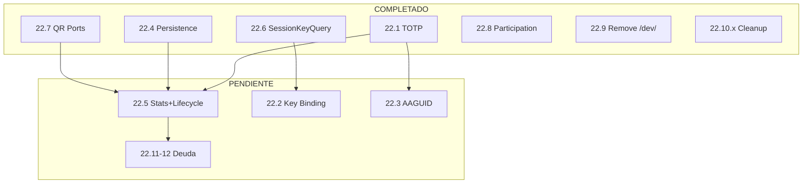

# ROADMAP2 - Fuente de Verdad Verificada

> **Generado:** 2025-12-18  
> **Metodo:** Consolidacion de ramas divergentes + auditoria de codigo  
> **Base:** main consolidado desde fase-22.10.3  
> **Build:** OK | **Tests:** 155/155 pasando

---

## Metodo de Verificacion

Este ROADMAP fue creado DESPUES de:

1. Merge de `fase-22.10.3-resolve-zod-todos` a `main`
2. Intento de cherry-pick de `fase-22.5` (incompatible - requiere reimplementacion)
3. Verificacion de build + tests (155 pasando)
4. Auditoria de codigo real con `ls` y `grep`

---

## Estado de Fases

| Fase | Descripcion | Estado | Evidencia |
|------|-------------|--------|-----------|
| 19.1 | shared/ports/ interfaces | COMPLETADA | `shared/ports/index.ts` existe |
| 19.2 | Dominio Session | COMPLETADA | `backend/session/` existe |
| 19.3 | Dominio Restriction | COMPLETADA | `backend/restriction/` existe |
| 20.1-20.7 | Limpieza Legacy | COMPLETADA | Endpoints actualizados |
| 21.1 | Servicios compartidos enrollment | COMPLETADA | `frontend/shared/services/enrollment/` |
| 21.1.1 | Fix LoginService authClient | COMPLETADA | `login.service.ts` actualizado |
| 21.1.2 | Access Gateway Orchestrator | COMPLETADA | `access-gateway.service.ts` |
| 21.1.3 | Auto-revoke enrollment | COMPLETADA | `one-to-one-policy.service.ts` |
| 21.2 | QR Reader Access Gateway | COMPLETADA | `qr-reader/main.ts` usa Access |
| 21.3 | Eliminar guest/ | COMPLETADA | `frontend/features/guest/` NO existe |
| 22.1 | Validacion TOTP | COMPLETADA | `totp-validation.stage.ts` existe |
| 22.4 | Extraer Persistencia | COMPLETADA | `attendance-persistence.service.ts` |
| 22.5 | Stats + QR Lifecycle | **PENDIENTE** | Incompatible con arquitectura actual |
| 22.6 | Inyectar SessionKeyQuery | COMPLETADA | `session-key-query.adapter.ts` |
| 22.7 | QR Projection Ports | COMPLETADA | `qr-generator.port.ts` etc |
| 22.8 | Descomponer Participation | COMPLETADA | `participation.service.ts` refactorizado |
| 22.9 | Eliminar /dev/ endpoints | COMPLETADA | Comentario confirma eliminacion |
| 22.10 | Mover WebSocketAuth | COMPLETADA | `auth/presentation/websocket-auth.middleware.ts` |
| 22.10.1 | Eliminar JWT generate | COMPLETADA | 0 matches de "generate" |
| 22.10.2 | Eliminar emojis | COMPLETADA | 0 emojis en archivos |
| 22.10.3 | Resolver TODO Zod | COMPLETADA | `validation.middleware.ts` clarificado |
| 22.2 | Session Key Binding | PENDIENTE | No hay credentialId en HKDF |
| 22.3 | Validar AAGUID | PENDIENTE | Columna existe, validacion no |
| 22.11 | Limpiar IFs de config | PENDIENTE | |
| 22.12 | Eliminar DI container | PENDIENTE | |

---

## Fases Pendientes Priorizadas

### 1. Fase 22.5: Extraer Stats + QR Lifecycle (REIMPLEMENTAR)

**Estado:** PENDIENTE - Requiere reimplementacion sobre arquitectura actual

**Problema:** La rama original `fase-22.5` tenia codigo incompatible:
- Usaba imports directos a `qr-projection/` (viola SoC)
- No usaba los adapters creados en 22.4-22.8
- Test tenia tipos incorrectos (`h` en QRPayloadV1)

**Que debe hacer:**
1. Crear `AttendanceStatsService` en `attendance/domain/services/`
2. Crear `IAttendanceStatsService` en `shared/ports/`
3. Crear `QRLifecycleAdapter` usando los ports existentes (22.7)
4. Actualizar `CompleteScanUseCase` para usar estos servicios

**Modelo recomendado:** Opus (requiere analisis arquitectonico)

---

### 2. Fase 22.2: Session Key Binding

**Estado:** PENDIENTE

**Verificacion:**
```bash
grep -n "credentialId" node-service/src/backend/session/
# Resultado: NO encontrado en HKDF derivation
```

**Que falta:**
- Modificar `deriveSessionKey()` para incluir credentialId en info HKDF
- Actualizar frontend para derivar igual
- Tests de binding

**Modelo recomendado:** Opus (criptografia critica)

---

### 3. Fase 22.3: Validacion AAGUID

**Estado:** PARCIAL

**Existe:**
- Columna `aaguid` en tabla `devices`
- Se almacena durante enrollment

**Falta:**
- Whitelist de AAGUIDs permitidos
- Validacion durante enrollment
- Tests

**Modelo recomendado:** Opus (seguridad)

---

### 4. Fases 22.11 y 22.12: Deuda Tecnica Opcional

- 22.11: Limpiar IFs de configuracion temporal
- 22.12: Eliminar DI container si no se usa

**Modelo recomendado:** Sonnet (mecanico)

---

## Diagrama de Dependencias



---

## Documentos de Referencia

| Documento | Proposito | Estado |
|-----------|-----------|--------|
| `daRulez.md` | Reglas de desarrollo | FUENTE DE VERDAD |
| `spec-architecture.md` | Arquitectura tecnica | Actualizado |
| `spec-qr-validation.md` | Flujo de validacion QR | Actualizado |
| `db-schema.md` | Esquema de base de datos | Vigente |

**Nota:** `PROJECT-CONSTITUTION.md` fue consolidado en `daRulez.md` y eliminado.

---

## Ramas a Limpiar

Las siguientes ramas locales pueden eliminarse (su contenido esta en main):

```bash
# Ramas obsoletas (ya mergeadas o reemplazadas)
git branch -d fase-22.10.3-resolve-zod-todos
git branch -d fase-22.10.2-remove-emoji-logs
git branch -d fase-22.10.1-remove-jwt-generation
git branch -d fase-22.10-move-websocket-auth
git branch -d fase-22.4-extract-persistence
git branch -d fase-22.8-decompose-participation
git branch -d fase-22.9-remove-dev-endpoints
git branch -d fase-22.7-qr-projection-ports
git branch -d fase-22.6-inject-session-query
git branch -d fase-22.1-totp-validation
git branch -d fase-21.3-eliminar-guest
git branch -d fase-21.2-qr-reader-access-gateway
git branch -d fase-21.1.3-auto-revoke-enrollment
git branch -d fase-21.1.2-access-gateway-orchestrator
git branch -d fase-21.1.1-fix-login-service-authclient
git branch -d fase-21.1-shared-enrollment-services

# Rama con codigo incompatible (documentar y eliminar)
git branch -D fase-22.5-extract-stats-and-qr-lifecycle
```

---

## Proxima Accion

1. Reimplementar fase 22.5 sobre arquitectura actual (usar Opus)
2. O continuar con 22.2 (Session Key Binding) si 22.5 puede esperar

---

*Este documento reemplaza a ROADMAP.md como fuente de verdad.*
