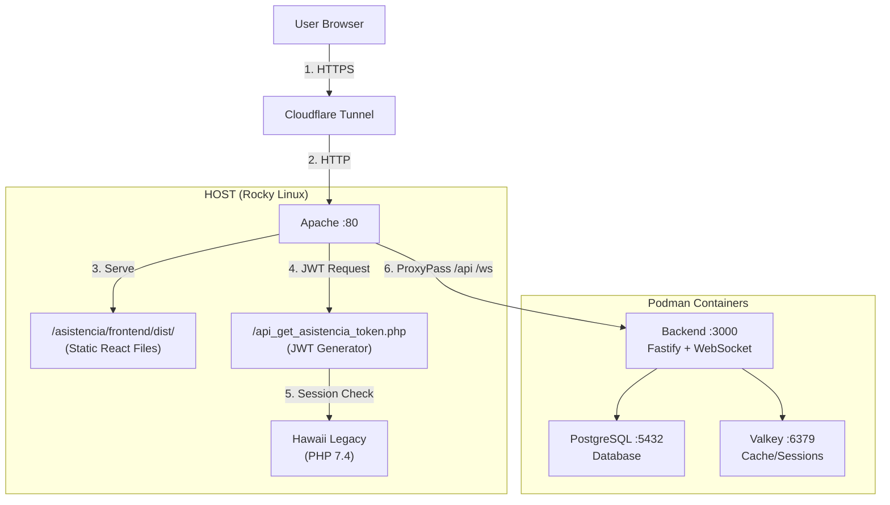

# Arquitectura Staging - Sistema de Asistencia

## Resumen

Entorno staging con 3 contenedores backend (Fastify, PostgreSQL, Valkey) y frontend estático servido por Apache en host.

## Componentes

### Host

**Apache 2.4.62**

- Servicio: Hawaii legacy PHP
- JWT endpoint: `/api_get_asistencia_token.php`
- Frontend estático: `/asistencia/frontend/dist/`
- ProxyPass: `/api/*` y `/ws/*` a `localhost:3000`

### Contenedores

**backend** (Node.js 20 + Fastify)

- Puerto: 3000
- API REST + WebSocket
- Autenticación JWT HS256
- Restart: unless-stopped
- Límites: CPU 0.25-1.0, RAM 128M-512M

**postgres** (PostgreSQL 18 Alpine)

- Puerto: 5432
- Persistencia: volume `postgres-data`
- Restart: unless-stopped

**valkey** (Valkey 7 Alpine)

- Puerto: 6379
- Cache y sesiones
- Restart: unless-stopped

## Arquitectura



## Flujo de Datos

1. Usuario accede via Cloudflare Tunnel (mantochrisal.cl)
2. Apache recibe petición HTTP en puerto 80
3. Frontend estático servido desde `/asistencia/frontend/dist/`
4. AJAX a `/api_get_asistencia_token.php` genera JWT
5. Validación sesión PHP legacy en Hawaii
6. API requests proxy a backend container puerto 3000
7. Backend consulta PostgreSQL y Valkey

## Diferencias con Producción

Staging excluye:

- `jwt-bridge`: Innecesario, JWT generado por PHP
- `frontend`: Servido estático por Apache, no containerizado

## Deployment

```bash
cd /var/www/html/hawaii/asistencia
podman-compose -f compose.yaml -f compose.staging.yaml up -d
```

## Configuración Apache

Requerida en `/etc/httpd/conf.d/hawaii.conf`:

```apache
ProxyPass /api http://localhost:3000/api
ProxyPassReverse /api http://localhost:3000/api
ProxyPass /ws ws://localhost:3000/ws
ProxyPassReverse /ws ws://localhost:3000/ws
```

## Validación

```bash
# Contenedores
podman-compose ps

# Backend health
curl http://localhost:3000/health

# JWT endpoint
curl -X GET http://localhost/api_get_asistencia_token.php \
  -H "Cookie: PHPSESSID=<session_id>"
```

## Notas Técnicas

- JWT Secret compartido: `backend/.env` y `api_get_asistencia_token.php`
- Puertos expuestos en host para debugging (remover en producción)
- Apache AllowOverride habilitado para `.htaccess`
- Cloudflare Tunnel usa 127.0.0.1 (IPv4 explícito)
