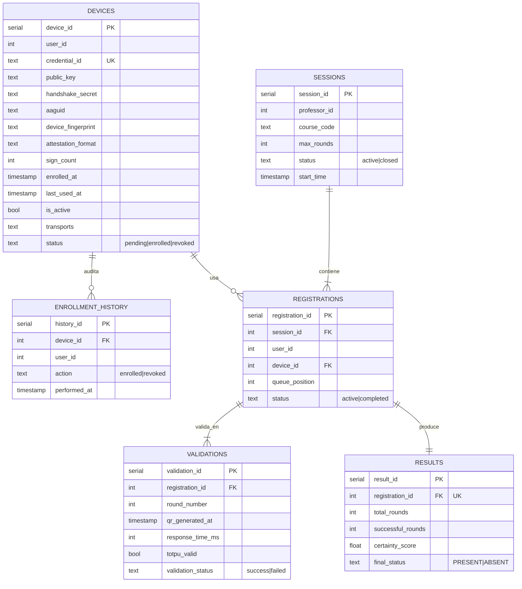
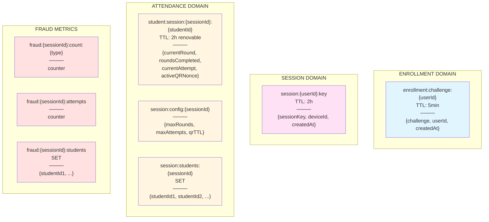

# Esquemas de Base de Datos

## PostgreSQL - Estructura Relacional

## Valkey (Redis) - Estructura Key-Value

---

## Schemas PostgreSQL

### Schema: `enrollment`
- **devices**: Dispositivos FIDO2 enrolados
- **enrollment_history**: Auditoría de acciones de enrollment

### Schema: `attendance`
- **sessions**: Sesiones de clase creadas por profesores
- **registrations**: Anuncios de participación de estudiantes
- **validations**: Validaciones individuales por ronda (FN3)
- **results**: Resultados finales consolidados

---

## Patrones de Clave Valkey

### Enrollment
- `enrollment:challenge:{userId}` - Challenge WebAuthn temporal (TTL: 5min)

### Session
- `session:{userId}:key` - Session key ECDH (TTL: 2h)

### Attendance
- `student:session:{sessionId}:{studentId}` - Estado de rounds e intentos por estudiante
- `session:config:{sessionId}` - Configuración de sesión (maxRounds, maxAttempts)
- `session:students:{sessionId}` - SET de estudiantes participantes

### Fraud Detection
- `fraud:{sessionId}:count:{type}` - Contadores de eventos de fraude
- `fraud:{sessionId}:attempts` - Contador de intentos totales
- `fraud:{sessionId}:students` - SET de estudiantes con actividad
