## 2. Arquitectura del Sistema

### 2.1 Flujo de Operación Completo

```mermaid
graph TD
    subgraph FASE1["FASE 1: LOGIN E INICIALIZACIÓN"]
        A[Cliente inicia sesión] -->|userId, password, deviceId| B[Servidor valida credenciales]
        B --> C{¿Nuevo dispositivo?}
        C -->|Sí| D[Impone delay anti-compartir]
        C -->|No| E[Genera TOTPu]
        D --> E
        E -->|TOTPu = TOTP secretUser, timestamp, deviceId| F[Almacena sesión]
        F --> G[Genera payload base]
        G --> H[Crea QR completo]
        H --> I[Extrae BitMatrix]
        I --> J[Identifica zona encoded data]
        J --> K[Fragmenta zona de datos en N partes]
        K --> L[Asigna porción user_i al usuario]
        L --> M[Envía a cliente: dataMatrix, TOTPu]
        M --> N[Almacena QR_truncado_i para proyección]
    end

    subgraph FASE2["FASE 2: REGISTRO EN SESIÓN DE ASISTENCIA"]
        O[Cliente solicita participar] -->|userId, sessionId, TOTPu| P[Servidor valida TOTPu]
        P --> Q[Genera TOTPs único para QR]
        Q -->|TOTPs = TOTP secretSession, timestamp, userId| R[Crea payload específico]
        R --> S[Genera QR_full]
        S --> T[Elimina porción del usuario]
        T --> U[Añade a cola de proyección]
        U --> V[Responde: registered, queuePosition]
    end

    subgraph FASE3["FASE 3: PROYECCIÓN ROTATIVA"]
        W[Pantalla proyecta QRs] --> X[QR_User_1<br/>500ms]
        X --> Y[QR_User_2<br/>500ms]
        Y --> Z[QR_User_3<br/>500ms]
        Z -->|Ciclo continúa| W
        X -.-> X1[User1 escanea]
        Y -.-> Y1[User2 escanea]
        Z -.-> Z1[User3 escanea]
    end

    subgraph FASE4["FASE 4: CAPTURA Y RECONSTRUCCIÓN LOCAL"]
        AA[Cliente escanea 10-15 FPS] --> AB{¿QR detectado?}
        AB -->|Sí| AC[Captura BitMatrix]
        AB -->|No| AA
        AC --> AD[Identifica zona encoded data]
        AD --> AE{¿Puede decodificar?}
        AE -->|No| AF[Combina con user_portion_local]
        AF --> AG[Reensambla BitMatrix completa]
        AG --> AH{¿Decodificación exitosa?}
        AH -->|Sí| AI[Extrae payload: sessionId, TOTPs, timestamp]
        AH -->|No| AA
        AI --> AJ{¿Validación local OK?}
        AJ -->|Sí| AK[Procede a Fase 5]
        AJ -->|No| AA
    end

    subgraph FASE5["FASE 5: VALIDACIÓN SERVIDOR"]
        AL[Cliente envía validación] -->|userId, sessionId, TOTPs, TOTPu, timestamp, roundNumber| AM[Servidor valida TOTPu]
        AM --> AN{¿TOTPu válido?}
        AN -->|No| AO[Error: Invalid session]
        AN -->|Sí| AP[Valida TOTPs]
        AP --> AQ{¿TOTPs válido?}
        AQ -->|No| AR[Error: Invalid QR token]
        AQ -->|Sí| AS[Verifica anti-replay]
        AS --> AT{¿Ya usado?}
        AT -->|Sí| AU[Error: Replay attack]
        AT -->|No| AV[Valida timestamp]
        AV --> AW{¿Dentro de ventana?}
        AW -->|No| AX[Error: Capture too old]
        AW -->|Sí| AY[Marca attendanceRound]
        AY --> AZ{¿roundNumber?}
        AZ -->|"< 3"| BA[Envía nextDataPortion]
        AZ -->|"= 3"| BB[Asistencia confirmada ✓]
    end

    subgraph FASE6["FASE 6: CICLO MULTI-RONDA x3"]
        BC[Ronda 1: Payload A] --> BD[Validación]
        BD -->|Exitosa| BE[Confirmación 1]
        BE --> BF[Ronda 2: Payload B]
        BF --> BG[Validación]
        BG -->|Exitosa| BH[Confirmación 2]
        BH --> BI[Ronda 3: Payload C]
        BI --> BJ[Validación]
        BJ -->|Exitosa| BK[Confirmación 3<br/>Asistencia confirmada ✓]
        BD -->|Falla| BL[Reintento siguiente ciclo]
        BG -->|Falla| BL
        BJ -->|Falla| BL
        BL -->|N intentos| BM[Sesión expira]
    end

    N -.-> O
    V -.-> W
    AK -.-> AL
    BA -.-> BC
    BB -.-> BC
```

#### Interpretación del Flujo de Operación

##### (FASE 1: LOGIN E INICIALIZACIÓN - Diagrama: Flujo de Operación Completo)

1. El cliente inicia sesión enviando userId, password y deviceId al servidor
2. El servidor valida las credenciales recibidas
3. Si es un dispositivo nuevo, se impone un delay anti-compartir (penalización temporal)
4. El servidor genera un TOTPu (TOTP de Usuario) único para esta sesión y dispositivo
5. Se almacena la sesión con el TOTPu, deviceId y tiempo de login
6. El servidor genera el payload base con sessionId, classId y timestamp
7. Se crea un código QR completo con el payload encriptado
8. Se extrae la BitMatrix completa del QR generado
9. Se identifica la zona de encoded data (excluyendo finder patterns, timing patterns, etc.)
10. La zona de datos se fragmenta en N partes (una por usuario)
11. Se asigna al usuario su porción específica de datos (user_portion_i)
12. El servidor envía al cliente su porción de datos (dataMatrix) junto con el TOTPu
13. Se almacena el QR truncado (sin la porción del usuario) para proyección posterior

##### (FASE 2: REGISTRO EN SESIÓN DE ASISTENCIA - Diagrama: Flujo de Operación Completo)

1. El cliente solicita participar enviando userId, sessionId y TOTPu
2. El servidor valida que el TOTPu sea correcto para esta sesión
3. Se genera un TOTPs (TOTP de Servidor) único para este QR específico
4. El TOTPs se genera usando secretSession, timestamp y userId
5. Se crea un payload específico con userId, sessionId, TOTPs y timestamp
6. Se genera un QR completo con el payload encriptado
7. Se elimina la porción de datos que corresponde a este usuario
8. El QR truncado se añade a la cola de proyección
9. El servidor responde confirmando el registro y la posición en la cola

##### (FASE 3: PROYECCIÓN ROTATIVA - Diagrama: Flujo de Operación Completo)

1. La pantalla comienza a proyectar códigos QR en rotación
2. Se muestra QR_User_1 durante 500ms
3. Se muestra QR_User_2 durante 500ms
4. Se muestra QR_User_3 durante 500ms
5. El ciclo continúa rotando indefinidamente
6. Cada usuario escanea su QR correspondiente cuando aparece en pantalla
7. User1 escanea cuando ve QR_User_1
8. User2 escanea cuando ve QR_User_2
9. User3 escanea cuando ve QR_User_3

##### (FASE 4: CAPTURA Y RECONSTRUCCIÓN LOCAL - Diagrama: Flujo de Operación Completo)

1. El cliente escanea continuamente el video a 10-15 FPS
2. Verifica si se detectó un código QR en el frame
3. Si no se detecta QR, vuelve a escanear
4. Si se detecta, captura la BitMatrix del QR proyectado
5. Identifica la zona de encoded data del QR capturado
6. Intenta decodificar el QR tal como está
7. Si no puede decodificar (QR incompleto), combina el QR capturado con su porción local
8. Reensambla la BitMatrix completa uniendo ambas partes
9. Intenta decodificar nuevamente la BitMatrix reconstruida
10. Si la decodificación falla, vuelve a escanear
11. Si es exitosa, extrae el payload: sessionId, TOTPs y timestamp
12. Valida localmente que sessionId coincida y timestamp sea reciente (<5 segundos)
13. Si la validación local falla, vuelve a escanear
14. Si la validación es correcta, procede a la Fase 5

##### (FASE 5: VALIDACIÓN SERVIDOR - Diagrama: Flujo de Operación Completo)

1. El cliente envía la validación con userId, sessionId, TOTPs, TOTPu, timestamp y roundNumber
2. El servidor valida el TOTPu (token de sesión del usuario)
3. Si el TOTPu no es válido, retorna error "Invalid session"
4. Si es válido, procede a validar el TOTPs (token del QR)
5. Verifica que el TOTPs corresponda al QR proyectado para este usuario
6. Si el TOTPs no es válido, retorna error "Invalid QR token"
7. Si es válido, verifica si el TOTPs ya fue usado anteriormente (anti-replay)
8. Si ya fue usado, retorna error "Replay attack"
9. Si no ha sido usado, valida el timestamp de captura
10. Verifica que el timestamp esté dentro de la ventana válida (<10 segundos)
11. Si está fuera de la ventana, retorna error "Capture too old"
12. Si está dentro de la ventana, marca la ronda de asistencia como completada
13. Verifica el número de ronda actual
14. Si roundNumber < 3, envía la siguiente porción de datos para la próxima ronda
15. Si roundNumber = 3, confirma que la asistencia fue registrada exitosamente

##### (FASE 6: CICLO MULTI-RONDA x3 - Diagrama: Flujo de Operación Completo)

1. Comienza la Ronda 1 con el Payload A
2. Se ejecuta el proceso de validación para la Ronda 1
3. Si es exitosa, se registra la Confirmación 1
4. Comienza la Ronda 2 con el Payload B
5. Se ejecuta el proceso de validación para la Ronda 2
6. Si es exitosa, se registra la Confirmación 2
7. Comienza la Ronda 3 con el Payload C
8. Se ejecuta el proceso de validación para la Ronda 3
9. Si es exitosa, se registra la Confirmación 3 y la asistencia queda confirmada
10. Si cualquier ronda falla, el usuario puede reintentar en el siguiente ciclo de proyección
11. Después de N intentos fallidos consecutivos, la sesión expira

### 2.2 Diagrama de Secuencia Detallado

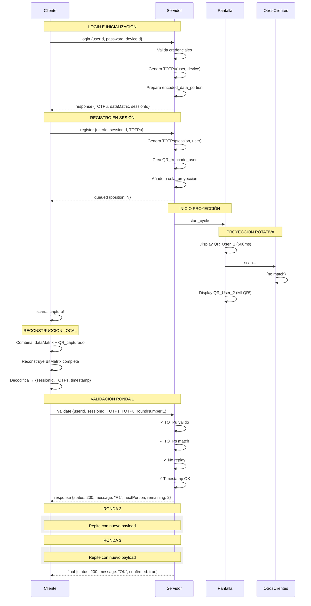

### 2.3 Sistema Dual TOTP

El sistema utiliza **dos tipos de TOTP** con propósitos diferentes:

#### 2.3.1 TOTPu (TOTP de Usuario)

**Propósito:** Vincular la sesión al dispositivo del usuario y prevenir compartir credenciales.

**Características:**


**Propiedades:**

- **Único por sesión + dispositivo**: Cambiar de dispositivo genera un nuevo TOTPu
- **Handshake en login**: Cliente y servidor sincronizan el TOTPu al iniciar sesión
- **Penalización por cambio**: Si se detecta nuevo `deviceId`, se impone delay antes de permitir login
  - Primer cambio: 5 minutos de espera
  - Cambios frecuentes: Incremento exponencial (10min, 30min, 1h, ...)
- **Válido durante toda la sesión**: No cambia hasta nuevo login
- **Enviado en cada validación**: Cliente incluye TOTPu en cada request de validación

**Generación de deviceId:**


**Flujo anti-compartir:**

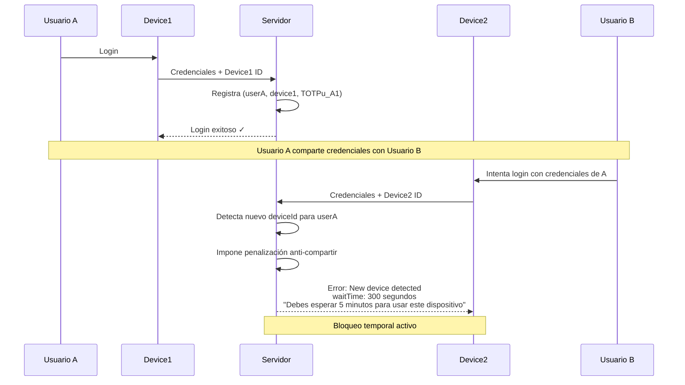

#### 2.3.2 TOTPs (TOTP de Servidor/Sesión)

**Propósito:** Validar que el QR capturado es reciente y no ha sido reusado (anti-replay).

**Características:**


**Propiedades:**

- **Único por QR generado**: Cada QR proyectado tiene su propio TOTPs
- **Vida corta**: Válido solo por 30 segundos (similar a códigos SMS)
- **Incluido en payload del QR**: El cliente lo extrae al decodificar
- **Validación de unicidad**: Servidor marca como usado tras primera validación
- **Vinculado a ronda**: TOTPs diferente para cada ronda (1, 2, 3)

**Diferencias clave:**

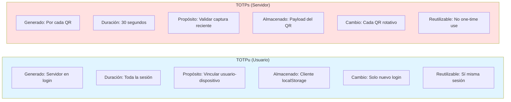

| Aspecto | TOTPu (Usuario) | TOTPs (Servidor) |
|---------|-----------------|------------------|
| **Generado por** | Servidor en login | Servidor por cada QR |
| **Duración** | Toda la sesión | 30 segundos |
| **Propósito** | Vincular usuario-dispositivo | Validar captura reciente |
| **Almacenado** | Cliente (localStorage) | En payload del QR |
| **Cambio** | Solo en nuevo login | Cada QR rotativo |
| **Reutilizable** | Sí (en misma sesión) | No (one-time use) |

**Validación conjunta en servidor:**


**Ejemplo de tokens en uso:**

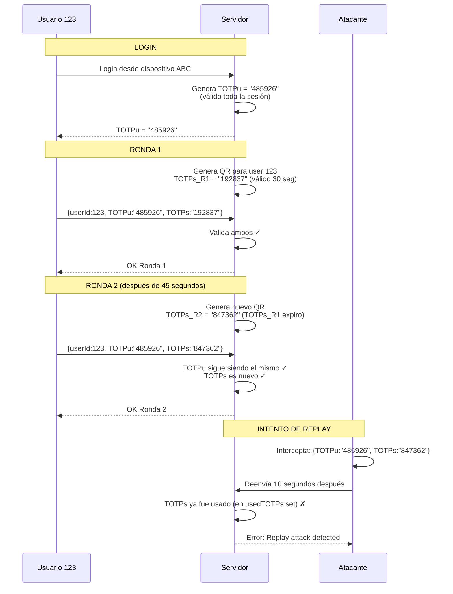

---

### 2.4 Precisiones Arquitectónicas de Implementación

#### 2.4.1 Enrolamiento vs Login (Separación Clara)

**Enrolamiento (Primera vez o nuevo dispositivo):**

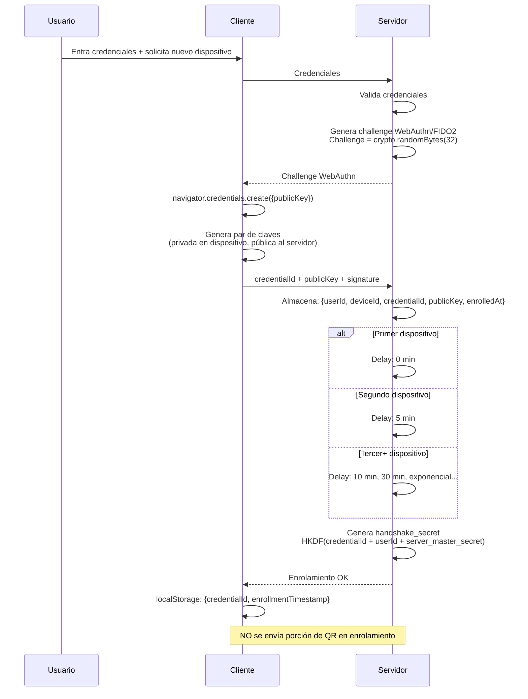

**Login con Sesión Activa:**

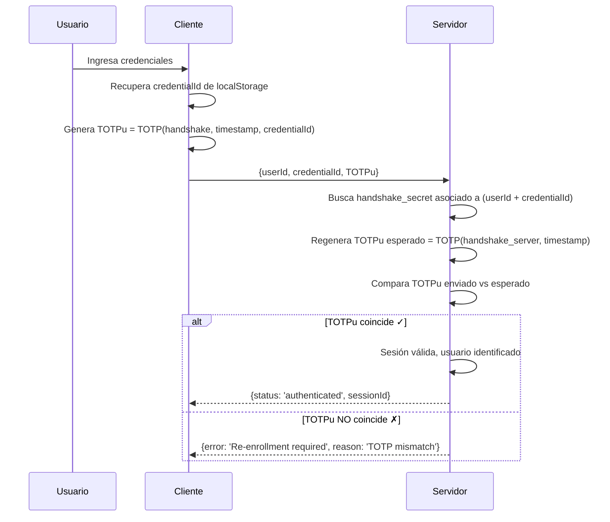

**Login CON inicio de proceso de asistencia:**

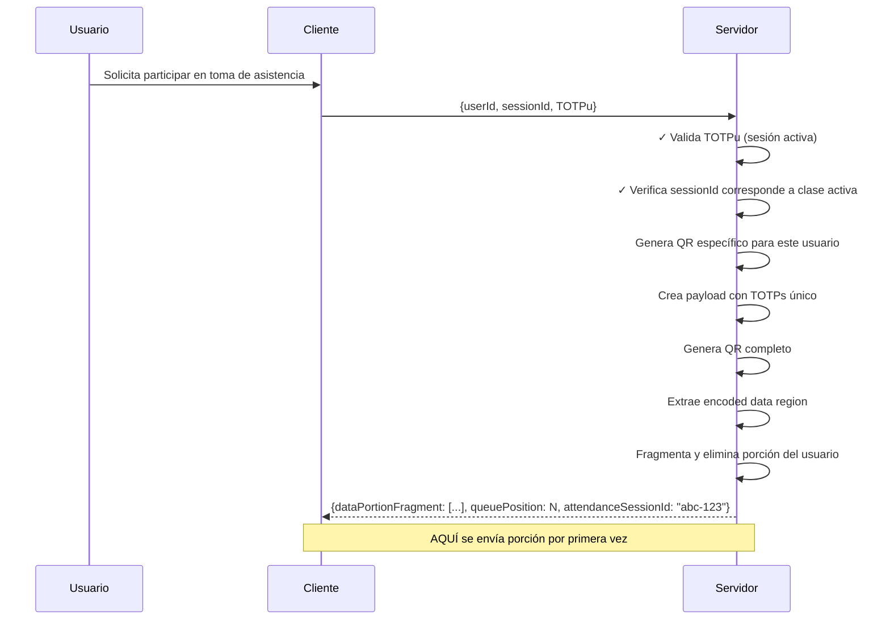

**Key Derivation (HKDF):**


#### 2.4.2 Arquitectura de Stack Tecnológico

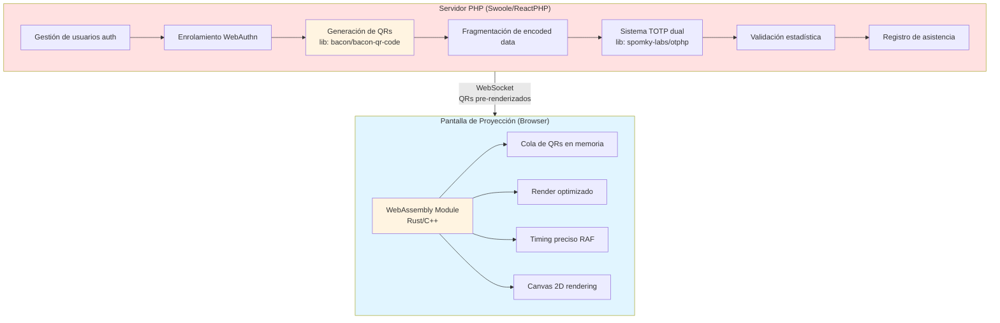

**Biblioteca recomendada para QR en PHP:**


#### 2.4.3 Flujo de Captura y Decodificación Inmediata

**Estrategia:** Interceptar antes de decodificación fallida

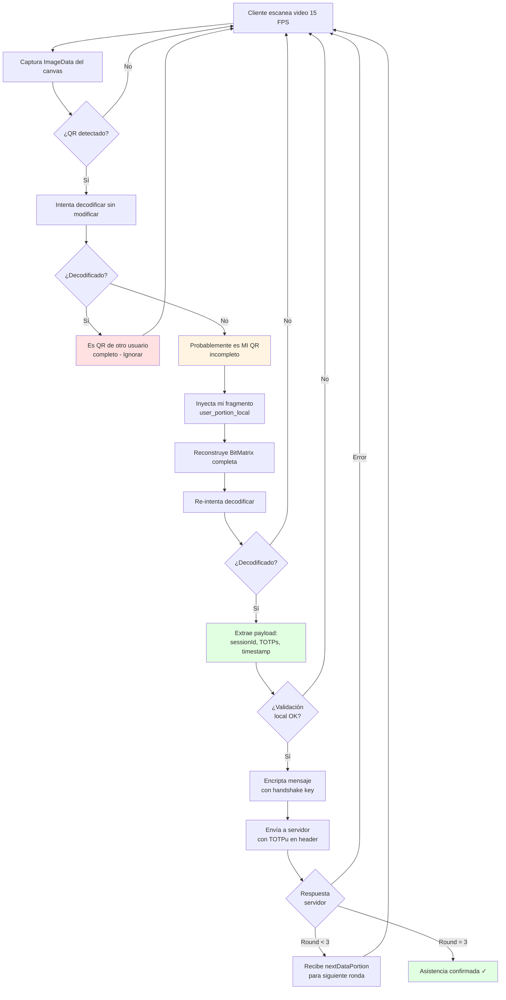


#### 2.4.4 Validación por Umbral Estadístico

**Problema:** Tiempos varían según condiciones (servidor lento, red saturada, etc.)

**Solución:** Validación basada en **grado de certeza** en lugar de booleano.

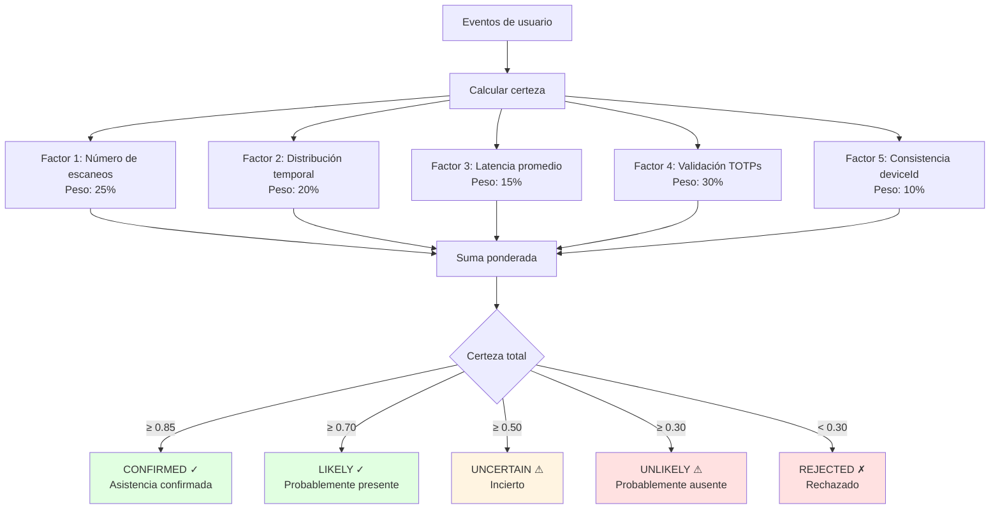

[📄 Ver código: 2.4.4-attendance-validator.php](../code/02-arquitectura_del_sistema/2.4.4-attendance-validator.php)

**Ejemplo de scoring:**

```text
Usuario A (presente, buena conexión):
├─ 8 escaneos / 10 posibles = 0.80 × 0.25 = 0.20
├─ Distribución temporal uniforme = 0.90 × 0.20 = 0.18
├─ Latencia promedio 250ms = 1.00 × 0.15 = 0.15
├─ 100% TOTPs válidos = 1.00 × 0.30 = 0.30
├─ Mismo dispositivo = 1.00 × 0.10 = 0.10
└─ Certeza total = 0.93 → CONFIRMED

Usuario B (presente, conexión lenta):
├─ 5 escaneos / 10 posibles = 0.50 × 0.25 = 0.125
├─ Distribución irregular = 0.60 × 0.20 = 0.12
├─ Latencia promedio 3500ms = 0.50 × 0.15 = 0.075
├─ 100% TOTPs válidos = 1.00 × 0.30 = 0.30
├─ Mismo dispositivo = 1.00 × 0.10 = 0.10
└─ Certeza total = 0.72 → LIKELY

Usuario C (ausente, intento de replay):
├─ 2 escaneos = 0.20 × 0.25 = 0.05
├─ Distribución: N/A = 0.30 × 0.20 = 0.06
├─ Latencia promedio 8000ms = 0.20 × 0.15 = 0.03
├─ 50% TOTPs válidos (mitad replay) = 0.50 × 0.30 = 0.15
├─ Dispositivo inconsistente = 0.50 × 0.10 = 0.05
└─ Certeza total = 0.34 → UNLIKELY
```

#### 2.4.5 Timestamps del Servidor para Anti-Replay

**Problema:** Necesitamos saber cuándo fue exhibido cada QR para validar latencias.

[📄 Ver código: 2.4.5-qr-projection-manager.php](../code/02-arquitectura_del_sistema/2.4.5-qr-projection-manager.php)

#### 2.4.6 Criterios de Finalización del Ciclo

El ciclo de proyección continúa hasta que se cumpla **cualquiera** de estas condiciones (XOR lógico):

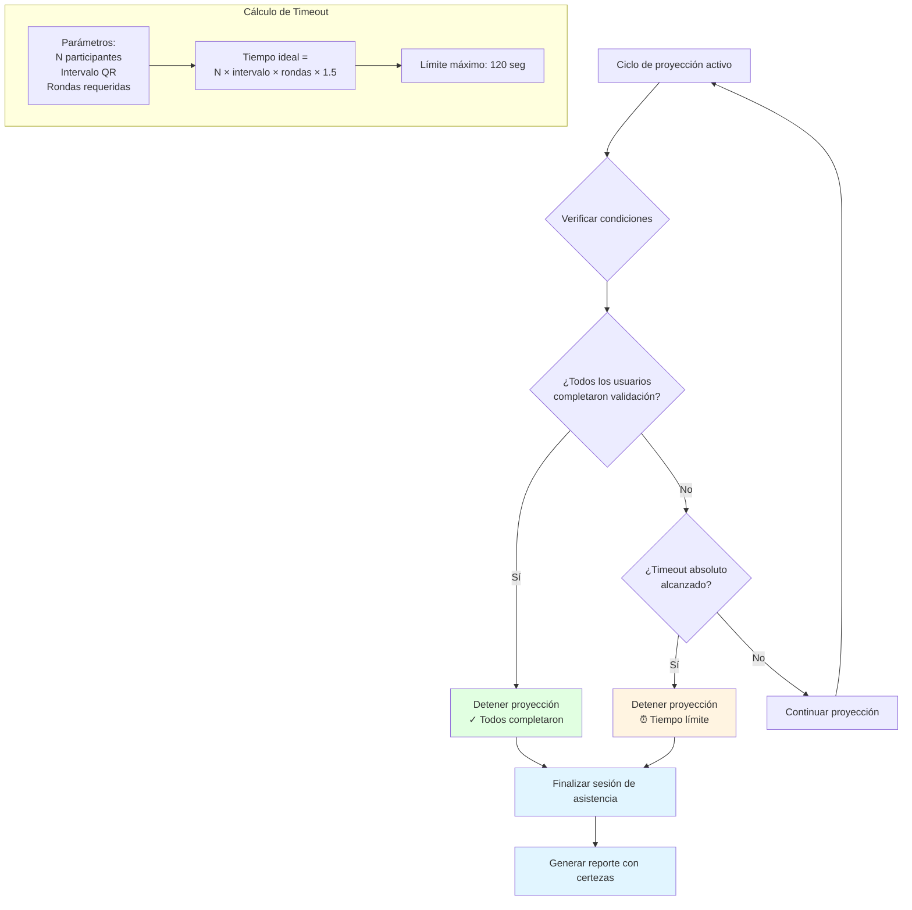


**Re:** "100 participantes en menos de 30 segundos"

Con intervalo de 300ms por QR:

```text
100 QRs × 0.3 seg = 30 segundos por ciclo
3 rondas = 90 segundos total

Viable SI:
├─ Red estable para todos
├─ Proyector de alta frecuencia (120Hz+)
├─ QRs pequeños (versión 5-7, ~40x40 módulos)
└─ Cada usuario tiene solo 3 oportunidades de captura

Alternativa para 100+ usuarios:
├─ Dividir en 4 grupos de 25
├─ Proyectar en paralelo en 4 pantallas
└─ Tiempo total = 25 × 0.5seg × 3 = 37.5 seg
```