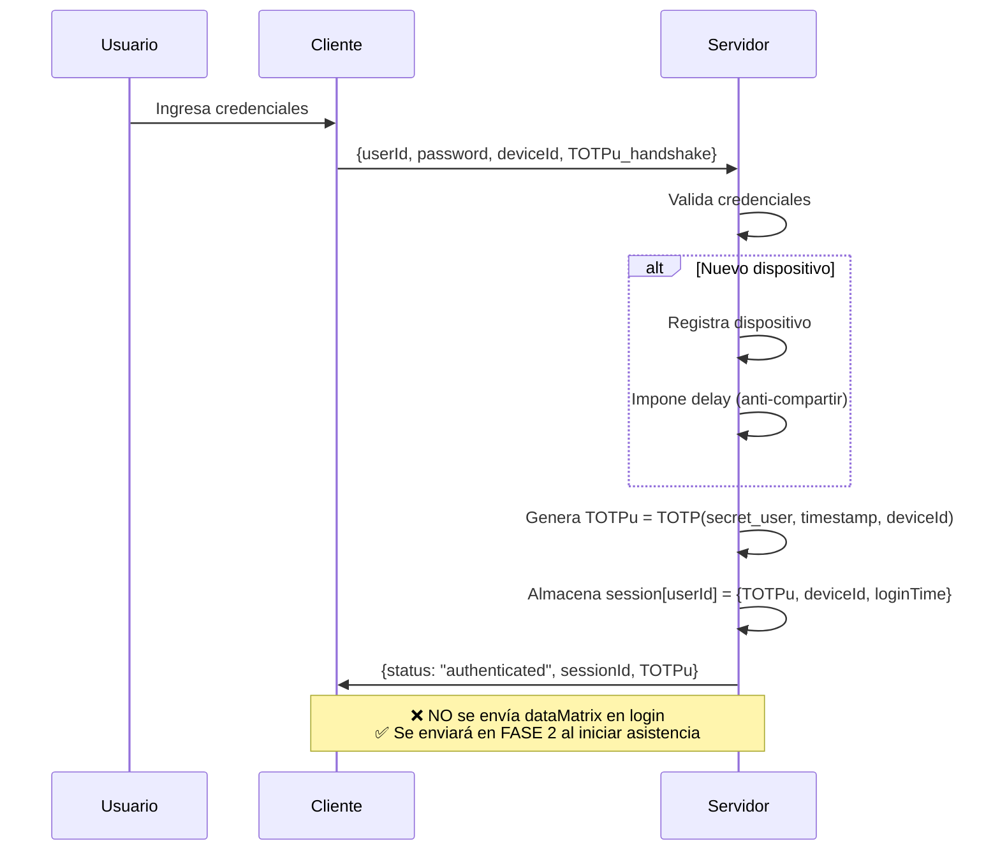
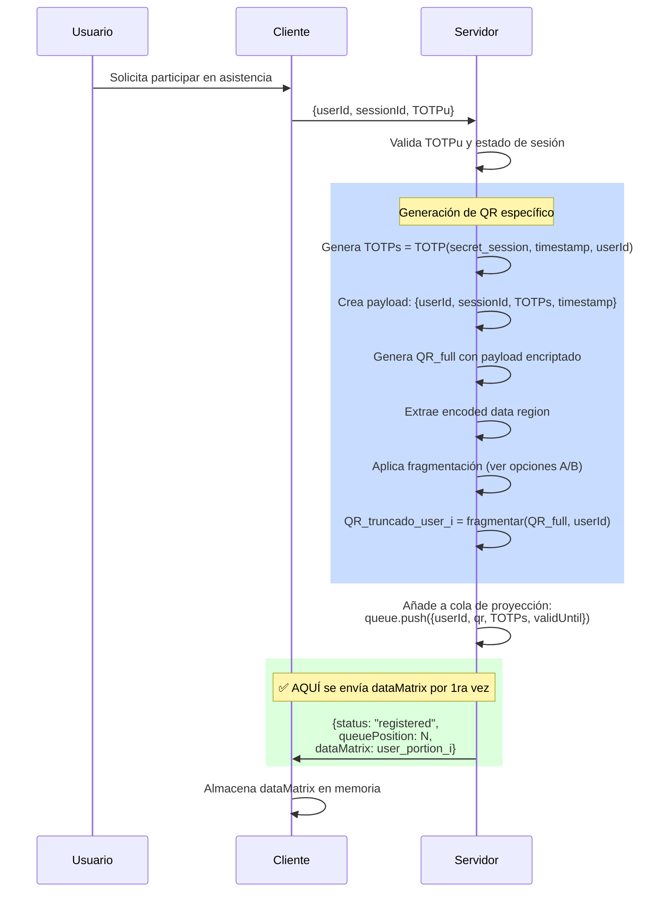
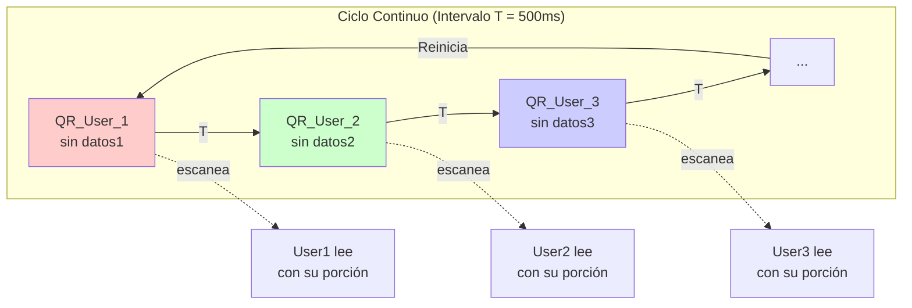
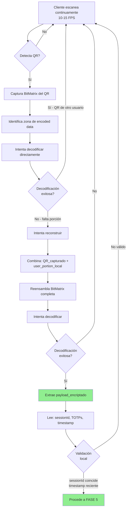
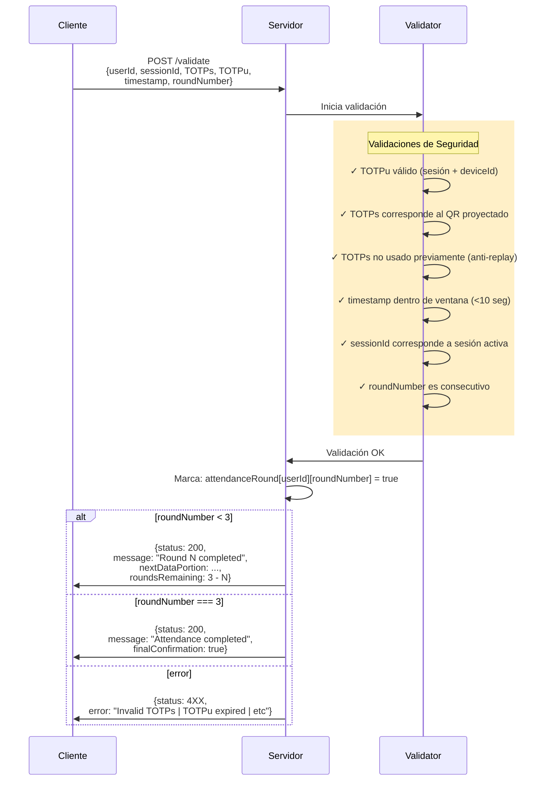
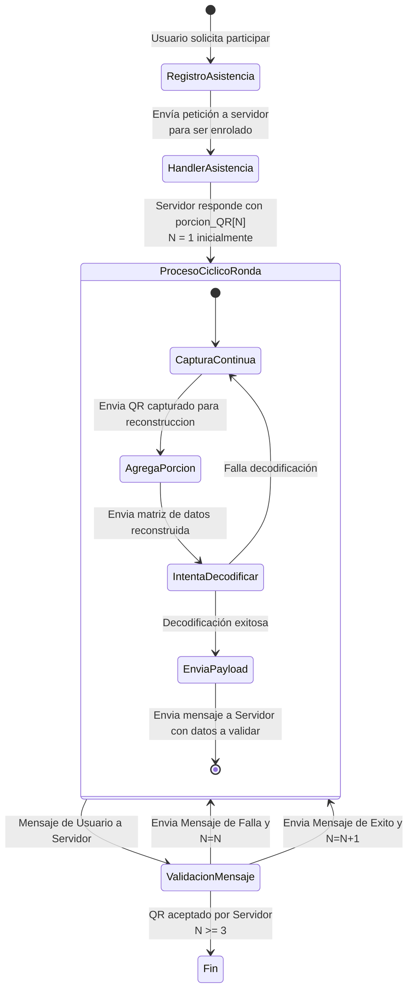
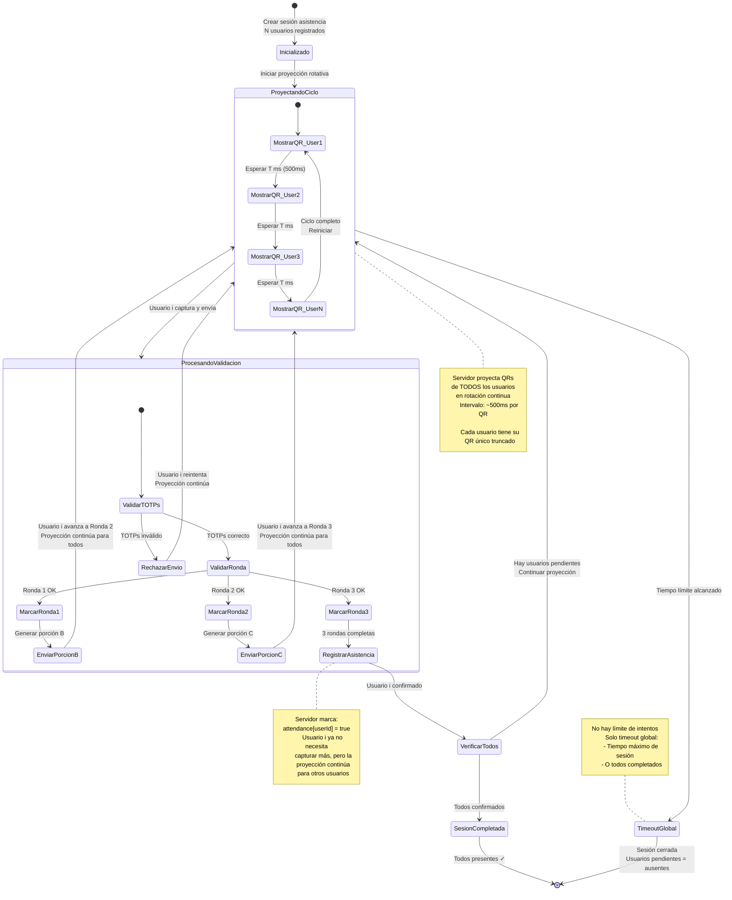
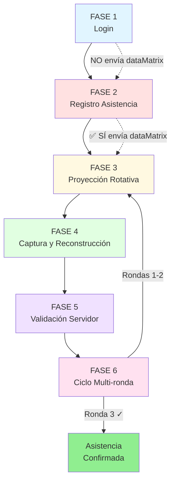

# Flujo Completo del Sistema de Asistencia - 6 Fases

## FASE 1: LOGIN E INICIALIZACIÓN



**Descripción:**

- Cliente envía: `{userId, password, deviceId, TOTPu_handshake}`
- Servidor valida credenciales
- Servidor genera TOTPu (único por sesión + dispositivo):
  - Si es nuevo dispositivo: registra + impone delay (anti-compartir)
  - `TOTPu = TOTP(secret_user, timestamp, deviceId)`
  - Almacena: `session[userId] = {TOTPu, deviceId, loginTime}`
- Servidor responde: `{status: "authenticated", sessionId, TOTPu}`

---

## FASE 2: REGISTRO EN SESIÓN DE ASISTENCIA



**Descripción:**

Usuario solicita participar en toma de asistencia:

- Cliente envía: `{userId, sessionId, TOTPu}`
- Servidor valida TOTPu y estado de sesión

Servidor genera QR específico para este usuario:

- Genera TOTPs único para este QR:
  - `TOTPs = TOTP(secret_session, timestamp, userId)`
  - (válido por tiempo corto, similar a código SMS)
- Crea payload: `{userId, sessionId, TOTPs, timestamp}`
- Genera QR_full con payload encriptado
- Extrae encoded data region
- **Aplica fragmentación (dos opciones en evaluación):**

  **Opción A - Data Masking (eliminación directa):**
  - Selecciona posiciones estratégicas en encoded data region
  - Elimina módulos específicos: `user_portion_i = QR_full.data[positions]`
  - `QR_truncado_user_i = QR_full con huecos en positions`
  - Cliente reconstruye insertando bytes en posiciones conocidas

  **Opción B - Shamir Secret Sharing:**
  - Divide encoded data en N fragmentos con umbral K
  - `fragments = ShamirSplit(QR_full.data, N=usuarios, K=2)`
  - `user_portion_i = fragments[i]`
  - `QR_truncado_user_i = fragments[0]` (fragmento base proyectado)
  - Cliente reconstruye: `QR_full.data = ShamirReconstruct([fragments[0], fragments[i]])`

- Añade a cola de proyección:

  ```javascript
  queue.push({
    userId: i,
    qr: QR_truncado_user_i,
    TOTPs: TOTPs,
    validUntil: timestamp + 30s
  })
  ```

Servidor confirma registro:

- Responde: `{status: 'registered', queuePosition: N, dataMatrix: user_portion_i}`

---

## FASE 3: PROYECCIÓN ROTATIVA



**Descripción:**

Pantalla proyecta QRs en rotación (intervalo en milisegundos):

- Intervalo T (ej: 500ms cada QR)
- Ciclo continúa hasta que servidor cierre sesión

Cada QR proyectado contiene:

- ✅ Finder patterns (completos)
- ✅ Timing patterns (completos)
- ✅ Format/Version info (completos)
- ❌ Encoded data region (INCOMPLETA - falta porción del usuario i)

**Importante:**
- Cada usuario tiene un QR ÚNICO y truncado de manera ÚNICA
- Solo puede reconstruir SU propio QR con SU porción específica
- Si intenta reconstruir el QR de otro usuario, la decodificación FALLARÁ

---

## FASE 4: CAPTURA Y RECONSTRUCCIÓN LOCAL



**Descripción:**

Cada usuario (concurrentemente):

- Cliente escanea continuamente (10-15 FPS)

Cuando detecta QR:

- Captura BitMatrix del QR proyectado
- Identifica zona de encoded data
- Detecta que le falta una porción (intenta decodificar → falla)

**Intenta reconstruir (según método de fragmentación):**

**Si se usa Opción A - Data Masking:**
- Identifica posiciones faltantes en BitMatrix
- Inserta `user_portion_local` en posiciones conocidas
- `QR_completo = QR_capturado con user_portion en huecos`
- Intenta decodificar
- **Si falla → QR no corresponde a este usuario** (porción incorrecta)
- **Si éxito → continúa validación**

**Si se usa Opción B - Shamir Secret Sharing:**
- Extrae fragmento base del QR capturado
- Combina: `ShamirReconstruct([fragment_base, user_portion_local])`
- Reconstruye encoded data completa
- Intenta decodificar
- **Si falla → QR no corresponde a este usuario** (fragmentos incompatibles)
- **Si éxito → continúa validación**

Si decodificación exitosa:

- Extrae `payload_encriptado` del QR
- Lee: `{sessionId, TOTPs, timestamp, ...}`
- Valida localmente:
  - sessionId coincide con sesión actual
  - timestamp reciente (<5 segundos del QR proyectado)

Si validación local OK:

- Procede a enviar al servidor (Fase 5)

---

## FASE 5: VALIDACIÓN SERVIDOR



**Descripción:**

Cliente envía (carga liviana):

```javascript
{
  userId: 123,
  sessionId: "abc-def",
  TOTPs: "456789",        // Extraído del QR decodificado
  TOTPu: "123456",        // Token de sesión del usuario
  timestamp: 1234567890,  // Momento de captura
  roundNumber: 1          // Ronda actual (1-3)
}
```

Servidor valida:

- ✓ TOTPu válido para esta sesión + deviceId
- ✓ TOTPs corresponde al QR proyectado para este userId
- ✓ TOTPs no ha sido usado previamente (anti-replay)
- ✓ timestamp dentro de ventana válida (<10 segundos)
- ✓ sessionId corresponde a sesión activa
- ✓ roundNumber es consecutivo (no saltar rondas)

Servidor marca: `attendanceRound[userId][roundNumber] = true`

Servidor responde según estado:

**Si roundNumber < 3:**

```javascript
{
  status: 200,
  message: "Round N completed",
  nextDataPortion: encoded_data_for_next_round,
  roundsRemaining: 3 - N
}
```

**Si roundNumber === 3:**

```javascript
{
  status: 200,
  message: "Attendance completed successfully",
  finalConfirmation: true
}
```

**Si error:**

```javascript
{
  status: 4XX,
  error: "Invalid TOTPs | TOTPu expired | etc"
}
```

---

## FASE 6: CICLO MULTI-RONDA (×3)

### 6.1 - Perspectiva del Usuario (Individual)



**Descripción - Perspectiva Usuario:**

**Inicio del proceso:**
1. Usuario solicita participar en toma de asistencia
2. Servidor registra al usuario y envía `porcion_QR[1]` (primera porción)

**Ciclo repetitivo (3 rondas):**

El usuario entra en un **ciclo continuo** que se repite para cada ronda (N = 1, 2, 3):

1. **Captura continua:** Cliente escanea continuamente (10-15 FPS)
2. **Intenta decodificar:** Por cada frame capturado
3. **Agrega porción:** Inserta su `porcion_QR[N]` local
4. **Intenta reconstruir:** Intenta decodificar el QR completo
   - **No reconoce:** QR no corresponde a este usuario, sigue capturando
   - **Reconoce:** Decodificación exitosa, extrae payload

5. **Envía payload:** POST al servidor con datos del QR decodificado
6. **Espera validación:** Servidor procesa y responde:
   - **Error (4XX):** Vuelve a captura continua (mismo N)
   - **Éxito + nueva porción (200 + porcion_QR[N+1]):** Avanza a siguiente ronda
   - **Éxito final (200 sin porción):** N = 3, asistencia confirmada

**Condiciones de terminación:**
- **Éxito:** Servidor responde 200 sin nueva porción (después de ronda 3)
- **Timeout:** Tiempo límite global del proceso alcanzado

---

### 6.2 - Perspectiva del Servidor (Sistema)



**Descripción - Perspectiva Servidor:**

El servidor maneja el proceso completo para TODOS los usuarios:

1. **Inicialización:**
   - Crea sesión de asistencia
   - N usuarios registrados (cada uno con su QR único)

2. **Proyección Rotativa Continua:**
   - Ciclo infinito: QR_User1 → QR_User2 → ... → QR_UserN → (reinicia)
   - Intervalo T entre cada QR (~500ms)
   - **Proyección NO se detiene** hasta que termine la sesión

3. **Procesamiento Concurrente:**
   - Mientras proyecta, **puede recibir validaciones** de múltiples usuarios
   - Cada usuario puede estar en diferente ronda:
     - User1 puede estar en Ronda 3
     - User2 puede estar en Ronda 1
     - User3 puede estar en Ronda 2

4. **Por cada validación recibida:**
   - Valida TOTPs + TOTPu + timestamp + sessionId
   - Si válido: marca ronda completada para ese usuario
   - Si ronda < 3: envía nueva porción para siguiente ronda
   - Si ronda === 3: marca asistencia confirmada
   - **La proyección continúa para otros usuarios**

5. **Condiciones de terminación:**
   - ✅ **Todos completados:** Todos los usuarios confirmaron 3 rondas
   - ❌ **Timeout global:** Tiempo máximo de sesión alcanzado
   - Usuarios que no completaron 3 rondas = **ausentes**

**Importante:**
- Servidor NO espera a que todos terminen una ronda para pasar a la siguiente
- Cada usuario avanza a su propio ritmo (asíncrono)
- Proyección es continua e independiente de validaciones
- No hay "reintentos" en servidor, solo proyección continua

---

### 6.3 - Datos Únicos por Ronda

El proceso completo se repite 3 veces con **datos completamente nuevos en cada ronda**:

1. **Ronda 1:**
   - Servidor genera nuevo Payload A con TOTPs único
   - Crea QR_A_truncado con fragmentación específica
   - Envía nueva user_portion_A al cliente
   - Validación → Confirmación 1 ✓

2. **Ronda 2:**
   - Servidor genera nuevo Payload B con TOTPs único (diferente a A)
   - Crea QR_B_truncado con fragmentación diferente
   - Envía nueva user_portion_B al cliente
   - Validación → Confirmación 2 ✓

3. **Ronda 3:**
   - Servidor genera nuevo Payload C con TOTPs único (diferente a A y B)
   - Crea QR_C_truncado con fragmentación diferente
   - Envía nueva user_portion_C al cliente
   - Validación → Confirmación 3 ✓
   - **Asistencia confirmada ✓**

**Importante:** Cada ronda usa:

- ✅ Payload DIFERENTE (A, B, C)
- ✅ TOTPs DIFERENTE (anti-replay)
- ✅ Fragmentación DIFERENTE (posiciones o fragmentos Shamir distintos)
- ✅ user_portion DIFERENTE (renovada en cada ronda)

---

## Resumen del Flujo Completo



---

## NOTAS TÉCNICAS: Opciones de Fragmentación

### Estado: EN EVALUACIÓN

El sistema contempla dos métodos para fragmentar el QR. Ambos están pendientes de pruebas de concepto para determinar cuál implementar en producción.

### Opción A: Data Masking (Eliminación Directa)

**Concepto:**
- Eliminar módulos específicos de la encoded data region
- Usuario recibe copia exacta de los bytes eliminados
- Reconstrucción por inserción directa en posiciones conocidas

**Ventajas:**
- ✅ Implementación simple y rápida
- ✅ Bajo overhead computacional
- ✅ Fácil debugging (inspección visual del QR)
- ✅ No requiere librerías criptográficas adicionales

**Desventajas:**
- ❌ Si se captura tanto QR proyectado como `user_portion`, se puede reconstruir
- ❌ Requiere coordinación precisa de posiciones entre cliente/servidor
- ❌ Vulnerable a ataques de fuerza bruta en porciones pequeñas

**Formato de dataMatrix:**
```javascript
{
  portion: Uint8Array,           // Bytes eliminados
  positions: number[],           // Índices en encoded data region
  checksum: string               // Validación de integridad
}
```

---

### Opción B: Shamir Secret Sharing

**Concepto:**
- Divide encoded data en N fragmentos con umbral K=2
- Fragmento base (0) se proyecta en pantalla
- Fragmento específico (i) se entrega al usuario i
- Reconstrucción requiere AMBOS fragmentos matemáticamente

**Ventajas:**
- ✅ Seguridad matemática robusta (imposible reconstruir con 1 solo fragmento)
- ✅ No depende de coordinación de posiciones
- ✅ Resistente a inspección visual
- ✅ Escalable a más de 2 fragmentos si se requiere

**Desventajas:**
- ❌ Mayor complejidad de implementación
- ❌ Overhead computacional (operaciones en GF(256))
- ❌ Requiere librería Shamir (ej: `secrets.js-grempe`)
- ❌ Debugging más difícil (no inspección visual)
- ❌ Tamaño de fragmentos puede exceder tamaño original (expansión polinomial)

**Formato de dataMatrix:**
```javascript
{
  fragment: Uint8Array,          // Fragmento Shamir
  fragmentIndex: number,         // Índice del fragmento (1-N)
  threshold: 2,                  // Umbral de reconstrucción
  checksum: string               // Validación de integridad
}
```

---

### Criterios de Decisión

Se evaluará según:

1. **Pruebas de integración con ZXing:**
   - ¿Ambas opciones permiten reconstrucción exitosa?
   - ¿Tasa de error de lectura en condiciones reales?

2. **Performance:**
   - Tiempo de reconstrucción en dispositivos móviles
   - Latencia en ciclo de proyección rotativa

3. **Seguridad práctica:**
   - Resistencia a capturas simultáneas (pantalla + app)
   - Vulnerabilidad a ataques de repetición

4. **Complejidad de implementación:**
   - Esfuerzo de desarrollo y mantenimiento
   - Facilidad de debugging en producción

---

**Documento actualizado:** 2025-10-24

**Correcciones aplicadas:**

- ✅ Eliminado envío prematuro de dataMatrix en FASE 1 (LOGIN)
- ✅ dataMatrix ahora se envía correctamente en FASE 2 (REGISTRO EN ASISTENCIA)
- ✅ Convertido todo a diagramas Mermaid naturales
- ✅ Preservada toda la información original
- ✅ Documentadas ambas opciones de fragmentación (A y B) en evaluación
- ✅ Aclarado que QRs son únicos por usuario en FASE 3
- ✅ Aclarado que cada ronda usa datos completamente nuevos en FASE 6
- ✅ Especificado que fallo de reconstrucción indica QR de otro usuario
