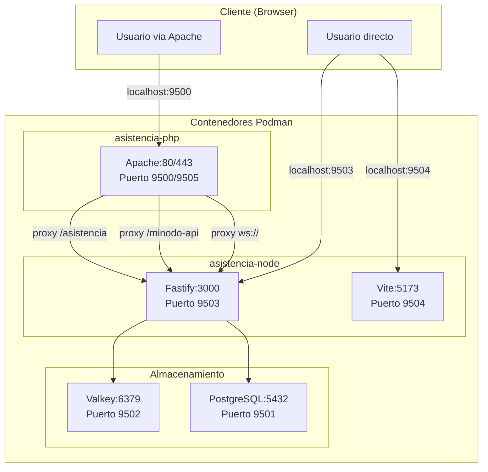
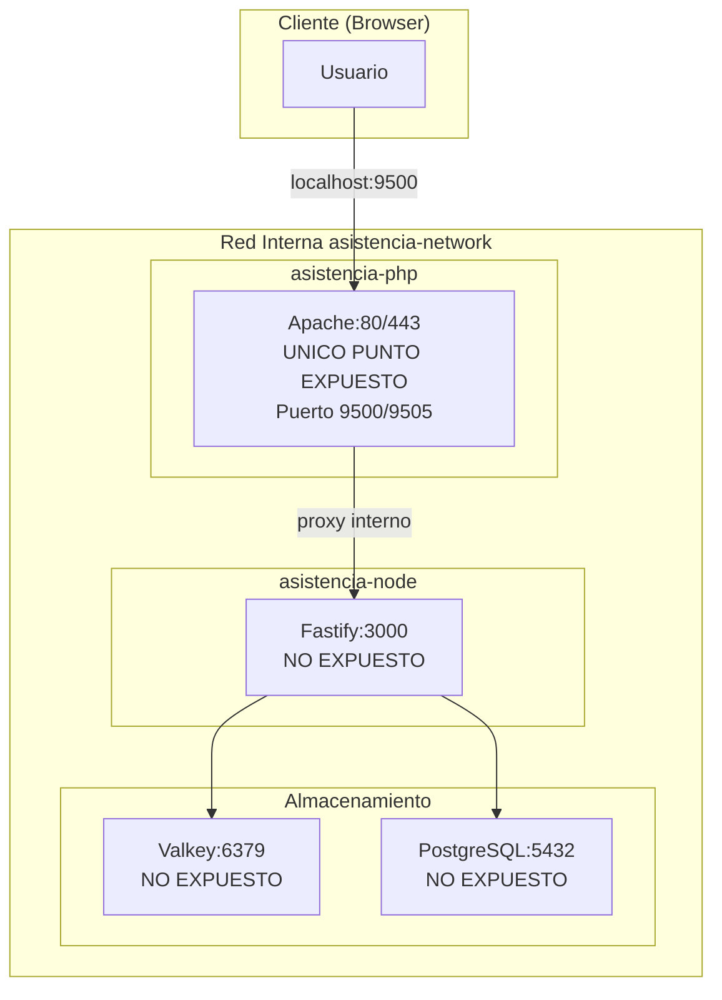

# Analisis de Contenedores y Arquitectura

## Resumen de Contenedores

El proyecto utiliza una arquitectura de 4 contenedores orquestados con Podman Compose. Los archivos `compose.yaml`, `compose.dev.yaml` y `compose.prod.yaml` definen la configuracion base y overrides por entorno.

| Contenedor | Imagen Base | Puerto Interno | Puerto Externo (Dev) | Produccion |
|------------|-------------|----------------|----------------------|------------|
| asistencia-php | rockylinux:9 + PHP 7.4 | 80, 443 | 9500, 9505 | SI |
| asistencia-node | node:20-alpine | 3000 | 9503, 9504 | SI |
| asistencia-postgres | postgres:18-alpine | 5432 | 9501 | SI |
| asistencia-valkey | valkey/valkey:7-alpine | 6379 | 9502 | SI |

---

## Analisis por Contenedor

### 1. asistencia-php (PHP Service)

**Proposito:** Frontend legacy y proxy inverso.

**Funcion principal:**

- Servir la aplicacion PHP legacy existente
- Emitir tokens JWT para usuarios autenticados
- Actuar como reverse proxy hacia node-service via Apache
- Proxy de WebSocket (`/asistencia/ws` -> node-service)
- Proxy de API (`/minodo-api/*` -> node-service)

**Tecnologias:**

- Rocky Linux 9
- PHP 7.4 + mod_php (MPM prefork)
- Apache 2.4 con mod_proxy, mod_proxy_wstunnel, mod_rewrite
- Certificado SSL autofirmado para HTTPS

**Pasa a produccion:** SI

**Justificacion:** Este contenedor es el punto de entrada unico. En produccion, todo el trafico pasa por Apache (puerto 9500/9505). Mantiene compatibilidad con el sistema legacy de autenticacion PHP.

**Diferencias dev/prod:**

- Dev: Monta codigo PHP como volumen para cambios en vivo
- Prod: Codigo montado read-only, limites de recursos (1 CPU, 512M RAM)

---

### 2. asistencia-node (Node Service)

**Proposito:** Backend modular con WebSocket y API REST.

**Funcion principal:**

- Validar tokens JWT emitidos por PHP
- Proyeccion de QR via WebSocket (modulo qr-projection)
- API de enrollment FIDO2 (modulo enrollment, en desarrollo)
- Servir frontend compilado (Vite) en produccion
- Proxy a Vite dev server en desarrollo

**Tecnologias:**

- Node.js 20 LTS (Alpine)
- Fastify con @fastify/websocket
- TypeScript compilado con tsc (backend)
- Vite (frontend)
- ioredis para conexion a Valkey

**Arquitectura interna:**

- Monolito modular con vertical slicing
- Capas: presentation, application, domain, infrastructure
- Dependency Injection manual (composition root en app.ts)

**Containerfile (multi-stage build):**

1. **builder:** Compila TypeScript y frontend Vite
2. **production:** Solo codigo compilado + deps de produccion
3. **development:** Con node_modules completos, ejecuta `npm run dev`

**Pasa a produccion:** SI

**Justificacion:** Core del sistema de asistencia criptografica. Maneja toda la logica de negocio nueva (QR, enrollment, attendance futuro).

**Diferencias dev/prod:**

- Dev: Hot reload con tsx watch y Vite dev server, puerto 9503/9504 expuesto
- Prod: Solo dist/index.js, puerto 3000 interno (no expuesto), limites de recursos (1 CPU, 512M RAM)

---

### 3. asistencia-postgres (PostgreSQL)

**Proposito:** Persistencia de datos del sistema de asistencia.

**Funcion principal:**

- Almacenar dispositivos FIDO2 enrolados (schema `enrollment`)
- Almacenar sesiones de asistencia y validaciones (schema `attendance`)
- Ejecutar migraciones automaticamente al iniciar

**Esquemas definidos (001-initial-schema.sql):**

```bash
enrollment/
  - devices          (dispositivos FIDO2)
  - enrollment_history (auditoria)

attendance/
  - sessions         (sesiones de clase)
  - registrations    (alumnos participantes)
  - validations      (rondas individuales)
  - results          (resultado final consolidado)
```

**Pasa a produccion:** SI

**Justificacion:** Base de datos principal para el sistema nuevo. Separada de la BD legacy PHP que sigue manejando usuarios, cursos, etc.

**Diferencias dev/prod:**

- Dev: Puerto 9501 expuesto para debug con psql/pgAdmin
- Prod: Puerto NO expuesto (solo acceso interno), limites de recursos (1 CPU, 1GB RAM)

---

### 4. asistencia-valkey (Valkey/Redis)

**Proposito:** Cache y almacenamiento temporal.

**Funcion principal:**

- Almacenar metadata de QR con TTL
- Cache de sesiones WebSocket
- Challenges de enrollment (TTL corto)
- Session keys temporales

**Tecnologias:**

- Valkey 7 (fork de Redis, compatible)
- Persistencia con appendonly

**Pasa a produccion:** SI

**Justificacion:** Requerido para datos efimeros con TTL. Los QR codes rotan cada 3 segundos, no tiene sentido persistirlos en PostgreSQL.

**Diferencias dev/prod:**

- Dev: Puerto 9502 expuesto para debug con redis-cli
- Prod: Puerto NO expuesto (solo acceso interno), limites de recursos (0.5 CPU, 256MB RAM)

---

## Flujo de Comunicacion

### Entorno de Desarrollo



### Entorno de Produccion



---

## Observaciones sobre Seguridad en Produccion

1. **Node no expuesto:** En produccion, puerto 3000 solo accesible via red interna Podman. Todo pasa por Apache.

2. **Bases de datos no expuestas:** PostgreSQL y Valkey solo accesibles desde la red interna `asistencia-network`.

3. **JWT separado:** PHP emite, Node valida. Secretos compartidos via variables de entorno.

4. **Usuario no-root en Node:** Containerfile crea usuario `nodejs:nodejs` para ejecutar la app.

5. **Health checks:** Node expone `/health` para monitoreo.

6. **Restart policies:** En produccion, todos los servicios tienen `restart: unless-stopped`.

---

## Estado de Implementacion por Contenedor

| Contenedor | Funcionalidad | Estado |
|------------|---------------|--------|
| php-service | Emision JWT | Funcional |
| php-service | Proxy a Node | Funcional |
| node-service | Auth JWT | Funcional |
| node-service | QR Projection WebSocket | Funcional |
| node-service | Enrollment API | Solo stubs |
| node-service | Attendance API | No existe |
| postgres | Schema enrollment | Definido |
| postgres | Schema attendance | Definido |
| valkey | QR metadata cache | Parcial |

---

## Recomendaciones para Continuar

1. **Infraestructura lista:** Los 4 contenedores estan configurados correctamente para dev y prod.

2. **Base de datos lista:** Esquemas `enrollment` y `attendance` estan definidos y se ejecutan automaticamente.

3. **Prioridad:** Completar modulo enrollment (backend) antes de iniciar attendance.

4. **Testing:** Usar puertos de desarrollo (9501-9504) para pruebas de integracion antes de probar flujo completo via Apache.

---

## Archivos Clave Revisados

- `compose.yaml` - Configuracion base
- `compose.dev.yaml` - Override desarrollo
- `compose.prod.yaml` - Override produccion
- `node-service/Containerfile` - Build multi-stage Node
- `php-service/Containerfile` - Build PHP + Apache
- `php-service/apache-config/asistencia.conf` - Proxy rules
- `database/init.sh` - Script migraciones
- `database/migrations/001-initial-schema.sql` - Esquema DB
