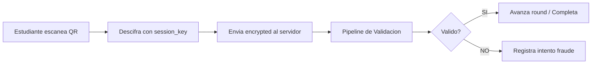
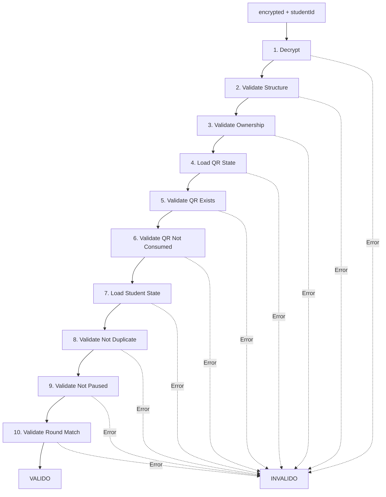
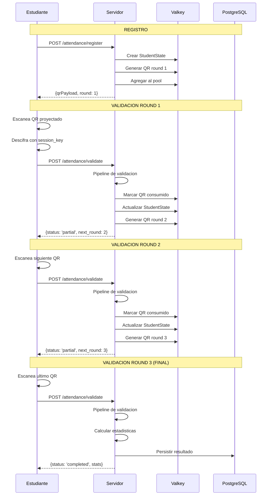

# Modulo Attendance

> Documentacion tecnica del modulo de validacion de asistencia

---

## Resumen

El modulo **Attendance** gestiona la validacion de escaneos QR por parte de los estudiantes. Implementa un **pipeline de validacion** con 10 etapas, deteccion de fraude, y persistencia de resultados.

---

## Responsabilidad



---

## Arquitectura del Modulo

```
src/backend/attendance/
├── application/
│   ├── complete-scan.usecase.ts      # Validacion + side effects
│   ├── validate-scan.usecase.ts      # Validacion pura (sin side effects)
│   └── participation.service.ts      # Registro de estudiantes
├── domain/
│   ├── models.ts                     # StudentState, ResultData
│   ├── stats-calculator.ts           # Calculo de estadisticas
│   ├── student-session.entity.ts     # Entidad de sesion
│   └── validation-pipeline/
│       ├── context.ts                # ValidationContext
│       ├── runner.ts                 # Pipeline runner
│       ├── stage.interface.ts        # Interface Stage
│       ├── pipeline.factory.ts       # Factory de pipeline
│       └── stages/                   # 10 stages individuales
├── infrastructure/
│   ├── adapters/                     # Adaptadores para pipeline
│   ├── repositories/                 # PostgreSQL repos
│   ├── student-session.repository.ts # Estado en Valkey
│   └── fraud-metrics.repository.ts   # Metricas de fraude
├── presentation/
│   ├── routes.ts                     # Rutas HTTP
│   └── error-mapper.ts               # Mapeo errores -> HTTP
└── __tests__/
    └── stages.test.ts                # 20 tests de stages
```

---

## Pipeline de Validacion

El pipeline ejecuta 10 etapas en secuencia. Si alguna falla, se detiene inmediatamente.



### Etapas del Pipeline

| Stage | Tipo | Responsabilidad |
|-------|------|-----------------|
| `decryptPayloadStage` | Sync | Descifra QR con AES-GCM |
| `validateStructureStage` | Sync | Valida formato QRPayloadV1 |
| `validateOwnershipStage` | Sync | Verifica que uid coincide con estudiante |
| `loadQrStateStage` | Async | Carga estado del QR desde Valkey |
| `validateQrExistsStage` | Sync | Verifica que QR existe |
| `validateQrNotConsumedStage` | Sync | Verifica QR no consumido |
| `loadStudentStateStage` | Async | Carga estado estudiante desde Valkey |
| `validateStudentNotDuplicateStage` | Sync | Verifica no duplicado en round |
| `validateStudentNotPausedStage` | Sync | Verifica estudiante no pausado |
| `validateRoundMatchStage` | Sync | Verifica round del QR coincide con actual |

---

## Componentes

### CompleteScanUseCase

Orquesta validacion completa con side effects:

```typescript
class CompleteScanUseCase {
  async execute(encrypted: string, studentId: number): Promise<CompleteScanResult>;
}
```

Flujo:
1. Ejecuta ValidateScanUseCase (pipeline)
2. Si invalido: registra intento en metricas de fraude
3. Si valido: marca QR como consumido
4. Registra round completado
5. Si no completo: genera siguiente QR
6. Si completo: calcula estadisticas
7. Persiste en PostgreSQL (opcional)

### ValidateScanUseCase

Validacion pura sin side effects:

```typescript
class ValidateScanUseCase {
  async execute(encrypted: string, studentId: number): Promise<ValidateScanResult>;
}
```

### ParticipationService

Gestiona registro de estudiantes:

```typescript
class ParticipationService {
  // Registra estudiante en sesion
  async registerParticipation(sessionId: string, studentId: number): Promise<RegisterResult>;
  
  // Consulta estado
  async getStatus(sessionId: string, studentId: number): Promise<StatusResult>;
  
  // Refresca QR
  async refreshQR(sessionId: string, studentId: number): Promise<RefreshResult>;
}
```

---

## Flujo Completo



---

## Sistema de Rounds

Cada estudiante debe completar **3 rounds** para registrar asistencia:

```
Round 1 ──> Round 2 ──> Round 3 ──> COMPLETADO
   │           │           │
   └───────────┴───────────┴──> Cada round requiere escanear
                                un QR valido diferente
```

Proposito:
- Dificultar fraude por captura de un solo QR
- Verificar presencia continua durante la clase
- Generar estadisticas de tiempo de respuesta

---

## Metricas de Fraude

El sistema rastrea intentos sospechosos:

```typescript
// Tipos de fraude detectados
type FraudType = 
  | 'invalid_qr'      // QR no descifrable
  | 'fake_qr'         // QR falso detectado
  | 'repeated_scan'   // Intento duplicado
  | 'expired_qr';     // QR expirado/consumido
```

Almacenamiento en Valkey:

| Clave | Contenido |
|-------|-----------|
| `fraud:count:{sessionId}:{type}` | Contador por tipo |
| `fraud:attempts:{sessionId}` | Lista de intentos (JSON) |
| `fraud:students:{sessionId}` | Set de studentIds sospechosos |

---

## Endpoints HTTP

| Metodo | Endpoint | Descripcion |
|--------|----------|-------------|
| GET | `/asistencia/api/attendance/active-session` | Consulta si hay sesion activa |
| POST | `/asistencia/api/attendance/register` | Registra estudiante en sesion |
| POST | `/asistencia/api/attendance/validate` | Valida payload QR escaneado |
| GET | `/asistencia/api/attendance/status` | Consulta estado del estudiante |
| POST | `/asistencia/api/attendance/refresh-qr` | Solicita nuevo QR |

### Endpoints de Desarrollo

Requieren `DEV_ENDPOINTS=true`:

| Metodo | Endpoint | Descripcion |
|--------|----------|-------------|
| POST | `/attendance/dev/fakes` | Inyectar fakes manualmente |
| POST | `/attendance/dev/balance` | Balancear pool |
| GET | `/attendance/dev/pool/:sessionId` | Ver contenido del pool |
| GET | `/attendance/dev/fraud/:sessionId` | Ver metricas de fraude |
| GET | `/attendance/dev/config` | Ver configuracion |
| PATCH | `/attendance/dev/config` | Actualizar configuracion |

---

## Modelos

### StudentState

Estado del estudiante en una sesion:

```typescript
interface StudentState {
  sessionId: string;
  studentId: number;
  status: 'active' | 'paused' | 'completed' | 'timeout';
  currentRound: number;
  roundsCompleted: RoundResult[];
  activeQR?: string;
  registeredAt: number;
  lastActivityAt: number;
}
```

### CompleteScanResult

Resultado de validacion:

```typescript
interface CompleteScanResult {
  valid: boolean;
  isComplete?: boolean;
  sessionId?: string;
  
  // Si completo
  stats?: {
    roundsCompleted: number;
    avgResponseTime: number;
    certainty: number;
  };
  
  // Si no completo
  nextRound?: {
    round: number;
    qrPayload: string;
    qrTTL: number;
  };
  
  // Si error
  error?: { code: string; message: string };
}
```

---

## Persistencia PostgreSQL

Opcional, habilitada con `ENABLE_POSTGRES_PERSISTENCE=true`:

| Repositorio | Tabla | Contenido |
|-------------|-------|-----------|
| SessionRepository | `attendance.sessions` | Sesiones de clase |
| RegistrationRepository | `attendance.registrations` | Registros de estudiantes |
| ValidationRepository | `attendance.validations` | Validaciones por round |
| ResultRepository | `attendance.results` | Resultados finales |

---

## Configuracion

```typescript
// Constantes centralizadas en shared/config
DEFAULT_MAX_ROUNDS = 3;           // Rounds para completar
DEFAULT_MAX_ATTEMPTS = 5;         // Intentos maximos por round
DEFAULT_QR_TTL_SECONDS = 60;      // TTL de QRs
DEFAULT_MIN_POOL_SIZE = 10;       // Tamano minimo pool
```

### Variables de Entorno

| Variable | Descripcion | Default |
|----------|-------------|---------|
| `ENABLE_POSTGRES_PERSISTENCE` | Habilita persistencia PostgreSQL | `false` |
| `DEV_ENDPOINTS` | Habilita endpoints de desarrollo | `false` |
| `MAX_ROUNDS` | Rounds para completar asistencia | `3` |

---

## Mapeo de Errores

El modulo mapea errores de dominio a respuestas HTTP:

| Codigo Dominio | HTTP Status | Mensaje |
|----------------|-------------|---------|
| `DECRYPTION_FAILED` | 400 | QR invalido o corrupto |
| `INVALID_STRUCTURE` | 400 | Formato de QR invalido |
| `OWNERSHIP_MISMATCH` | 403 | QR no pertenece a este estudiante |
| `QR_NOT_FOUND` | 404 | QR no existe o expiro |
| `QR_CONSUMED` | 409 | QR ya fue utilizado |
| `DUPLICATE_SCAN` | 409 | Ya validaste este round |
| `ROUND_MISMATCH` | 400 | Round incorrecto |

---

## Referencias

- `node-service/src/backend/attendance/` - Codigo fuente
- `node-service/src/backend/attendance/__tests__/` - Tests (20 tests)
- `shared/config/` - Constantes centralizadas
- `database/migrations/` - Esquemas PostgreSQL
