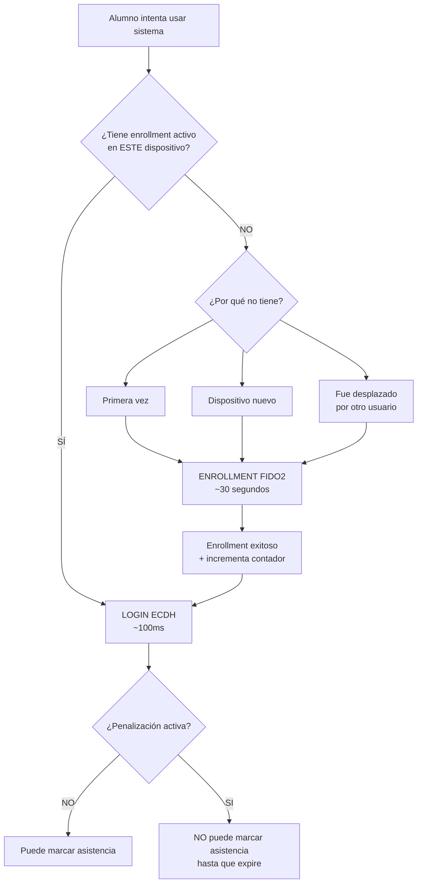
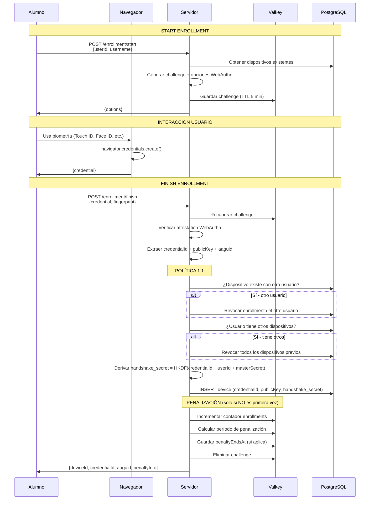
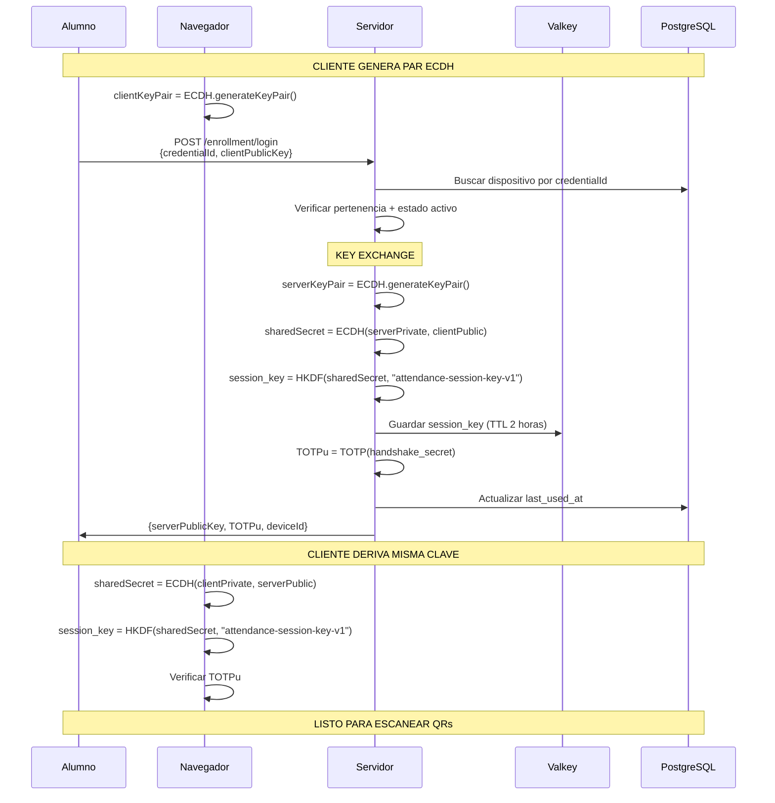
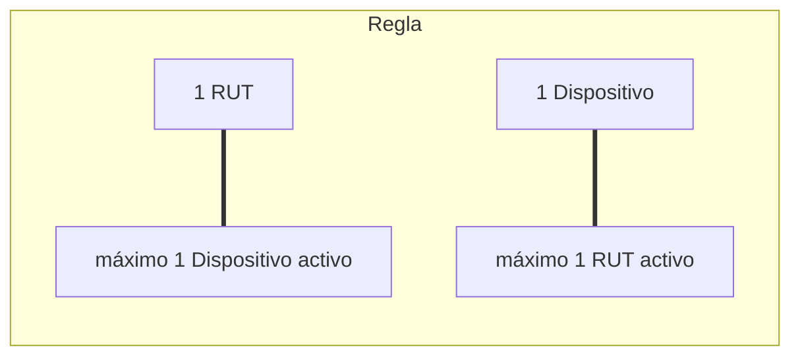
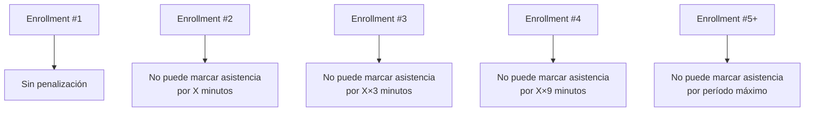

# Módulo Enrollment

> Documentación técnica del módulo de inscripción de dispositivos FIDO2 + ECDH

---

## Resumen

El módulo **Enrollment** gestiona la relación 1:1 entre alumnos (RUT) y dispositivos físicos. Combina:

- **FIDO2/WebAuthn**: Registro biométrico del dispositivo
- **ECDH**: Intercambio de claves para derivar `session_key`
- **HKDF**: Derivación de secretos criptográficos

---

## Cuándo Ocurre Enrollment



### Escenarios que Requieren Enrollment

| Escenario | Descripción |
|-----------|-------------|
| **Primera vez** | Alumno nunca ha enrolado ningún dispositivo |
| **Dispositivo nuevo** | Alumno intenta usar dispositivo diferente al enrolado |
| **Desplazado** | Otro usuario enroló el dispositivo donde estaba |

> **Nota:** En todos los casos aplica la política 1:1 - el dispositivo anterior queda automáticamente revocado.
>
> **Penalización:** La **primera vez** no tiene penalización. A partir del **segundo enrollment**, el alumno puede enrolarse inmediatamente pero **no puede registrar asistencia** durante un período configurable (crece exponencialmente con cada re-enrollment).

---

## Arquitectura del Módulo

```
src/backend/enrollment/
├── application/
│   ├── enrollment.service.ts          # Orquestador (legacy)
│   └── use-cases/
│       ├── start-enrollment.use-case.ts
│       ├── finish-enrollment.use-case.ts
│       ├── login-ecdh.use-case.ts
│       ├── get-enrollment-status.use-case.ts
│       └── revoke-device.use-case.ts
├── domain/
│   ├── entities/                       # Device, Credential
│   └── models.ts                       # DTOs, interfaces
├── infrastructure/
│   ├── crypto/
│   │   ├── ecdh.service.ts            # Key exchange P-256
│   │   └── hkdf.service.ts            # Derivación de claves
│   ├── fido2/
│   │   └── fido2.service.ts           # SimpleWebAuthn wrapper
│   ├── penalties/
│   │   └── penalty.service.ts         # Penalizaciones en asistencia
│   └── repositories/
│       ├── device.repository.ts       # PostgreSQL
│       ├── enrollment-challenge.repository.ts  # Valkey
│       └── session-key.repository.ts  # Valkey
└── presentation/
    ├── routes.ts                       # Registro de rutas
    └── controllers/                    # HTTP controllers
```

---

## Flujo Detallado

### Fase 1: Registro FIDO2 (Start + Finish)



### Fase 2: Login ECDH (Cada Sesión)



---

## Secretos Criptográficos

| Secreto | Almacenamiento | TTL | Propósito |
|---------|----------------|-----|-----------|
| `handshake_secret` | PostgreSQL | Permanente | Derivar claves, generar TOTP |
| `session_key` | Valkey | 2 horas | Cifrar/descifrar QRPayloadV1 con AES-256-GCM |
| `sharedSecret` | Memoria | Efímero | Solo para derivar session_key (nunca se transmite) |

### Derivación de Claves (HKDF)

```typescript
// handshake_secret (permanente, en enrollment)
handshake_secret = HKDF(
  ikm: credentialId + userId + masterSecret,
  info: "attendance-handshake-v1",
  length: 32 bytes
)

// session_key (efímera, en login)
session_key = HKDF(
  ikm: sharedSecret,  // resultado de ECDH
  info: "attendance-session-key-v1",
  length: 32 bytes
)
```

---

## Política 1:1 Estricta



### Consecuencias

| Acción | Resultado |
|--------|----------|
| Juan enrola por **primera vez** | Sin penalización - puede marcar asistencia inmediatamente |
| Juan enrola celular nuevo (ya tenía uno) | Celular viejo → **REVOCADO** + **no puede marcar asistencia** por X minutos |
| Pedro toma celular de Juan y lo enrola | Enrollment de Juan → **REVOCADO**. Juan debe re-enrolarse y tendrá penalización |
| Juan (desplazado) enrola otro dispositivo | Enrollment inmediato, pero **no puede marcar asistencia** por X minutos |

---

## Sistema de Penalizaciones

La penalización **NO impide enrolarse**, pero **SÍ impide registrar asistencia** durante un período configurable.



### Qué Puede y No Puede Hacer el Alumno Penalizado

| Acción | Permitido |
|--------|----------|
| Enrolarse en nuevo dispositivo | SI, inmediatamente |
| Login ECDH | SI |
| Escanear QRs | SI |
| **Registrar asistencia** | **NO** (durante penalización) |
| Ver estado de sesión | SI |

### Configuración

```bash
# Variables de entorno
PENALTY_BASE_MINUTES=5
PENALTY_MULTIPLIER=3
PENALTY_MAX_MINUTES=1440  # 24 horas
```

### Lógica

```typescript
function getPenaltyMinutes(enrollmentCount: number): number {
  if (enrollmentCount <= 1) return 0; // Primera vez sin penalización
  
  const penalty = PENALTY_BASE_MINUTES * Math.pow(PENALTY_MULTIPLIER, enrollmentCount - 2);
  return Math.min(penalty, PENALTY_MAX_MINUTES);
}

// En validación de asistencia:
function canMarkAttendance(userId: number): boolean {
  const penalty = getPenaltyInfo(userId);
  if (penalty.isActive) {
    throw new Error(`Penalización activa hasta ${penalty.endsAt}`);
  }
  return true;
}
```

---

## Endpoints HTTP

| Método | Endpoint | Descripción | Auth |
|--------|----------|-------------|------|
| POST | `/api/enrollment/start` | Iniciar enrollment FIDO2 | JWT |
| POST | `/api/enrollment/finish` | Completar enrollment FIDO2 | JWT |
| POST | `/api/enrollment/login` | Login ECDH (obtener session_key) | JWT |
| GET | `/api/enrollment/status` | Estado de enrollment del usuario | JWT |
| DELETE | `/api/enrollment/devices/:deviceId` | Revocar dispositivo | JWT |

### Rate Limiting

- **Enrollment** (start, finish): 5 intentos por minuto
- **Login ECDH**: 10 intentos por minuto

---

## Diferencia Clave

```
┌──────────────────────────────────────────────────────────────────────────┐
│                                                                           │
│   ENROLLMENT (~30 segundos)                                               │
│   • Requiere biometría del usuario                                       │
│   • Genera credentialId + publicKey + handshake_secret                   │
│   • Persiste en PostgreSQL                                                │
│   • Aplica penalizaciones                                                 │
│   • Ocurre cuando NO hay enrollment activo válido                        │
│                                                                           │
│   LOGIN ECDH (~100ms)                                                     │
│   • No requiere interacción del usuario                                  │
│   • Key exchange efímero (Perfect Forward Secrecy)                       │
│   • Genera session_key temporal (2h en Valkey)                           │
│   • Ocurre cuando SÍ hay enrollment activo válido                        │
│                                                                           │
│   INCENTIVO: Mantener tu dispositivo = puede marcar asistencia          │
│   DESINCENTIVO: Cambiar dispositivo = no puede marcar asistencia (temp)  │
│                                                                           │
└──────────────────────────────────────────────────────────────────────────┘
```

---

## Referencias

- `node-service/src/backend/enrollment/` - Código fuente
- `documents/03-especificaciones-tecnicas/14-decision-totp-session-key.md` - Decisión arquitectónica
- [WebAuthn Spec](https://www.w3.org/TR/webauthn-2/) - W3C WebAuthn Level 2
- [RFC 5869](https://tools.ietf.org/html/rfc5869) - HKDF specification
