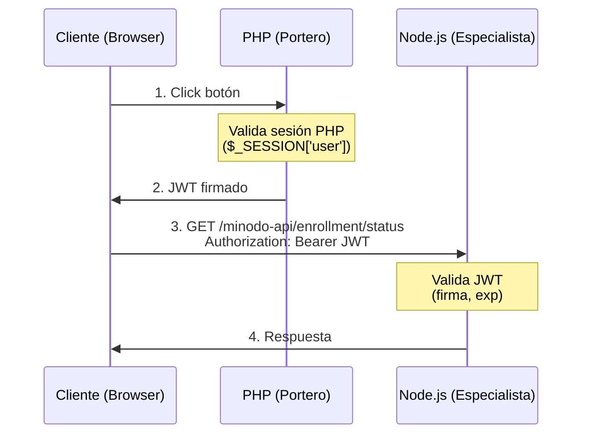
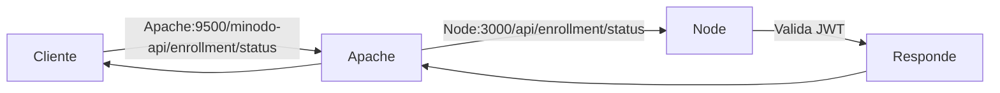
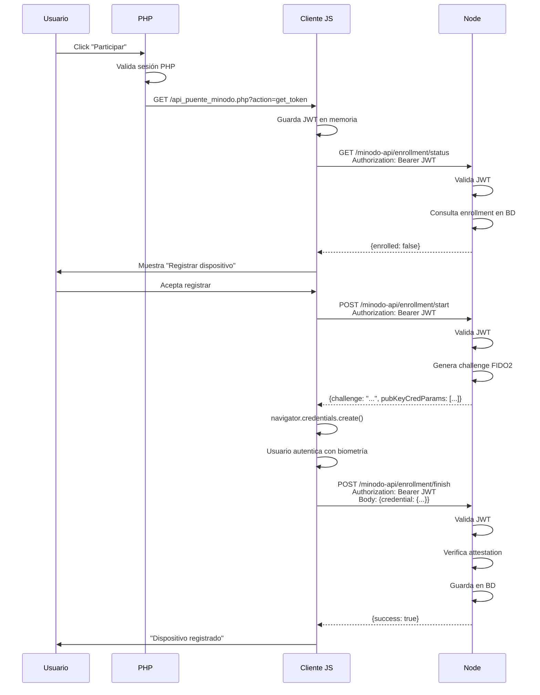
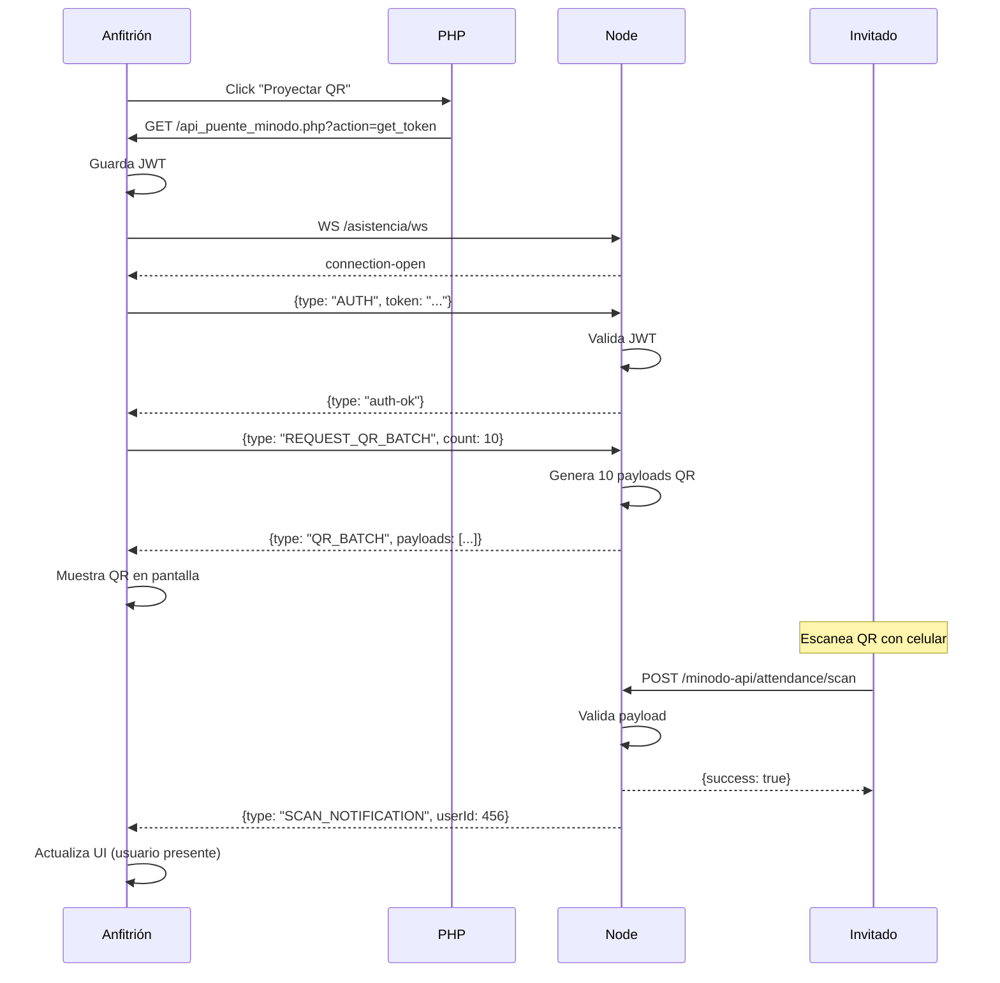

# Integración PHP-Node: Arquitectura de Comunicación

**Versión:** 2.0  
**Fecha:** 2025-11-04  
**Estado:** Implementado y Documentado

---

## Resumen Ejecutivo

Este documento consolida la arquitectura final de comunicación entre el **PHP Service (monolito legacy "Hawaii")** y el **Node Service (microservicio de criptografía FIDO2/Attendance)**.

### Principio Fundamental

**No modificar el sistema de autenticación legacy.** El monolito PHP usa sesiones estándar de PHP (`$_SESSION`) desde hace años. El microservicio Node necesita autenticar requests, pero **no debe forzar un cambio en cómo los usuarios se loguean.**

### Solución: Patrón "Portero con JWT Bridge"



**Analogía:** PHP es el portero de un edificio. Conoce a los residentes (sesiones PHP). Cuando un residente quiere visitar al especialista Node.js, el portero le da un "pase de visitante temporal" (JWT) con validez de 5 minutos. El especialista no conoce a nadie, solo confía en los pases del portero.

---

## ¿Por Qué JWT y No Tokens de Un Solo Uso (Nonce)?

### Contexto Histórico

Durante el diseño inicial, se consideraron dos alternativas:

1. **Token Nonce (Un solo uso):** Generar un token random, guardarlo en `$_SESSION['microservice_token']`, pasarlo al cliente, que lo envía a Node, y Node lo valida contra PHP via HTTP (backend-to-backend).
2. **JWT (Firmado):** Generar un token **auto-contenido** firmado por PHP, que Node puede validar sin consultar a PHP.

### Decisión: JWT

**Razones:**

1. **Cero Latencia:** Node valida el JWT localmente (verificación de firma). No necesita hacer llamadas HTTP a PHP.
2. **Escalabilidad:** Si múltiples instancias de Node, todas pueden validar sin consultar a PHP.
3. **Estándar Probado:** JWT es el estándar de facto para autenticación stateless (RFC 7519).
4. **No Intrusivo:** Seguimos usando sesiones PHP. Solo agregamos 1 archivo (`api_puente_minodo.php`).
5. **Desacoplamiento:** Node no depende de PHP durante su operación normal.

**Desventajas (aceptadas):**

- JWT no se puede revocar instantáneamente (pero con expiration de 5 min es aceptable).
- Requiere compartir un secreto (`JWT_SECRET`) entre PHP y Node (resuelto con variable de entorno).

### ¿Cuándo Usar Nonce en Vez de JWT?

El patrón nonce es útil cuando:

- El "pase" solo se usa **una vez** (ej: cargar un iframe).
- Necesitas revocar permisos instantáneamente.
- Latencia backend-to-backend es negligible.

En nuestro caso, el cliente hace **múltiples requests** con el mismo JWT durante los 5 minutos (enrollment tiene varios pasos), por lo que JWT es superior.

---

## Arquitectura Implementada

### Componentes

#### 1. PHP Service (El Portero)

**Responsabilidades:**

- Autenticar usuarios (login con `db.inc`, sesiones PHP)
- Emitir JWT para usuarios autenticados
- Renderizar HTML legacy
- **NO** maneja criptografía
- **NO** accede a PostgreSQL schemas `enrollment`/`attendance`
- **NO** valida dispositivos FIDO2

**Archivo Nuevo:**

```bash
php-service/
└── src/
    ├── api_puente_minodo.php  <- El único archivo nuevo
    └── lib/
        └── jwt.php             <- Biblioteca JWT (sin dependencias)
```

**Endpoint:**

```http
GET /api_puente_minodo.php?action=get_token HTTP/1.1
Cookie: PHPSESSID=abc123...

Response 200:
{
  "success": true,
  "token": "eyJhbGciOiJIUzI1NiIsInR5cCI6IkpXVCJ9...",
  "expiresIn": 300,
  "userId": 123,
  "username": "juan.perez"
}

Response 401 (sin sesión):
{
  "success": false,
  "error": "NOT_AUTHENTICATED"
}
```

#### 2. Node Service (El Especialista)

**Responsabilidades:**

- Validar JWT en todas las requests
- Toda la lógica criptográfica (FIDO2, ECDH, AES-GCM, TOTP)
- Gestionar enrollment de dispositivos
- Generar y validar payloads QR
- WebSocket seguro (requiere auth JWT)
- **NO** renderiza HTML
- **NO** conoce sesiones PHP

**Archivos:**

```bash
node-service/
└── src/
    ├── modules/
    │   └── auth/
    │       ├── domain/
    │       │   └── jwt-utils.ts          <- Validación JWT
    │       ├── presentation/
    │       │   └── auth-middleware.ts    <- Middleware Fastify
    │       └── application/
    │           └── auth.service.ts
    └── config/
        └── index.ts                      <- JWT_SECRET config
```

**Middleware:**

```typescript
// Todos los endpoints protegidos
fastify.addHook('preHandler', async (request, reply) => {
  const token = extractToken(request.headers.authorization);
  const payload = await JWTUtils.verify(token);
  request.user = { userId: payload.userId, username: payload.username };
});
```

#### 3. Apache Reverse Proxy (El Traductor)

**Configuración:**

```apache
# php-service/apache-config/asistencia.conf

# Reverse Proxy para API Node
ProxyPass /minodo-api http://node:3000/api
ProxyPassReverse /minodo-api http://node:3000/api

# Reverse Proxy para WebSocket
ProxyPass /asistencia/ws ws://node:3000/ws
```

**Flujo:**



---

## Flujos de Usuario

### Caso 1: Enrollment Inicial



### Caso 2: WebSocket Proyección QR



---

## Seguridad

### JWT Payload

```json
{
  "iss": "php-service",
  "aud": "node-service",
  "sub": "123",
  "userId": 123,
  "username": "juan.perez",
  "nombreCompleto": "Juan Pérez",
  "rol": "alumno",
  "iat": 1730546789,
  "exp": 1730547089
}
```

### Validación en Node

```typescript
// Verifica:
// 1. Firma HMAC-SHA256 válida
// 2. No expirado (exp > now)
// 3. Issuer correcto (php-service)
// 4. Audience correcto (node-service)
```

### Secreto Compartido

```yaml
# compose.yaml (variable de entorno)
services:
  php:
    environment:
      - JWT_SECRET=${JWT_SECRET}
  node:
    environment:
      - JWT_SECRET=${JWT_SECRET}
```

**Generación:**

```bash
openssl rand -hex 32
# Ejemplo: 9f86d081884c7d659a2feaa0c55ad015a3bf4f1b2b0b822cd15d6c15b0f00a08
```

---

## Preguntas Frecuentes

### ¿Por qué no usar OAuth2/OpenID Connect?

**Respuesta:** Sobrematar una mosca con un cañón. OAuth2 es para delegar acceso a recursos de terceros. Aquí solo necesitamos autenticar al usuario entre dos servicios del mismo sistema. JWT simple es suficiente.

### ¿Qué pasa si el JWT expira mientras el usuario está trabajando?

**Respuesta:** El cliente detecta el error 401, obtiene un nuevo JWT llamando a `/api_puente_minodo.php?action=get_token` (si la sesión PHP sigue activa), y reintenta el request.

### ¿Por qué no pasar el PHPSESSID directamente a Node?

**Respuesta:** Node no tiene acceso al filesystem donde PHP guarda las sesiones (`/tmp/sess_*`). Además, PHP y Node usan diferentes librerías de sesiones. JWT es el puente estándar.

### ¿Qué pasa si comprometen el JWT_SECRET?

**Respuesta:** Un atacante puede fabricar JWT válidos. Mitigación:

1. JWT_SECRET en variable de entorno (no en código)
2. Rotación periódica del secreto
3. Expiration corto (5 min)
4. Logs de actividad sospechosa

---

## Migración y Mantenimiento

### Antes de esta Arquitectura

- Cliente → PHP → Node (proxy HTTP cada request)
- PHP necesita conocer todas las rutas de Node
- Latencia doble
- PHP se convierte en cuello de botella

### Después

- Cliente → PHP (solo para obtener JWT)
- Cliente → Node (directamente con JWT)
- PHP solo emite tokens, no procesa requests
- Node independiente y escalable

### Si Necesitas Agregar un Nuevo Endpoint en Node

1. **Node:** Agrega el endpoint con middleware de auth

   ```typescript
   fastify.get('/api/nuevo-endpoint', {
     preHandler: [authenticateJWT]
   }, async (request, reply) => {
     // request.user.userId disponible
   });
   ```

2. **Cliente:** Usa el JWT existente

   ```javascript
   const response = await fetch('/minodo-api/nuevo-endpoint', {
     headers: { 'Authorization': `Bearer ${jwt}` }
   });
   ```

3. **PHP:** No tocar nada

---

## Archivos a Eliminar Después de Consolidar

Los siguientes archivos en `documents/revisar_y_borrar/` son obsoletos:

- `recomendacion.md` - Propuesta inicial, ya implementada
- `ARQUITECTURA_JWT.md` - Parcial, falta contexto de sesiones PHP
- `INSTRUCCIONES_JWT.md` - Procedimiento de instalación, mover a README
- `conulsta php2.md` - Conversación, contexto ya consolidado aquí

**Acción:** Después de revisar este documento, mover a carpeta `HISTORICO/` o borrar.

---

## Referencias

- [RFC 7519 - JSON Web Token](https://datatracker.ietf.org/doc/html/rfc7519)
- [OWASP JWT Cheat Sheet](https://cheatsheetseries.owasp.org/cheatsheets/JSON_Web_Token_for_Java_Cheat_Sheet.html)
- [PHP-JWT Library (referencia)](https://github.com/firebase/php-jwt)

---

**Próximos Pasos:**

1. [DONE] Implementar `api_puente_minodo.php`
2. [DONE] Implementar middleware JWT en Node
3. [DONE] Configurar Apache reverse proxy
4. [PENDING] Testing end-to-end
5. [PENDING] Documentar en README principal del proyecto

---

_Documento consolidado basado en: recomendacion.md, consulta php2.md, ARQUITECTURA_JWT.md, y la implementación actual del código._
