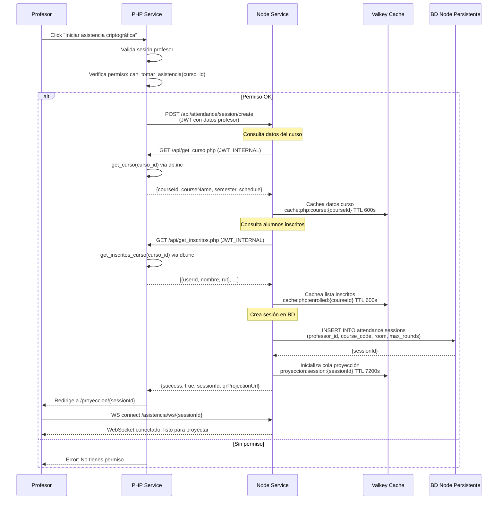
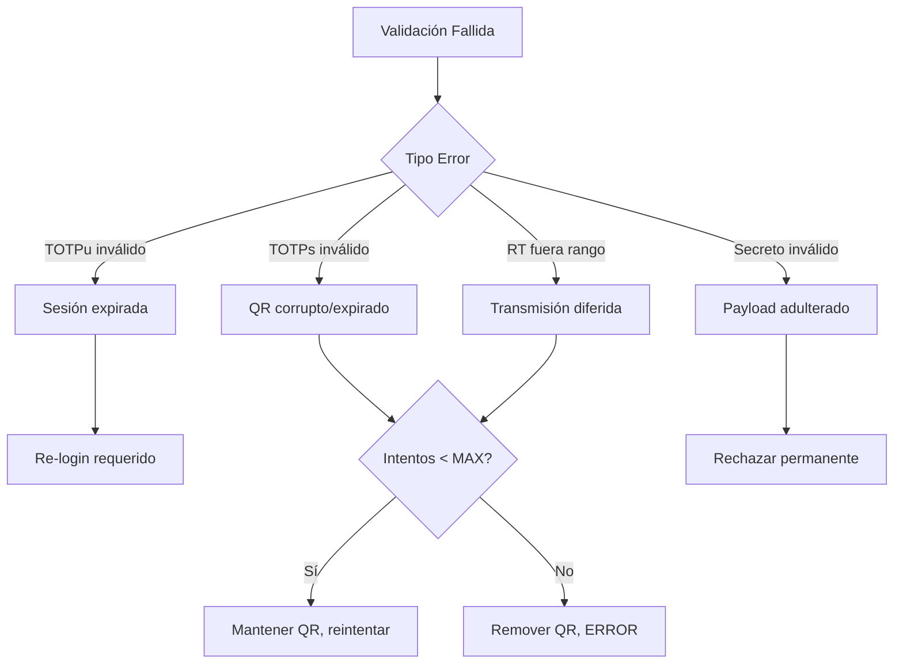

# Flujo de Asistencia

---

## Propósito

Proceso completo de validación de asistencia mediante N rondas de captura de QR con validación criptográfica y cálculo de umbral probabilístico.

---

## Pre-requisitos

**Usuario:**

- Dispositivo enrolado (FIDO2 completado)
- Sesión activa (ECDH key exchange completado)
- `session_key` y `TOTPu` disponibles localmente

**Sistema:**

- Sesión de asistencia activa (profesor inició sesión)
- Módulo Asistencia activo
- BD Node Cache (Valkey) disponible
- BD Node Persistente (PostgreSQL) disponible
- WebSocket proyección funcionando

**Arquitectura de Datos:**

El flujo de asistencia utiliza **las tres bases de datos**:

1. **BD PHP Legacy (PostgreSQL):** Datos de sesión, curso, alumnos inscritos
   - Node consulta vía HTTP: `PHPLegacyClient.getCourse(courseId)`
   - Node consulta vía HTTP: `PHPLegacyClient.getInscriptos(courseId)`
   - PHP ejecuta: `get_curso()`, `get_inscritos_curso()` via `db.inc`

2. **BD Node Cache (Valkey):** Metadatos QR temporales (TTL 2 min)
   - Keys: `qr:session:<sessionId>:<userId>:<round>`
   - Data: `{userId, ronda, timestamp_envio, mostrado_count, intentos_fallidos}`
   - Cola proyección: `proyeccion:session:<sessionId>` (lista de payloads activos)

3. **BD Node Persistente (PostgreSQL):** Registros, validaciones, resultados
   - Tabla: `attendance.registrations` (quién participa)
   - Tabla: `attendance.validations` (RT por ronda)
   - Tabla: `attendance.results` (status final, certeza)

**NO hay acceso cross-database directo.** Node obtiene datos de PHP mediante HTTP endpoints.

Ver detalles: [08-arquitectura-datos.md](08-arquitectura-datos.md)

---

## Paso 0: Inicio de Sesión de Asistencia (Profesor)

Antes de que los alumnos puedan participar, el profesor debe iniciar la sesión de asistencia.

### Flujo del Profesor



### Datos Consultados a BD Legacy (PHP)

Cuando Node crea la sesión, consulta via HTTP:

1. **Datos del curso:**
   - `get_curso(curso_id)` retorna: código, nombre, semestre, horario, sala
   - Cacheado en Valkey: `cache:php:course:{courseId}` (TTL 10 min)

2. **Lista de inscritos:**
   - `get_inscritos_curso(curso_id, semestre_id)` retorna array de alumnos
   - Cacheado en Valkey: `cache:php:enrolled:{courseId}` (TTL 10 min)

3. **Datos del profesor:**
   - `get_def_profesor(username)` retorna: id, nombre, email
   - Cacheado en Valkey: `cache:php:user:{professorId}` (TTL 5 min)

### Creación de Sesión en Node

```typescript
// POST /api/attendance/session/create

async createSession(professorId: number, courseId: string, room: string) {
  // 1. Consultar datos curso (con cache)
  let courseData = await valkey.get(`cache:php:course:${courseId}`);
  if (!courseData) {
    courseData = await PHPLegacyClient.getCourse(courseId);
    await valkey.setex(`cache:php:course:${courseId}`, 600, JSON.stringify(courseData));
  }
  
  // 2. Consultar inscritos (con cache)
  let enrolled = await valkey.get(`cache:php:enrolled:${courseId}`);
  if (!enrolled) {
    enrolled = await PHPLegacyClient.getEnrolledStudents(courseId, courseData.semesterId);
    await valkey.setex(`cache:php:enrolled:${courseId}`, 600, JSON.stringify(enrolled));
  }
  
  // 3. Crear sesión en BD Node
  const sessionId = uuid.v4();
  await db.query(
    `INSERT INTO attendance.sessions 
     (session_id, professor_id, professor_name, course_code, course_name, room, semester, max_rounds) 
     VALUES ($1, $2, $3, $4, $5, $6, $7, $8)`,
    [sessionId, professorId, professorData.nombre, courseData.codigo, courseData.nombre, room, courseData.semestre, 3]
  );
  
  // 4. Inicializar cola proyección en Valkey
  await valkey.del(`proyeccion:session:${sessionId}`); // Limpiar si existe
  await valkey.expire(`proyeccion:session:${sessionId}`, 7200); // TTL 2 horas
  
  return { sessionId, courseData, enrolledCount: enrolled.length };
}
```

### Manejo de Cambios Durante la Sesión

**¿Qué pasa si datos cambian en BD Legacy durante la sesión?**

- **Cache expira:** Después de TTL (5-10 min), Node vuelve a consultar PHP
- **Alumnos agregados/eliminados:** Cache se invalida, próxima consulta trae datos actualizados
- **Sesión activa:** Node usa snapshot cacheado para consistencia durante la sesión

**Invalidación manual de cache:**

```typescript
// Endpoint para profesor: "Actualizar lista de alumnos"
// DELETE /api/cache/enrolled/{courseId}

async invalidateEnrolledCache(courseId: string) {
  await valkey.del(`cache:php:enrolled:${courseId}`);
  return { success: true, message: "Cache invalidado, próxima consulta actualizará datos" };
}
```

---

## Diagrama de Secuencia Completo (N Rondas)

```mermaid
sequenceDiagram
    participant U as Usuario
    participant B as Browser
    participant P as PHP Service
    participant A as Módulo Asistencia
    participant E as Módulo Enrolamiento
````

---

## Paso 1: Anuncio de Participación

### Cliente (Browser)

```javascript
async function registerForAttendance(sessionId) {
  const response = await fetch('/api/attendance/register', {
    method: 'POST',
    headers: {'Content-Type': 'application/json'},
    body: JSON.stringify({
      userId: currentUser.id,
      sessionId: sessionId
    })
  });

  const result = await response.json();
  
  if (result.status === "registered") {
    console.log(`En cola, posición: ${result.queuePosition}`);
    startQRScanning();
  } else {
    console.error(result.error);
  }
}
```

### Servidor (Módulo Asistencia)

```plaintext
```plaintext
Endpoint: POST /api/attendance/register

Input:
  {
    userId: 123,
    sessionId: "uuid-sesion"
  }

Proceso:
  1. Verificar dispositivo enrolado (BD Node Persistente):
     device = await db.query(
       'SELECT * FROM enrollment.devices WHERE user_id = $1 AND is_active = true',
       [userId]
     )
     if (!device): REJECT "NOT_ENROLLED"
  
  2. Obtener datos de sesión (BD PHP Legacy vía HTTP):
     sessionData = await PHPLegacyClient.getSession(sessionId)
     // PHP ejecuta: get_curso(), get_def_profesor() via db.inc
     // Retorna: {courseId, courseName, professorId, professorName, room, semester}
     
     // Cachea en Valkey (TTL 600s):
     await valkey.setex(
       `cache:php:session:${sessionId}`,
       600,
       JSON.stringify(sessionData)
     )
  
  3. Verificar inscripción (BD PHP Legacy vía HTTP):
     inscripcion = await PHPLegacyClient.getInscripcionAlumno(userId, courseId)
     // PHP ejecuta: get_inscritos_curso() via db.inc
     // Valida que userId está inscrito en courseId
  
  4. Registrar participación (BD Node Persistente):
     await db.query(
       'INSERT INTO attendance.registrations (session_id, user_id, device_id, queue_position) VALUES ($1, $2, $3, $4)',
       [sessionId, userId, device.device_id, queue_position]
     )
  
  5. Almacenar qr_metadata (BD Node Cache - Valkey):
     await valkey.hset(
       `qr:session:${sessionId}:${userId}:1`,
       {userId, ronda: 1, timestamp_envio: Date.now(), mostrado_count: 0, intentos_fallidos: 0}
     )
     await valkey.expire(`qr:session:${sessionId}:${userId}:1`, 120) // TTL 2 min
  
  6. Añadir a cola de proyección (BD Node Cache - Valkey):
     await valkey.lpush(`proyeccion:session:${sessionId}`, payload_encriptado)

Output:
  {
    status: "registered",
    queuePosition: 15,
    totalRounds: 3
  }
```

---

## Paso 2: Generación de Payload QR

**IMPORTANTE:** Cada ronda genera un QR completamente NUEVO. NO se reutiliza el mismo QR entre rondas.

```plaintext
Para cada ronda se genera un payload único:

1. Generar TOTPs único POR RONDA
   secret = SHA256(sessionId || userId || roundNumber || SERVER_SECRET)
   TOTPs = TOTP(secret, floor(time/30), 6)
   // roundNumber diferente = TOTPs diferente

2. Generar nonce aleatorio NUEVO
   nonce = crypto.randomBytes(16)
   // Cada ronda = nonce diferente

3. Encriptar secreto interno
   secreto_encriptado = AES_encrypt(TOTPs + nonce, server_internal_key)

4. Crear payload con número de ronda
   payload = {
     secreto: secreto_encriptado,
     userId: 123,
     dataActividad: {
       profesor: "Dr. Smith",
       horario: "14:00-16:00",
       sala: "A-201",
       curso: "Estructura de Datos",
       semestre: "2025-2"
     },
     TOTPs: "485926",  // Diferente cada ronda
     ronda: 1          // Incrementa: 1, 2, 3, ..., N
   }

5. Encriptar payload completo
   payload_encriptado = AES_GCM_encrypt(
     JSON.stringify(payload),
     session_key,  // Derivada de ECDH
     iv = crypto.randomBytes(12)
   )

6. Crear QR metadata
   qr_metadata = {
     userId: 123,
     ronda: 1,
6. Crear QR metadata (específica por ronda)
   qr_metadata = {
     userId: 123,
     ronda: 1,              // Cada ronda tiene su propia entrada
     timestamp_envio: Date.now(),  // Timestamp único para esta ronda
     mostrado_count: 0,
     intentos_fallidos: 0,
     valido: true
   }

7. Almacenar en Valkey (key específica por ronda)
   HSET qr:session:uuid-123:456:1 qr_metadata
   EXPIRE qr:session:uuid-123:456:1 120  // TTL: 2 minutos
   
   // Ronda 2 tendría: qr:session:uuid-123:456:2
   // Ronda 3 tendría: qr:session:uuid-123:456:3
   // Cada una es INDEPENDIENTE

8. Añadir a cola de proyección
   LPUSH proyeccion:session:uuid-123 payload_encriptado
```

**Nota crítica:** Ronda 2 NO reutiliza el QR de Ronda 1. Se genera un payload completamente nuevo con diferentes parámetros criptográficos.

---

## Paso 3: Rotación Aleatoria (WebSocket)

```plaintext
Lógica del servidor WebSocket:

setInterval(() => {
  // 1. Obtener todos los QR pendientes
  const qrList = LRANGE proyeccion:session_uuid 0 -1

  if (qrList.length == 0) return

  // 2. Seleccionar QR aleatorio
  const randomIndex = Math.floor(Math.random() * qrList.length)
  const selectedQR = qrList[randomIndex]

  // 3. Obtener metadata
  const metadata = HGET qr:session:userId:ronda

  // 4. Incrementar contador
  metadata.mostrado_count++
  HSET qr:session:userId:ronda mostrado_count metadata.mostrado_count

  // 5. Verificar límite de displays
  if (metadata.mostrado_count > MAX_DISPLAYS) {
    // Enviar mensaje al usuario
    sendToUser(userId, {
      type: "warning",
      message: "No detectamos tu captura, verifica que estás escaneando"
    })
  }

  // 6. Proyectar QR
  broadcast({
    type: "qr",
    payload: selectedQR,
    displayTime: 500
  })

}, 500)  // Cada 500ms
```

---

## Paso 4: Captura y Desencriptación (Cliente)

```javascript
// Escáner QR continuo
const scanner = new QrScanner(
  videoElement,
  async (result) => {
    try {
      // 1. Decodificar QR
      const qrData = JSON.parse(result.data);

      // 2. Intentar desencriptar con session_key
      const payload = await decryptPayload(qrData, sessionKey);

      // 3. Verificar si es mi QR
      if (payload.userId === currentUser.id) {
        console.log(`Mi QR detectado! Ronda ${payload.ronda}`);
        
        // 4. Pausar escáner
        scanner.stop();

        // 5. Procesar y enviar respuesta
        await sendAttendanceResponse(payload);
      } else {
        // No es mi QR, continuar escaneando
        console.log('QR de otro usuario, continuando...');
      }
    } catch (error) {
      // QR corrupto o no es para mí, continuar
      console.log('QR no válido, continuando...');
    }
  },
  {
    returnDetailedScanResult: true,
    highlightScanRegion: true,
    fps: 10
  }
);

async function decryptPayload(qrData, sessionKey) {
  const {ciphertext, iv, tag} = qrData;

  // Desencriptar con AES-256-GCM
  const decrypted = await crypto.subtle.decrypt(
    {
      name: "AES-GCM",
      iv: base64ToArrayBuffer(iv),
      tagLength: 128
    },
    sessionKey,
    base64ToArrayBuffer(ciphertext + tag)
  );

  return JSON.parse(new TextDecoder().decode(decrypted));
}
```

---

## Paso 5: Envío de Respuesta

```javascript
async function sendAttendanceResponse(payload) {
  // 1. Crear respuesta
  const response = {
    // Del QR
    secreto: payload.secreto,
    userId: payload.userId,
    dataActividad: payload.dataActividad,
    TOTPs: payload.TOTPs,
    ronda: payload.ronda,

    // Agregado por cliente
    timestamp_enviado: Date.now(),
    TOTPu: generateTOTPu(handshakeSecret),
    metadatos: {
      latencia_red: navigator.connection ? navigator.connection.downlink : null,
      device_info: navigator.userAgent,
      rtt: performance.now()
    }
  };

  // 2. Encriptar respuesta
  const encryptedResponse = await encryptResponse(response, sessionKey);

  // 3. Enviar al servidor
  const result = await fetch('/api/attendance/validate', {
    method: 'POST',
    headers: {'Content-Type': 'application/json'},
    body: JSON.stringify(encryptedResponse)
  });

  const validation = await result.json();
  handleValidationResult(validation);
}
```

---

## Paso 6: Validación (Servidor)

```plaintext
Endpoint: POST /api/attendance/validate

Input:
  {
    ciphertext: "base64...",
    iv: "base64...",
    tag: "base64..."
  }

Proceso de Validación:

1. Desencriptar con session_key
   response = AES_GCM_decrypt(input, session_key)

2. Validar TOTPu (sesión)
   TOTPu_expected = TOTP(handshake_secret, floor(time/30), 6)
   if (response.TOTPu != TOTPu_expected): REJECT
   
3. Validar TOTPs (QR)
   secret = SHA256(sessionId || userId || ronda || SERVER_SECRET)
   TOTPs_expected = TOTP(secret, floor(time/30), 6)
   
   // Ventana de 3 períodos (-1, 0, +1)
   valid = false
   for (offset in [-1, 0, 1]):
     TOTPs_check = TOTP(secret, floor(time/30) + offset, 6)
     if (response.TOTPs == TOTPs_check):
       valid = true
       break
   
   if (!valid): REJECT

4. Recuperar qr_metadata
   metadata = HGET qr:session:userId:ronda
   if (!metadata): REJECT (QR expirado)

5. Validar que QR no fue usado
   if (metadata.valido == false): REJECT (replay attack)

6. Calcular RT (Response Time)
   RT = response.timestamp_enviado - metadata.timestamp_envio
   
7. Validar RT en rango
   if (RT < 500ms OR RT > 15000ms): REJECT
   
8. Validar secreto desencriptado
   secreto_decrypted = AES_decrypt(response.secreto, server_internal_key)
   nonce_received = extractNonce(secreto_decrypted)
   TOTPs_received = extractTOTPs(secreto_decrypted)
   
   if (TOTPs_received != response.TOTPs): REJECT

9. Si todo OK: ACEPTAR
   - Almacenar RT en array
   - Incrementar ronda
   - Marcar QR como usado
```

---

## Paso 7: Generación de Siguiente Ronda

```plaintext
Si ronda < N:
  1. Incrementar contador de ronda
  2. Generar nuevo payload para ronda+1
  3. Almacenar nuevo qr_metadata
  4. Añadir a cola de proyección
  5. Retornar success

Si ronda == N:
  Pasar a cálculo de umbral (Paso 8)
```

---

## Paso 8: Cálculo de Umbral de Certeza

```plaintext
Después de N rondas completadas:

1. Recuperar todos los RT
   RT_array = [RT1, RT2, RT3, ..., RTn]

2. Calcular estadísticas
   avg_RT = mean(RT_array)
   std_dev = standardDeviation(RT_array)
   min_RT = min(RT_array)
   max_RT = max(RT_array)
   median_RT = median(RT_array)

3. Aplicar algoritmo de umbral
   if (std_dev < 500 AND 800 < avg_RT < 3000):
     certeza = 95%
     status = "PRESENTE"
   
   elif (std_dev < 1000 AND 500 < avg_RT < 5000):
     certeza = 70%
     status = "PROBABLE_PRESENTE"
   
   elif (std_dev < 2000 AND 300 < avg_RT < 8000):
     certeza = 50%
     status = "DUDOSO"
   
   else:
     certeza = 20%
     status = "AUSENTE"

4. Registrar en base de datos
   INSERT INTO attendance.records (
     session_id,
     user_id,
     round_times,
     avg_rt,
     std_dev,
     certainty,
     status
   ) VALUES (
     session_uuid,
     123,
     '[1200, 1150, 1300]',  -- JSON
     1216.67,
     76.38,
     95.0,
     'PRESENTE'
   )

5. Retornar resultado final
   {
     success: true,
     status: "PRESENTE",
     certainty: 95.0,
     stats: {
       avg_rt: 1216.67,
       std_dev: 76.38,
       rounds: 3
     }
   }
```

### Justificación del Algoritmo de Umbral

```plaintext
Escenario PRESENTE (certeza >= 95%):
  - std_dev < 500ms: Respuestas consistentes
  - 800 < avg_RT < 3000: Tiempo humano realista
  - Indica: Usuario presente, escaneando activamente

Escenario AUSENTE (certeza < 70%):
  - std_dev > 2000ms: Respuestas erráticas
  - avg_RT fuera de rango: Automatizado o diferido
  - Indica: Bot, captura de pantalla, o transmisión diferida
```

---

## Manejo de Errores y Reintentos



**Límites:**

- MAX_INTENTOS_FALLIDOS = 3
- MAX_DISPLAYS_SIN_CAPTURA = 10
- QR_TTL = 120 segundos

---

## Notificaciones al Usuario

```plaintext
Eventos:
  - "registered": "Registrado, busca tu QR"
  - "ronda_validada": "Ronda N validada, busca siguiente"
  - "warning_no_captura": "No detectamos captura, verifica"
  - "intento_fallido": "Intento fallido, reintenta"
  - "max_intentos": "Máximo intentos alcanzado"
  - "presente": "Asistencia confirmada: PRESENTE"
  - "ausente": "Asistencia rechazada"
```

---

**Versión:** 1.0  
**Fecha:** 2025-11-02  
**Estado:** Especificación Técnica
