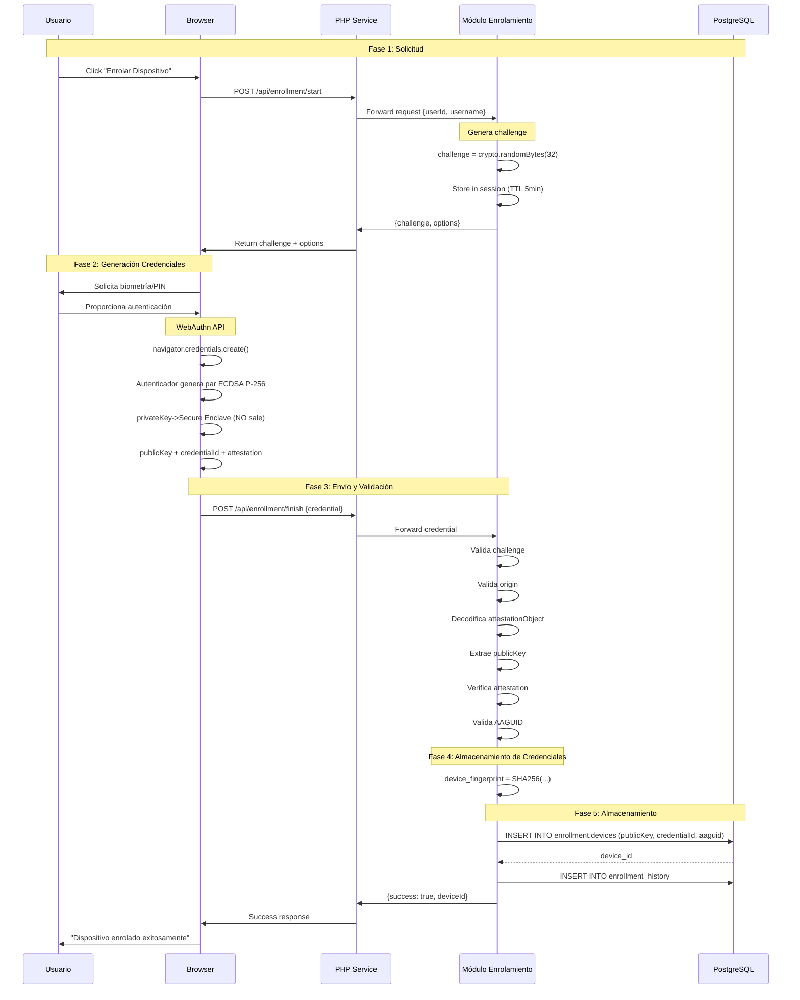
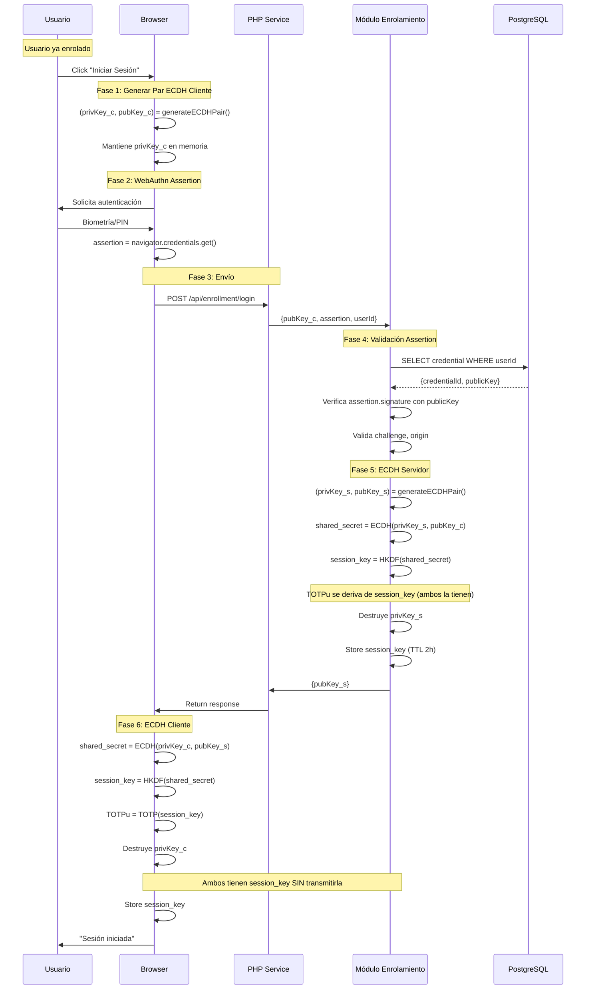
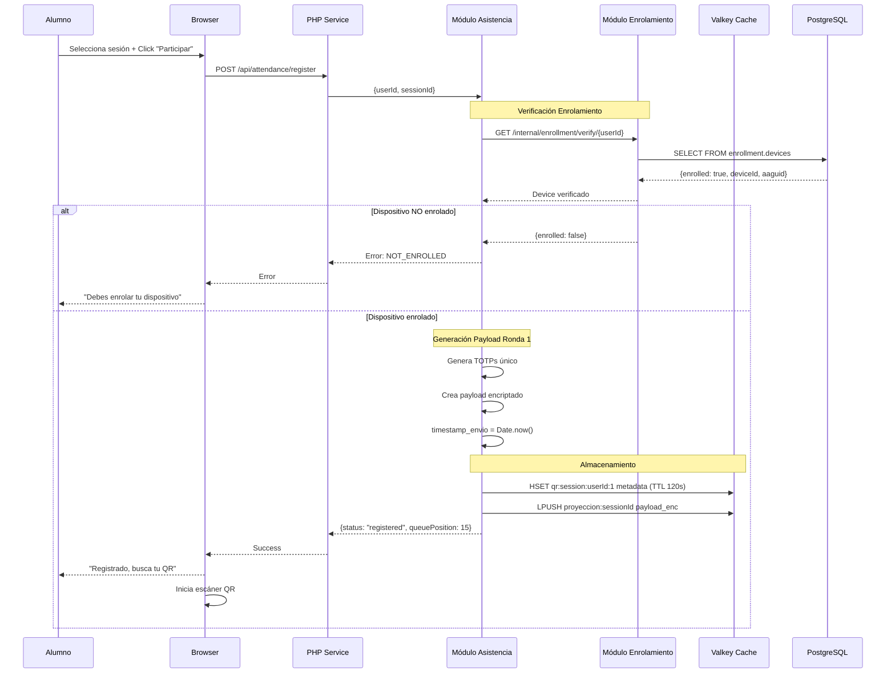
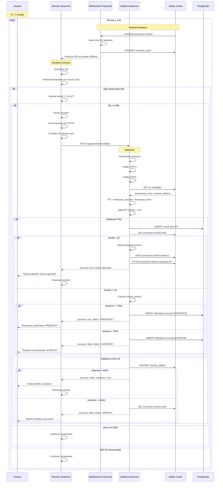
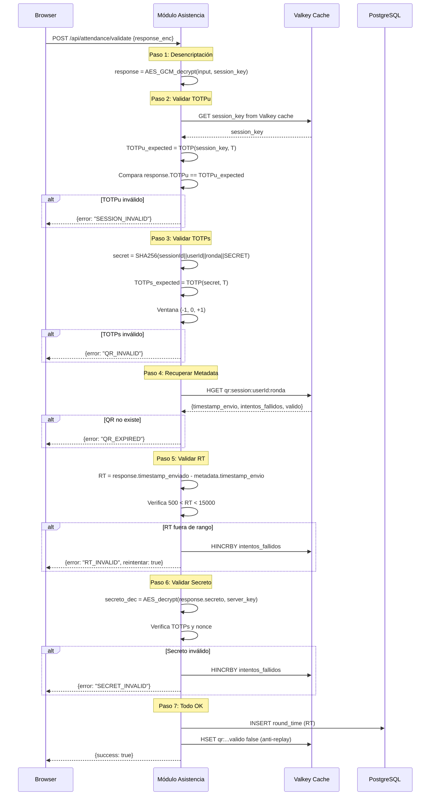
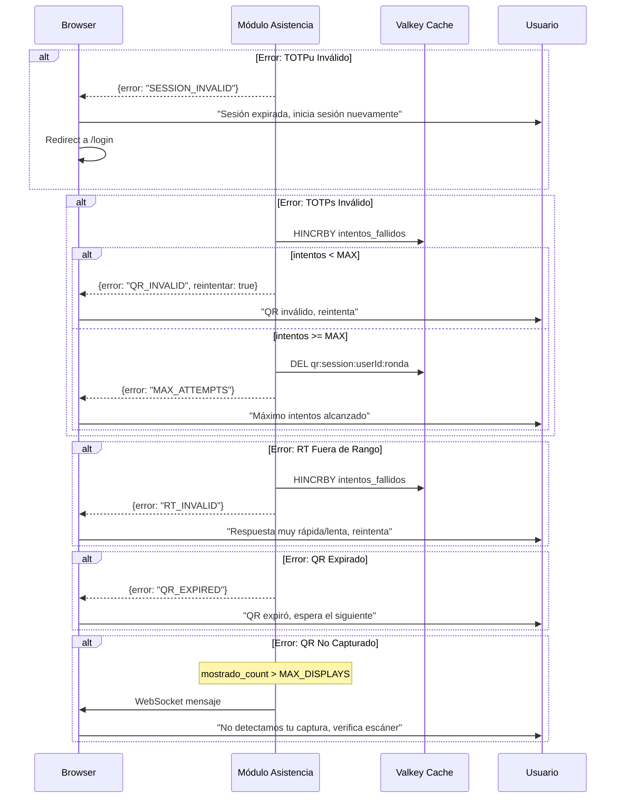
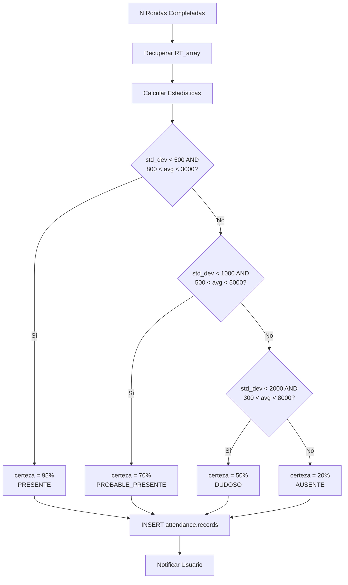
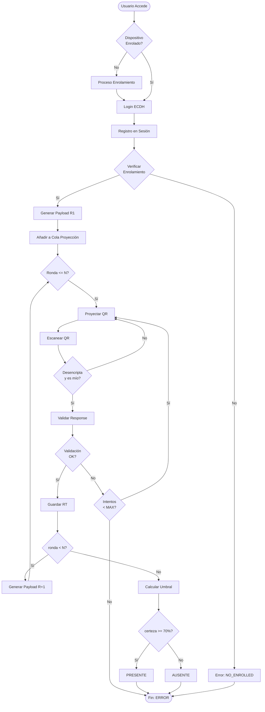

# Diagramas de Secuencia

---

## Índice

1. [Enrolamiento Completo](#enrolamiento-completo)
2. [Login ECDH](#login-ecdh)
3. [Registro en Sesión](#registro-en-sesión)
4. [Ciclo Completo N Rondas](#ciclo-completo-n-rondas)
5. [Validación de Ronda](#validación-de-ronda)
6. [Manejo de Errores](#manejo-de-errores)

---

## Enrolamiento Completo

---

## Login ECDH

---

## Registro en Sesión

---

## Ciclo Completo N Rondas

---

## Validación de Ronda

---

## Manejo de Errores

---

## Cálculo de Umbral (Final)

---

## Flujo Completo Simplificado

---

**Versión:** 1.0  
**Fecha:** 2025-11-02  
**Estado:** Especificación Técnica
