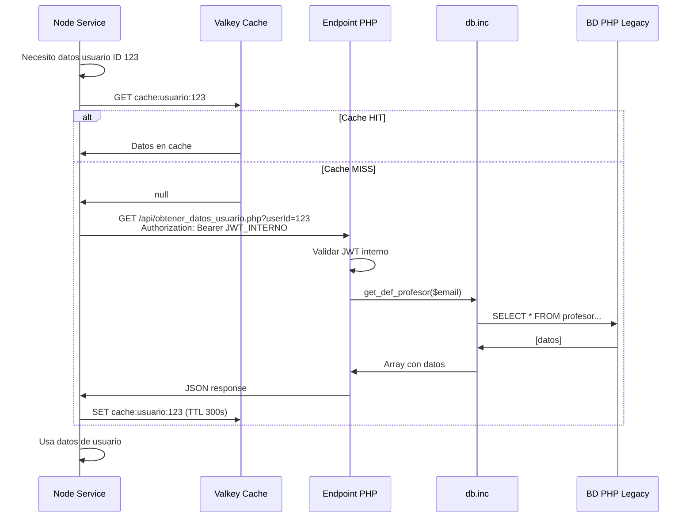
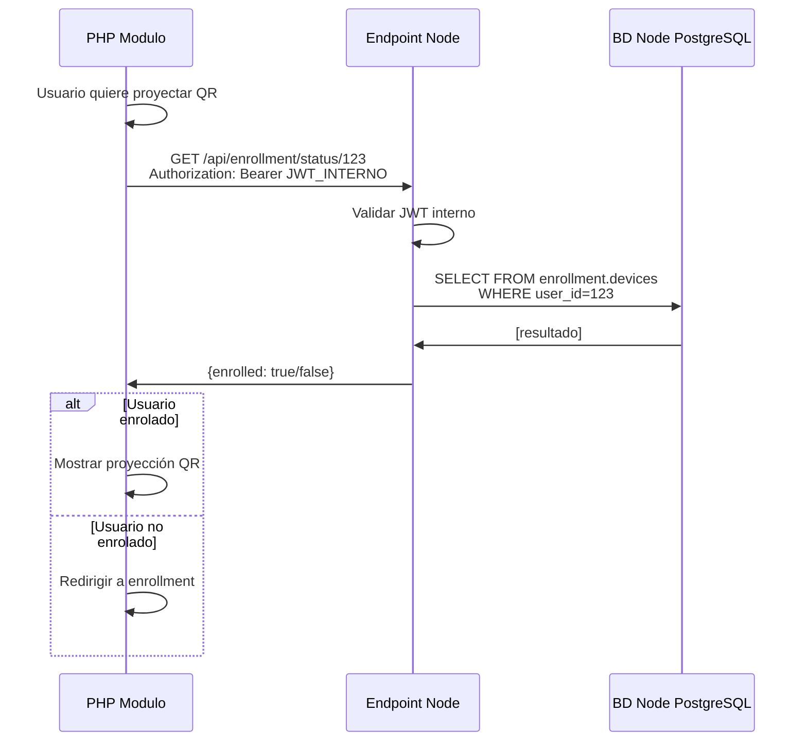
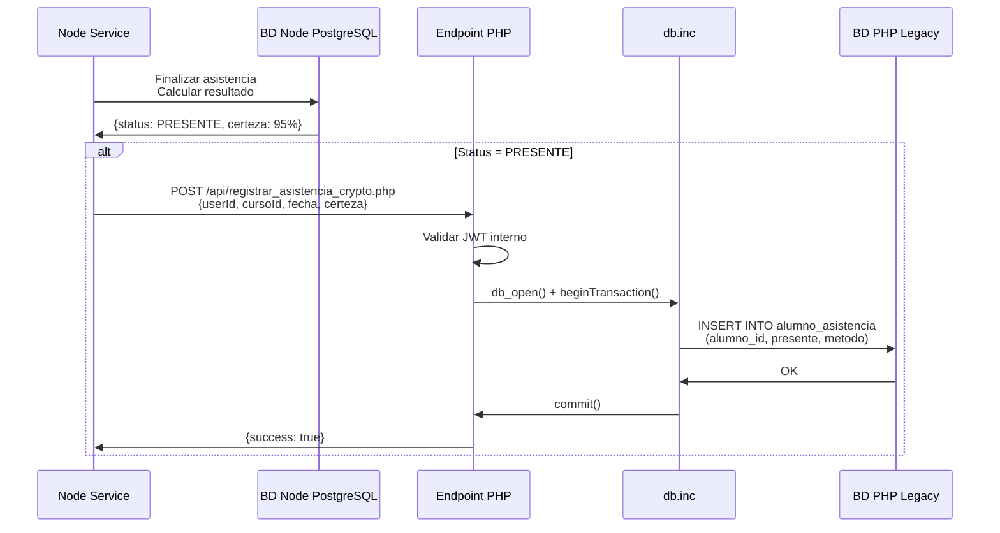

# Arquitectura de Datos: Tres Bases de Datos Independientes

**Versión:** 1.0  
**Fecha:** 2025-11-05  
**Estado:** Especificación Técnica

---

## Visión General

El sistema utiliza TRES bases de datos completamente separadas para mantener independencia entre el sistema legacy y el módulo nuevo, asegurando que el módulo sea autocontenido y removible.

### Bases de Datos

1. **BD PHP Legacy (PostgreSQL)**: Usuarios, cursos, asistencia tradicional
2. **BD Node Cache (Valkey/Redis)**: Cache temporal, metadata QR
3. **BD Node Persistente (PostgreSQL)**: Enrollment FIDO2, validaciones asistencia

### Principio de Separación

**Regla fundamental:** Ninguna aplicación accede directamente a las bases de datos de la otra.

- PHP solo accede a BD Legacy via `db.inc`
- Node solo accede a BD Cache (Valkey) y BD Persistente (PostgreSQL)
- Comunicación cross-database SOLO via endpoints HTTP/REST

Esta separación garantiza que:
- El módulo nuevo no modifica el sistema legacy
- El módulo puede ser removido sin afectar el sistema legacy
- Ambos sistemas pueden escalar independientemente

---

## Base de Datos PHP Legacy (PostgreSQL)

### Características

- **Motor:** PostgreSQL (versión existente en producción)
- **Propietario:** Sistema Legacy PHP "Hawaii"
- **Contenido:** Usuarios, cursos, asistencia tradicional, permisos
- **Acceso PHP:** Directo via funciones de `db.inc`
- **Acceso Node:** PROHIBIDO (debe usar endpoints HTTP)

### Tablas Relevantes para el Módulo

```sql
-- Estas tablas NO son directamente accesibles desde Node

public.profesor (
  id SERIAL PRIMARY KEY,
  rut VARCHAR(12) UNIQUE NOT NULL,
  nombre VARCHAR(200) NOT NULL,
  correo VARCHAR(100) UNIQUE NOT NULL,
  super BOOLEAN DEFAULT FALSE,
  control_clases BOOLEAN DEFAULT FALSE,
  control_asistencia BOOLEAN DEFAULT FALSE
);

public.alumno (
  id SERIAL PRIMARY KEY,
  rut VARCHAR(12) UNIQUE NOT NULL,
  nombre VARCHAR(200) NOT NULL,
  email VARCHAR(100),
  carrera_id INTEGER
);

public.curso (
  id SERIAL PRIMARY KEY,
  codigo VARCHAR(20) NOT NULL,
  nombre VARCHAR(200) NOT NULL,
  semestre_id INTEGER REFERENCES semestre(id)
);

public.semestre (
  id SERIAL PRIMARY KEY,
  nombre VARCHAR(50),
  fecha_inicio DATE,
  fecha_termino DATE
);

public.asistencia_curso (
  id SERIAL PRIMARY KEY,
  curso_id INTEGER REFERENCES curso(id),
  fecha TIMESTAMP,
  codigo_reserva VARCHAR(100) UNIQUE
);

public.alumno_asistencia (
  id SERIAL PRIMARY KEY,
  alumno_id INTEGER REFERENCES alumno(id),
  asistencia_curso_id INTEGER REFERENCES asistencia_curso(id),
  presente BOOLEAN,
  metodo VARCHAR(50)  -- 'tradicional', 'criptografico'
);
```

### Funciones db.inc Disponibles

El sistema legacy proporciona funciones PHP para acceso a datos:

#### Autenticación

```php
get_usuario_actual()           // Retorna email desde cookie UCN_SESSID (JWT)
set_login_cookie($email)       // Crea cookie con JWT (30 días TTL)
get_secret_key()              // Secreto para firmar JWT legacy
```

#### Profesores

```php
get_def_profesor($email)       // Array con todos los datos del profesor
get_rut_from_email($email)    // RUT del profesor
get_nombre_profesor($rut)     // Nombre completo del profesor
```

#### Permisos

```php
has_super_access()                              // Verifica super admin
can_control_clases()                            // Permiso control clases
can_control_asistencia()                        // Permiso control asistencia
can_tomar_asistencia($idcurso, $idsemestre)    // Permiso por curso
can_asistencia_fuera_de_fecha($user)           // Permiso especial
```

#### Alumnos

```php
get_alumno_by_rut($rut)       // Datos del alumno por RUT
get_url_foto($rut)            // URL de foto del alumno
```

#### Cursos

```php
get_curso($id)                              // Datos del curso
get_semestre_actual()                       // ID del semestre activo
get_cursos_profesor($rut, $id_semestre)     // Cursos del profesor
get_inscritos_curso($idcurso, $idsemestre)  // Alumnos inscritos
```

### Endpoints PHP para Node

Node puede obtener datos de BD Legacy via endpoints HTTP que el módulo PHP proporciona:

```php
// GET /asistencia-criptografica/api/obtener_datos_usuario.php?userId=123
// Authorization: Bearer {JWT_INTERNO}

Response 200:
{
  "userId": 123,
  "rut": "12345678-9",
  "nombre": "Juan Pérez",
  "email": "juan.perez@ucn.cl",
  "foto": "/files/fotos/12345678-9.jpg",
  "rol": "profesor",
  "permisos": {
    "superAdmin": false,
    "controlAsistencia": true
  }
}
```

```php
// GET /asistencia-criptografica/api/obtener_alumnos_curso.php?idCurso=45&idSemestre=2
// Authorization: Bearer {JWT_INTERNO}

Response 200:
[
  {
    "alumnoId": 100,
    "rut": "11111111-1",
    "nombre": "Alumno Uno",
    "email": "alumno1@alumnos.ucn.cl",
    "carrera": "Ingeniería Civil Informática"
  },
  // ...
]
```

```php
// GET /asistencia-criptografica/api/verificar_permiso.php?userId=123&permiso=tomar_asistencia&idCurso=45
// Authorization: Bearer {JWT_INTERNO}

Response 200:
{
  "permitido": true
}
```

### Acceso desde Node

```typescript
// node-service/src/infrastructure/php-legacy/php-legacy-client.ts

import { fetch } from 'undici';

export class PHPLegacyClient {
  private phpBaseUrl = 'http://php-service:80';
  private internalJWT: string;
  
  constructor() {
    // JWT especial para comunicación interna Node->PHP
    this.internalJWT = this.generarJWTInterno();
  }
  
  async obtenerDatosUsuario(userId: number): Promise<Usuario> {
    const response = await fetch(
      `${this.phpBaseUrl}/asistencia-criptografica/api/obtener_datos_usuario.php?userId=${userId}`,
      {
        headers: {
          'Authorization': `Bearer ${this.internalJWT}`
        }
      }
    );
    
    if (!response.ok) {
      throw new Error(`Error obteniendo datos usuario: ${response.status}`);
    }
    
    return response.json();
  }
  
  async obtenerAlumnosCurso(
    idCurso: number,
    idSemestre: number
  ): Promise<Alumno[]> {
    const response = await fetch(
      `${this.phpBaseUrl}/asistencia-criptografica/api/obtener_alumnos_curso.php?idCurso=${idCurso}&idSemestre=${idSemestre}`,
      {
        headers: {
          'Authorization': `Bearer ${this.internalJWT}`
        }
      }
    );
    
    if (!response.ok) {
      throw new Error(`Error obteniendo alumnos: ${response.status}`);
    }
    
    return response.json();
  }
  
  async verificarPermiso(
    userId: number,
    permiso: string,
    idCurso?: number
  ): Promise<boolean> {
    const params = new URLSearchParams({
      userId: userId.toString(),
      permiso
    });
    
    if (idCurso) {
      params.append('idCurso', idCurso.toString());
    }
    
    const response = await fetch(
      `${this.phpBaseUrl}/asistencia-criptografica/api/verificar_permiso.php?${params}`,
      {
        headers: {
          'Authorization': `Bearer ${this.internalJWT}`
        }
      }
    );
    
    if (!response.ok) {
      return false;
    }
    
    const data = await response.json();
    return data.permitido === true;
  }
  
  private generarJWTInterno(): string {
    // JWT con TTL largo para comunicación interna
    const payload = {
      iss: 'node-service',
      aud: 'php-legacy-system',
      sub: 'internal-communication',
      iat: Math.floor(Date.now() / 1000),
      exp: Math.floor(Date.now() / 1000) + 3600  // 1 hora
    };
    
    return jwt.sign(payload, process.env.JWT_SECRET_INTERNAL);
  }
}
```

---

## Base de Datos Node Cache (Valkey/Redis)

### Características

- **Motor:** Valkey 7 (fork de Redis compatible)
- **Propietario:** Servicio Node
- **Propósito:** Cache de alta velocidad para datos temporales
- **Acceso PHP:** NO
- **Acceso Node:** SI (directo)
- **Persistencia:** NO (datos se pierden al reiniciar, es cache)

### Rol de Valkey en el Sistema

**IMPORTANTE:** Valkey NO genera contenido criptográfico ni payloads QR.

**Responsabilidades de Valkey:**
- **Almacenar metadata temporal** de QR generados (timestamps, contadores)
- **Mantener cola de proyección** para rotación aleatoria
- **Cachear consultas HTTP** a BD Legacy (reduce latencia)
- **Gestionar sesiones temporales** de asistencia en progreso

**Responsabilidades de Node (no Valkey):**
- Generar payloads QR (encriptación AES-GCM)
- Generar TOTPs (TOTP algoritmo)
- Encriptar/desencriptar datos
- Validar firmas criptográficas

**Flujo correcto:**
1. Node genera payload QR con criptografía
2. Node almacena metadata en Valkey (timestamp, contadores)
3. Node agrega payload a cola Valkey
4. WebSocket lee cola desde Valkey
5. WebSocket proyecta QR usando payload de cola
6. Cliente escanea y Node valida usando metadata de Valkey

### Casos de Uso

1. **Metadata de QR generados** (TTL: 2 minutos)
   - Node GENERA el payload QR (criptografía)
   - Node ALMACENA metadata en Valkey: timestamp_envio, userId, round, sessionId
   - Permite a Node validar RT cuando llega respuesta del cliente
   - Se borra automáticamente después de validación o expiración

2. **Cola de proyección QR** (TTL: 7200 segundos / 2 horas)
   - Node GENERA payloads encriptados
   - Valkey ALMACENA lista de payloads pendientes
   - WebSocket LEE de Valkey para proyección aleatoria
   - Permite rotación eficiente sin regenerar QR

3. **Cache de consultas a PHP** (TTL: 5-10 minutos)
   - Reduce consultas repetitivas a BD Legacy
   - Datos de usuarios que cambian poco
   - Lista de alumnos de curso

4. **Sesiones temporales** (TTL: duración de asistencia)
   - Estado de asistencia en progreso
   - Contadores de intentos fallidos

### Estructura de Keys

```
Patrón de naming: {tipo}:{contexto}:{identificador}

qr:{sessionId}:{userId}:{round}
  -> Metadata de QR específico
  -> TTL: 120 segundos
  -> Valor: JSON con {timestamp_envio, nonce, intento}

proyeccion:{sessionId}
  -> Lista (LPUSH/RPOP) de payloads QR pendientes
  -> TTL: 7200 segundos (2 horas - duración típica de sesión)
  -> Valor: Array de strings (payloads encriptados)

session:asistencia:{sessionId}:{userId}
  -> Estado temporal de asistencia en progreso
  -> TTL: 600 segundos (10 minutos)
  -> Valor: JSON con {round_actual, intentos_fallidos, timestamps}

cache:usuario:{userId}
  -> Cache de datos de usuario desde PHP
  -> TTL: 300 segundos (5 minutos)
  -> Valor: JSON con datos completos del usuario

cache:alumnos:{cursoId}:{semestreId}
  -> Cache de lista de alumnos desde PHP
  -> TTL: 600 segundos (10 minutos)
  -> Valor: JSON array con datos de alumnos

lock:enrollment:{userId}
  -> Lock distribuido para prevenir enrollment concurrente
  -> TTL: 60 segundos
  -> Valor: timestamp del lock
```

### Ejemplo de Uso: Metadata QR

```typescript
// node-service/src/infrastructure/valkey/valkey-qr-metadata.service.ts

export class ValkeyQRMetadataService {
  private client: ValkeyClient;
  
  async guardarMetadataQR(
    sessionId: string,
    userId: number,
    round: number,
    metadata: QRMetadata
  ): Promise<void> {
    const key = `qr:${sessionId}:${userId}:${round}`;
    
    await this.client.set(
      key,
      JSON.stringify(metadata),
      'EX', 120  // TTL: 2 minutos
    );
  }
  
  async obtenerMetadataQR(
    sessionId: string,
    userId: number,
    round: number
  ): Promise<QRMetadata | null> {
    const key = `qr:${sessionId}:${userId}:${round}`;
    const data = await this.client.get(key);
    
    if (!data) {
      return null;
    }
    
    return JSON.parse(data);
  }
  
  async eliminarMetadataQR(
    sessionId: string,
    userId: number,
    round: number
  ): Promise<void> {
    const key = `qr:${sessionId}:${userId}:${round}`;
    await this.client.del(key);
  }
  
  async incrementarIntentosFallidos(
    sessionId: string,
    userId: number,
    round: number
  ): Promise<number> {
    const key = `qr:${sessionId}:${userId}:${round}`;
    const metadata = await this.obtenerMetadataQR(sessionId, userId, round);
    
    if (!metadata) {
      throw new Error('Metadata QR no encontrada');
    }
    
    metadata.intentos_fallidos = (metadata.intentos_fallidos || 0) + 1;
    
    await this.guardarMetadataQR(sessionId, userId, round, metadata);
    
    return metadata.intentos_fallidos;
  }
}
```

### Ejemplo de Uso: Cache de PHP

```typescript
// node-service/src/infrastructure/php-legacy/php-legacy-cache.service.ts

export class PHPLegacyCache {
  private valkey: ValkeyClient;
  private phpClient: PHPLegacyClient;
  
  async obtenerDatosUsuario(userId: number): Promise<Usuario> {
    const cacheKey = `cache:usuario:${userId}`;
    
    // Intentar obtener de cache primero
    const cached = await this.valkey.get(cacheKey);
    if (cached) {
      return JSON.parse(cached);
    }
    
    // No en cache, consultar a PHP
    const datos = await this.phpClient.obtenerDatosUsuario(userId);
    
    // Guardar en cache (5 minutos)
    await this.valkey.set(
      cacheKey,
      JSON.stringify(datos),
      'EX', 300
    );
    
    return datos;
  }
  
  async obtenerAlumnosCurso(
    idCurso: number,
    idSemestre: number
  ): Promise<Alumno[]> {
    const cacheKey = `cache:alumnos:${idCurso}:${idSemestre}`;
    
    // Intentar cache
    const cached = await this.valkey.get(cacheKey);
    if (cached) {
      return JSON.parse(cached);
    }
    
    // Consultar a PHP
    const alumnos = await this.phpClient.obtenerAlumnosCurso(
      idCurso,
      idSemestre
    );
    
    // Cache 10 minutos (lista de alumnos cambia poco)
    await this.valkey.set(
      cacheKey,
      JSON.stringify(alumnos),
      'EX', 600
    );
    
    return alumnos;
  }
  
  async invalidarCacheUsuario(userId: number): Promise<void> {
    await this.valkey.del(`cache:usuario:${userId}`);
  }
  
  async invalidarCacheAlumnos(
    idCurso: number,
    idSemestre: number
  ): Promise<void> {
    await this.valkey.del(`cache:alumnos:${idCurso}:${idSemestre}`);
  }
}
```

---

## Base de Datos Node Persistente (PostgreSQL)

### Características

- **Motor:** PostgreSQL 18
- **Propietario:** Servicio Node
- **Contenido:** Enrollment FIDO2, sesiones de asistencia, validaciones
- **Acceso PHP:** NO (PHP consulta estado via endpoints Node)
- **Acceso Node:** SI (directo)
- **Persistencia:** SI (datos críticos, backups diarios)

### Principio: Datos Mínimos de Usuario

**Node NO mantiene datos completos de usuarios.** Solo almacena identificadores y datos criptográficos.

#### Datos que SÍ tiene Node (BD Persistente):

- `user_id` (INTEGER): Identificador único del usuario
- `credential_id` (TEXT): ID de credencial FIDO2
- `public_key` (TEXT): Clave pública ECDSA P-256
- `handshake_secret` (TEXT): Secret derivado para TOTPu
- `device_fingerprint` (TEXT): Huella del dispositivo
- Timestamps: `enrolled_at`, `last_used_at`
- Resultados validación: `response_time_ms`, `certainty_score`, `status`

#### Datos que NO tiene Node (están en BD Legacy):

- Nombre completo del usuario
- Email
- RUT
- Carrera
- Datos de profesor (cursos, permisos)
- Datos de curso completos (créditos, programa)
- Historial académico

**Cuando Node necesita estos datos:** Consulta PHP via HTTP con JWT_INTERNAL.

**Ejemplo:**

```typescript
// Node necesita mostrar nombre en UI
const userData = await PHPLegacyClient.getUserById(userId);
// Retorna: {userId: 123, nombre: "Juan Pérez", email: "juan.perez@ucn.cl", rut: "12345678-9"}

// Node cachea en Valkey (TTL 5 min)
await valkey.setex(`cache:php:user:${userId}`, 300, JSON.stringify(userData));
```

### Schemas

Ver documento `05-esquema-base-datos.md` para especificación completa.

**Resumen:**

- `enrollment.devices`: Dispositivos FIDO2 enrolados (user_id + credenciales)
- `enrollment.enrollment_history`: Auditoría de enrollment
- `attendance.sessions`: Sesiones de asistencia criptográfica (professor_id, course_code)
- `attendance.registrations`: Anuncios de participación (user_id, device_id)
- `attendance.validations`: Validaciones por ronda (response_time_ms)
- `attendance.results`: Resultados finales (certainty_score, status)

**Nota:** Las tablas usan `user_id`, `professor_id` como INTEGER (FK conceptual a BD Legacy), pero NO hay constraint FOREIGN KEY real porque son bases de datos separadas.

### Endpoints Node para PHP

PHP puede consultar datos de BD Node via endpoints:

```typescript
// GET /api/enrollment/status/:userId
// Authorization: Bearer {JWT_USUARIO o JWT_INTERNO}

Response 200:
{
  "enrolled": true,
  "deviceId": 42,
  "enrolledAt": "2025-11-01T10:30:00Z",
  "deviceInfo": {
    "aaguid": "...",
    "lastUsed": "2025-11-04T15:20:00Z"
  }
}
```

```typescript
// GET /api/attendance/session/:sessionId/status
// Authorization: Bearer {JWT_INTERNO}

````

### Acceso desde PHP

```php
// php-service/src/lib/node-integration.php

class NodeIntegration {
    private $nodeBaseUrl = 'http://node-service:3000';
    private $internalJWT;
    
    public function __construct() {
        $this->internalJWT = $this->generarJWTInterno();
    }
    
    public function consultarEnrollmentStatus($userId) {
        $ch = curl_init("{$this->nodeBaseUrl}/api/enrollment/status/{$userId}");
        curl_setopt($ch, CURLOPT_HTTPHEADER, [
            "Authorization: Bearer {$this->internalJWT}"
        ]);
        curl_setopt($ch, CURLOPT_RETURNTRANSFER, true);
        
        $response = curl_exec($ch);
        $httpCode = curl_getinfo($ch, CURLINFO_HTTP_CODE);
        curl_close($ch);
        
        if ($httpCode !== 200) {
            return ['enrolled' => false];
        }
        
        return json_decode($response, true);
    }
    
    public function obtenerResultadosAsistencia($sessionId) {
        $ch = curl_init("{$this->nodeBaseUrl}/api/attendance/session/{$sessionId}/results");
        curl_setopt($ch, CURLOPT_HTTPHEADER, [
            "Authorization: Bearer {$this->internalJWT}"
        ]);
        curl_setopt($ch, CURLOPT_RETURNTRANSFER, true);
        
        $response = curl_exec($ch);
        $httpCode = curl_getinfo($ch, CURLINFO_HTTP_CODE);
        curl_close($ch);
        
        if ($httpCode !== 200) {
            return ['error' => 'No se pudieron obtener resultados'];
        }
        
        return json_decode($response, true);
    }
    
    private function generarJWTInterno() {
        $payload = [
            'iss' => 'php-legacy-system',
            'aud' => 'node-service',
            'sub' => 'internal-communication',
            'iat' => time(),
            'exp' => time() + 3600  // 1 hora
        ];
        
        return JWT::encode($payload, getenv('JWT_SECRET_INTERNAL'));
    }
}
```

---

## Comunicación Cross-Database

### Flujo: Node necesita datos de PHP



### Flujo: PHP necesita datos de Node



### Flujo: Sincronización Legacy (Node → PHP)

Cuando Node registra asistencia exitosa, notifica a PHP para registro en sistema legacy:



---

## Configuración de Deployment

### Desarrollo (Docker Compose)

```yaml
# compose.yaml
services:
  php-service:
    build: ./php-service
    depends_on:
      - postgres-legacy
    environment:
      - DB_HOST=postgres-legacy
      - DB_NAME=asistencia_legacy
      - JWT_SECRET=${JWT_SECRET}
      - JWT_SECRET_INTERNAL=${JWT_SECRET_INTERNAL}
    networks:
      - app-network
  
  node-service:
    build: ./node-service
    depends_on:
      - postgres-node
      - valkey
    environment:
      - DB_HOST=postgres-node
      - DB_NAME=asistencia_node
      - REDIS_HOST=valkey
      - REDIS_PORT=6379
      - JWT_SECRET=${JWT_SECRET}
      - JWT_SECRET_INTERNAL=${JWT_SECRET_INTERNAL}
      - PHP_BASE_URL=http://php-service:80
    networks:
      - app-network
  
  postgres-legacy:
    image: postgres:18
    container_name: postgres-legacy
    environment:
      - POSTGRES_DB=asistencia_legacy
      - POSTGRES_USER=admin
      - POSTGRES_PASSWORD=${POSTGRES_PASSWORD}
    volumes:
      - postgres-legacy-data:/var/lib/postgresql/data
    ports:
      - "9501:5432"
    networks:
      - app-network
  
  postgres-node:
    image: postgres:18
    container_name: postgres-node
    environment:
      - POSTGRES_DB=asistencia_node
      - POSTGRES_USER=admin
      - POSTGRES_PASSWORD=${POSTGRES_PASSWORD}
    volumes:
      - postgres-node-data:/var/lib/postgresql/data
      - ./node-service/sql:/docker-entrypoint-initdb.d
    ports:
      - "9504:5432"
    networks:
      - app-network
  
  valkey:
    image: valkey/valkey:7
    container_name: valkey-cache
    ports:
      - "9502:6379"
    volumes:
      - valkey-data:/data
    networks:
      - app-network

volumes:
  postgres-legacy-data:
  postgres-node-data:
  valkey-data:

networks:
  app-network:
    driver: bridge
```

### Producción

**BD PHP Legacy:**
- Ya existe en servidor de producción
- NO modificar, solo agregar endpoints PHP del módulo

**BD Node Persistente:**
- Nueva instancia PostgreSQL dedicada
- Puede estar en mismo servidor o separado
- Backup diario recomendado

**BD Node Cache:**
- Nueva instancia Valkey/Redis
- Puede estar en mismo servidor
- NO requiere backup (datos temporales)

---

## Patrones de Uso Recomendados

### Patrón 1: Consulta con Cache

```typescript
// Siempre usar cache para consultas a PHP
async obtenerDatosUsuario(userId: number): Promise<Usuario> {
  return this.phpCache.obtenerDatosUsuario(userId);
}

// NO consultar directo:
// const datos = await this.phpClient.obtenerDatosUsuario(userId);
```

### Patrón 2: Invalidación de Cache

```typescript
// Cuando datos cambian, invalidar cache
async actualizarPermisosUsuario(userId: number) {
  // ... lógica de actualización ...
  
  // Invalidar cache para que próxima consulta obtenga datos frescos
  await this.phpCache.invalidarCacheUsuario(userId);
}
```

### Patrón 3: Lock Distribuido

```typescript
// Para operaciones críticas, usar lock en Valkey
async enrollDevice(userId: number, credential: Credential) {
  const lockKey = `lock:enrollment:${userId}`;
  
  // Intentar obtener lock
  const locked = await this.valkey.set(lockKey, Date.now(), 'NX', 'EX', 60);
  
  if (!locked) {
    throw new Error('Enrollment ya en progreso para este usuario');
  }
  
  try {
    // Ejecutar enrollment
    await this.enrollmentService.enroll(userId, credential);
  } finally {
    // Liberar lock
    await this.valkey.del(lockKey);
  }
}
```

### Patrón 4: Batch de Consultas

```typescript
// Para múltiples consultas, usar pipeline de Valkey
async obtenerDatosMultiplesUsuarios(userIds: number[]): Promise<Usuario[]> {
  const pipeline = this.valkey.pipeline();
  
  // Agregar todos los GET al pipeline
  for (const userId of userIds) {
    pipeline.get(`cache:usuario:${userId}`);
  }
  
  const results = await pipeline.exec();
  
  // Identificar cuáles faltan en cache
  const faltantes: number[] = [];
  const usuarios: Usuario[] = [];
  
  for (let i = 0; i < results.length; i++) {
    if (results[i][1]) {
      usuarios.push(JSON.parse(results[i][1]));
    } else {
      faltantes.push(userIds[i]);
    }
  }
  
  // Consultar faltantes a PHP (en paralelo)
  if (faltantes.length > 0) {
    const promises = faltantes.map(id => 
      this.phpClient.obtenerDatosUsuario(id)
    );
    const datosNuevos = await Promise.all(promises);
    
    // Guardar en cache
    const cachePipeline = this.valkey.pipeline();
    for (let i = 0; i < faltantes.length; i++) {
      cachePipeline.set(
        `cache:usuario:${faltantes[i]}`,
        JSON.stringify(datosNuevos[i]),
        'EX', 300
      );
    }
    await cachePipeline.exec();
    
    usuarios.push(...datosNuevos);
  }
  
  return usuarios;
}
```

---

## Consideraciones de Seguridad

### JWT Interno (PHP ↔ Node)

Usar secreto diferente al JWT de usuarios:

```bash
# .env
JWT_SECRET=secret_para_usuarios_5min_ttl
JWT_SECRET_INTERNAL=secret_para_comunicacion_interna_1h_ttl
```

**Razones:**
- Separación de concerns
- TTL diferente (usuarios: 5min, interno: 1h)
- Si se compromete uno, el otro sigue seguro

### Validación en Endpoints Bridge

```php
// Endpoint PHP para Node
function validarJWTInterno($authHeader) {
    $token = str_replace('Bearer ', '', $authHeader);
    
    try {
        $payload = JWT::decode($token, getenv('JWT_SECRET_INTERNAL'));
        
        // Verificar issuer correcto
        if ($payload->iss !== 'node-service') {
            return false;
        }
        
        return true;
    } catch (Exception $e) {
        return false;
    }
}
```

```typescript
// Endpoint Node para PHP
async function validarJWTInterno(authHeader: string): Promise<boolean> {
  try {
    const token = authHeader.replace('Bearer ', '');
    const payload = jwt.verify(token, process.env.JWT_SECRET_INTERNAL);
    
    // Verificar issuer correcto
    if (payload.iss !== 'php-legacy-system') {
      return false;
    }
    
    return true;
  } catch (error) {
    return false;
  }
}
```

### Rate Limiting en Endpoints Bridge

```typescript
// Limitar requests de comunicación interna
import rateLimit from '@fastify/rate-limit';

fastify.register(rateLimit, {
  max: 1000,  // Máximo 1000 requests
  timeWindow: '1 minute',
  keyGenerator: (request) => {
    // Identificar por issuer del JWT
    const token = request.headers.authorization?.replace('Bearer ', '');
    if (token) {
      const payload = jwt.decode(token);
      return payload.iss;
    }
    return request.ip;
  }
});
```

---

## Migración y Mantenimiento

### Backup

**BD PHP Legacy:**
- Responsabilidad del sistema existente
- Ya tiene estrategia de backup implementada
- NO modificar

**BD Node Persistente:**
```bash
# Backup diario automático
0 2 * * * pg_dump -h postgres-node -U admin asistencia_node > /backups/node-$(date +\%Y\%m\%d).sql
```

**BD Node Cache:**
- NO requiere backup (datos temporales)
- Si se pierde, se regenera automáticamente

### Monitoreo

**Métricas clave:**

```typescript
// Tasa de cache hit
const cacheHitRate = cacheHits / (cacheHits + cacheMisses);

// Latencia de consultas cross-database
const avgLatencyPHP = totalLatencyPHP / numRequestsPHP;

// Tamaño de cache
const cacheSize = await valkey.dbsize();

// Conexiones activas BD Node
const activeConnections = await pool.totalCount;
```

### Logs Estructurados

```typescript
// Loguear todas las consultas cross-database
logger.info('cross-database-query', {
  source: 'node',
  target: 'php',
  endpoint: '/api/obtener_datos_usuario.php',
  userId: 123,
  cached: false,
  latency: 45,  // ms
  timestamp: new Date().toISOString()
});
```

---

## Anexo: Comandos Útiles

### Inspeccionar Valkey

```bash
# Conectar a Valkey
redis-cli -h valkey -p 6379

# Ver todas las keys
KEYS *

# Ver keys de un patrón
KEYS qr:*
KEYS cache:usuario:*

# Ver contenido de key
GET cache:usuario:123

# Ver TTL de key
TTL qr:session123:100:1

# Limpiar cache completo
FLUSHDB

# Ver estadísticas
INFO stats
```

### Inspeccionar PostgreSQL Node

```bash
# Conectar a BD Node
psql -h postgres-node -U admin -d asistencia_node

# Ver tablas
\dt enrollment.*
\dt attendance.*

# Ver dispositivos enrolados
SELECT user_id, enrolled_at, is_active 
FROM enrollment.devices 
WHERE is_active = true;

# Ver sesiones de asistencia activas
SELECT id, course_id, status, start_time 
FROM attendance.sessions 
WHERE status = 'active';

# Ver tamaño de base de datos
SELECT pg_size_pretty(pg_database_size('asistencia_node'));
```

### Probar Endpoints Bridge

```bash
# Desde Node a PHP
curl -X GET "http://php-service:80/asistencia-criptografica/api/obtener_datos_usuario.php?userId=123" \
  -H "Authorization: Bearer {JWT_INTERNO}"

# Desde PHP a Node
curl -X GET "http://node-service:3000/api/enrollment/status/123" \
  -H "Authorization: Bearer {JWT_INTERNO}"
```

---

## Referencias

- `05-esquema-base-datos.md`: Especificación completa de BD Node
- `01-arquitectura-general.md`: Diagrama general del sistema
- `antecedente_funcioensDB_servidorbase.md`: Funciones db.inc disponibles
- `antecedente_autenticacion_servidorbase.md`: Sistema de autenticación legacy

---

**Documento creado:** 2025-11-05  
**Próxima revisión:** Después de implementación de endpoints bridge
