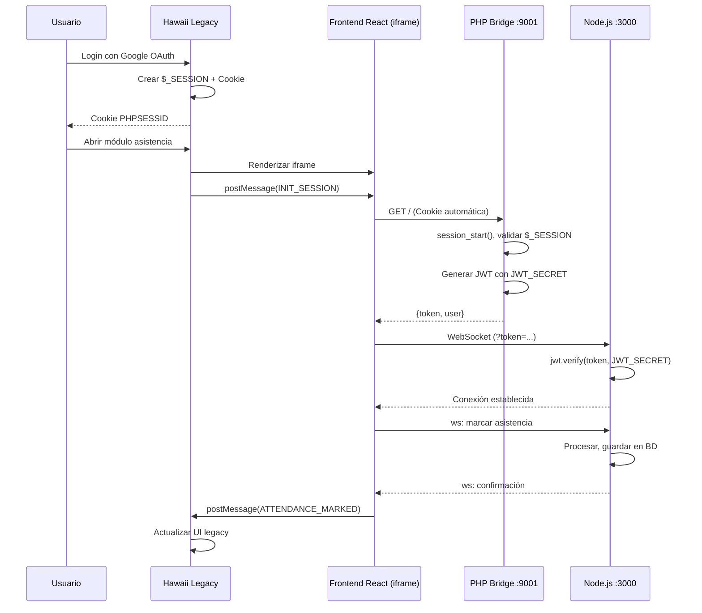

# ✅ ARQUITECTURA FINAL: Integración JWT Bridge Service

**Fecha:** 2026-01-02  
**Prioridad:** ALTA  
**Estado:** 🟢 DOCUMENTADO

---

## Contexto del Sistema

### Componentes Existentes

```
┌─────────────────────────────────────────────────────────────────┐
│                    SISTEMA HAWAII LEGACY                         │
│  - PHP 7.4                                                       │
│  - Google OAuth 2.0 (autenticación)                             │
│  - Sesión PHP: $_SESSION['id'], $_SESSION['user']               │
│  - Cookie: PHPSESSID                                             │
│  - Puerto: 80/443 (Apache)                                       │
└─────────────────────────────────────────────────────────────────┘
                              ↓
                    Cookie de sesión compartida
                              ↓
┌─────────────────────────────────────────────────────────────────┐
│              FRONTEND REACT (Módulo Asistencia)                  │
│  - Servido estáticamente por Nginx/Apache                       │
│  - Embebido en iframe dentro de Hawaii legacy                   │
│  - Mismo dominio: losvilos.ucn.cl/hawaii/asistencia/            │
│  - Tiene acceso a cookie PHPSESSID (same-origin)                │
└─────────────────────────────────────────────────────────────────┘
                              ↓
                  Necesita JWT para WebSocket
                              ↓
┌─────────────────────────────────────────────────────────────────┐
│                  JWT BRIDGE SERVICE (PHP)                        │
│  - Puerto: 9001                                                  │
│  - Lee $_SESSION via db.inc                                      │
│  - Valida sesión legacy + genera JWT                            │
│  - Firmado con JWT_SECRET compartido                            │
└─────────────────────────────────────────────────────────────────┘
                              ↓
                         JWT Token
                              ↓
┌─────────────────────────────────────────────────────────────────┐
│                  BACKEND NODE.JS (Fastify)                       │
│  - Puerto: 3000                                                  │
│  - WebSocket para asistencia en tiempo real                     │
│  - Valida JWT con JWT_SECRET compartido                         │
│  - Lógica de negocio: QR, TOTP, FIDO2                          │
└─────────────────────────────────────────────────────────────────┘
```

### Restricciones Importantes

1. ✅ **NO modificar sistema legacy Hawaii** - Intocable
2. ✅ **Cookie de sesión PHP debe mantenerse** - Es el único sistema de auth
3. ✅ **Frontend React en iframe** - Embebido en páginas legacy
4. ✅ **Same-origin policy** - Frontend y PHP Bridge comparten dominio

---

## Flujo de Autenticación FINAL

### Secuencia Completa

```
PASO 1: Usuario autenticado en Hawaii Legacy
━━━━━━━━━━━━━━━━━━━━━━━━━━━━━━━━━━━━━━━━━━━━

Usuario → Hawaii Legacy (Google OAuth) → $_SESSION['user'] + Cookie PHPSESSID


PASO 2: Usuario abre módulo de asistencia
━━━━━━━━━━━━━━━━━━━━━━━━━━━━━━━━━━━━━━━━━━━━

Hawaii Legacy → Renderiza iframe con React App
                URL: /hawaii/asistencia/app/
                Cookie PHPSESSID se envía automáticamente (same-origin)


PASO 3: Frontend React necesita JWT
━━━━━━━━━━━━━━━━━━━━━━━━━━━━━━━━━━━━━━━━━━━━

Frontend (iframe) → fetch('http://172.16.23.244:9001/')
                    Headers: Cookie: PHPSESSID=abc123 (automático)
                    ↓
JWT Bridge Service (PHP) → Recibe request con cookie
                           → session_start() lee $_SESSION
                           → Valida con is_logged_in() (db.inc)
                           → Genera JWT firmado con JWT_SECRET
                           ↓
Frontend ← JWT { userId, username, rol, exp, jti }


PASO 4: Frontend se conecta a WebSocket
━━━━━━━━━━━━━━━━━━━━━━━━━━━━━━━━━━━━━━━━━━━━

Frontend → WebSocket (ws://172.16.23.244:3000/ws)
           Query: ?token=eyJhbGciOiJIUzI1NiIsInR5cCI6IkpXVCJ9...
           ↓
Node.js Backend → Valida JWT con JWT_SECRET compartido
                → Extrae userId, username, rol
                → Establece conexión WebSocket
                → Usuario puede tomar asistencia
```

---

## Comunicación Iframe ↔ Parent (postMessage)

### ¿Por qué postMessage?

El frontend React está en un **iframe embebido** dentro de páginas legacy de Hawaii. Aunque están en same-origin (pueden compartir cookies), el iframe necesita:

1. **Recibir contexto inicial** del padre (curso, bloque, fecha)
2. **Notificar eventos** al padre (asistencia completada, errores)
3. **Coordinar navegación** (cerrar modal, recargar página)

### Protocolo de Mensajes

```javascript
// PADRE (Hawaii Legacy) → IFRAME (React App)
window.frames['asistencia-iframe'].postMessage({
  type: 'INIT_SESSION',
  payload: {
    idCurso: 429,
    idSemestre: 5,
    fecha: '2025-04-01',
    bloque: 1,
    tipo: 1,
    usuario: 'profesor@ucn.cl'
  }
}, 'https://losvilos.ucn.cl');

// IFRAME (React App) → PADRE (Hawaii Legacy)
window.parent.postMessage({
  type: 'SESSION_CREATED',
  payload: {
    sessionId: 12345,
    qrCode: 'CVYAFO'
  }
}, 'https://losvilos.ucn.cl');
```

### Mensajes Definidos

| Dirección | Tipo | Propósito |
|-----------|------|-----------|
| Padre → Iframe | `INIT_SESSION` | Enviar datos de curso/sesión |
| Iframe → Padre | `SESSION_CREATED` | Confirmar sesión creada |
| Iframe → Padre | `ATTENDANCE_MARKED` | Notificar asistencia marcada |
| Iframe → Padre | `ERROR` | Reportar errores |
| Iframe → Padre | `CLOSE_MODAL` | Solicitar cerrar iframe |

---

## Implementación JWT Bridge Service

### Endpoint Principal: `GET /`

**Request:**
```http
GET / HTTP/1.1
Host: 172.16.23.244:9001
Cookie: PHPSESSID=abc123def456
```

**Response (Success):**
```json
{
  "success": true,
  "token": "eyJhbGciOiJIUzI1NiIsInR5cCI6IkpXVCJ9.eyJ1c2VySWQiOjEyMywidXNlcm5hbWUiOiJwcm9mZXNvckB1Y24uY2wiLCJyb2wiOiJwcm9mZXNvciIsImlhdCI6MTczNTg0MDAwMCwiZXhwIjoxNzM1ODQwMzAwLCJqdGkiOiJ1dWlkLXYxIn0.signature",
  "expiresIn": 300,
  "user": {
    "userId": 123,
    "username": "profesor@ucn.cl",
    "rol": "profesor"
  }
}
```

**Response (Unauthorized):**
```json
{
  "success": false,
  "error": "NOT_AUTHENTICATED",
  "message": "Usuario no autenticado en sistema legacy"
}
```

### Código PHP (index.php)

```php
<?php
// Cargar funciones legacy
require_once '/var/www/html/hawaii/db.inc';

// Cargar config y dependencias
$config = require __DIR__ . '/config/config.php';
require __DIR__ . '/src/JwtGenerator.php';
require __DIR__ . '/src/middleware/LegacySessionValidator.php';

use JwtBridge\JwtGenerator;
use JwtBridge\LegacySessionValidator;

// Headers CORS
header('Content-Type: application/json');
header('Access-Control-Allow-Origin: https://losvilos.ucn.cl');
header('Access-Control-Allow-Credentials: true');
header('Access-Control-Allow-Methods: GET, OPTIONS');

if ($_SERVER['REQUEST_METHOD'] === 'OPTIONS') {
    http_response_code(200);
    exit;
}

// Validar sesión legacy
$validator = new LegacySessionValidator($config);
if (!$validator->validate()) {
    http_response_code(401);
    echo json_encode([
        'success' => false,
        'error' => 'NOT_AUTHENTICATED',
        'message' => 'Usuario no autenticado en sistema legacy'
    ]);
    exit;
}

// Generar JWT
$generator = new JwtGenerator($config);
$userData = [
    'userId' => $_SESSION['id'] == -1 ? abs(crc32($_SESSION['user'])) : $_SESSION['id'],
    'username' => $_SESSION['user'],
    'rol' => $_SESSION['id'] == -1 ? 'alumno' : 'profesor'
];

$jwt = $generator->generate($userData);

echo json_encode([
    'success' => true,
    'token' => $jwt,
    'expiresIn' => $config['jwt']['ttl'],
    'user' => $userData
]);
```

---

## Validación JWT en Node.js

### Middleware de Autenticación

```typescript
// backend/src/plugins/auth.ts
import jwt from 'jsonwebtoken';
import { FastifyRequest, FastifyReply } from 'fastify';

const JWT_SECRET = process.env.JWT_SECRET!;

interface JWTPayload {
  userId: number;
  username: string;
  rol: 'profesor' | 'alumno';
  iat: number;
  exp: number;
  jti: string;
}

export async function validateJWT(
  request: FastifyRequest,
  reply: FastifyReply
) {
  try {
    const token = 
      request.headers.authorization?.replace('Bearer ', '') ||
      request.query.token as string;

    if (!token) {
      return reply.code(401).send({
        success: false,
        error: 'NO_TOKEN',
        message: 'Token JWT requerido'
      });
    }

    const decoded = jwt.verify(token, JWT_SECRET) as JWTPayload;
    
    // Inyectar usuario en request
    request.user = {
      userId: decoded.userId,
      username: decoded.username,
      rol: decoded.rol
    };

  } catch (error) {
    return reply.code(401).send({
      success: false,
      error: 'INVALID_TOKEN',
      message: error instanceof jwt.TokenExpiredError 
        ? 'Token expirado' 
        : 'Token inválido'
    });
  }
}
```

### WebSocket con Autenticación

```typescript
// backend/src/plugins/websocket.ts
import { FastifyInstance } from 'fastify';
import jwt from 'jsonwebtoken';

const JWT_SECRET = process.env.JWT_SECRET!;

export async function registerWebSocket(fastify: FastifyInstance) {
  fastify.register(require('@fastify/websocket'));

  fastify.get('/ws', { websocket: true }, (connection, req) => {
    // Validar JWT desde query string
    const token = req.query.token as string;
    
    if (!token) {
      connection.socket.close(1008, 'Token requerido');
      return;
    }

    try {
      const decoded = jwt.verify(token, JWT_SECRET);
      
      // Usuario autenticado, establecer conexión
      connection.socket.user = decoded;
      
      connection.socket.on('message', (message) => {
        // Manejar mensajes del cliente
        const data = JSON.parse(message.toString());
        
        // Lógica de asistencia, QR, TOTP, etc.
      });

    } catch (error) {
      connection.socket.close(1008, 'Token inválido');
    }
  });
}
```

---

## Configuración de Secretos Compartidos

### Variable de Entorno JWT_SECRET

**CRÍTICO:** El mismo `JWT_SECRET` debe estar en:

1. **PHP Bridge Service** (`.env`)
2. **Node.js Backend** (`.env`)

```bash
# /var/www/html/hawaii/asistencia/.env

# Secret compartido PHP ↔ Node.js
JWT_SECRET="GYw+eD2ykl2k2UDu/ttZPZ+tWaIraic27OYcU2iAxEKHnpbRYKnqC9d2agkfbDBrNm8mr"

# TTL del token (5 minutos)
JWT_TTL=300

# URLs de servicios
JWT_BRIDGE_URL="http://172.16.23.244:9001"
NODE_SERVICE_URL="http://172.16.23.244:3000"
```

### Generar Nuevo Secret (Producción)

```bash
# Generar secret seguro de 64 bytes
openssl rand -base64 64 | tr -d '\n'
```

---

## Diagrama de Secuencia Completo



---

## Testing del Flujo

### 1. Verificar Sesión Legacy

```bash
# Obtener cookie de sesión desde navegador
# Developer Tools > Application > Cookies > PHPSESSID

COOKIE="PHPSESSID=tu-session-id-aqui"

# Probar que Hawaii legacy reconoce la sesión
curl -b "$COOKIE" http://172.16.23.244/hawaii/main_curso.php
# Debe retornar HTML, no redirect a login
```

### 2. Obtener JWT desde PHP Bridge

```bash
# Usar la misma cookie
curl -b "$COOKIE" http://172.16.23.244:9001/

# Respuesta esperada:
{
  "success": true,
  "token": "eyJ...",
  "expiresIn": 300,
  "user": {
    "userId": 123,
    "username": "profesor@ucn.cl",
    "rol": "profesor"
  }
}
```

### 3. Validar JWT en Node.js

```bash
# Extraer token del paso anterior
TOKEN="eyJhbGciOiJIUzI1NiIsInR5cCI6IkpXVCJ9..."

# Probar endpoint protegido
curl -H "Authorization: Bearer $TOKEN" \
  http://172.16.23.244:3000/api/health

# Respuesta esperada:
{
  "success": true,
  "message": "Authenticated",
  "user": {
    "userId": 123,
    "username": "profesor@ucn.cl",
    "rol": "profesor"
  }
}
```

### 4. Conectar WebSocket

```javascript
// En el navegador (DevTools Console)
const token = 'eyJ...'; // Token del paso 2

const ws = new WebSocket(`ws://172.16.23.244:3000/ws?token=${token}`);

ws.onopen = () => console.log('✅ Conectado');
ws.onmessage = (e) => console.log('Mensaje:', e.data);
ws.onerror = (e) => console.error('❌ Error:', e);

// Enviar mensaje de prueba
ws.send(JSON.stringify({ type: 'PING' }));
```

---

## Checklist de Implementación

### Fase 1: JWT Bridge Service ✅

- [x] Implementar `JwtGenerator.php`
- [x] Implementar `LegacySessionValidator.php`
- [x] Crear endpoint `GET /`
- [x] Configurar CORS
- [x] Integrar con `db.inc`
- [x] Tests unitarios (42 tests)
- [x] CI/CD configurado

### Fase 2: Node.js Backend (Pendiente)

- [ ] Implementar middleware `validateJWT`
- [ ] Configurar JWT_SECRET desde `.env`
- [ ] Agregar autenticación a WebSocket
- [ ] Tests de integración JWT
- [ ] Documentar endpoints protegidos

### Fase 3: Frontend React (Pendiente)

- [ ] Implementar hook `useJWTAuth()`
- [ ] Fetch token desde PHP Bridge
- [ ] Almacenar token en memoria (NO localStorage)
- [ ] Renovar token antes de expiración
- [ ] Conectar WebSocket con token
- [ ] Implementar postMessage con padre

### Fase 4: Integración Legacy (Pendiente)

- [ ] Identificar archivos que abren iframe
- [ ] Implementar postMessage en padre
- [ ] Pasar contexto inicial (curso, fecha, bloque)
- [ ] Manejar eventos del iframe
- [ ] Testing E2E del flujo completo

---

## Preguntas Frecuentes

### ¿Por qué no usar el sistema de autenticación de Hawaii directamente en Node.js?

**R:** Node.js no puede leer sesiones PHP fácilmente. El PHP Bridge actúa como traductor:
- Lee `$_SESSION` del sistema legacy
- Genera JWT que Node.js puede validar
- Mantiene separación de responsabilidades

### ¿Qué pasa si el JWT expira durante la sesión?

**R:** El frontend debe:
1. Detectar token próximo a expirar (ej: 1 min antes)
2. Hacer request a PHP Bridge para obtener nuevo token
3. Reconectar WebSocket con token nuevo
4. Todo transparente para el usuario

### ¿Por qué JWT_SECRET compartido es seguro?

**R:** Ambos servicios (PHP y Node.js) están en el **backend**, no expuestos al cliente:
- Cliente solo recibe JWTs firmados (read-only)
- Cliente NO puede generar JWTs (no tiene el secret)
- Secret compartido permite verificación distribuida sin DB

### ¿Qué pasa si alguien roba el JWT?

**R:** Mitigaciones:
- TTL corto (5 minutos)
- Solo en memoria, nunca localStorage
- HTTPS en producción
- JTI único previene replay en mismo período
- WebSocket valida token en cada conexión

---

## Referencias Técnicas

- **Documentación JWT:** https://jwt.io/introduction
- **WebAuthn/FIDO2:** `/documents/03-especificaciones-tecnicas/14-decision-totp-session-key.md`
- **Flujo Legacy:** `/documents/01-contexto/flujo_legacy.md`
- **Integración PHP:** `/documents/01-contexto/roseta-integracion-php-legacy.md`
- **Bitácora Día 1:** `/documents/implementacion-final/bitacora/2026-01-01_dia1-sprint1.md`
- **Bitácora Día 2:** `/documents/implementacion-final/bitacora/2026-01-02_dia2-sprint1.md`

---

**Última actualización:** 2026-01-02 17:30  
**Revisión:** v2.0 - Arquitectura final documentada
