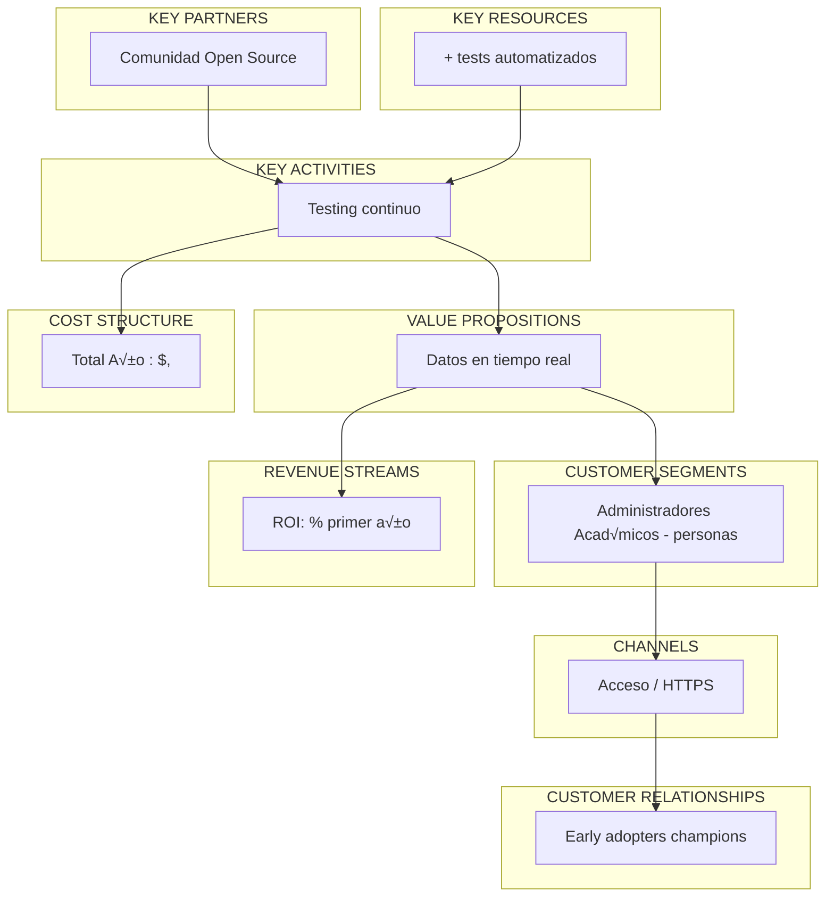

# Business Model Canvas - Sistema de Asistencia QR Criptogr√°fico
Institución: Universidad Católica del Norte - Campus Coquimbo 
Unidad: Escuela de Ingeniería 
Producto: Sistema de Toma de Asistencia con QR Din√°mico 
Fecha: de diciembre de 
---
## Canvas Completo

---
## Análisis Detallado por Sección
## 1. CUSTOMER SEGMENTS (Segmentos de Clientes)
 Segmento Primario: Profesores de Ingeniería
Perfil Demogr√°fico:
- Edad: - años
- G√nero: % masculino, % femenino
- Educación: % con postgrado (Magíster o Doctorado)
- Tecnología: Variable (% early adopters, % pragmáticos, % conservadores)
Perfil Psicogr√°fico:
- Valoración alta de eficiencia (tiempo = oro)
- Orientados a resultados acad√micos
- Preocupados por cumplimiento normativo
- Receptivos a tecnología si demuestra valor claro
Comportamiento:
- Dictan - cursos/semestre
- - sesiones/curso
- Usan sistema Hawaii diariamente
- Prefieren soluciones que "funcionen sin complicaciones"
Jobs-to-be-Done:
. Verificar asistencia de estudiantes (normativa UCN: % mínimo)
. Generar reportes para notas (asistencia = % de nota final)
. Identificar alumnos en riesgo por ausencias
. Cumplir obligaciones administrativas
---
 Segmento Secundario: Estudiantes de Ingeniería
Perfil Demogr√°fico:
- Edad: - años (promedio )
- G√nero: % masculino, % femenino
- Procedencia: % Coquimbo, % regiones cercanas
- Nivel socioecon√≥mico: Medio (% con beca/cr√dito)
Perfil Psicogr√°fico:
- Nativos digitales (nacidos -)
- Cómodos con tecnología móvil
- Valoración alta de velocidad y feedback inmediato
- Esc√pticos de sistemas "antiguos" o lentos
Comportamiento:
- % tiene smartphone (mínimo Android + o iOS +)
- Usan QR para pagos, men√∫s, transporte (familiar)
- Acceden a sistema Hawaii desde móvil % del tiempo
- Prefieren interfaces simples y visuales
Jobs-to-be-Done:
. Registrar asistencia r√°pidamente (sin interrumpir clase)
. Confirmar que quedaron presentes (evitar problemas futuros)
. No perder tiempo en procesos administrativos
. Cumplir % asistencia para aprobar
---
 Segmento Terciario: Administradores Acad√micos
Perfil Demogr√°fico:
- Edad: - años
- Rol: Jefes de carrera, secretarias acad√micas
- Experiencia: - años en UCN
Jobs-to-be-Done:
. Consolidar datos de asistencia de todos los cursos
. Generar reportes para acreditación de carreras
. Identificar alumnos en riesgo (alertas tempranas)
. Validar cumplimiento de normativa interna
---
 . VALUE PROPOSITIONS (Propuestas de Valor)
 Para Profesores:
Propuesta Principal:
> "Recupera minutos por clase mientras eliminas completamente el fraude por suplantación, con reportes automáticos y cumplimiento normativo garantizado"
Beneficios Funcionales:
- Tiempo: min a min (% reducción)
- Seguridad: QR din√°mico cambia cada seg
- Reportes: Un clic para exportar a Excel
- Cumplimiento: % trazabilidad
Beneficios Emocionales:
- Tranquilidad: "S√ que los datos son confiables"
- Satisfacción: "Tengo más tiempo para enseñar"
- Control: "Puedo ver qui√n marc√≥ y a qu√ hora"
Diferenciadores vs. Competencia:
- vs. Lista Manual: x más rápido, sin errores de transcripción
- vs. Firma en Papel: Imposible firmar por compañero
- vs. Sistemas Comerciales: Integrado con Hawaii, sin costo adicional
---
 Para Estudiantes:
Propuesta Principal:
> "Marca tu asistencia en menos de segundos con tu celular, recibe confirmación instantánea y olvídate de preocuparte si quedaste registrado"
Beneficios Funcionales:
- Velocidad: menor a segundos total
- Confirmación: Mensaje con tu nombre
- Familiar: Tecnología QR que ya usan
- Sin instalación: Funciona en navegador
Beneficios Emocionales:
- Tranquilidad: "S√ que qued√ presente"
- Comodidad: "No tuve que esperar lista manual"
- Modernidad: "Fue r√°pido y moderno"
---
 . CHANNELS (Canales)
 Canal de Descubrimiento: Talleres de Capacitación
Formato:
- Presencial en sala de profesores
- minutos por sesión
- sesiones (inicio de cada semestre)
- Máximo profesores por sesión
Contenido:
. Demo en vivo ( min)
. Casos de uso ( min)
. Pr√°ctica guiada ( min)
. Q&A ( min)
Materiales:
- Slides con screenshots
- Video tutorial minutos
- Guía rápida PDF ( página)
- Contacto de soporte
---
 Canal de Adopción: Integración en Sistema Hawaii
Ventajas:
- Sin fricción (ya están logueados)
- Single Sign-On autom√°tico
- Acceso desde men√∫ conocido
- Sin apps adicionales que instalar
Ubicación:
- Botón en main_curso.php (profesores)
- Botón en horario.php (estudiantes)
- Destacado visualmente (color verde)
---
## 1. CUSTOMER RELATIONSHIPS (Relaciones con Clientes)
 Modelo: Asistencia Personal + Self-Service
Fase : Onboarding (Primeras semanas)
- Email de bienvenida con tutorial
- Taller presencial opcional
- Soporte prioritario vía email/ticket
Fase : Uso Regular
- FAQ online con respuestas comunes
- Videos tutoriales cortos
- Early adopters como "champions" (peer support)
Fase : Mejora Continua
- Encuestas semestrales de satisfacción
- Beta testing de nuevas features
- Comunidad de usuarios (si escala)
---
 . REVENUE STREAMS (Fuentes de Ingresos)
Modelo: Servicio Interno sin Monetización Directa
Valor Generado (No Monetizado):
. Ahorro de Tiempo Docente:
  - min/clase √ó profesores √ó cursos √ó clases/curso
  - = , minutos/semestre = horas/semestre
  - = , horas/a√±o acad√mico
  - Valor: $,/año (a $/hora docente)
. Reducción de Fraude:
  - Estimado: casos/semestre evitados
  - Valor intangible: Integridad acad√mica
. Eficiencia Administrativa:
  - Reportes: horas a minutos
  - reportes/semestre √ó . horas ahorradas
  - = . horas/semestre = . horas/año
  - Valor: $,/año
Total Valor Generado: apróximadamente $,/año 
Inversión Año : $, 
ROI: % en primer año
---
 . KEY RESOURCES (Recursos Clave)
 Tecnológicos:
Stack Seleccionado:
- Backend: Fastify (x m√°s r√°pido que Express)
- Frontend: Vite (build x m√°s r√°pido que Webpack)
- Testing: Vitest (-x m√°s r√°pido que Jest)
- Database: PostgreSQL (ya existente, compartida)
- Cache: Valkey/Redis (compatible con Redis)
Justificaci√≥n T√cnica:
- Performance crítica: alumnos escaneando simultáneamente
- TypeScript nativo: Reduce bugs en producción
- Testing automatizado: + tests = confiabilidad
---
 Humaños:
Equipo Core:
- Desarrollador Full-Stack (Node.js + PHP + DevOps)
- Soporte TI UCN (infraestructura)
- Early Adopters (profesores beta testers)
Skills Clave:
- Domain-Driven Design (DDD)
- Event Storming
- Fastify + Vite ecosystem
- PostgreSQL optimization
- Testing automation
---
 Intangibles:
Conocimiento del Dominio:
- meses investigando proceso actual
- Entrevistas con profesores
- Observación de clases presenciales
- An√°lisis de sistema legacy Hawaii
Arquitectura:
- Event-Driven Design
- CQRS pattern (separación lectura/escritura)
- Bounded Contexts bien definidos
- Testing pyramid completo
---
 . KEY ACTIVITIES (Actividades Clave)
 Desarrollo (Continuo):
- Sprint planning semanal
- Daily standups (self-retrospectiva)
- Code reviews automatizados (CI/CD)
- Refactoring incremental
 Soporte (Recurrente):
- Respuesta a tickets: menor a horas
- Monitoreo de logs: Diario
- Actualizaciones de seguridad: Mensual
- Bug fixes críticos: menor a horas
 Integración (Crítico):
- Sincronización con sistema legacy Hawaii
- Validación de esquema PostgreSQL compartido
- Testing de integración continuo
- Rollback plan actualizado
---
 . KEY PARTNERSHIPS (Socios Clave)
 Escuela de Ingeniería UCN (Sponsor)
Rol: Financiamiento + Validaci√≥n acad√mica 
Contribución:
- Presupuesto para desarrollo e infraestructura
- Acceso a profesores y estudiantes para testing
- Validación de requisitos normativos
- Promoción interna del sistema
---
 Dirección de TI UCN (Infraestructura)
Rol: Hosting + Seguridad 
Contribución:
- Servidores VPS en datacenter UCN
- Cloudflare Tunnel configurado
- Respaldos autom√°ticos de base de datos
- Soporte en incidentes críticos
---
 Sistema Legacy Hawaii (Proveedor de Datos)
Rol: Fuente de verdad para cursos/estudiantes 
Dependencia Crítica:
- Esquema PostgreSQL compartido
- Sesiones PHP para autenticación
- Datos maestros (cursos, alumnos, profesores)
Riesgos:
- Cambios en legacy pueden romper integración
- Mitigación: Tests de integración + versionado
---
 . COST STRUCTURE (Estructura de Costos)
 Desglose Detallado:
Desarrollo Inicial (One-time):
```
Planificación:     horas × $ = $
Desarrollo Backend:  horas √ó $ = $,
Desarrollo Frontend:  horas √ó $ = $,
Testing PHP:      horas √ó $ = $
Integración:      horas × $ = $
           ─────────────────────
Total Desarrollo:          $,
```
Infraestructura (Anual):
```
Servidor VPS:     $/mes √ó = $
CDN/Storage:     $/mes √ó = $
           ───────────────────
Total Infraestructura:       $
```
Operación (Anual):
```
Soporte t√cnico:   h/mes √ó $ √ó = $,
Mantenimiento:    h/mes √ó $ √ó = $,
           ─────────────────────────
Total Operación:              $,
```
TOTAL AÑO : $, 
TOTAL AÑOS SIGUIENTES: $,
---
 An√°lisis FODA (Fortalezas, Oportunidades, Debilidades, Amenazas)
 Fortalezas
. Integración nativa con sistema legacy sin fricción de adopción
. Performance superior (Fastify + Vite) experiencia fluida
. Testing robusto (+ tests) alta confiabilidad
. Costo bajo ($,/año) ROI positivo en año 
 Oportunidades
. Escalamiento a otras facultades de UCN ( facultades totales)
. Expansión a otros campus (Antofagasta, Santiago)
. Analytics avanzado (predicción de ausencias con ML)
. Integración con sistema de notas y otras plataformas
 Debilidades
. Dependencia de sistema legacy Hawaii (riesgo t√cnico)
. Equipo pequeño ( desarrollador) posible cuello de botella
. Adopción voluntaria requiere evangelización activa
. Sin app nativa experiencia móvil limitada a web
 Amenazas
. Cambios en legacy pueden romper integración
. Rechazo de profesores conservadores (resistencia al cambio)
. Problemas de conectividad WiFi UCN en horas peak
. Sistemas comerciales con mayor presupuesto de marketing
---
 Estrategia de Go-to-Market
### Fase : Piloto Controlado (Enero )
- profesores early adopters
- cursos por profesor ( cursos totales)
- apróximadamente estudiantes expuestos
- Feedback intensivo semanal
M√tricas de √âxito:
- Mayor a % adopción de profesores piloto
- Mayor a % estudiantes marcan exitosamente
- incidentes críticos
- NPS mayor a /
---
### Fase : Expansión Escuela (Febrero-Marzo )
- Invitación a todos los profesores de Ingeniería ( personas)
- Talleres de capacitación quincenales
- Champions program (early adopters evangelizan)
M√tricas de √âxito:
- Mayor a % adopción en Escuela de Ingeniería
- Mayor a , registros de asistencia/semana
- Menor a % tasa de tickets de soporte
---
### Fase : Escalamiento UCN (Abril +)
- Presentación a otras facultades
- Presupuesto para expansión de infraestructura
- Contratación de soporte adicional (si es necesario)
---
 M√tricas Clave (KPIs)
 Adopción:
- % Profesores activos: Target mayor a %
- % Estudiantes con al menos registro: Target mayor a %
- Clases con sistema activo/total clases: Target mayor a %
 Performance:
- Tiempo promedio de marca: Target menor a seg
- Success rate (primer intento): Target mayor a %
- Uptime del sistema: Target mayor a %
 Satisfacción:
- NPS Profesores: Target mayor a /
- NPS Estudiantes: Target mayor a /
- Tickets de soporte/mes: Target menor a 
 Impacto:
- Tiempo ahorrado/clase: Target mayor a min
- Fraude detectado: Target casos
- Reportes generados/mes: Target mayor a 
---
 Conclusión
Viabilidad del Modelo: ALTA
Justificación:
. Problema Real: Validado con profesores (p√rdida de tiempo confirmada)
. Soluci√≥n T√cnica: Factible con stack moderno y probado
. ROI Positivo: $, valor generado vs. $, inversión = % ROI
. Escalabilidad: Modelo puede expandirse a facultades (x crecimiento)
. Sostenibilidad: Costos operativos bajos ($,/año) cubiertos por Escuela
Recomendación: PROCEDER con piloto controlado en Enero 
---
Creado por: Equipo de Desarrollo UCN Coquimbo 
Revisado por: Escuela de Ingeniería 
Fecha: de diciembre de  
Próxima Revisión: Post-piloto (Febrero )
