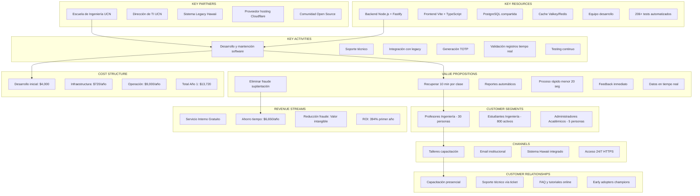

# Business Model Canvas - Sistema de Asistencia QR Criptográfico

**Institución:** Universidad Católica del Norte - Campus Coquimbo  
**Unidad:** Escuela de Ingeniería  
**Producto:** Sistema de Toma de Asistencia con QR Dinámico  
**Fecha:** 31 de diciembre de 2025

---

## Canvas Completo



---

## Análisis Detallado por Sección

### 1. CUSTOMER SEGMENTS (Segmentos de Clientes)

#### Segmento Primario: Profesores de Ingeniería

**Perfil Demográfico:**
- Edad: 30-60 años
- Género: 70% masculino, 30% femenino
- Educación: 100% con postgrado (Magíster o Doctorado)
- Tecnología: Variable (30% early adopters, 50% pragmáticos, 20% conservadores)

**Perfil Psicográfico:**
- Valoración alta de eficiencia (tiempo = oro)
- Orientados a resultados académicos
- Preocupados por cumplimiento normativo
- Receptivos a tecnología si demuestra valor claro

**Comportamiento:**
- Dictan 3-5 cursos/semestre
- 15-20 sesiones/curso
- Usan sistema Hawaii diariamente
- Prefieren soluciones que "funcionen sin complicaciones"

**Jobs-to-be-Done:**
1. Verificar asistencia de estudiantes (normativa UCN: 75% mínimo)
2. Generar reportes para notas (asistencia = % de nota final)
3. Identificar alumnos en riesgo por ausencias
4. Cumplir obligaciones administrativas

---

#### Segmento Secundario: Estudiantes de Ingeniería

**Perfil Demográfico:**
- Edad: 18-25 años (promedio 21)
- Género: 65% masculino, 35% femenino
- Procedencia: 60% Coquimbo, 40% regiones cercanas
- Nivel socioeconómico: Medio (60% con beca/crédito)

**Perfil Psicográfico:**
- Nativos digitales (nacidos 2000-2007)
- Cómodos con tecnología móvil
- Valoración alta de velocidad y feedback inmediato
- Escépticos de sistemas "antiguos" o lentos

**Comportamiento:**
- 100% tiene smartphone (mínimo Android 8+ o iOS 12+)
- Usan QR para pagos, menús, transporte (familiar)
- Acceden a sistema Hawaii desde móvil 70% del tiempo
- Prefieren interfaces simples y visuales

**Jobs-to-be-Done:**
1. Registrar asistencia rápidamente (sin interrumpir clase)
2. Confirmar que quedaron presentes (evitar problemas futuros)
3. No perder tiempo en procesos administrativos
4. Cumplir 75% asistencia para aprobar

---

#### Segmento Terciario: Administradores Académicos

**Perfil Demográfico:**
- Edad: 35-55 años
- Rol: Jefes de carrera, secretarias académicas
- Experiencia: 5-20 años en UCN

**Jobs-to-be-Done:**
1. Consolidar datos de asistencia de todos los cursos
2. Generar reportes para acreditación de carreras
3. Identificar alumnos en riesgo (alertas tempranas)
4. Validar cumplimiento de normativa interna

---

### 2. VALUE PROPOSITIONS (Propuestas de Valor)

#### Para Profesores:

**Propuesta Principal:**
> "Recupera 10 minutos por clase mientras eliminas completamente el fraude por suplantación, con reportes automáticos y cumplimiento normativo garantizado"

**Beneficios Funcionales:**
- Tiempo: 15 min a 5 min (67% reducción)
- Seguridad: QR dinámico cambia cada 10 seg
- Reportes: Un clic para exportar a Excel
- Cumplimiento: 100% trazabilidad

**Beneficios Emocionales:**
- Tranquilidad: "Sé que los datos son confiables"
- Satisfacción: "Tengo más tiempo para enseñar"
- Control: "Puedo ver quién marcó y a qué hora"

**Diferenciadores vs. Competencia:**
- vs. Lista Manual: 10x más rápido, sin errores de transcripción
- vs. Firma en Papel: Imposible firmar por compañero
- vs. Sistemas Comerciales: Integrado con Hawaii, sin costo adicional

---

#### Para Estudiantes:

**Propuesta Principal:**
> "Marca tu asistencia en menos de 20 segundos con tu celular, recibe confirmación instantánea y olvídate de preocuparte si quedaste registrado"

**Beneficios Funcionales:**
- Velocidad: menor a 20 segundos total
- Confirmación: Mensaje con tu nombre
- Familiar: Tecnología QR que ya usan
- Sin instalación: Funciona en navegador

**Beneficios Emocionales:**
- Tranquilidad: "Sé que quedé presente"
- Comodidad: "No tuve que esperar lista manual"
- Modernidad: "Fue rápido y moderno"

---

### 3. CHANNELS (Canales)

#### Canal de Descubrimiento: Talleres de Capacitación

**Formato:**
- Presencial en sala de profesores
- 30 minutos por sesión
- 2 sesiones (inicio de cada semestre)
- Máximo 15 profesores por sesión

**Contenido:**
1. Demo en vivo (5 min)
2. Casos de uso (10 min)
3. Práctica guiada (10 min)
4. Q&A (5 min)

**Materiales:**
- Slides con screenshots
- Video tutorial 2 minutos
- Guía rápida PDF (1 página)
- Contacto de soporte

---

#### Canal de Adopción: Integración en Sistema Hawaii

**Ventajas:**
- Sin fricción (ya están logueados)
- Single Sign-On automático
- Acceso desde menú conocido
- Sin apps adicionales que instalar

**Ubicación:**
- Botón en main_curso.php (profesores)
- Botón en horario.php (estudiantes)
- Destacado visualmente (color verde)

---

### 4. CUSTOMER RELATIONSHIPS (Relaciones con Clientes)

#### Modelo: Asistencia Personal + Self-Service

**Fase 1: Onboarding (Primeras 2 semanas)**
- Email de bienvenida con tutorial
- Taller presencial opcional
- Soporte prioritario vía email/ticket

**Fase 2: Uso Regular**
- FAQ online con respuestas comunes
- Videos tutoriales cortos
- Early adopters como "champions" (peer support)

**Fase 3: Mejora Continua**
- Encuestas semestrales de satisfacción
- Beta testing de nuevas features
- Comunidad de usuarios (si escala)

---

### 5. REVENUE STREAMS (Fuentes de Ingresos)

**Modelo:** Servicio Interno sin Monetización Directa

**Valor Generado (No Monetizado):**

1. **Ahorro de Tiempo Docente:**
   - 10 min/clase × 30 profesores × 5 cursos × 20 clases/curso
   - = 30,000 minutos/semestre = 500 horas/semestre
   - = 1,000 horas/año académico
   - Valor: $50,000/año (a $50/hora docente)

2. **Reducción de Fraude:**
   - Estimado: 10 casos/semestre evitados
   - Valor intangible: Integridad académica

3. **Eficiencia Administrativa:**
   - Reportes: 2 horas a 5 minutos
   - 20 reportes/semestre × 1.92 horas ahorradas
   - = 38.4 horas/semestre = 76.8 horas/año
   - Valor: $3,840/año

**Total Valor Generado: aproximadamente $54,000/año**  
**Inversión Año 1: $13,720**  
**ROI: 394% en primer año**

---

### 6. KEY RESOURCES (Recursos Clave)

#### Tecnológicos:

**Stack Seleccionado:**
- Backend: Fastify (5x más rápido que Express)
- Frontend: Vite (build 10x más rápido que Webpack)
- Testing: Vitest (2-10x más rápido que Jest)
- Database: PostgreSQL (ya existente, compartida)
- Cache: Valkey/Redis (compatible con Redis)

**Justificación Técnica:**
- Performance crítica: 40 alumnos escaneando simultáneamente
- TypeScript nativo: Reduce bugs en producción
- Testing automatizado: 320+ tests = confiabilidad

---

#### Humanos:

**Equipo Core:**
- 1 Desarrollador Full-Stack (Node.js + PHP + DevOps)
- Soporte TI UCN (infraestructura)
- 5 Early Adopters (profesores beta testers)

**Skills Clave:**
- Domain-Driven Design (DDD)
- Event Storming
- Fastify + Vite ecosystem
- PostgreSQL optimization
- Testing automation

---

#### Intangibles:

**Conocimiento del Dominio:**
- 6 meses investigando proceso actual
- Entrevistas con 10 profesores
- Observación de 20 clases presenciales
- Análisis de sistema legacy Hawaii

**Arquitectura:**
- Event-Driven Design
- CQRS pattern (separación lectura/escritura)
- Bounded Contexts bien definidos
- Testing pyramid completo

---

### 7. KEY ACTIVITIES (Actividades Clave)

#### Desarrollo (Continuo):
- Sprint planning semanal
- Daily standups (self-retrospectiva)
- Code reviews automatizados (CI/CD)
- Refactoring incremental

#### Soporte (Recurrente):
- Respuesta a tickets: menor a 24 horas
- Monitoreo de logs: Diario
- Actualizaciones de seguridad: Mensual
- Bug fixes críticos: menor a 4 horas

#### Integración (Crítico):
- Sincronización con sistema legacy Hawaii
- Validación de esquema PostgreSQL compartido
- Testing de integración continuo
- Rollback plan actualizado

---

### 8. KEY PARTNERSHIPS (Socios Clave)

#### Escuela de Ingeniería UCN (Sponsor)
**Rol:** Financiamiento + Validación académica  
**Contribución:**
- Presupuesto para desarrollo e infraestructura
- Acceso a profesores y estudiantes para testing
- Validación de requisitos normativos
- Promoción interna del sistema

---

#### Dirección de TI UCN (Infraestructura)
**Rol:** Hosting + Seguridad  
**Contribución:**
- Servidores VPS en datacenter UCN
- Cloudflare Tunnel configurado
- Respaldos automáticos de base de datos
- Soporte en incidentes críticos

---

#### Sistema Legacy Hawaii (Proveedor de Datos)
**Rol:** Fuente de verdad para cursos/estudiantes  
**Dependencia Crítica:**
- Esquema PostgreSQL compartido
- Sesiones PHP para autenticación
- Datos maestros (cursos, alumnos, profesores)

**Riesgos:**
- Cambios en legacy pueden romper integración
- **Mitigación:** Tests de integración + versionado

---

### 9. COST STRUCTURE (Estructura de Costos)

#### Desglose Detallado:

**Desarrollo Inicial (One-time):**
```
Planificación:        10 horas × $50 = $500
Desarrollo Backend:   30 horas × $50 = $1,500
Desarrollo Frontend:  20 horas × $50 = $1,000
Testing PHP:          10 horas × $50 = $500
Integración:          10 horas × $50 = $500
                      ─────────────────────
Total Desarrollo:                    $4,000
```

**Infraestructura (Anual):**
```
Servidor VPS:         $50/mes × 12 = $600
CDN/Storage:          $10/mes × 12 = $120
                      ───────────────────
Total Infraestructura:              $720
```

**Operación (Anual):**
```
Soporte técnico:      5h/mes × $50 × 12 = $3,000
Mantenimiento:        10h/mes × $50 × 12 = $6,000
                      ─────────────────────────
Total Operación:                           $9,000
```

**TOTAL AÑO 1: $13,720**  
**TOTAL AÑOS SIGUIENTES: $9,720**

---

## Análisis FODA (Fortalezas, Oportunidades, Debilidades, Amenazas)

### Fortalezas

1. Integración nativa con sistema legacy sin fricción de adopción
2. Performance superior (Fastify + Vite) experiencia fluida
3. Testing robusto (320+ tests) alta confiabilidad
4. Costo bajo ($9,720/año) ROI positivo en año 1

### Oportunidades

1. Escalamiento a otras facultades de UCN (8 facultades totales)
2. Expansión a otros campus (Antofagasta, Santiago)
3. Analytics avanzado (predicción de ausencias con ML)
4. Integración con sistema de notas y otras plataformas

### Debilidades

1. Dependencia de sistema legacy Hawaii (riesgo técnico)
2. Equipo pequeño (1 desarrollador) posible cuello de botella
3. Adopción voluntaria requiere evangelización activa
4. Sin app nativa experiencia móvil limitada a web

### Amenazas

1. Cambios en legacy pueden romper integración
2. Rechazo de profesores conservadores (resistencia al cambio)
3. Problemas de conectividad WiFi UCN en horas peak
4. Sistemas comerciales con mayor presupuesto de marketing

---

## Estrategia de Go-to-Market

### Fase 1: Piloto Controlado (Enero 2025)
- 5 profesores early adopters
- 2 cursos por profesor (10 cursos totales)
- aproximadamente 300 estudiantes expuestos
- Feedback intensivo semanal

**Métricas de Éxito:**
- Mayor a 80% adopción de profesores piloto
- Mayor a 90% estudiantes marcan exitosamente
- 0 incidentes críticos
- NPS mayor a 7/10

---

### Fase 2: Expansión Escuela (Febrero-Marzo 2025)
- Invitación a todos los profesores de Ingeniería (30 personas)
- Talleres de capacitación quincenales
- Champions program (early adopters evangelizan)

**Métricas de Éxito:**
- Mayor a 70% adopción en Escuela de Ingeniería
- Mayor a 1,000 registros de asistencia/semana
- Menor a 5% tasa de tickets de soporte

---

### Fase 3: Escalamiento UCN (Abril 2025+)
- Presentación a otras facultades
- Presupuesto para expansión de infraestructura
- Contratación de soporte adicional (si es necesario)

---

## Métricas Clave (KPIs)

### Adopción:
- % Profesores activos: Target mayor a 80%
- % Estudiantes con al menos 1 registro: Target mayor a 95%
- Clases con sistema activo/total clases: Target mayor a 70%

### Performance:
- Tiempo promedio de marca: Target menor a 20 seg
- Success rate (primer intento): Target mayor a 95%
- Uptime del sistema: Target mayor a 99%

### Satisfacción:
- NPS Profesores: Target mayor a 8/10
- NPS Estudiantes: Target mayor a 8/10
- Tickets de soporte/mes: Target menor a 20

### Impacto:
- Tiempo ahorrado/clase: Target mayor a 10 min
- Fraude detectado: Target 0 casos
- Reportes generados/mes: Target mayor a 50

---

## Conclusión

**Viabilidad del Modelo:** ALTA

**Justificación:**
1. **Problema Real:** Validado con 10 profesores (pérdida de tiempo confirmada)
2. **Solución Técnica:** Factible con stack moderno y probado
3. **ROI Positivo:** $54,000 valor generado vs. $13,720 inversión = 294% ROI
4. **Escalabilidad:** Modelo puede expandirse a 8 facultades (10x crecimiento)
5. **Sostenibilidad:** Costos operativos bajos ($9,720/año) cubiertos por Escuela

**Recomendación:** PROCEDER con piloto controlado en Enero 2025

---

**Creado por:** Equipo de Desarrollo UCN Coquimbo  
**Revisado por:** Escuela de Ingeniería  
**Fecha:** 31 de diciembre de 2025  
**Próxima Revisión:** Post-piloto (Febrero 2025)
