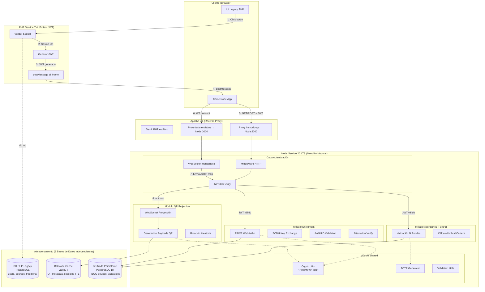
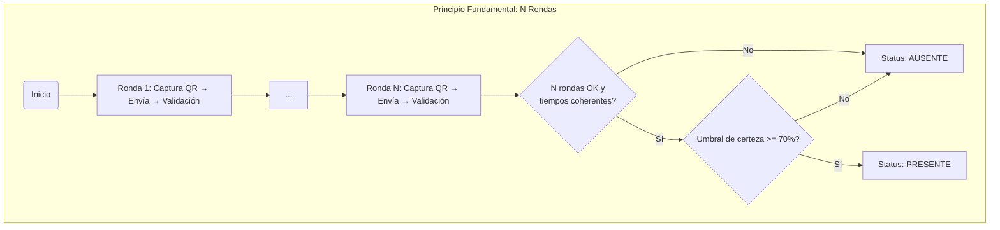

# Arquitectura General - Sistema de Asistencia Criptográfica

**Versión:** 2.0  
**Fecha actualización:** 2025-11-03  
**Estado:** Documento actualizado con arquitectura JWT implementada

---

## Resumen Ejecutivo

Sistema de validación de asistencia mediante autenticación criptográfica multi-ronda:

- **JWT:** PHP emite tokens, Node valida (separación de responsabilidades)
- **WebSocket seguro:** Autenticación JWT obligatoria (Opción 5B)
- **FIDO2/WebAuthn:** Device binding para enrollment
- **ECDH:** Key exchange sin transmitir claves
- **N QR por alumno:** N rondas de validación con tiempos de respuesta
- **Rotación aleatoria:** Todos los QR en pantalla rotan

Objetivo: Eliminar fraude mediante validación de presencia física con umbral probabilístico.

---

## Arquitectura Completa con JWT



**Notas clave:**

- **Apache Reverse Proxy:** Rutea `/minodo-api/*` y `/asistencia/ws` a Node
- **JWT unidireccional:** PHP emite (postMessage), Node valida (no emite)
- **WebSocket auth:** Primer mensaje debe ser `{type: 'AUTH', token: '...'}`
- **Códigos cierre:** 4401 (no auth), 4403 (invalid), 4408 (timeout)
- **3 Bases de Datos Independientes:**
  - BD PHP Legacy: Gestiona usuarios, cursos, asistencia tradicional (acceso via db.inc)
  - BD Node Cache (Valkey): Metadatos QR temporales, sessions (TTL)
  - BD Node Persistente: Dispositivos FIDO2, validaciones criptográficas
- **Sin acceso cross-database directo:** Comunicación entre PHP-Node solo via HTTP endpoints con JWT interno
- **Referencia completa:** Ver [08-arquitectura-datos.md](08-arquitectura-datos.md) para detalles de arquitectura de datos

---

## Principio Fundamental: N Rondas



**Importante:** Cada ronda genera un QR completamente NUEVO:

- Nuevo TOTPs (basado en timestamp actual + ronda)
- Nuevo nonce aleatorio
- Nuevo timestamp_envio
- Metadata separada en Valkey: `qr:session:{sessionId}:{userId}:{round}`

NO se reutiliza el mismo QR entre rondas. Esto previene replay attacks y permite validación estadística independiente por ronda.

**Seguridad:** Atacante debe acertar N payloads + tiempos realistas consecutivos.

---

## Capa de Autenticación JWT (Implementada)

### Emisión JWT (PHP Service)

```php
// php-service/src/lib/jwt.php
class JWT {
    public static function encode($payload) {
        $header = base64url_encode(json_encode([
            'typ' => 'JWT',
            'alg' => 'HS256'
        ]));
        
        $payload_encoded = base64url_encode(json_encode($payload));
        $signature = hash_hmac('sha256', 
            "$header.$payload_encoded", 
            JWT_SECRET, 
            true
        );
        
        return "$header.$payload_encoded." . base64url_encode($signature);
    }
}

// Payload estándar
$payload = [
    'userId' => $user_id,
    'username' => $username,
    'nombreCompleto' => $nombre_completo,
    'rol' => $rol, // 'profesor' o 'alumno'
    'iat' => time(),
    'exp' => time() + 300, // TTL: 5 minutos
    'iss' => 'php-service',
    'aud' => 'node-service'
];
```

### Validación JWT (Node Service)

```typescript
// node-service/src/shared/config/index.ts
export class JWTUtils {
  static verify(token: string): AuthenticatedUser {
    const [header, payload, signature] = token.split('.');
    
    // Verificar firma
    const expectedSig = crypto
      .createHmac('sha256', JWT_SECRET)
      .update(`${header}.${payload}`)
      .digest('base64url');
      
    if (signature !== expectedSig) {
      throw new Error('Invalid signature');
    }
    
    // Decodificar payload
    const decoded = JSON.parse(
      Buffer.from(payload, 'base64url').toString()
    );
    
    // Validar expiración
    if (decoded.exp < Math.floor(Date.now() / 1000)) {
      throw new Error('Token expired');
    }
    
    return {
      userId: decoded.userId,
      username: decoded.username,
      rol: decoded.rol
    };
  }
}
```

### Uso en HTTP (Middleware Fastify)

```typescript
// Middleware de autenticación
fastify.addHook('onRequest', async (request, reply) => {
  const authHeader = request.headers.authorization;
  
  if (!authHeader || !authHeader.startsWith('Bearer ')) {
    reply.code(401).send({ error: 'No authorization header' });
    return;
  }
  
  try {
    const token = authHeader.substring(7);
    const user = JWTUtils.verify(token);
    request.user = user; // Inyectar en request
  } catch (error) {
    reply.code(403).send({ error: 'Invalid token' });
  }
});
```

### Uso en WebSocket (Handshake)

```typescript
// Primer mensaje DEBE ser AUTH
ws.on('message', async (data) => {
  const message = JSON.parse(data.toString());
  
  if (!isAuthenticated && message.type !== 'AUTH') {
    ws.close(4401, 'Authentication required');
    return;
  }
  
  if (message.type === 'AUTH') {
    try {
      const user = JWTUtils.verify(message.token);
      isAuthenticated = true;
      
      ws.send(JSON.stringify({
        type: 'auth-ok',
        payload: {
          userId: user.userId,
          username: user.username
        }
      }));
      
      // Continuar con proyección QR
      startProjection();
      
    } catch (error) {
      ws.close(4403, 'Invalid token');
    }
  }
});

// Timeout de 5 segundos
setTimeout(() => {
  if (!isAuthenticated) {
    ws.close(4408, 'Authentication timeout');
  }
}, 5000);
```

**Referencia completa:** Ver [10-guia-integracion-php-node.md](../10-guia-integracion-php-node.md)

---

## Stack Tecnológico

| Componente | Tecnología | Versión | Puerto |
|------------|------------|---------|--------|
| Emisor JWT | PHP + Apache | 7.4 / 2.4 | 9500 |
| Backend Monolito | Node.js + TypeScript | 20 LTS | 3000 |
| Cache | Valkey | 7 Alpine | 6379 |
| Base de Datos | PostgreSQL | 18 | 5432 |

Criptografía principal: ECDSA P-256 (FIDO2), ECDH P-256 (intercambio de claves), HKDF-SHA256 (derivación), TOTP (RFC 6238), AES-256-GCM (cifrado de payloads).

---

## Arquitectura de Datos: 3 Bases de Datos Independientes

El sistema utiliza una arquitectura de datos distribuida con **tres bases de datos completamente independientes**:

### BD PHP Legacy (PostgreSQL)

- **Propósito:** Sistema de gestión académica existente
- **Contenido:** Usuarios, profesores, cursos, inscripciones, asistencia tradicional
- **Acceso:** Solo PHP Service mediante funciones `db.inc`
- **Ejemplos:** `get_usuario_actual()`, `get_cursos_profesor()`, `get_inscritos_curso()`
- **Ubicación:** Servidor de producción PHP (fuera del contenedor de desarrollo)

### BD Node Cache (Valkey/Redis)

- **Propósito:** Almacenamiento temporal de alto rendimiento
- **Contenido:** Metadatos QR, sessions WebSocket, cache de consultas a PHP
- **TTL:** 30-600 segundos según tipo de dato
- **Patrones de claves:**
  - `qr:session:<sessionId>:<userId>:<round>` - Metadata QR activos
  - `cache:php:user:<userId>` - Cache datos usuario (300s)
  - `cache:php:course:<courseId>` - Cache datos curso (600s)
  - `ws:auth:<connectionId>` - Sesiones WebSocket (60s)

### BD Node Persistente (PostgreSQL)

- **Propósito:** Almacenamiento persistente del módulo Node
- **Contenido:** Dispositivos FIDO2, validaciones criptográficas, resultados de asistencia
- **Schemas:** `enrollment`, `attendance`
- **Backups:** Diarios automáticos
- **Tablas principales:** `devices`, `sessions`, `registrations`, `validations`, `results`

### Principio: Sin Acceso Cross-Database Directo

**Regla fundamental:** Node **NO** puede consultar directamente BD PHP Legacy.

**Comunicación PHP ↔ Node:**

1. Node necesita datos de PHP → HTTP request a endpoint PHP con JWT interno
2. PHP consulta su propia BD usando `db.inc`
3. PHP retorna JSON a Node
4. Node cachea respuesta en Valkey (TTL apropiado)

**Ejemplo de flujo:**

```typescript
// Node necesita datos de un curso
const courseData = await PHPLegacyClient.getCourse(courseId);
// PHPLegacyClient internamente:
// 1. Genera JWT_INTERNAL con JWT_SECRET_INTERNAL
// 2. POST https://php-service/api/get_curso.php
// 3. PHP ejecuta: $curso = get_curso($courseId) via db.inc
// 4. PHP retorna JSON
// 5. Node cachea en Valkey: cache:php:course:<courseId> (TTL 600s)
```

**Ver documentación completa:** [08-arquitectura-datos.md](08-arquitectura-datos.md)

---

## Flujo General

### Fase 0: Enrolamiento (una vez por dispositivo)

1. WebAuthn genera par ECDSA P-256 (clave privada en secure enclave).
2. Cliente envía: credentialId + publicKey + attestation.
3. Servidor valida AAGUID + attestation certificate.
4. Deriva handshake_secret = HKDF(credentialId + userId + MASTER).
5. Almacena: {userId, credentialId, publicKey, handshake_secret, AAGUID}.

### Fase 1: Login (ECDH Key Exchange)

1. Cliente genera par efímero ECDH (privKey_c, pubKey_c) y envía pubKey_c + WebAuthn assertion.
2. Servidor valida assertion y genera par efímero ECDH (privKey_s, pubKey_s).
3. Ambos derivan shared_secret via ECDH y session_key via HKDF(shared_secret).
4. Servidor genera TOTPu = TOTP(handshake_secret) y retorna {pubKey_s, TOTPu}.

Resultado: Cliente y servidor comparten session_key sin transmitirla; se usará para cifrar/descifrar payloads.

### Fase 2: Anuncio de Participación

1. Alumno → PHP: Participar en sesión X.
2. PHP → Enrolamiento: verificar userId enrolado.
3. Si OK → PHP → Asistencia: {userId, sessionId}. Asistencia registra y encola payload_R1 para el alumno.

### Fase 3: Generación de Payload QR

Payload por ronda (solo ejemplo):

```json
{
  "secreto": "AES_encrypt(TOTPs + nonce, server_key)",
  "userId": 123,
  "dataActividad": {"profesor": "Dr. Smith", "horario": "14:00-16:00", "sala": "A-201", "curso": "Estructura de Datos", "semestre": "2025-2"},
  "TOTPs": "485926",
  "ronda": 1
}
```

Metadatos (servidor):

- timestamp_envio_qr = Date.now() (no viaja en el QR)
- Almacenar en Valkey: `qr:session:<userId>:<ronda> -> { userId, ronda, timestamp_envio, mostrado_count, intentos_fallidos, valido }` (TTL 2 min)
- Añadir a cola: `proyeccion:session -> payload`

### Fase 4: Rotación Aleatoria en Pantalla

WebSocket proyecta cada 500ms de manera aleatoria los QR activos. Por cada QR mostrado:

- Incrementa mostrado_count
- Si mostrado_count > MAX_DISPLAYS (p.ej. 10): enviar aviso al alumno para reintentar
- Si QR validado: remover de cola; si ronda < N, generar siguiente payload

### Fase 5: Captura y Desencriptación (Cliente)

El cliente escanea continuamente. Para cada QR detectado:

1. Decodifica QR → obtiene payload cifrado.
2. Intenta descifrar con session_key.
3. Si descifra: verificar que payload.userId sea propio; si no, descartar.
4. Si no descifra: descartar.

### Fase 6: Envío de Respuesta (Cliente → Servidor)

Respuesta cifrada con session_key (ejemplo):

```json
{
  "secreto": "encrypted_nonce",
  "userId": 123,
  "dataActividad": {"profesor": "Dr. Smith", "horario": "14:00-16:00", "sala": "A-201", "curso": "Estructura de Datos", "semestre": "2025-2"},
  "TOTPs": "485926",
  "ronda": 1,
  "timestamp_enviado": 1730546400000,
  "TOTPu": "192837",
  "metadatos": {"latencia_red_mbps": 10.0, "device_info": "Mozilla/5.0 ..."}
}
```

### Fase 7: Validación (Servidor)

1. Descifrar response con session_key.
2. Validar TOTPu (sesión vigente) y TOTPs (QR legítimo).
3. Recuperar qr_metadata de Valkey.
4. Calcular RT = timestamp_enviado - timestamp_envio_qr y validar rango (500ms – 15s).
5. Validar secreto descifrado contra nonce/servidor.
6. Si válido:
   - Registrar RT de la ronda e intentos_fallidos = 0.
   - Si ronda < N: generar siguiente payload, encolar y responder success con ronda_siguiente.
   - Si ronda == N: calcular umbral_certeza; si >= 70% → PRESENTE, si no → AUSENTE.
7. Si inválido:
   - intentos_fallidos++.
   - Si < MAX (p.ej. 3): mantener mismo QR y responder reintentar.
   - Si ≥ MAX: retirar de cola y responder ERROR_MAX_INTENTOS.

### Fase 8: Cálculo de Umbral de Certeza

Dado RT_array = [RT1, RT2, ..., RTn]:

- avg_RT = mean(RT_array)
- std_dev = std(RT_array)
- min_RT = min(RT_array)
- max_RT = max(RT_array)

Reglas ejemplo:

- std_dev < 500ms y 800 < avg_RT < 3000 → 95% PRESENTE
- std_dev < 1000ms y 500 < avg_RT < 5000 → 70% PROBABLE_PRESENTE
- std_dev < 2000ms y 300 < avg_RT < 8000 → 50% DUDOSO
- Caso contrario → 20% AUSENTE

Registrar en BD: {userId, sessionId, rondas: RT_array, certainty, status}.

---

## Seguridad

### Vectores de Ataque Mitigados

| Ataque | Mitigación |
|--------|------------|
| Captura de pantalla | N rondas + tiempos realistas |
| Replay attack | TOTPs one-time + Valkey anti-replay |
| Suplantación | Device binding FIDO2 + AAGUID |
| Compartir cuenta | Delay exponencial + attestation tracking |
| Transmisión diferida | Validación de RT (<15s) + umbral estadístico |
| Bot/script | N rondas + std_dev coherente |
| MITM | ECDH key exchange + AES-GCM |
| Session hijacking | TOTPu vinculado a handshake_secret |

### Criptografía sin transmitir claves

```text
ECDH Key Exchange:
  Cliente: privKey_c (nunca sale)
  Servidor: privKey_s (nunca sale)

  Ambos derivan: shared_secret = ECDH(privKey_local, pubKey_remota)
  Ambos derivan: session_key = HKDF(shared_secret)

  session_key NUNCA viaja por red.

Único dato que viaja adicionalmente: TOTPu (6 dígitos, 30s de validez)
```

---

## Control de Dispositivos

### Anti-Compartir

Cada validación verifica:

- TOTPu basado en handshake_secret único por device
- AAGUID consistente (mismo autenticador)
- Attestation certificate válido
- Credential estable

Detección y penalización:

- AAGUID diferente → nuevo device → penalización
- Múltiples devices activos → alerta + restricción

Escala de penalización de enrolamiento:

- Device 1: 0 min delay
- Device 2: 5 min delay
- Device 3: 30 min delay
- Device 4+: Exponencial (máx 24h)

---

## Escalabilidad

| Métrica | MVP | Objetivo |
|---------|-----|----------|
| Alumnos concurrentes | 50 | 200 |
| QR rotando simultáneos | 50 | 200 |
| Rotación | 500ms | 500ms |
| Rondas por alumno | 3 | 3–5 |
| Latencia validación | <500ms | <300ms |

---

## Configuración

### Variables de Entorno

```bash
# Node Service (Monolito Modular)
NODE_ENV=production
SERVER_MASTER_SECRET=<rotable>
ENCRYPTION_KEY=<derived>
PORT=3000
JWT_SECRET=<secret_shared_with_php>

# Base de Datos
DB_HOST=postgres
DB_PORT=5432
DB_USER=asistencia
DB_PASSWORD=<secret>
DB_NAME=asistencia_db

# Cache
VALKEY_HOST=valkey
VALKEY_PORT=6379

# PHP Service (Emisor JWT)
PHP_HOST=php-service
PHP_PORT=9500
JWT_SECRET=<secret_shared_with_node>
```

### Esquemas de Base de Datos

```sql
-- Schema: enrollment
CREATE SCHEMA IF NOT EXISTS enrollment;

CREATE TABLE IF NOT EXISTS enrollment.devices (
  device_id SERIAL PRIMARY KEY,
  user_id INTEGER NOT NULL,
  credential_id TEXT UNIQUE NOT NULL,
  public_key TEXT NOT NULL,
  handshake_secret TEXT NOT NULL,
  aaguid TEXT NOT NULL,
  device_fingerprint TEXT NOT NULL,
  enrolled_at TIMESTAMP DEFAULT NOW(),
  is_active BOOLEAN DEFAULT TRUE
);

-- Schema: attendance (Tercera Forma Normal - FN3)
CREATE SCHEMA IF NOT EXISTS attendance;

CREATE TABLE IF NOT EXISTS attendance.sessions (
  session_id SERIAL PRIMARY KEY,
  professor_id INTEGER NOT NULL,
  professor_name TEXT NOT NULL,
  course_code TEXT NOT NULL,
  course_name TEXT NOT NULL,
  room TEXT NOT NULL,
  semester TEXT NOT NULL,
  start_time TIMESTAMP NOT NULL,
  end_time TIMESTAMP,
  max_rounds INTEGER DEFAULT 3,
  status TEXT DEFAULT 'active'
);

CREATE TABLE IF NOT EXISTS attendance.registrations (
  registration_id SERIAL PRIMARY KEY,
  session_id INTEGER REFERENCES attendance.sessions(session_id),
  user_id INTEGER NOT NULL,
  device_id INTEGER REFERENCES enrollment.devices(device_id),
  queue_position INTEGER NOT NULL,
  registered_at TIMESTAMP DEFAULT NOW(),
  status TEXT DEFAULT 'active',
  UNIQUE(session_id, user_id)
);

CREATE TABLE IF NOT EXISTS attendance.validations (
  validation_id SERIAL PRIMARY KEY,
  registration_id INTEGER REFERENCES attendance.registrations(registration_id),
  round_number INTEGER NOT NULL,
  qr_generated_at TIMESTAMP NOT NULL,
  response_time_ms INTEGER,
  totpu_valid BOOLEAN,
  totps_valid BOOLEAN,
  validation_status TEXT,
  created_at TIMESTAMP DEFAULT NOW(),
  UNIQUE(registration_id, round_number)
);

CREATE TABLE IF NOT EXISTS attendance.results (
  result_id SERIAL PRIMARY KEY,
  registration_id INTEGER REFERENCES attendance.registrations(registration_id),
  total_rounds INTEGER NOT NULL,
  successful_rounds INTEGER NOT NULL,
  avg_response_time_ms FLOAT,
  std_dev_response_time FLOAT,
  certainty_score FLOAT NOT NULL,
  final_status TEXT NOT NULL,  -- 'PRESENT', 'ABSENT', 'DOUBTFUL', 'ERROR'
  calculated_at TIMESTAMP DEFAULT NOW(),
  UNIQUE(registration_id)
);
```

---

## Próximos Documentos

1. 02-componentes-criptograficos.md — FIDO2, ECDH, TOTP, AES detallado
2. 03-flujo-enrolamiento.md — Registro de dispositivos paso a paso
3. 04-flujo-asistencia.md — Proceso completo N rondas
4. 05-esquema-base-datos.md — Tablas completas con índices
5. 06-diagramas-secuencia.md — Diagramas Mermaid interactivos completos
6. 07-decisiones-arquitectonicas.md — Por qué ECDH, por qué N rondas
7. 08-plan-implementacion.md — Roadmap por fases

---

Versión: 3.1 (Monolito Modular — Arquitectura Limpia)

Fecha: 2025-11-02

Cambios:

- Documento limpiado y reorganizado (removidas redundancias, bloques corruptos y mezcla de formatos)
- Arquitectura de monolito modular (vertical slicing)
- Diagramas en Mermaid y tablas estandarizadas
- Sin código de implementación; enfoque en planificación (QUÉ, POR QUÉ, CÓMO, DÓNDE)
