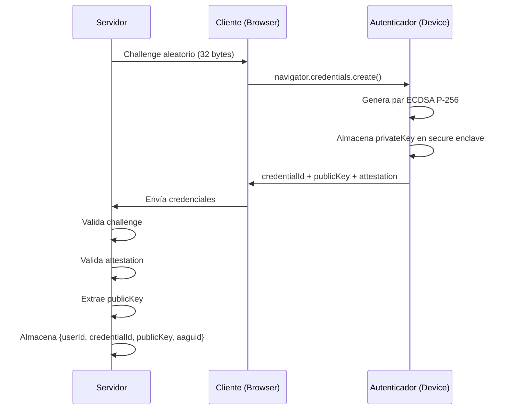
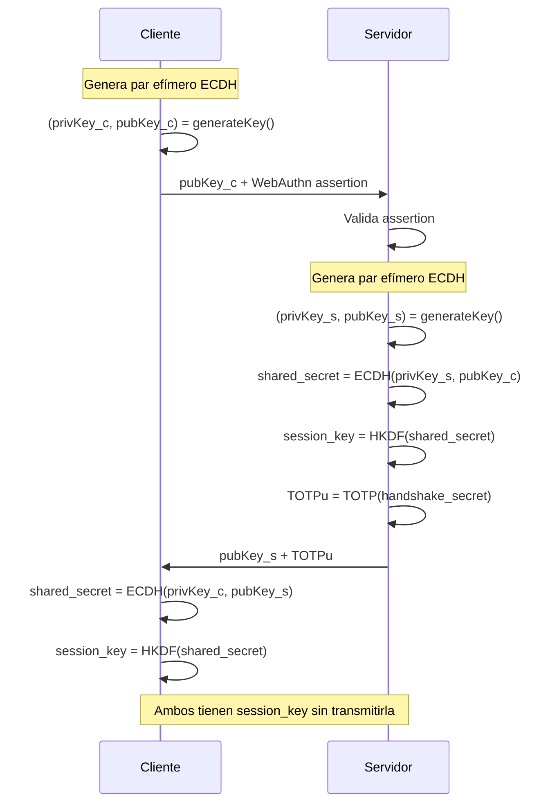
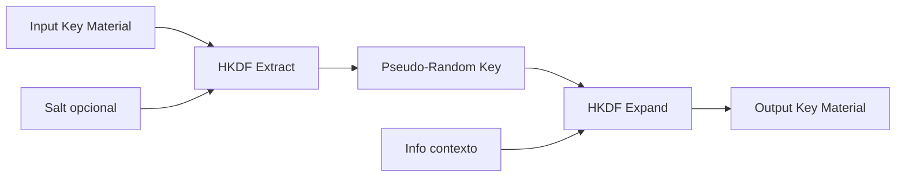
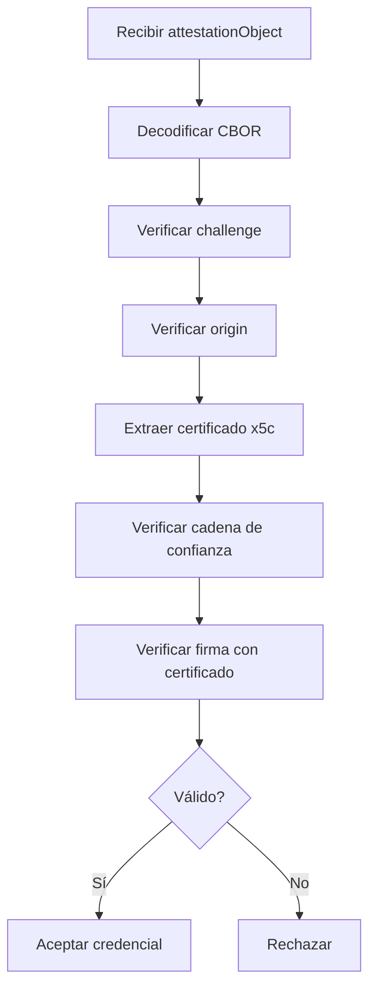
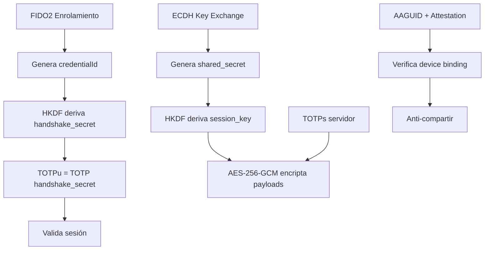

# Componentes Criptográficos

## Índice

1. [FIDO2/WebAuthn](#fido2webauthn)
2. [ECDH (Elliptic Curve Diffie-Hellman)](#ecdh-elliptic-curve-diffie-hellman)
3. [HKDF (Key Derivation)](#hkdf-key-derivation)
4. [TOTP Dual](#totp-dual)
5. [AES-256-GCM](#aes-256-gcm)
6. [Device-Bound Passkeys](#device-bound-passkeys)
7. [Attestation Certificates](#attestation-certificates)

---

## FIDO2/WebAuthn

### Propósito

Vincular usuarios a dispositivos físicos mediante criptografía asimétrica, eliminando contraseñas y previniendo phishing.

### Flujo de Enrolamiento



### Parámetros WebAuthn

```javascript
{
  challenge: crypto.randomBytes(32),
  rp: {
    name: "Sistema Asistencia UCN",
    id: "asistencia.ucn.cl"
  },
  user: {
    id: Uint8Array.from(String(userId), c => c.charCodeAt(0)),
    name: username,
    displayName: displayName
  },
  pubKeyCredParams: [
    { alg: -7, type: "public-key" }  // ES256 (ECDSA P-256)
  ],
  authenticatorSelection: {
    authenticatorAttachment: "platform",  // Preferir interno
    userVerification: "required",         // Requiere PIN/biometría
    residentKey: "preferred"              // Discoverable credentials
  },
  attestation: "direct"  // Solicitar certificado del autenticador
}
```

### Validación Servidor

**Pasos de validación:**

1. Decodificar `attestationObject` (CBOR)
2. Verificar `challenge` coincide con el almacenado
3. Verificar `origin` es el esperado
4. Extraer `publicKey` de `authData`
5. Verificar firma del attestation (si presente)
6. Validar certificado de attestation
7. Almacenar credencial en base de datos

### Algoritmos Soportados

| Algorithm | ID (alg) | Descripción | Soporte |
|-----------|----------|-------------|---------|
| ES256 | -7 | ECDSA P-256 SHA-256 | Recomendado |
| RS256 | -257 | RSASSA-PKCS1-v1_5 SHA-256 | Fallback |
| EdDSA | -8 | Ed25519 | Poco común |

**Decisión:** Usar ES256 (ECDSA P-256) como primario.

---

## ECDH (Elliptic Curve Diffie-Hellman)

### Propósito

Permitir que cliente y servidor deriven una clave compartida (`session_key`) sin transmitirla por la red.

### Flujo de Key Exchange



### Propiedades Criptográficas

**Perfect Forward Secrecy (PFS):**

- Cada sesión usa pares ECDH efímeros diferentes
- Compromiso futuro de claves no afecta sesiones pasadas
- Claves privadas destruidas después de derivar `session_key`

**Curva Elíptica:**

- P-256 (secp256r1)
- Misma curva que FIDO2 ES256
- 128 bits de seguridad

**Ventajas:**

- Estándar de la industria (TLS 1.3, Signal Protocol)
- Librerías maduras (Web Crypto API, Node.js crypto)
- Sin transmisión de claves simétricas

---

## HKDF (Key Derivation)

### Propósito

Derivar claves criptográficas seguras a partir de material key inicial (IKM), sin necesidad de almacenar múltiples secrets.

### Especificación

**Basado en:** RFC 5869  
**Hash:** SHA-256  
**Fases:** Extract + Expand



### Usos en el Sistema

#### 1. Derivación de handshake_secret

```
Input:
  - credentialId (único por dispositivo)
  - userId (único por usuario)
  - SERVER_MASTER_SECRET (rotable)

Proceso:
  ikm = credentialId || userId || SERVER_MASTER_SECRET
  salt = null
  info = "attendance-handshake-v1"
  length = 32 bytes

Output:
  handshake_secret = HKDF(sha256, ikm, salt, info, 32)

Almacenamiento:
  - Ubicación: PostgreSQL enrollment.devices.handshake_secret
  - Formato: Base64 encoded string
  - Persistencia: Permanente (asociado al dispositivo)
  - Rotación: Solo si se revoca el dispositivo o se cambia SERVER_MASTER_SECRET
```

#### 2. Derivación de session_key

```
Input:
  - shared_secret (resultado de ECDH)

Proceso:
  ikm = shared_secret
  salt = null
  info = "attendance-session-key-v1"
  length = 32 bytes

Output:
  session_key = HKDF(sha256, ikm, salt, info, 32)

Almacenamiento:
  - Ubicación: Valkey cache + memoria del cliente (browser)
  - Formato: Buffer/Uint8Array (nunca serializada en DB)
  - Persistencia: Efímera (TTL 2 horas en Valkey)
  - Clave Valkey: session:{userId}:key
  - Cliente: Mantiene en memoria volátil (variable JavaScript)
  - Destrucción: Al cerrar sesión o expirar TTL
```

### Propiedades de Seguridad

- **Determinística:** Mismo input produce mismo output
- **Irreversible:** No se puede obtener IKM desde output
- **Único por contexto:** `info` diferencia derivaciones
- **Rotable:** Cambiar `SERVER_MASTER_SECRET` invalida todos los secrets

---

## TOTP Dual

### Propósito

Sistema dual de TOTP para vincular sesiones a dispositivos y validar QR específicos.

### TOTPu (TOTP de Usuario/Sesión)

**Propósito:** Vincular sesión a dispositivo enrolado

```
Secret: handshake_secret (derivado de FIDO2)
Período: 30 segundos
Dígitos: 6
Algoritmo: SHA-256

TOTPu = TOTP(handshake_secret, floor(time/30), 6)
```

**Características:**

- Único por dispositivo enrolado
- Validez: durante toda la sesión
- Transmitido: en cada validación de ronda
- Propósito: verificar que el dispositivo es el mismo que se enroló

### TOTPs (TOTP de Servidor/QR)

**Propósito:** Anti-replay y validación de QR específico

```
Secret: SHA-256(sessionId || userId || roundNumber || SERVER_SECRET)
Período: 30 segundos
Dígitos: 6
Algoritmo: SHA-256

TOTPs = TOTP(secret, floor(time/30), 6)
```

**Características:**

- Único por QR generado
- Validez: 30 segundos (1 ventana TOTP)
- Transmitido: dentro del payload encriptado del QR
- Propósito: validar que el QR es legítimo y reciente

### Ventana de Validación

```
Servidor acepta TOTPs en ventana:
  - Actual (T0)
  - Anterior (T-1)
  - Siguiente (T+1)

Razón: compensar drift de reloj y latencia de red
```

### Comparación TOTPu vs TOTPs

| Aspecto | TOTPu | TOTPs |
|---------|-------|-------|
| Secret base | handshake_secret | sessionId + userId + round + SERVER_SECRET |
| Duración | Toda la sesión | 30 segundos |
| Transmisión | Cada validación | Dentro de payload QR |
| Propósito | Vincular dispositivo | Anti-replay + validar QR |
| Generado por | Cliente y servidor | Solo servidor |

---

## AES-256-GCM

### Propósito

Encriptación simétrica autenticada de payloads QR y respuestas de usuario.

### Especificación

**Algoritmo:** AES-256-GCM  
**Modo:** Galois/Counter Mode  
**Key size:** 256 bits  
**IV size:** 12 bytes (recomendado para GCM)  
**Tag size:** 16 bytes (authentication tag)

### Propiedades

- **Confidencialidad:** Payload encriptado
- **Autenticidad:** Tag verifica integridad
- **AEAD:** Authenticated Encryption with Associated Data
- **Performance:** Hardware acceleration disponible

### Uso: Encriptación de Payload QR

```
Input:
  plaintext = {
    secreto: AES_encrypt(TOTPs + nonce, server_key),
    userId: 123,
    dataActividad: {...},
    TOTPs: "485926",
    ronda: 1
  }
  
  key = session_key (derivada de ECDH)
  iv = crypto.randomBytes(12)

Process:
  ciphertext = AES_256_GCM_encrypt(plaintext, key, iv)
  tag = authentication_tag (generado automáticamente)

Output:
  payload_encriptado = {
    ciphertext: base64(ciphertext),
    iv: base64(iv),
    tag: base64(tag)
  }
```

### Uso: Encriptación de Respuesta Usuario

```code
Input:
  plaintext = {
    secreto: encrypted_nonce,
    userId: 123,
    dataActividad: {...},
    TOTPs: "485926",
    ronda: 1,
    timestamp_enviado: Date.now(),
    TOTPu: "192837",
    metadatos: {...}
  }
  
  key = session_key
  iv = crypto.randomBytes(12)

Output:
  response_encriptada similar a payload_encriptado
```

### Validación

```
Servidor desencripta:
  1. Extrae ciphertext, iv, tag
  2. Intenta desencriptar con session_key
  3. Si tag no coincide: FALLO (mensaje adulterado)
  4. Si desencriptación exitosa: procesa payload
```

---

## Device-Bound Passkeys

### Propósito

Asegurar que las credenciales FIDO2 están vinculadas físicamente al dispositivo y no pueden ser exportadas.

### Características

**Passkey Platform:**

- Almacenada en secure enclave del dispositivo
- TPM (Trusted Platform Module) en Windows
- Secure Enclave en iOS/macOS
- Hardware-backed keystore en Android

**No Exportable:**

- Clave privada NUNCA sale del dispositivo
- Imposible copiar a otro dispositivo
- Resistente a extracción por malware

### Verificación

```
authenticatorSelection: {
  authenticatorAttachment: "platform",
  userVerification: "required"
}
```

**Verificaciones servidor:**

1. `authData.flags.userVerified = true`
2. `authData.flags.userPresent = true`
3. AAGUID corresponde a autenticador conocido
4. Attestation certificate válido

### Anti-Compartir

```
Cada validación verifica:
  - AAGUID consistente (mismo autenticador)
  - TOTPu basado en handshake_secret único
  - Attestation certificate no cambia

Si detecta cambio:
  - Nuevo AAGUID -> nuevo dispositivo -> penalización
  - Múltiples AAGUIDs activos -> alerta
```

---

## Attestation Certificates

### Propósito

Verificar la autenticidad del autenticador y detectar dispositivos virtuales o comprometidos.

### Estructura

```
Attestation Object:
  fmt: "packed" | "fido-u2f" | "android-safetynet" | "tpm"
  authData: {
    rpIdHash: Buffer,
    flags: {userPresent, userVerified},
    signCount: integer,
    aaguid: Buffer (16 bytes),
    credentialId: Buffer,
    publicKey: COSE_Key
  },
  attStmt: {
    alg: -7 (ES256),
    sig: Buffer (firma),
    x5c: [Buffer] (cadena de certificados)
  }
```

### Validación



### AAGUID (Authenticator Attestation GUID)

**Formato:** 16 bytes UUID  
**Propósito:** Identificar modelo/fabricante del autenticador

**Ejemplos:**

- `adce0002-35bc-c60a-648b-0b25f1f05503` - Chrome Touch ID
- `00000000-0000-0000-0000-000000000000` - Windows Hello
- `08987058-cadc-4b81-b6e1-30de50dcbe96` - YubiKey 5

**Uso en sistema:**

```
Validación:
  1. Verificar AAGUID está en lista permitida
  2. Asociar AAGUID con userId en BD
  3. En cada login, verificar AAGUID no cambió
  4. Si cambia -> nuevo dispositivo -> aplicar penalización
```

### Attestation Formats

| Formato | Descripción | Uso |
|---------|-------------|-----|
| packed | FIDO2 estándar | Recomendado |
| fido-u2f | FIDO U2F legacy | Compatibilidad |
| android-safetynet | Google SafetyNet | Android |
| tpm | TPM 2.0 | Windows |
| none | Sin attestation | Desarrollo |

**Decisión:** Aceptar `packed` y `fido-u2f` en producción.

---

## Integración de Componentes



**Flujo completo:**

1. FIDO2 genera credenciales vinculadas a dispositivo
2. HKDF deriva `handshake_secret` único
3. ECDH establece `session_key` sin transmitirla
4. AES-GCM encripta/desencripta payloads con `session_key`
5. TOTPu valida sesión, TOTPs valida QR
6. AAGUID y attestation previenen compartir dispositivos

---

**Versión:** 1.0  
**Fecha:** 2025-11-02  
**Estado:** Especificación Técnica
