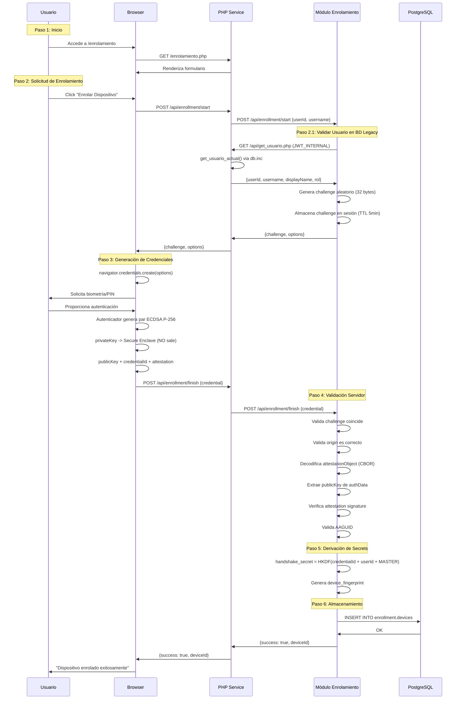
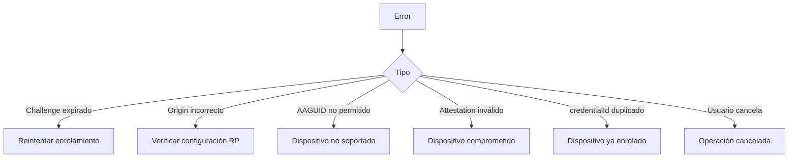

# Flujo de Enrolamiento

---

## Propósito

Registrar dispositivos de usuarios mediante FIDO2/WebAuthn, generando credenciales criptográficas vinculadas físicamente al hardware.

---

## Pre-requisitos

**Usuario:**

- Dispositivo con autenticador compatible (Touch ID, Windows Hello, YubiKey)
- Browser moderno con soporte WebAuthn
- Conexión HTTPS

**Sistema:**

- Módulo Enrolamiento activo (Puerto 3000)
- PostgreSQL Node Persistente disponible (schema `enrollment`)
- Variables de entorno configuradas (`SERVER_MASTER_SECRET`)

**Arquitectura de Datos:**

El enrolamiento utiliza **dos bases de datos**:

1. **BD PHP Legacy (PostgreSQL):** Valida que el usuario existe mediante endpoint HTTP
   - Node llama: `PHPLegacyClient.getUserById(userId)`
   - PHP consulta: `get_usuario_actual()` via `db.inc`
   - Retorna: `{userId, username, displayName, rol}`

2. **BD Node Persistente (PostgreSQL):** Almacena dispositivos FIDO2
   - Tabla: `enrollment.devices`
   - Datos: credentialId, publicKey, handshake_secret, AAGUID
   - Acceso directo desde módulo Node

**NO hay acceso cross-database directo.** Node obtiene datos de usuarios mediante HTTP endpoints PHP.

Ver detalles: [08-arquitectura-datos.md](08-arquitectura-datos.md)

---

## Diagrama de Secuencia Completo



---

## Paso 1: Inicio de Enrolamiento

### Cliente (Browser)

```javascript
// Usuario hace click en "Enrolar Dispositivo"
async function startEnrollment() {
  const response = await fetch('/api/enrollment/start', {
    method: 'POST',
    headers: {'Content-Type': 'application/json'},
    body: JSON.stringify({
      userId: currentUser.id,
      username: currentUser.username,
      displayName: currentUser.displayName
    })
  });
  
  const {challenge, options} = await response.json();
  return {challenge, options};
}
```

### Servidor (Módulo Enrolamiento)

```plaintext
Endpoint: POST /api/enrollment/start

Input:
  {
    userId: 123,
    username: "jperez",
    displayName: "Juan Pérez"
  }

Proceso:
  1. Validar que usuario existe en BD Legacy:
     userData = await PHPLegacyClient.getUserById(userId)
     // Internamente hace HTTP request a PHP con JWT_INTERNAL
     // PHP ejecuta: get_usuario_actual() via db.inc
     // Retorna: {userId, username, displayName, rol}
     
  2. Verificar en cache Valkey (TTL 300s):
     cacheKey = `cache:php:user:${userId}`
     if (valkey.exists(cacheKey)):
       userData = valkey.get(cacheKey)
     else:
       userData = await PHPLegacyClient.getUserById(userId)
       valkey.setex(cacheKey, 300, JSON.stringify(userData))
  
  3. Genera challenge aleatorio (32 bytes)
  
  4. Almacena en sesión: session[userId] = {challenge, timestamp}
  
  5. Configura TTL: 5 minutos
  
  6. Genera options WebAuthn

Output:
  {
    challenge: base64(32_bytes),
    options: {
      rp: {name, id},
      user: {id, name, displayName},
      pubKeyCredParams: [{alg: -7}],
      authenticatorSelection: {
        authenticatorAttachment: "platform",
        userVerification: "required",
        residentKey: "preferred"
      },
      attestation: "direct"
    }
  }
```

---

## Paso 2: Generación de Credenciales (Cliente)

```javascript
async function createCredential(challenge, options) {
  // Convertir challenge de base64 a Uint8Array
  const challengeBuffer = Uint8Array.from(
    atob(challenge), 
    c => c.charCodeAt(0)
  );

  // Configurar opciones WebAuthn
  const publicKeyOptions = {
    challenge: challengeBuffer,
    rp: options.rp,
    user: {
      id: Uint8Array.from(String(options.user.id), c => c.charCodeAt(0)),
      name: options.user.name,
      displayName: options.user.displayName
    },
    pubKeyCredParams: [{alg: -7, type: "public-key"}],
    authenticatorSelection: options.authenticatorSelection,
    attestation: options.attestation,
    timeout: 60000
  };

  // Solicitar generación de credencial
  const credential = await navigator.credentials.create({
    publicKey: publicKeyOptions
  });

  return credential;
}
```

### Interacción con Autenticador

```text
Browser solicita:
  "Sistema Asistencia UCN quiere crear credencial para jperez"

Usuario:
  - Touch ID: Coloca dedo
  - Windows Hello: Reconocimiento facial o PIN
  - Android: Huella o PIN

Autenticador:
  1. Verifica identidad usuario
  2. Genera par ECDSA P-256
  3. Almacena privateKey en secure enclave
  4. Genera credentialId único
  5. Crea attestation signature
  6. Retorna {credentialId, publicKey, attestation}
```

---

## Paso 3: Envío de Credenciales al Servidor

```javascript
async function finishEnrollment(credential) {
  // Preparar datos para enviar
  const credentialData = {
    id: credential.id,
    rawId: arrayBufferToBase64(credential.rawId),
    type: credential.type,
    response: {
      clientDataJSON: arrayBufferToBase64(
        credential.response.clientDataJSON
      ),
      attestationObject: arrayBufferToBase64(
        credential.response.attestationObject
      )
    }
  };

  // Enviar al servidor
  const response = await fetch('/api/enrollment/finish', {
    method: 'POST',
    headers: {'Content-Type': 'application/json'},
    body: JSON.stringify(credentialData)
  });

  return await response.json();
}
```

---

## Paso 4: Validación Servidor

```plaintext
Endpoint: POST /api/enrollment/finish

Input:
  {
    id: "credential_id_base64",
    rawId: "credential_id_base64",
    type: "public-key",
    response: {
      clientDataJSON: "base64...",
      attestationObject: "base64..."
    }
  }

Proceso de Validación:

1. Recuperar challenge almacenado
   challenge_stored = session[userId].challenge
   if (timestamp > 5 min): REJECT

2. Decodificar clientDataJSON
   clientData = JSON.parse(base64_decode(clientDataJSON))
   
3. Verificar challenge
   if (clientData.challenge != challenge_stored): REJECT
   
4. Verificar origin
   if (clientData.origin != EXPECTED_ORIGIN): REJECT
   
5. Verificar type
   if (clientData.type != "webauthn.create"): REJECT

6. Decodificar attestationObject (CBOR)
   attestation = cbor.decode(base64_decode(attestationObject))

7. Extraer authData
   authData = attestation.authData
   
8. Verificar RP ID Hash
   rpIdHash = authData.rpIdHash
   if (sha256(RP_ID) != rpIdHash): REJECT

9. Verificar flags
   if (!authData.flags.userPresent): REJECT
   if (!authData.flags.userVerified): REJECT
   if (!authData.flags.attestedCredentialData): REJECT

10. Extraer AAGUID
    aaguid = authData.aaguid

11. Extraer credentialId
    credentialId = authData.credentialId

12. Extraer publicKey (COSE format)
    publicKey = authData.credentialPublicKey

13. Verificar attestation (si presente)
    if (attestation.fmt == "packed"):
      cert = attestation.attStmt.x5c[0]
      sig = attestation.attStmt.sig
      verify_signature(authData + clientDataHash, sig, cert)

14. Verificar AAGUID en lista permitida
    if (aaguid not in ALLOWED_AAGUIDS): REJECT

Output (si todo OK):
  ACCEPT credencial
```

---

## Paso 5: Derivación de Secrets

```plaintext
handshake_secret = HKDF(
  sha256,
  ikm = credentialId || userId || SERVER_MASTER_SECRET,
  salt = null,
  info = "attendance-handshake-v1",
  length = 32
)

device_fingerprint = sha256(
  aaguid || userId || credentialId
)
```

---

## Paso 6: Almacenamiento en Base de Datos

```sql
INSERT INTO enrollment.devices (
  user_id,
  credential_id,
  public_key,
  handshake_secret,
  aaguid,
  device_fingerprint,
  attestation_format,
  sign_count,
  enrolled_at
) VALUES (
  123,
  'xyz...',
  '-----BEGIN PUBLIC KEY-----...',
  'handshake_secret_derived',
  '08987058-cadc-4b81-b6e1-30de50dcbe96',
  'device_fingerprint_hash',
  'packed',
  0,
  NOW()
);
```

**Índices:**

```sql
CREATE UNIQUE INDEX idx_credential_id ON enrollment.devices(credential_id);
CREATE INDEX idx_user_id ON enrollment.devices(user_id);
CREATE INDEX idx_aaguid ON enrollment.devices(aaguid);
```

---

## Paso 7: Respuesta Final

```javascript
// Servidor responde
{
  success: true,
  deviceId: "device_uuid",
  message: "Dispositivo enrolado exitosamente",
  aaguid: "08987058-cadc-4b81-b6e1-30de50dcbe96"
}

// Cliente muestra
UI: "Dispositivo enrolado exitosamente. Ya puedes participar en sesiones de asistencia."
```

---

## Manejo de Errores



**Códigos de error:**

| Código | Descripción | Acción |
|--------|-------------|--------|
| ERR_CHALLENGE_EXPIRED | Challenge TTL excedido | Reiniciar proceso |
| ERR_INVALID_ORIGIN | Origin no coincide | Configuración incorrecta |
| ERR_AAGUID_NOT_ALLOWED | Dispositivo no soportado | Usar otro dispositivo |
| ERR_ATTESTATION_INVALID | Attestation verification failed | Rechazar |
| ERR_DUPLICATE_CREDENTIAL | credentialId ya existe | Ya enrolado |
| ERR_USER_CANCELLED | Usuario canceló | Informar y permitir reintentar |

---

## Re-Enrolamiento

```plaintext
Escenarios:
  1. Usuario pierde dispositivo
  2. Usuario compra nuevo dispositivo
  3. Reinstalación de SO

Proceso:
  1. Usuario solicita re-enrolamiento
  2. Sistema verifica identidad (email, SMS, admin)
  3. Sistema desactiva dispositivos antiguos
  4. Aplica penalización (delay exponencial)
  5. Permite nuevo enrolamiento

Penalizaciones:
  Device 1: 0 min delay
  Device 2: 5 min delay
  Device 3: 30 min delay
  Device 4+: Exponencial (máx 24h)
```

---

## Verificación Post-Enrolamiento

```plaintext
Test de validación:
  1. Endpoint: GET /api/enrollment/verify/{userId}
  2. Verifica que credentialId existe en BD
  3. Verifica que AAGUID es válido
  4. Retorna estado de enrolamiento

Respuesta:
  {
    enrolled: true,
    deviceId: "uuid",
    aaguid: "...",
    enrolledAt: "2025-11-02T10:30:00Z",
    deviceCount: 1
  }
```

---

**Versión:** 1.0  
**Fecha:** 2025-11-02  
**Estado:** Especificación Técnica
