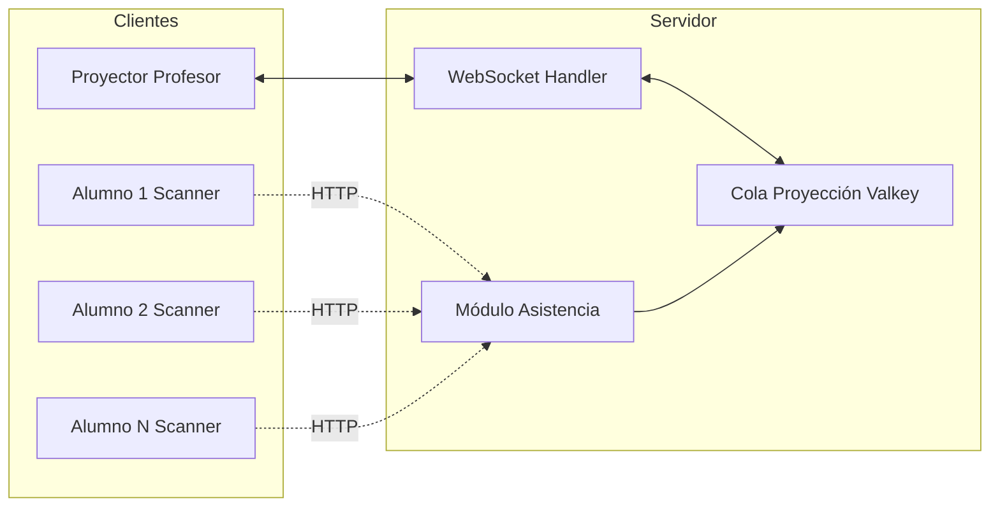
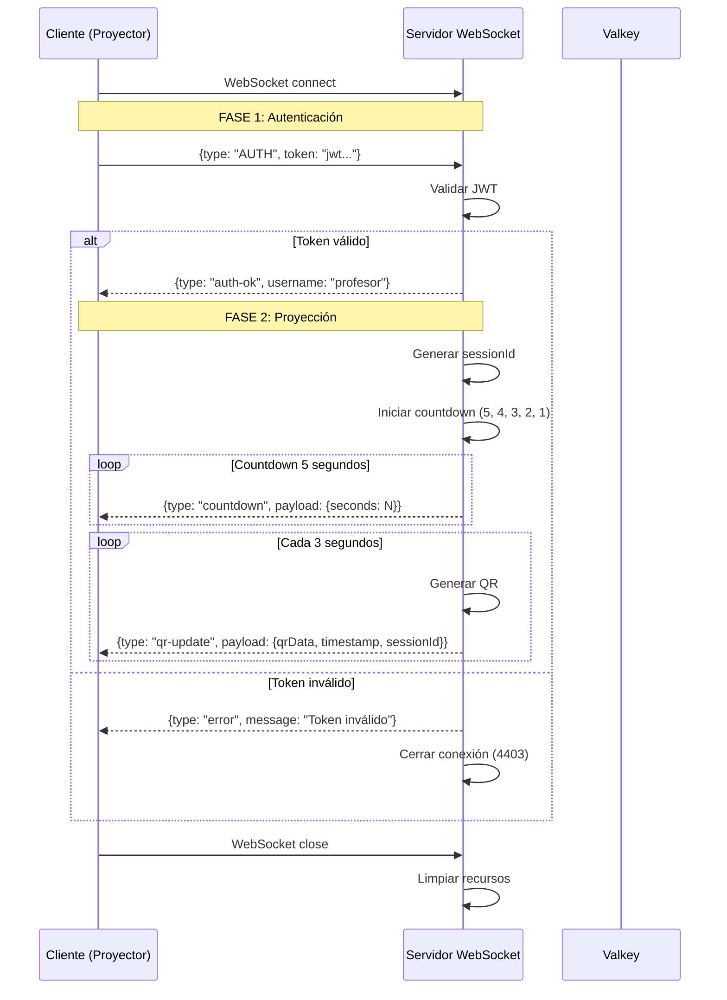

# Protocolo WebSocket - Proyección de QR

## Propósito

Definir el protocolo de comunicación WebSocket para la proyección aleatoria de códigos QR en tiempo real durante sesiones de asistencia.

## NOTA IMPORTANTE

Este documento describe el WebSocket de **proyección de QR** (para profesores/anfitriones).

**WebSockets en el sistema:**

1. `/asistencia/ws` - Proyección de QR (IMPLEMENTADO - este documento)
2. `/enrollment/ws` - Proceso de enrollment FIDO2 (PENDIENTE - ver 12-propuesta-separacion-roles-anfitrion-invitado.md)

**Estado de implementación:**

- WebSocket de proyección: Funcional con autenticación JWT
- WebSocket de enrollment: Pendiente de implementación

---

## Seguridad: Autenticación JWT

El WebSocket requiere autenticación JWT mediante handshake en primer mensaje.

**Flujo de autenticación:**

1. Cliente obtiene JWT de PHP via `api_puente_minodo.php`
2. PHP envía JWT al iframe via `postMessage`
3. Cliente se conecta al WebSocket
4. Cliente envía mensaje `AUTH` con token como primer mensaje
5. Servidor valida JWT antes de proceder
6. Si válido: servidor responde `auth-ok` e inicia proyección
7. Si inválido: servidor cierra conexión con código 4403

**Códigos de cierre WebSocket:**

| Código | Razón | Descripción |
|--------|-------|-------------|
| 4401 | No autenticado | Cliente no envió mensaje AUTH como primer mensaje |
| 4403 | Token inválido | JWT inválido, expirado o malformado |
| 4408 | Auth timeout | Cliente no autenticó en 5 segundos |

---

## Características

- **Bidireccional:** Cliente y servidor intercambian mensajes
- **Tiempo real:** Latencia < 50ms
- **Rotación aleatoria:** Cada 500ms
- **Broadcast:** Un servidor proyecta a múltiples clientes
- **Resiliente:** Reconexión automática

---

## Arquitectura de Conexión



**Nota:** Solo el proyector del profesor usa WebSocket para recibir QR. Alumnos escanean la pantalla con cámara (no WebSocket).

---

## Endpoints

### WebSocket Endpoint

```url
ws://localhost:3000/ws/projection
```

**Producción:**

```url
wss://asistencia.ucn.cl/ws/projection
```

---

## Ciclo de Vida de Conexión



---

## Tipos de Mensajes

### 1. Cliente → Servidor

#### `AUTH` (REQUERIDO - Primer mensaje)

Autenticación JWT antes de cualquier operación.

```json
{
  "type": "AUTH",
  "token": "eyJhbGciOiJIUzI1NiIsInR5cCI6IkpXVCJ9..."
}
```

**Validaciones:**

- Debe ser el primer mensaje
- Token no expirado (TTL 5 minutos)
- Firma válida
- Issuer y audience correctos

**Respuesta esperada:** `auth-ok` o `error`

**Errores posibles:**

- `4401` - No es el primer mensaje o falta token
- `4403` - Token inválido o expirado
- `4408` - No autenticó en 5 segundos

#### `ping` (Opcional)

Keepalive para mantener conexión activa.

```json
{
  "type": "ping",
  "timestamp": 1730546400000
}
```

**Respuesta esperada:** `pong`

**Nota:** Este mensaje solo se procesa después de autenticación exitosa.

---

### 2. Servidor → Cliente

#### `auth-ok`

Confirmación de autenticación exitosa.

```json
{
  "type": "auth-ok",
  "username": "juan.perez"
}
```

**Significado:** Cliente autenticado, proyección iniciará inmediatamente.

#### `countdown`

Cuenta regresiva antes de iniciar proyección de QR.

```json
{
  "type": "countdown",
  "payload": {
    "seconds": 3
  }
}
```

**Secuencia:** Se envía cada segundo con valores 5, 4, 3, 2, 1.

#### `qr-update`

Frame de QR para proyectar en pantalla.

```json
{
  "type": "qr-update",
  "payload": {
    "qrData": "data:image/png;base64,iVBORw0KG...",
    "timestamp": 1730546400500,
    "sessionId": "session-1730546400-abc123"
  }
}
```

**Frecuencia:** Cada 3 segundos.

#### `error`

Error durante operación.

```json
{
  "type": "error",
  "message": "Token inválido o expirado"
}
```

**Comportamiento:** Después de enviar error, servidor cierra conexión.

#### `connection_established` (DEPRECADO)

Ya no se usa. Autenticación es obligatoria antes de cualquier mensaje del servidor (excepto errores).

#### `session_joined` (DEPRECADO)

Ya no se usa. Servidor inicia proyección automáticamente después de `auth-ok`.

**Nota:** `payload` es el payload encriptado completo, incluyendo `{ciphertext, iv, tag}`.

#### `session_left`

Confirmación de que se abandonó la sesión.

```json
{
  "type": "session_left",
  "sessionId": "abc123",
  "timestamp": 1730546401000
}
```

#### `pong`

Respuesta a `ping`.

```json
{
  "type": "pong",
  "timestamp": 1730546400100
}
```

#### `error`

Error en procesamiento de mensaje.

```json
{
  "type": "error",
  "code": "SESSION_NOT_FOUND",
  "message": "Sesión abc123 no existe o expiró",
  "timestamp": 1730546400200
}
```

**Códigos de error comunes:**

| Código | Descripción |
|--------|-------------|
| `SESSION_NOT_FOUND` | Sesión no existe o expiró |
| `UNAUTHORIZED` | Token inválido o rol incorrecto |
| `INVALID_MESSAGE` | Mensaje mal formado |
| `QUEUE_EMPTY` | No hay QRs en cola de proyección |

---

## Algoritmo de Rotación Aleatoria

### Pseudocódigo

```typescript
async function startRotationLoop(sessionId: string, ws: WebSocket) {
  const ROTATION_INTERVAL = 500; // ms
  let frameCounter = 0;

  const interval = setInterval(async () => {
    // 1. Recuperar cola de proyección
    const queue = await valkey.getProjectionQueue(sessionId);

    if (queue.length === 0) {
      // No hay QR activos, enviar mensaje vacío
      ws.send(JSON.stringify({
        type: "queue_empty",
        sessionId,
        timestamp: Date.now()
      }));
      return;
    }

    // 2. Seleccionar QR aleatorio
    const randomIndex = Math.floor(Math.random() * queue.length);
    const selectedPayload = queue[randomIndex];

    // 3. Incrementar contador de visualización
    // (requiere parsear payload para extraer userId y ronda)
    const { userId, ronda } = parsePayloadMetadata(selectedPayload);
    await valkey.incrementDisplayCount(sessionId, userId, ronda);

    // 4. Broadcast a cliente
    frameCounter++;
    ws.send(JSON.stringify({
      type: "qr_frame",
      sessionId,
      payload: selectedPayload,
      frameNumber: frameCounter,
      timestamp: Date.now(),
      queueSize: queue.length
    }));

  }, ROTATION_INTERVAL);

  // Cleanup al desconectar
  ws.on('close', () => {
    clearInterval(interval);
  });
}
```

### Propiedades

- **Aleatoriedad:** `Math.random()` para selección
- **Distribución uniforme:** Cada QR tiene igual probabilidad
- **Sin predicción:** Atacante no puede predecir cuándo aparecerá QR específico
- **Contador de displays:** Detecta QR que nunca son capturados

---

## Renderizado de QR en Cliente

### HTML/JavaScript

```html
<div id="qr-projector">
  <canvas id="qr-canvas" width="512" height="512"></canvas>
  <div id="qr-info">
    <span>Frame: <span id="frame-number">0</span></span>
    <span>Cola: <span id="queue-size">0</span></span>
  </div>
</div>

<script type="module">
  import QRCode from 'qrcode';

  const ws = new WebSocket('ws://localhost:3000/ws/projection');
  const canvas = document.getElementById('qr-canvas');

  ws.onopen = () => {
    // Unirse a sesión
    ws.send(JSON.stringify({
      type: 'join_session',
      sessionId: 'abc123',
      role: 'professor',
      token: localStorage.getItem('jwt_token')
    }));
  };

  ws.onmessage = async (event) => {
    const msg = JSON.parse(event.data);

    switch (msg.type) {
      case 'qr_frame':
        // Renderizar QR en canvas
        await QRCode.toCanvas(canvas, msg.payload, {
          width: 512,
          margin: 2,
          errorCorrectionLevel: 'M'
        });

        // Actualizar info
        document.getElementById('frame-number').textContent = msg.frameNumber;
        document.getElementById('queue-size').textContent = msg.queueSize;
        break;

      case 'queue_empty':
        // Mostrar mensaje "Esperando alumnos..."
        const ctx = canvas.getContext('2d');
        ctx.clearRect(0, 0, 512, 512);
        ctx.fillText('Esperando alumnos...', 200, 256);
        break;

      case 'error':
        console.error('WebSocket error:', msg.message);
        break;
    }
  };

  ws.onerror = (error) => {
    console.error('WebSocket connection error:', error);
  };

  ws.onclose = () => {
    console.log('WebSocket closed');
  };
</script>
```

---

## Manejo de Reconexión

### Estrategia Exponential Backoff

```typescript
class ReconnectingWebSocket {
  private ws: WebSocket | null = null;
  private reconnectAttempts = 0;
  private maxReconnectDelay = 30000; // 30s

  connect(url: string) {
    this.ws = new WebSocket(url);

    this.ws.onclose = () => {
      this.reconnect(url);
    };

    this.ws.onerror = () => {
      this.ws?.close();
    };
  }

  private reconnect(url: string) {
    const delay = Math.min(
      1000 * Math.pow(2, this.reconnectAttempts),
      this.maxReconnectDelay
    );

    console.log(`Reconnecting in ${delay}ms (attempt ${this.reconnectAttempts + 1})`);

    setTimeout(() => {
      this.reconnectAttempts++;
      this.connect(url);
    }, delay);
  }
}
```

**Delays:**

| Intento | Delay |
|---------|-------|
| 1 | 1s |
| 2 | 2s |
| 3 | 4s |
| 4 | 8s |
| 5 | 16s |
| 6+ | 30s |

---

## Seguridad

### Autenticación

```typescript
// Servidor valida JWT en mensaje join_session
async function handleJoinSession(msg: any, ws: WebSocket) {
  const { sessionId, role, token } = msg;

  // 1. Verificar JWT
  const decoded = jwt.verify(token, JWT_SECRET);

  // 2. Verificar rol
  if (role !== 'professor') {
    ws.send(JSON.stringify({
      type: 'error',
      code: 'UNAUTHORIZED',
      message: 'Solo profesores pueden proyectar'
    }));
    ws.close();
    return;
  }

  // 3. Verificar sesión existe
  const sessionMeta = await valkey.getSessionMetadata(sessionId);
  if (!sessionMeta) {
    ws.send(JSON.stringify({
      type: 'error',
      code: 'SESSION_NOT_FOUND',
      message: 'Sesión no existe'
    }));
    return;
  }

  // 4. Verificar profesor es dueño de sesión
  if (sessionMeta.professorId !== decoded.userId) {
    ws.send(JSON.stringify({
      type: 'error',
      code: 'UNAUTHORIZED',
      message: 'No eres el profesor de esta sesión'
    }));
    ws.close();
    return;
  }

  // Todo OK, iniciar broadcast
  startRotationLoop(sessionId, ws);
}
```

### Rate Limiting

```typescript
// Limitar a 10 mensajes por segundo por cliente
const rateLimiter = new Map<string, number[]>();

function checkRateLimit(clientId: string): boolean {
  const now = Date.now();
  const window = 1000; // 1 segundo
  const maxMessages = 10;

  if (!rateLimiter.has(clientId)) {
    rateLimiter.set(clientId, []);
  }

  const timestamps = rateLimiter.get(clientId)!;
  const recent = timestamps.filter(t => now - t < window);

  if (recent.length >= maxMessages) {
    return false; // Rate limit exceeded
  }

  recent.push(now);
  rateLimiter.set(clientId, recent);
  return true;
}
```

---

## Monitoreo y Métricas

### Métricas Clave

```typescript
interface WebSocketMetrics {
  activeConnections: number;
  totalFramesSent: number;
  averageBroadcastLatency: number; // ms
  reconnectionRate: number; // %
  errorsPerMinute: number;
}
```

### Logging

```typescript
logger.info('WebSocket connection established', {
  clientId,
  remoteAddress: ws._socket.remoteAddress
});

logger.debug('QR frame broadcasted', {
  sessionId,
  frameNumber,
  queueSize,
  latency: Date.now() - startTime
});

logger.warn('Rate limit exceeded', {
  clientId,
  messagesInWindow: 15
});

logger.error('WebSocket error', {
  clientId,
  error: error.message,
  stack: error.stack
});
```

---

## Testing

### Unit Tests

```typescript
describe('WebSocket Rotation', () => {
  it('debería seleccionar QR aleatorio de cola', async () => {
    const queue = ['qr1', 'qr2', 'qr3'];
    const selected = selectRandomQR(queue);
    expect(queue).toContain(selected);
  });

  it('debería incrementar mostrado_count', async () => {
    await valkey.saveQRMetadata({
      userId: 123,
      sessionId: 'abc',
      ronda: 1,
      mostrado_count: 0,
      // ...
    });

    await valkey.incrementDisplayCount('abc', 123, 1);

    const metadata = await valkey.getQRMetadata('abc', 123, 1);
    expect(metadata.mostrado_count).toBe(1);
  });
});
```

### Integration Tests

```typescript
describe('WebSocket Integration', () => {
  it('debería proyectar QR cada 500ms', (done) => {
    const ws = new WebSocket('ws://localhost:3000/ws/projection');
    const frames: number[] = [];

    ws.onopen = () => {
      ws.send(JSON.stringify({
        type: 'join_session',
        sessionId: 'test-session',
        role: 'professor',
        token: 'valid_jwt_token'
      }));
    };

    ws.onmessage = (event) => {
      const msg = JSON.parse(event.data);
      if (msg.type === 'qr_frame') {
        frames.push(msg.frameNumber);
      }
    };

    setTimeout(() => {
      expect(frames.length).toBeGreaterThanOrEqual(5); // ~2.5s = 5 frames
      expect(frames.length).toBeLessThanOrEqual(7);
      ws.close();
      done();
    }, 3000);
  });
});
```

---

## Configuración

### Variables de Entorno

```bash
# WebSocket
WS_PORT=3000
WS_PATH=/ws/projection
WS_HEARTBEAT_INTERVAL=30000  # 30s
WS_ROTATION_INTERVAL=500     # 500ms

# Seguridad
WS_MAX_CONNECTIONS_PER_IP=5
WS_RATE_LIMIT_MESSAGES=10
WS_RATE_LIMIT_WINDOW=1000    # 1s
```

### Docker Compose

```yaml
node-service:
  environment:
    - WS_PORT=3000
    - WS_PATH=/ws/projection
    - WS_ROTATION_INTERVAL=500
  ports:
    - "3000:3000"
```

---

## Próximos Pasos

1. Implementar WebSocket handler en Node service
2. Integrar con módulo Asistencia
3. Crear UI de proyector para profesor
4. Tests de carga (50-200 conexiones concurrentes)
5. Optimizar latencia de broadcast

---

**Versión:** 1.0
**Fecha:** 2025-11-02
**Estado:** Especificación Técnica
