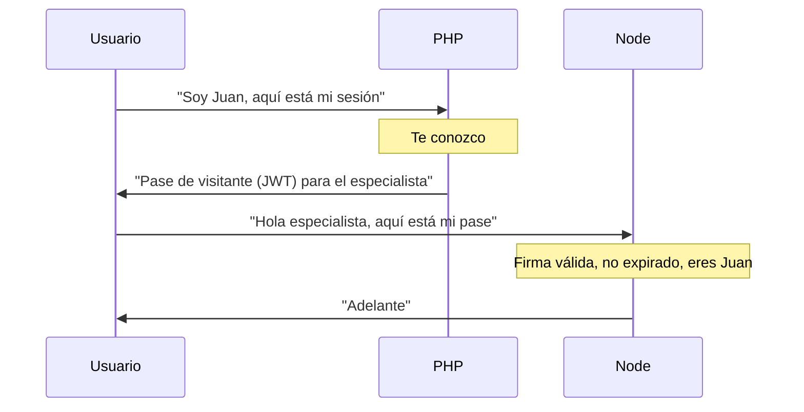
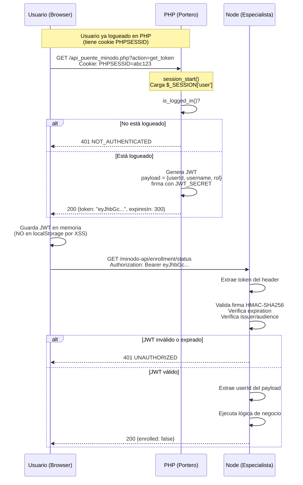
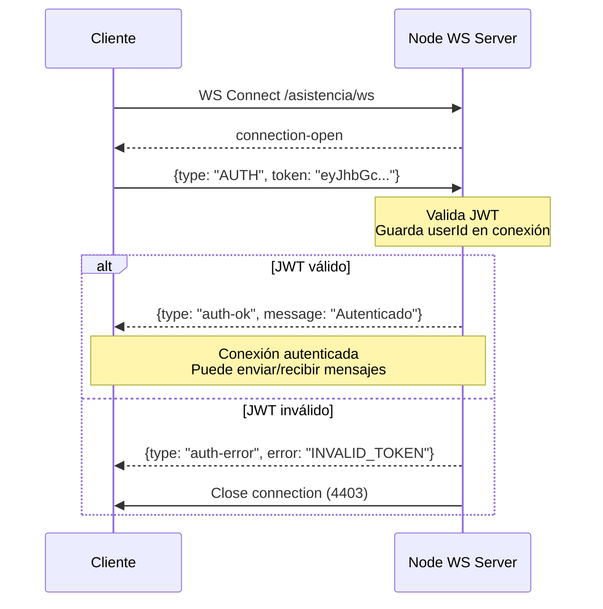

# Autenticación y Autorización: Guía Completa del Sistema

**Versión:** 1.0  
**Fecha:** 2025-11-04  
**Estado:** Documentación Consolidada

---

## Visión General

Este documento explica **cómo funciona la autenticación y autorización** en el sistema de asistencia, que integra:

1. **Monolito PHP Legacy "Hawaii"** - Sistema existente con autenticación tradicional
2. **Microservicio Node.js** - Módulo nuevo de criptografía FIDO2

**Desafío:** Integrar ambos sistemas sin modificar el mecanismo de autenticación legacy.

---

## Autenticación en PHP Legacy (Sistema Existente)

### Archivo Central: `db.inc`

El sistema PHP utiliza **sesiones estándar de PHP** gestionadas por el archivo `db.inc`.

**Flujo de Login:**

```php
// 1. Usuario envía credenciales
POST /login.php
Body: { email: "juan.perez@ucn.cl", password: "..." }

// 2. PHP valida contra BD
function auth_ok($email, $password) {
    $sql = "SELECT COUNT(*) FROM profesor 
            WHERE email = :email 
            AND passwd = :passwd";
    // Verifica hash de contraseña
}

// 3. Si es válido, guarda en sesión
function save_auth_token($token) {
    $_SESSION['user'] = $email;
    $_SESSION['root'] = is_super_admin($email);
    $_SESSION['permisos'] = load_permisos($email);
}

// 4. PHP crea cookie PHPSESSID automáticamente
// El navegador la envía en cada request subsiguiente
```

**Flujo de Requests Posteriores:**

```php
// Cada página PHP incluye db.inc
require_once 'db.inc';

// Primera línea de db.inc:
session_start(); // Lee cookie PHPSESSID, carga $_SESSION

// Verificar autenticación
if (!is_logged_in()) {
    header('Location: login.php');
    exit;
}

// Acceder a datos del usuario
$usuario_actual = get_usuario_actual(); // Devuelve $_SESSION['user']
```

---

## Sistema de Autorización en PHP

### Niveles de Acceso

#### 1. Super Administrador (Root)

```php
function has_super_access() {
    return isset($_SESSION['root']) && $_SESSION['root'] === true;
}

// Uso:
if (has_super_access()) {
    // Acceso total al sistema
}
```

#### 2. Administrador

```php
function is_admin($user) {
    $sql = "SELECT COUNT(*) FROM profesor 
            WHERE email = :user 
            AND administrador = true";
    // Consulta BD
}

// Uso:
if (is_admin($usuario_actual)) {
    // Acceso a panel administrativo
}
```

#### 3. Permisos Granulares

```php
function puede($permiso) {
    // Si es super admin, siempre puede
    if (has_super_access()) return true;
    
    // Carga permisos desde BD si no están en sesión
    if (!isset($_SESSION['permisos'])) {
        $sql = "SELECT id_permiso 
                FROM permiso_profesor 
                WHERE profesor = (SELECT id FROM profesor WHERE email = :email)";
        // Guarda en $_SESSION['permisos']
    }
    
    // Verifica si tiene el permiso específico
    return isset($_SESSION['permisos'][$permiso]);
}

// Constantes de permisos
define('VER_REPORTE_JULIO', 1);
define('TOMAR_ASISTENCIA', 2);
define('PONER_NOTAS', 3);
// ...

// Uso:
if (puede(TOMAR_ASISTENCIA)) {
    // Puede tomar asistencia
}
```

#### 4. Permisos Contextuales

```php
function can_tomar_asistencia($idcurso, $idsemestre) {
    // Verifica si el profesor está asignado a este curso
    $sql = "SELECT COUNT(*) 
            FROM relacion 
            WHERE profesor = :profesor 
            AND idcurso = :idcurso 
            AND idsemestre = :idsemestre";
    // ...
}

// Uso:
if (can_tomar_asistencia($curso_id, $semestre_id)) {
    // Puede tomar asistencia en este curso específico
}
```

### Protección de Páginas

```php
// horario.php (ejemplo de página protegida)
<?php
require_once 'db.inc';

// 1. Verificar login
if (!is_logged_in()) {
    header('Location: login.php');
    exit;
}

// 2. Verificar permisos
$usuario = get_usuario_actual();
if (!is_admin($usuario) && !puede(VER_HORARIOS)) {
    die('Acceso denegado');
}

// 3. Renderizar contenido
// ...
?>
```

---

## Integración con Node.js: El Puente JWT

### Problema a Resolver

**¿Cómo autenticar requests del cliente al microservicio Node sin modificar el sistema PHP?**

**Opciones descartadas:**

1. Node accede a las sesiones de PHP (incompatible, diferentes formatos)
2. Node consulta a PHP en cada request (latencia, acoplamiento)
3. Node tiene su propio sistema de login (duplicación, inconsistencia)

**Solución elegida:**

**JWT Bridge Pattern** - PHP emite tokens JWT que Node puede validar sin consultar a PHP

---

## Arquitectura del JWT Bridge

### Analogía: El Portero y el Especialista



### Flujo Técnico



---

## Implementación del JWT Bridge

### Lado PHP: Emisor de JWT

**Archivo:** `php-service/src/api_puente_minodo.php`

```php
<?php
require_once 'db.inc';  // Carga sistema de sesiones
require_once 'lib/jwt.php';  // Biblioteca JWT

session_start();

// Simulación de sesión (en producción ya existe por db.inc)
if (!isset($_SESSION['user_id'])) {
    $_SESSION['user_id'] = 123;
    $_SESSION['username'] = 'test.user';
    $_SESSION['rol'] = 'alumno';
}

// Endpoint: Obtener token
if ($_GET['action'] === 'get_token') {
    emitir_jwt();
}

function emitir_jwt() {
    // 1. Verificar sesión
    if (!isset($_SESSION['user_id']) || !isset($_SESSION['username'])) {
        http_response_code(401);
        echo json_encode([
            'success' => false,
            'error' => 'NOT_AUTHENTICATED',
            'message' => 'Debes iniciar sesión primero'
        ]);
        exit;
    }
    
    // 2. Construir payload
    $userId = (int)$_SESSION['user_id'];
    $username = $_SESSION['username'];
    $rol = $_SESSION['rol'] ?? 'usuario';
    $now = time();
    
    $payload = [
        'iss' => 'php-service',      // Emisor
        'aud' => 'node-service',     // Audiencia
        'sub' => (string)$userId,    // Subject (usuario)
        'userId' => $userId,
        'username' => $username,
        'rol' => $rol,
        'iat' => $now,               // Issued at
        'exp' => $now + 300          // Expira en 5 minutos
    ];
    
    // 3. Firmar con secreto compartido
    $secret = getenv('JWT_SECRET');
    if (!$secret) {
        $secret = 'default-secret-change-in-production';
    }
    
    $token = JWT::encode($payload, $secret);
    
    // 4. Responder
    header('Content-Type: application/json');
    echo json_encode([
        'success' => true,
        'token' => $token,
        'expiresIn' => 300,
        'userId' => $userId,
        'username' => $username
    ]);
}
?>
```

**Biblioteca JWT:** `php-service/src/lib/jwt.php`

```php
<?php
class JWT {
    public static function encode($payload, $secret) {
        $header = json_encode(['typ' => 'JWT', 'alg' => 'HS256']);
        $payload = json_encode($payload);
        
        $base64UrlHeader = self::base64UrlEncode($header);
        $base64UrlPayload = self::base64UrlEncode($payload);
        
        $signature = hash_hmac(
            'sha256',
            $base64UrlHeader . "." . $base64UrlPayload,
            $secret,
            true
        );
        $base64UrlSignature = self::base64UrlEncode($signature);
        
        return $base64UrlHeader . "." . $base64UrlPayload . "." . $base64UrlSignature;
    }
    
    public static function decode($jwt, $secret) {
        $parts = explode('.', $jwt);
        if (count($parts) !== 3) {
            throw new Exception('Invalid JWT format');
        }
        
        list($header64, $payload64, $signature64) = $parts;
        
        // Verificar firma
        $expectedSignature = hash_hmac(
            'sha256',
            $header64 . "." . $payload64,
            $secret,
            true
        );
        $expectedSignature64 = self::base64UrlEncode($expectedSignature);
        
        if (!hash_equals($expectedSignature64, $signature64)) {
            throw new Exception('Invalid signature');
        }
        
        $payload = json_decode(self::base64UrlDecode($payload64), true);
        
        // Verificar expiración
        if (isset($payload['exp']) && $payload['exp'] < time()) {
            throw new Exception('Token expired');
        }
        
        return $payload;
    }
    
    private static function base64UrlEncode($data) {
        return rtrim(strtr(base64_encode($data), '+/', '-_'), '=');
    }
    
    private static function base64UrlDecode($data) {
        return base64_decode(strtr($data, '-_', '+/'));
    }
}
?>
```

---

### Lado Node: Validador de JWT

**Archivo:** `node-service/src/modules/auth/domain/jwt-utils.ts`

```typescript
import jwt from 'jsonwebtoken';
import { config } from '../../../shared/config';

export interface JWTPayload {
  iss: string;
  aud: string;
  sub: string;
  userId: number;
  username: string;
  rol: string;
  iat: number;
  exp: number;
}

export class JWTUtils {
  static async verify(token: string): Promise<JWTPayload> {
    try {
      const payload = jwt.verify(token, config.jwt.secret, {
        issuer: config.jwt.issuer,
        audience: config.jwt.audience
      }) as JWTPayload;
      
      return payload;
    } catch (error) {
      if (error instanceof jwt.TokenExpiredError) {
        throw new Error('TOKEN_EXPIRED');
      }
      if (error instanceof jwt.JsonWebTokenError) {
        throw new Error('INVALID_TOKEN');
      }
      throw error;
    }
  }
  
  static extractFromHeader(authHeader: string | undefined): string {
    if (!authHeader) {
      throw new Error('NO_AUTH_HEADER');
    }
    
    const parts = authHeader.split(' ');
    if (parts.length !== 2 || parts[0] !== 'Bearer') {
      throw new Error('INVALID_AUTH_FORMAT');
    }
    
    return parts[1];
  }
}
```

**Middleware Fastify:** `node-service/src/modules/auth/presentation/auth-middleware.ts`

```typescript
import { FastifyRequest, FastifyReply } from 'fastify';
import { JWTUtils } from '../domain/jwt-utils';

export async function authenticateJWT(
  request: FastifyRequest,
  reply: FastifyReply
) {
  try {
    // Extraer token del header
    const token = JWTUtils.extractFromHeader(request.headers.authorization);
    
    // Validar JWT
    const payload = await JWTUtils.verify(token);
    
    // Inyectar usuario en request
    (request as any).user = {
      userId: payload.userId,
      username: payload.username,
      rol: payload.rol
    };
    
  } catch (error) {
    const message = error instanceof Error ? error.message : 'Unknown error';
    
    reply.code(401).send({
      success: false,
      error: 'UNAUTHORIZED',
      message: getErrorMessage(message)
    });
  }
}

function getErrorMessage(error: string): string {
  const messages: Record<string, string> = {
    'NO_AUTH_HEADER': 'No se proporcionó token de autenticación',
    'INVALID_AUTH_FORMAT': 'Formato de autorización inválido (use Bearer <token>)',
    'TOKEN_EXPIRED': 'Token expirado',
    'INVALID_TOKEN': 'Token inválido'
  };
  
  return messages[error] || 'Error de autenticación';
}
```

**Uso en Endpoints:**

```typescript
// node-service/src/modules/enrollment/presentation/enrollment.routes.ts
import { authenticateJWT } from '../../auth/presentation/auth-middleware';

export async function enrollmentRoutes(fastify: FastifyInstance) {
  // Todos los endpoints bajo /api/enrollment requieren JWT
  
  fastify.get('/api/enrollment/status', {
    preHandler: [authenticateJWT]
  }, async (request, reply) => {
    const { userId } = (request as any).user;
    
    // userId viene del JWT validado
    const status = await enrollmentService.getStatus(userId);
    
    return { success: true, ...status };
  });
  
  fastify.post('/api/enrollment/start', {
    preHandler: [authenticateJWT]
  }, async (request, reply) => {
    const { userId, username } = (request as any).user;
    
    const challenge = await enrollmentService.startEnrollment(userId, username);
    
    return { success: true, challenge };
  });
}
```

---

## Configuración del Secreto Compartido

### Generar Secreto

```bash
# Generar secreto aleatorio de 256 bits
openssl rand -hex 32
# Resultado: 9f86d081884c7d659a2feaa0c55ad015a3bf4f1b2b0b822cd15d6c15b0f00a08
```

### Docker Compose

```yaml
# compose.yaml
services:
  php:
    image: asistencia-php:latest
    environment:
      - JWT_SECRET=${JWT_SECRET}
  
  node:
    image: asistencia-node:latest
    environment:
      - JWT_SECRET=${JWT_SECRET}
```

### Archivo .env

```bash
# .env (en la raíz del proyecto)
JWT_SECRET=9f86d081884c7d659a2feaa0c55ad015a3bf4f1b2b0b822cd15d6c15b0f00a08
```

**Respuesta:** Agregar `.env` a `.gitignore`

```bash
# .gitignore
.env
.env.local
.env.*.local
```

---

## Flujo Cliente: JavaScript

### Obtener JWT

```javascript
// frontend/modules/auth/auth.service.js

class AuthService {
  constructor() {
    this.token = null;
    this.expiresAt = null;
  }
  
  async obtenerToken() {
    try {
      const response = await fetch('/api_puente_minodo.php?action=get_token', {
        credentials: 'include'  // Envía cookie PHPSESSID
      });
      
      if (!response.ok) {
        if (response.status === 401) {
          throw new Error('NO_AUTHENTICATED');
        }
        throw new Error('TOKEN_REQUEST_FAILED');
      }
      
      const data = await response.json();
      
      if (!data.success) {
        throw new Error(data.error || 'UNKNOWN_ERROR');
      }
      
      // Guardar en memoria (NO en localStorage)
      this.token = data.token;
      this.expiresAt = Date.now() + (data.expiresIn * 1000);
      
      console.log('Token obtenido:', {
        userId: data.userId,
        username: data.username,
        expiresIn: data.expiresIn
      });
      
      return this.token;
    } catch (error) {
      console.error('Error obteniendo token:', error);
      throw error;
    }
  }
  
  getToken() {
    // Si el token está a punto de expirar (< 30 segundos), pedir uno nuevo
    if (this.token && this.expiresAt && (this.expiresAt - Date.now() < 30000)) {
      console.log('Token cerca de expirar, renovando...');
      return this.obtenerToken();
    }
    
    return this.token;
  }
  
  async fetchConToken(url, options = {}) {
    // Obtener token si no existe
    if (!this.token) {
      await this.obtenerToken();
    }
    
    // Agregar header de autorización
    options.headers = {
      ...options.headers,
      'Authorization': `Bearer ${this.token}`
    };
    
    try {
      const response = await fetch(url, options);
      
      // Si token expiró, renovar y reintentar
      if (response.status === 401) {
        console.log('Token inválido, renovando...');
        await this.obtenerToken();
        
        // Reintentar con nuevo token
        options.headers['Authorization'] = `Bearer ${this.token}`;
        return fetch(url, options);
      }
      
      return response;
    } catch (error) {
      console.error('Error en fetch con token:', error);
      throw error;
    }
  }
}

// Exportar instancia singleton
export const authService = new AuthService();
```

### Uso en Enrollment

```javascript
// frontend/modules/enrollment/enrollment.service.js
import { authService } from '../auth/auth.service.js';

class EnrollmentService {
  async verificarEstado() {
    const response = await authService.fetchConToken('/minodo-api/enrollment/status');
    
    if (!response.ok) {
      throw new Error('Error verificando estado de enrollment');
    }
    
    return response.json();
  }
  
  async iniciarEnrollment() {
    const response = await authService.fetchConToken('/minodo-api/enrollment/start', {
      method: 'POST'
    });
    
    if (!response.ok) {
      throw new Error('Error iniciando enrollment');
    }
    
    return response.json();
  }
  
  async finalizarEnrollment(credential) {
    const response = await authService.fetchConToken('/minodo-api/enrollment/finish', {
      method: 'POST',
      headers: {
        'Content-Type': 'application/json'
      },
      body: JSON.stringify({ credential })
    });
    
    if (!response.ok) {
      throw new Error('Error finalizando enrollment');
    }
    
    return response.json();
  }
}

export const enrollmentService = new EnrollmentService();
```

---

## WebSocket con JWT

### Autenticación WebSocket



### Cliente WebSocket

```javascript
// frontend/modules/websocket/websocket.client.js
import { authService } from '../auth/auth.service.js';

class WebSocketClient {
  constructor() {
    this.ws = null;
    this.authenticated = false;
  }
  
  async conectar() {
    // 1. Obtener token JWT
    const token = await authService.obtenerToken();
    
    // 2. Conectar WebSocket
    const wsUrl = `ws://${window.location.host}/asistencia/ws`;
    this.ws = new WebSocket(wsUrl);
    
    this.ws.onopen = () => {
      console.log('WebSocket conectado, autenticando...');
      
      // 3. Enviar mensaje de autenticación
      this.ws.send(JSON.stringify({
        type: 'AUTH',
        token: token
      }));
    };
    
    this.ws.onmessage = (event) => {
      const message = JSON.parse(event.data);
      
      if (message.type === 'auth-ok') {
        console.log('WebSocket autenticado');
        this.authenticated = true;
        this.onAuthenticated();
      } else if (message.type === 'auth-error') {
        console.error('Error de autenticación WS:', message.error);
        this.ws.close();
      } else {
        this.onMessage(message);
      }
    };
    
    this.ws.onerror = (error) => {
      console.error('Error WebSocket:', error);
    };
    
    this.ws.onclose = (event) => {
      console.log('WebSocket cerrado:', event.code, event.reason);
      this.authenticated = false;
    };
  }
  
  enviar(message) {
    if (!this.authenticated) {
      throw new Error('WebSocket no autenticado');
    }
    
    this.ws.send(JSON.stringify(message));
  }
  
  // Sobrescribir en subclases
  onAuthenticated() {}
  onMessage(message) {}
}

export { WebSocketClient };
```

### Servidor WebSocket

```typescript
// node-service/src/modules/qr-projection/presentation/websocket.handler.ts
import { FastifyInstance } from 'fastify';
import { WebSocket } from 'ws';
import { JWTUtils } from '../../auth/domain/jwt-utils';

interface AuthenticatedWebSocket extends WebSocket {
  userId?: number;
  username?: string;
  authenticated?: boolean;
}

export function setupWebSocketHandler(fastify: FastifyInstance) {
  fastify.get('/ws', { websocket: true }, (connection, request) => {
    const ws = connection.socket as AuthenticatedWebSocket;
    ws.authenticated = false;
    
    // Temporizador: si no autentica en 5 segundos, cerrar
    const authTimeout = setTimeout(() => {
      if (!ws.authenticated) {
        ws.close(4408, 'Authentication timeout');
      }
    }, 5000);
    
    ws.on('message', async (data: Buffer) => {
      try {
        const message = JSON.parse(data.toString());
        
        // Primer mensaje debe ser AUTH
        if (!ws.authenticated) {
          if (message.type !== 'AUTH') {
            ws.send(JSON.stringify({
              type: 'auth-error',
              error: 'FIRST_MESSAGE_MUST_BE_AUTH'
            }));
            ws.close(4401, 'Not authenticated');
            return;
          }
          
          // Validar JWT
          try {
            const payload = await JWTUtils.verify(message.token);
            
            ws.userId = payload.userId;
            ws.username = payload.username;
            ws.authenticated = true;
            
            clearTimeout(authTimeout);
            
            ws.send(JSON.stringify({
              type: 'auth-ok',
              message: 'Autenticado correctamente'
            }));
            
            fastify.log.info({
              event: 'ws-auth-success',
              userId: ws.userId,
              username: ws.username
            });
            
          } catch (error) {
            ws.send(JSON.stringify({
              type: 'auth-error',
              error: error instanceof Error ? error.message : 'INVALID_TOKEN'
            }));
            ws.close(4403, 'Invalid token');
          }
          
          return;
        }
        
        // Mensajes subsiguientes (ya autenticado)
        handleAuthenticatedMessage(ws, message);
        
      } catch (error) {
        fastify.log.error({
          event: 'ws-message-error',
          error: error instanceof Error ? error.message : 'Unknown error'
        });
        
        ws.send(JSON.stringify({
          type: 'error',
          error: 'MESSAGE_PROCESSING_ERROR'
        }));
      }
    });
    
    ws.on('close', (code, reason) => {
      clearTimeout(authTimeout);
      fastify.log.info({
        event: 'ws-close',
        userId: ws.userId,
        code,
        reason: reason.toString()
      });
    });
  });
}

function handleAuthenticatedMessage(ws: AuthenticatedWebSocket, message: any) {
  // Procesar mensajes según tipo
  switch (message.type) {
    case 'REQUEST_QR_BATCH':
      // Generar batch de QR
      break;
    case 'HEARTBEAT':
      ws.send(JSON.stringify({ type: 'HEARTBEAT_ACK' }));
      break;
    // ...
  }
}
```

---

## Seguridad: Mejores Prácticas

### 1. Almacenamiento de JWT

```javascript
// MAL: LocalStorage es vulnerable a XSS
localStorage.setItem('jwt', token);

// BIEN: Variable en memoria
class AuthService {
  constructor() {
    this.token = null;  // Solo en memoria
  }
}
```

### 2. Rotación de Secretos

```bash
# Cada 90 días, generar nuevo secreto
openssl rand -hex 32 > .jwt-secret-new

# Actualizar .env y restart servicios
# Los JWT antiguos expirarán naturalmente en 5 minutos
```

### 3. Logging de Seguridad

```typescript
// Loguear intentos de autenticación fallidos
fastify.log.warn({
  event: 'auth-failed',
  error: error.message,
  ip: request.ip,
  userAgent: request.headers['user-agent']
});
```

### 4. Rate Limiting

```typescript
// Limitar requests por IP
import rateLimit from '@fastify/rate-limit';

fastify.register(rateLimit, {
  max: 100,
  timeWindow: '1 minute'
});
```

---

## Preguntas Frecuentes

### ¿Qué pasa si comprometen el JWT_SECRET?

**Respuesta:** Un atacante puede fabricar JWT válidos para cualquier usuario. **Mitigación:**

1. JWT_SECRET en variable de entorno (no en código)
2. Rotación periódica del secreto (cada 90 días)
3. Monitoreo de actividad sospechosa
4. Expiration corto (5 minutos)

### ¿Por qué no usar cookies HTTP-only para JWT?

**Respuesta:** Podría usarse, pero:

- Requiere configurar CORS cuidadosamente
- Complica el desarrollo local (diferentes puertos)
- Authorization header es más explícito y estándar

### ¿Cómo revocar un JWT antes de que expire?

**Respuesta:** JWT es stateless (no se puede revocar directamente). Opciones:

1. **Blacklist en Redis:** Guardar tokens revocados en Valkey
2. **Versioning:** Incluir versión en payload, incrementar al cambiar contraseña
3. **Refresh tokens:** Implementar refresh tokens de larga duración

**Para este sistema:** Con expiration de 5 min, el riesgo es aceptable.

---

## Referencias

- **RFC 7519:** [JSON Web Token (JWT)](https://datatracker.ietf.org/doc/html/rfc7519)
- **OWASP:** [JWT Security Cheat Sheet](https://cheatsheetseries.owasp.org/cheatsheets/JSON_Web_Token_for_Java_Cheat_Sheet.html)
- **MDN:** [Web Crypto API](https://developer.mozilla.org/en-US/docs/Web/API/Web_Crypto_API)

---

## Anexo: Comparación con Otras Alternativas

| Método | Ventajas | Desventajas | Decisión |
|--------|----------|-------------|----------|
| **JWT (Elegido)** | Stateless, Escalable, Estándar | No revocable instantáneamente | **USAR** |
| **Token Nonce** | Un solo uso, Revocable | Latencia PHP, Requiere backend-to-backend | Solo para iframes |
| **OAuth2** | Estándar robusto | Complejidad innecesaria | Overkill |
| **Compartir Cookie** | Simple | Incompatible PHP-Node | No viable |

---

_Documento consolidado basado en: db.inc, api_puente_minodo.php, jwt-utils.ts, auth-middleware.ts, y la consulta "conulsta php2.md"._
