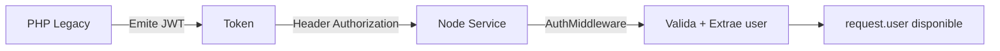
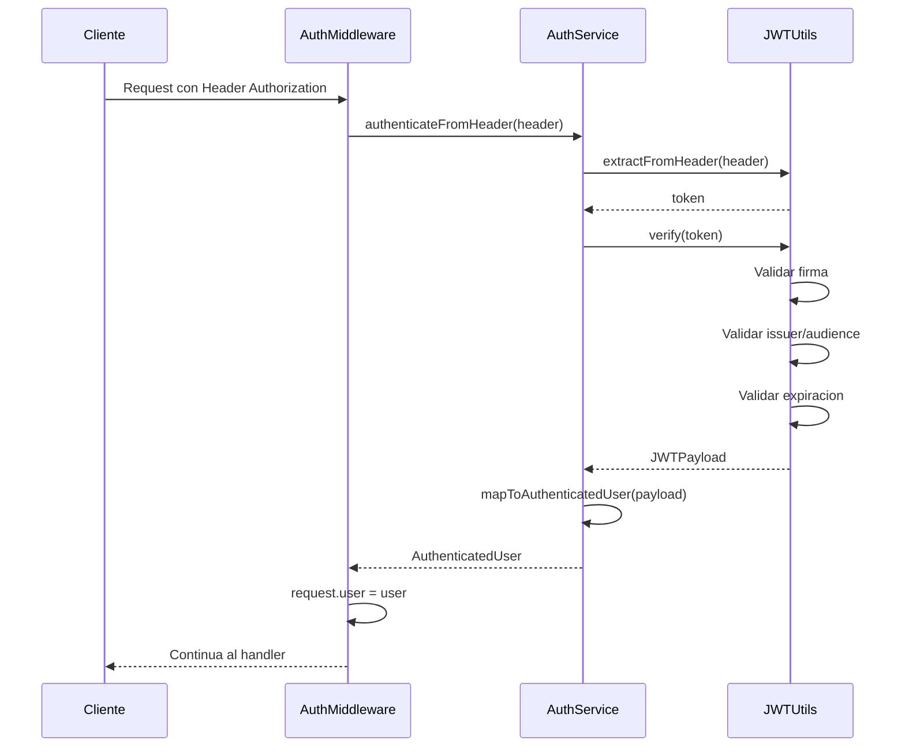

# Modulo Auth

> Documentacion tecnica del modulo de autenticacion JWT

---

## Resumen

El modulo **Auth** gestiona la validacion de tokens JWT emitidos por el sistema PHP Legacy. No emite tokens propios (excepto en desarrollo), solo valida y extrae informacion del usuario autenticado.

---

## Responsabilidad



El modulo Auth actua como **puente de confianza** entre PHP Legacy y Node Service.

---

## Arquitectura del Modulo

```
src/backend/auth/
├── application/
│   └── auth.service.ts           # Orquestador de autenticacion
├── domain/
│   ├── jwt-utils.ts              # Validacion y generacion JWT
│   ├── models.ts                 # JWTPayload, AuthenticatedUser
│   └── user-id.ts                # Value Object para userId
└── presentation/
    └── auth-middleware.ts        # Middleware Fastify
```

---

## Componentes

### AuthService (Application Layer)

Orquesta la autenticacion:

```typescript
class AuthService {
  // Extrae token del header y valida
  authenticateFromHeader(authHeader: string | undefined): AuthenticatedUser;
  
  // Valida token directo
  verifyToken(token: string): AuthenticatedUser;
  
  // Genera token (solo desarrollo/testing)
  generateToken(user: {...}): string;
}
```

### JWTUtils (Domain Layer)

Utilidades de bajo nivel para JWT:

```typescript
class JWTUtils {
  // Verifica firma, issuer, audience, expiracion
  verify(token: string): JWTPayload;
  
  // Genera nuevo token
  generate(payload: {...}): string;
  
  // Extrae token de "Bearer <token>"
  extractFromHeader(authHeader: string): string;
}
```

### AuthMiddleware (Presentation Layer)

Middleware para rutas protegidas:

```typescript
class AuthMiddleware {
  // Requiere autenticacion - lanza error si falla
  authenticate(): PreHandler;
  
  // Autenticacion opcional - no lanza error
  optionalAuthenticate(): PreHandler;
}
```

---

## Modelos

### JWTPayload

Estructura del token JWT:

```typescript
interface JWTPayload {
  userId: number;        // ID del usuario
  username: string;      // Nombre de usuario (RUT o email)
  nombreCompleto?: string;
  rol?: string;          // 'alumno' | 'profesor' | 'admin'
  iat?: number;          // Issued at
  exp?: number;          // Expiration
  iss?: string;          // Issuer
  aud?: string;          // Audience
}
```

### AuthenticatedUser

Usuario autenticado en el request:

```typescript
interface AuthenticatedUser {
  readonly userId: UserId;     // Value Object
  readonly username: string;
  readonly nombreCompleto?: string;
  readonly rol?: string;
}
```

---

## Flujo de Autenticacion



---

## Configuracion

```typescript
// src/shared/config/index.ts
jwt: {
  secret: process.env.JWT_SECRET,
  expiresIn: '2h',
  issuer: 'asistencia.ucn.cl',
  audience: 'asistencia-node',
}
```

### Variables de Entorno

| Variable | Descripcion | Default |
|----------|-------------|---------|
| `JWT_SECRET` | Clave secreta para firmar/verificar | Requerido |
| `JWT_EXPIRES_IN` | Tiempo de expiracion | `2h` |
| `JWT_ISSUER` | Issuer esperado | `asistencia.ucn.cl` |
| `JWT_AUDIENCE` | Audience esperado | `asistencia-node` |

---

## Uso en Otros Modulos

### Proteger Rutas

```typescript
import { AuthMiddleware } from '../../auth/presentation/auth-middleware';
import { AuthService } from '../../auth/application/auth.service';

// Crear middleware
const authMiddleware = new AuthMiddleware(authService);

// Aplicar a rutas
fastify.addHook('preHandler', authMiddleware.authenticate());

// En el handler, acceder al usuario
fastify.get('/ruta', async (request, reply) => {
  const user = request.user; // AuthenticatedUser
  console.log(user.userId.toNumber());
});
```

### Autenticacion WebSocket

```typescript
// El middleware de WebSocket usa el mismo AuthService
const authResult = await wsAuthMiddleware.authenticate(socket);
if (authResult.success) {
  const user = authResult.user;
}
```

---

## Errores

| Error | Causa | HTTP Status |
|-------|-------|-------------|
| `Header Authorization no proporcionado` | Falta header | 401 |
| `Formato de Authorization invalido` | No es "Bearer token" | 401 |
| `Token expirado` | exp < now | 401 |
| `Token invalido` | Firma incorrecta | 401 |
| `JWT payload invalido` | Falta userId o username | 401 |

---

## Notas de Integracion

- **PHP Legacy emite los tokens**: Node solo valida
- **Mismo secret compartido**: Configurado en ambos sistemas
- **UserId es Value Object**: Usar `userId.toNumber()` para obtener el numero
- **No hay endpoints propios**: Auth es un modulo de soporte, no expone rutas

---

## Referencias

- `node-service/src/backend/auth/` - Codigo fuente
- `node-service/src/shared/config/` - Configuracion JWT
- [RFC 7519](https://tools.ietf.org/html/rfc7519) - JSON Web Token specification
