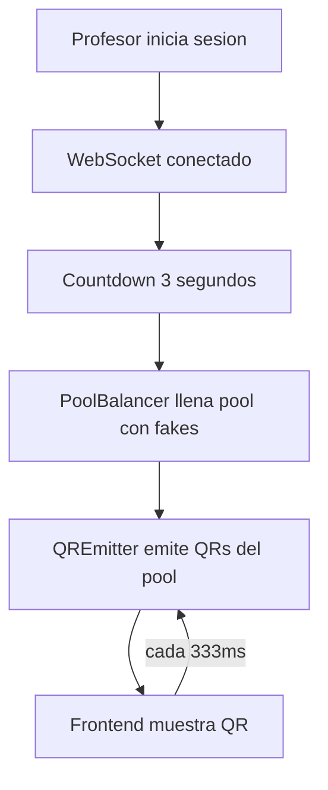
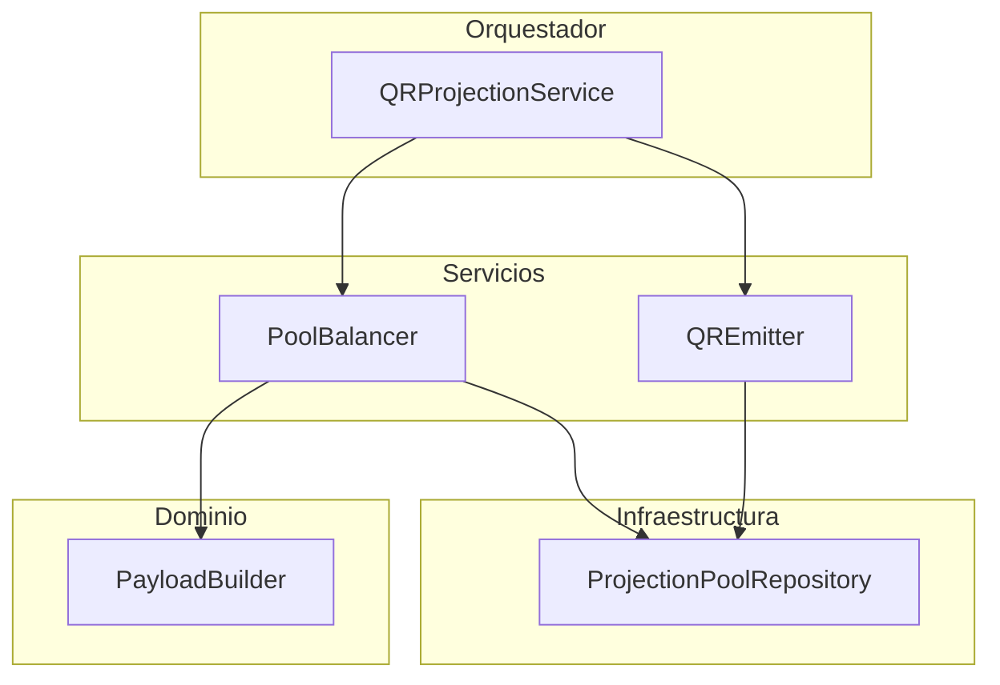
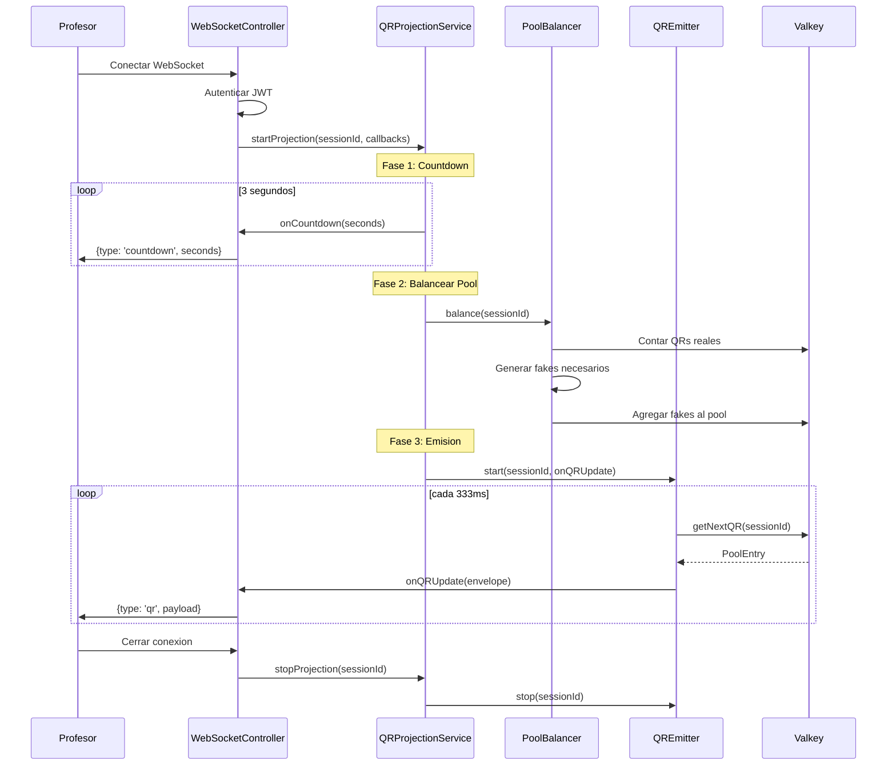

# Modulo QR-Projection

> Documentacion tecnica del modulo de proyeccion de codigos QR dinamicos

---

## Resumen

El modulo **QR-Projection** gestiona la generacion y emision de codigos QR dinamicos para el profesor. Los QRs se proyectan via WebSocket y cambian cada ~333ms, incluyendo QRs falsos (seneuelos) para dificultar fraude.

---

## Responsabilidad



---

## Arquitectura del Modulo

```
src/backend/qr-projection/
├── application/
│   ├── qr-projection.service.ts      # Orquestador principal
│   └── services/
│       ├── pool-balancer.service.ts  # Balancea pool con QRs falsos
│       ├── pool-feeder.service.ts    # Alimenta pool con QRs reales
│       └── qr-emitter.service.ts     # Emite QRs a intervalos
├── domain/
│   ├── models.ts                     # QRPayloadV1, QRPayloadEnvelope
│   ├── session-id.ts                 # Value Object para session ID
│   ├── qr-generator.ts               # Generador legacy
│   └── services/
│       └── payload-builder.service.ts # Construye payloads
├── infrastructure/
│   └── qr-payload.repository.ts      # Almacena payloads en Valkey
└── presentation/
    ├── websocket-controller.ts       # Manejo de WebSocket
    └── types.ts                      # DTOs de mensajes
```

---

## Patron de Servicios



---

## Componentes

### QRProjectionService (Orquestador)

Coordina el ciclo de vida de una proyeccion:

```typescript
class QRProjectionService {
  // Genera nuevo ID de sesion
  generateSessionId(): SessionId;
  
  // Inicia proyeccion completa (countdown + emision)
  async startProjection(
    sessionId: SessionId,
    callbacks: ProjectionCallbacks,
    context?: ProjectionContext
  ): Promise<void>;
  
  // Detiene proyeccion
  stopProjection(sessionId: SessionId): void;
}
```

### PoolBalancer

Mantiene el pool con un tamano minimo usando QRs falsos:

```typescript
class PoolBalancer implements IPoolBalancer {
  // Balancea pool agregando fakes si es necesario
  async balance(sessionId: string): Promise<BalanceResult>;
  
  // Calcula cuantos fakes se necesitan
  calculateFakesNeeded(realCount: number): number;
  
  // Obtiene estadisticas del pool
  async getStats(sessionId: string): Promise<PoolStats>;
}
```

**Estrategia "Pool de tamano fijo":**

```
Pool minimo = 10 QRs

Caso 1: 3 estudiantes registrados
[Real][Real][Real][Fake][Fake][Fake][Fake][Fake][Fake][Fake]
 3 reales + 7 falsos = 10 QRs

Caso 2: 12 estudiantes registrados  
[Real][Real][Real][Real][Real][Real][Real][Real][Real][Real][Real][Real]
 12 reales + 0 falsos = 12 QRs (sin fakes)
```

### QREmitter

Emite QRs del pool a intervalos regulares:

```typescript
class QREmitter {
  // Inicia emision para una sesion
  start(
    sessionId: string,
    onEmit: EmitCallback,
    shouldStop?: ShouldStopCallback
  ): void;
  
  // Detiene emision
  stop(sessionId: string): void;
  
  // Verifica si esta activo
  isActive(sessionId: string): boolean;
}
```

### PayloadBuilder (Dominio Puro)

Construye payloads QR sin dependencias externas:

```typescript
class PayloadBuilder {
  // Construye payload para estudiante
  static buildStudentPayload(input: StudentPayloadInput): QRPayloadV1;
  
  // Construye payload falso
  static buildFakePayload(input: FakePayloadInput): QRPayloadV1;
  
  // Serializa a JSON
  static toJsonString(payload: QRPayloadV1): string;
}
```

---

## Flujo de Proyeccion



---

## Modelos

### QRPayloadV1

Estructura del payload antes de encriptar:

```typescript
interface QRPayloadV1 {
  v: 1;              // Version
  sid: string;       // Session ID
  uid: number;       // Student ID (0 para fakes)
  r: number;         // Round number
  t: number;         // Timestamp (epoch ms)
  n: string;         // Nonce unico
}
```

### QRPayloadEnvelope

Mensaje enviado al frontend:

```typescript
interface QRPayloadEnvelope {
  type: 'qr';
  payload: {
    sessionId: string;
    encrypted: string;  // iv.ciphertext.authTag (Base64)
    expiresAt: number;  // Timestamp de expiracion
    round?: number;     // Round actual (opcional)
  };
}
```

---

## Encriptacion

Los payloads se encriptan con **AES-256-GCM**:

```
encrypted = iv.ciphertext.authTag

Donde:
- iv: 12 bytes (Base64)
- ciphertext: payload cifrado (Base64)
- authTag: 16 bytes de autenticacion (Base64)
```

**QRs Reales:** Encriptados con `session_key` del estudiante
**QRs Falsos:** Encriptados con clave aleatoria (indescifrables)

---

## WebSocket Protocol

### Mensajes del Servidor

```typescript
// Countdown
{ type: 'countdown', payload: { seconds: 3 } }
{ type: 'countdown', payload: { seconds: 2 } }
{ type: 'countdown', payload: { seconds: 1 } }

// QR Update (cada 333ms)
{
  type: 'qr',
  payload: {
    sessionId: 'abc123...',
    encrypted: 'iv.ciphertext.authTag',
    expiresAt: 1701936000000
  }
}
```

### Endpoint WebSocket

| Endpoint | Descripcion | Auth |
|----------|-------------|------|
| `/asistencia/ws` | Conexion WebSocket para proyeccion | JWT (primer mensaje) |

---

## Configuracion

```typescript
// Valores por defecto
{
  countdownSeconds: 3,        // Segundos de countdown
  regenerationInterval: 333,  // ms entre emisiones (~3 QRs/seg)
  payloadTTL: 60,            // TTL en Valkey (segundos)
  minPoolSize: 10,           // Tamano minimo del pool
}
```

### Variables de Entorno

| Variable | Descripcion | Default |
|----------|-------------|---------|
| `QR_COUNTDOWN_SECONDS` | Segundos de countdown | `3` |
| `QR_REGENERATION_INTERVAL` | Intervalo en ms | `333` |
| `QR_PAYLOAD_TTL` | TTL de payloads | `60` |
| `MIN_POOL_SIZE` | Tamano minimo pool | `10` |

---

## Interfaces (Ports)

El modulo define interfaces en `shared/ports/` para inversion de dependencias:

```typescript
// IPoolBalancer
interface IPoolBalancer {
  balance(sessionId: string): Promise<BalanceResult>;
  getStats(sessionId: string): Promise<PoolStats>;
}

// IQRGenerator  
interface IQRGenerator {
  generatePayload(sessionId: string, studentId: number, round: number): Promise<GeneratedQR>;
}

// IQRPayloadRepository
interface IQRPayloadRepository {
  save(sessionId: string, nonce: string, payload: QRPayloadV1): Promise<void>;
  get(nonce: string): Promise<QRPayloadV1 | null>;
}
```

---

## QRs Falsos (Seneuelos)

Caracteristicas:

- Formato identico a QRs reales
- Encriptados con clave aleatoria que se descarta
- Imposibles de descifrar por cualquier cliente
- `uid = 0` (no pertenecen a ningun estudiante)
- Mezclados aleatoriamente en el pool

Proposito:

- Dificultar captura de QRs por foto/video
- Ocultar cuantos estudiantes estan registrados
- Mantener flujo constante de QRs

---

## Referencias

- `node-service/src/backend/qr-projection/` - Codigo fuente
- `shared/ports/` - Interfaces del modulo
- `shared/infrastructure/valkey/` - ProjectionPoolRepository
- `shared/infrastructure/crypto/` - AesGcmService
