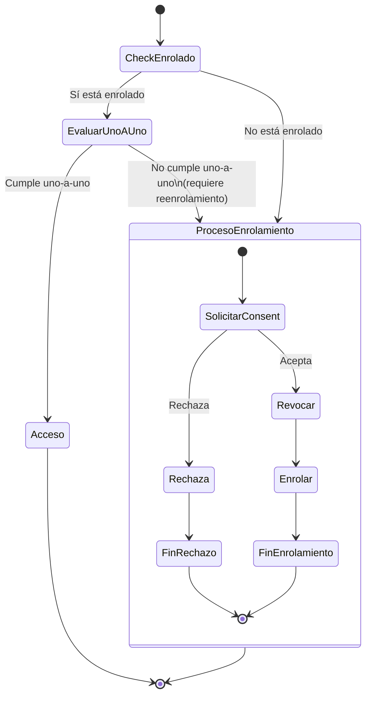

# Sistema de Enrolamiento Biométrico FIDO2

## Precondiciones
- Usuario autenticado en el sistema
- Usuario solicita registrar asistencia mediante botón de inicio
- Módulo de restricciones temporales disponible como servicio externo

---

## Objetivo del Sistema

Garantizar que cada usuario registre asistencia desde **un único dispositivo** mediante enrolamiento biométrico FIDO2, evitando el compartir credenciales entre usuarios y dispositivos.

**Política 1:1:** Un usuario por dispositivo; un dispositivo por usuario.



---

## Arquitectura de Implementación (Fase 17 SoC)

### Componentes

```text
┌─────────────────────────────────────────────────────────────────┐
│                    EnrollmentFlowOrchestrator                   │
│  Coordina el flujo de acceso y enrollment                       │
│  - attemptAccess(userId, fingerprint) → AccessResult            │
│  - processEnrollmentConsent(userId, consent) → ProcessResult    │
└─────────────────────────────────────────────────────────────────┘
                              │
         ┌────────────────────┼────────────────────┐
         ▼                    ▼                    ▼
┌─────────────────┐  ┌─────────────────┐  ┌─────────────────┐
│ DeviceState     │  │ OneToOnePolicy  │  │ Restriction     │
│ Machine         │  │ Service         │  │ Service (stub)  │
│ (transiciones)  │  │ (política 1:1)  │  │ (restricciones) │
└─────────────────┘  └─────────────────┘  └─────────────────┘
         │                    │
         ▼                    ▼
┌─────────────────────────────────────────────────────────────────┐
│                        Use Cases (slim)                         │
│  StartEnrollmentUseCase  │  FinishEnrollmentUseCase            │
│  (WebAuthn options)      │  (verify + HKDF + persist)          │
│                          │                                      │
│  LoginEcdhUseCase                                               │
│  (ECDH + session_key + TOTPu)                                   │
└─────────────────────────────────────────────────────────────────┘
```

### Responsabilidades

| Componente | Responsabilidad |
|------------|-----------------|
| `EnrollmentFlowOrchestrator` | Coordina flujo CheckEnrolado → EvaluarUnoAUno → Acceso/Enrollment |
| `DeviceStateMachine` | Solo transiciones de estado: not_enrolled ↔ pending ↔ enrolled ↔ revoked |
| `SessionStateMachine` | Decide si un estado permite sesión (`isEnabled()`) |
| `OneToOnePolicyService` | Valida y revoca violaciones de política 1:1 |
| `RestrictionService` | (Stub) Integración futura con restricciones PHP |
| `StartEnrollmentUseCase` | Solo: generar WebAuthn options + guardar challenge |
| `FinishEnrollmentUseCase` | Solo: verificar WebAuthn + derivar HKDF + persistir |
| `LoginEcdhUseCase` | Solo: ECDH + session_key + TOTPu |

### Flujo de Datos

```text
1. Usuario intenta acceso
   │
   ▼
2. EnrollmentFlowOrchestrator.attemptAccess()
   ├── DeviceRepository.findByUserId() → CheckEnrolado
   │
   ├── if enrolled:
   │   └── Verificar fingerprint → EvaluarUnoAUno
   │       ├── match: return ACCESS_GRANTED
   │       └── no match: return REQUIRES_REENROLLMENT
   │
   └── if not enrolled: return REQUIRES_ENROLLMENT

3. Si requiere enrollment:
   │
   ▼
4. EnrollmentFlowOrchestrator.processEnrollmentConsent()
   ├── if rejected: return shouldProceed=false
   └── if accepted:
       ├── Identificar devices a revocar
       └── return shouldProceed=true, devicesToRevoke

5. Si consent aceptado:
   │
   ▼
6. OneToOnePolicyService.revokeViolations() → Revocar
   │
   ▼
7. StartEnrollmentUseCase → generar challenge
   │
   ▼
8. [Cliente: WebAuthn registration]
   │
   ▼
9. FinishEnrollmentUseCase → verificar y persistir → FinEnrolamiento
```
