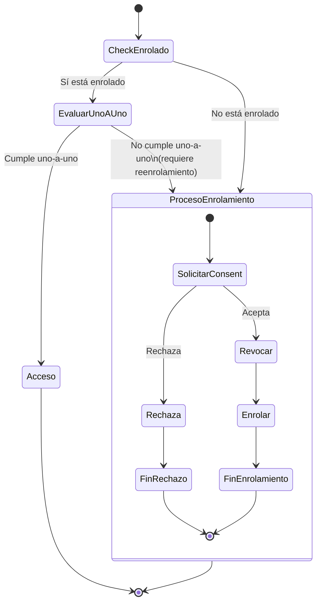

# Sistema de Enrolamiento Biométrico FIDO2

## Precondiciones
- Usuario autenticado en el sistema
- Usuario solicita registrar asistencia mediante botón de inicio
- Módulo de restricciones temporales disponible como servicio externo

---

## Objetivo del Sistema

Garantizar que cada usuario registre asistencia desde **un único dispositivo** mediante enrolamiento biométrico FIDO2, evitando el compartir credenciales entre usuarios y dispositivos.

**Política 1:1:** Un usuario por dispositivo; un dispositivo por usuario.

