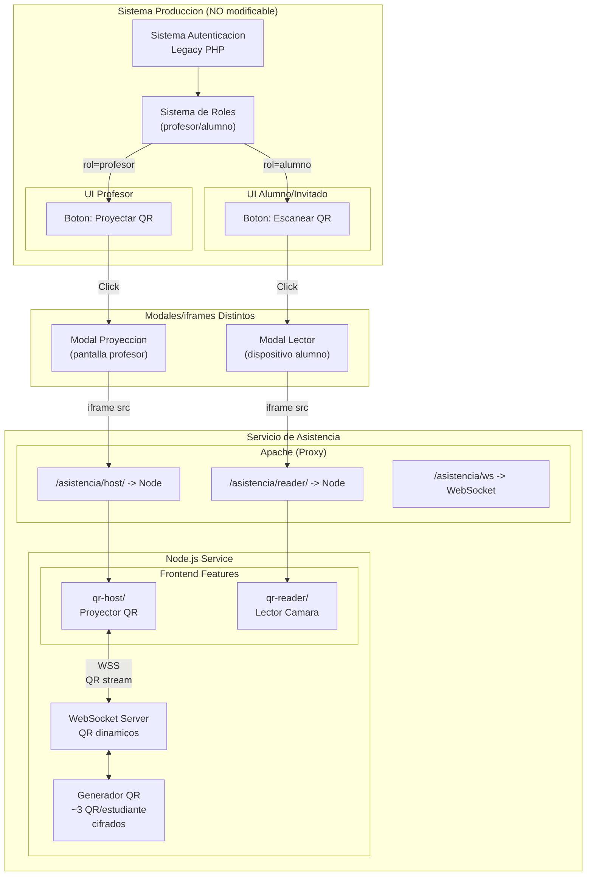
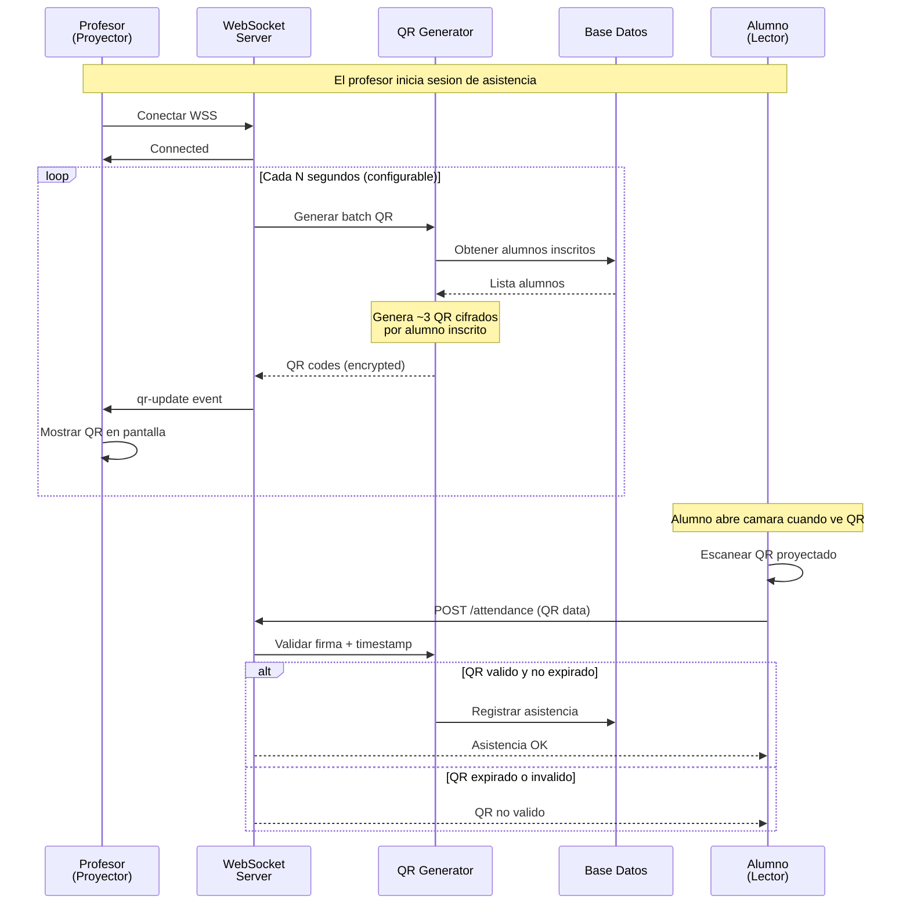
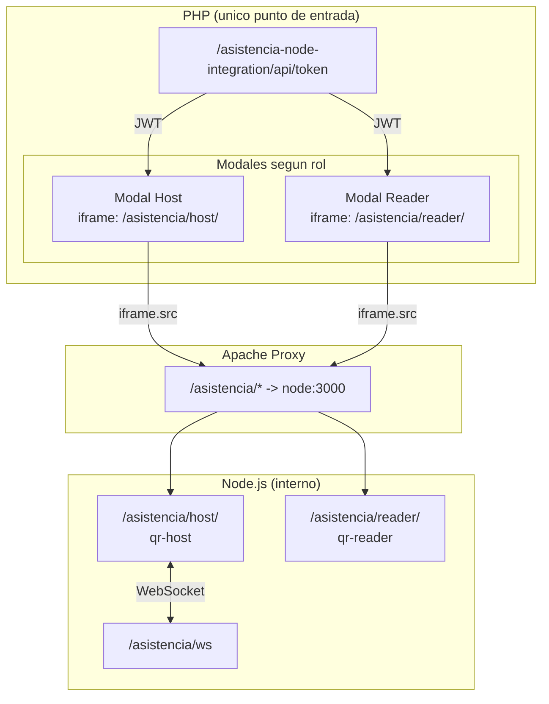
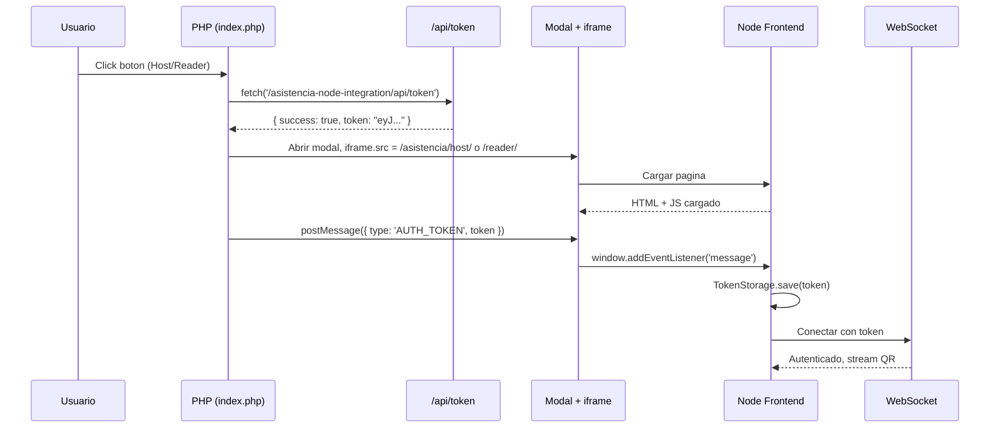

# Flujo de Arquitectura: Sistema de Asistencia

## 1. Arquitectura General - PHP Legacy + Servicio Asistencia



---

## 2. Flujo de Datos - WebSocket para QR Dinamicos



---

## 3. Separacion de Responsabilidades

```mermaid
flowchart LR
    subgraph Legacy["Sistema Legacy PHP<br/>(Produccion - NO tocar)"]
        direction TB
        L1["Autenticacion"]
        L2["Gestion de Roles"]
        L3["UI Principal"]
        L4["Botones por Rol"]
        L5["Abre Modal/iframe"]
    end

    subgraph Servicio["Servicio Asistencia<br/>(Independiente)"]
        direction TB
        S1["Recibe JWT<br/>(validacion redundante)"]
        S2["Proyector QR<br/>/asistencia/host/"]
        S3["Lector QR<br/>/asistencia/reader/"]
        S4["WebSocket<br/>Stream QR"]
        S5["Criptografia<br/>QR firmados"]
        S6["Registro<br/>Asistencia"]
    end

    Legacy -->|"iframe + JWT"| Servicio
```



---

## 4. Punto de Acceso Unificado



---

## 5. Flujo de Autenticacion JWT + postMessage



---

## 6. Resumen de Componentes

| Componente | Responsabilidad | Ruta |
|------------|-----------------|------|
| PHP Legacy | Autenticacion, roles, UI, botones | Sistema existente |
| JWT Endpoint | Genera token para iframes | `/asistencia-node-integration/api/token` |
| Modal Host | iframe para profesor | `/asistencia/host/` |
| Modal Reader | iframe para alumno | `/asistencia/reader/` |
| qr-host | Mostrar QR dinamicos via WebSocket | Proyector |
| qr-reader | Camara + escaneo QR | Lector |
| WebSocket | Stream de QR cifrados | `/asistencia/ws` |

---

## 7. Validacion Redundante de Seguridad

El servicio de asistencia agrega validacion extra sobre el JWT recibido:

```text
Middleware Node.js:
  - Validar firma JWT
  - Verificar expiracion
  - Para /asistencia/ws: verificar rol=profesor
  - Para /asistencia/reader/: cualquier usuario autenticado
```

