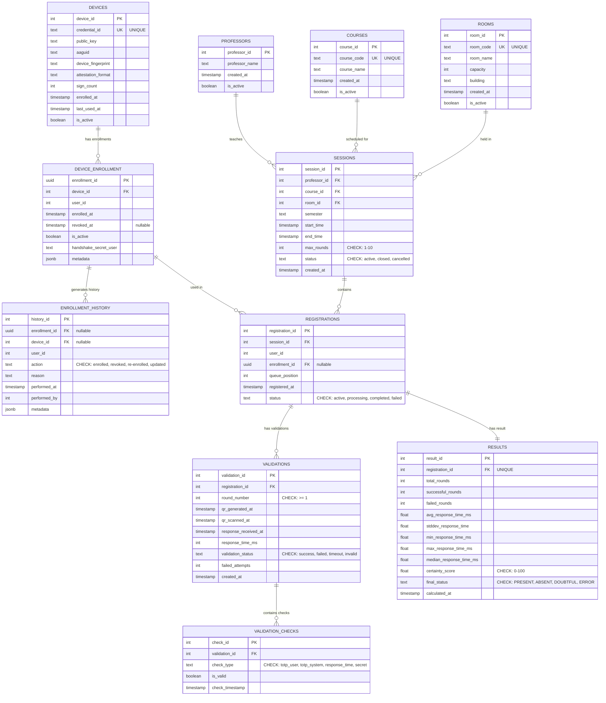

```mermaid
erDiagram
    %% ========================================
    %% ENROLLMENT SCHEMA
    %% ========================================
    
    DEVICES {
        int device_id PK
        text credential_id UK "UNIQUE"
        text public_key
        text aaguid
        text device_fingerprint
        text attestation_format
        int sign_count
        timestamp enrolled_at
        timestamp last_used_at
        boolean is_active
    }
    
    DEVICE_ENROLLMENT {
        uuid enrollment_id PK
        int device_id FK
        int user_id
        timestamp enrolled_at
        timestamp revoked_at "nullable"
        boolean is_active
        text handshake_secret_user
        jsonb metadata
    }
    
    ENROLLMENT_HISTORY {
        int history_id PK
        uuid enrollment_id FK "nullable"
        int device_id FK "nullable"
        int user_id
        text action "CHECK: enrolled, revoked, re-enrolled, updated"
        text reason
        timestamp performed_at
        int performed_by
        jsonb metadata
    }
    
    %% ========================================
    %% ATTENDANCE SCHEMA - MASTER TABLES
    %% ========================================
    
    PROFESSORS {
        int professor_id PK
        text professor_name
        timestamp created_at
        boolean is_active
    }
    
    COURSES {
        int course_id PK
        text course_code UK "UNIQUE"
        text course_name
        timestamp created_at
        boolean is_active
    }
    
    ROOMS {
        int room_id PK
        text room_code UK "UNIQUE"
        text room_name
        int capacity
        text building
        timestamp created_at
        boolean is_active
    }
    
    %% ========================================
    %% ATTENDANCE SCHEMA - SESSIONS
    %% ========================================
    
    SESSIONS {
        int session_id PK
        int professor_id FK
        int course_id FK
        int room_id FK
        text semester
        timestamp start_time
        timestamp end_time
        int max_rounds "CHECK: 1-10"
        text status "CHECK: active, closed, cancelled"
        timestamp created_at
    }
    
    %% ========================================
    %% ATTENDANCE SCHEMA - REGISTRATIONS
    %% ========================================
    
    REGISTRATIONS {
        int registration_id PK
        int session_id FK
        int user_id
        uuid enrollment_id FK "nullable"
        int queue_position
        timestamp registered_at
        text status "CHECK: active, processing, completed, failed"
    }
    
    %% ========================================
    %% ATTENDANCE SCHEMA - VALIDATIONS
    %% ========================================
    
    VALIDATIONS {
        int validation_id PK
        int registration_id FK
        int round_number "CHECK: >= 1"
        timestamp qr_generated_at
        timestamp qr_scanned_at
        timestamp response_received_at
        int response_time_ms
        text validation_status "CHECK: success, failed, timeout, invalid"
        int failed_attempts
        timestamp created_at
    }
    
    VALIDATION_CHECKS {
        int check_id PK
        int validation_id FK
        text check_type "CHECK: totp_user, totp_system, response_time, secret"
        boolean is_valid
        timestamp check_timestamp
    }
    
    %% ========================================
    %% ATTENDANCE SCHEMA - RESULTS
    %% ========================================
    
    RESULTS {
        int result_id PK
        int registration_id FK "UNIQUE"
        int total_rounds
        int successful_rounds
        int failed_rounds
        float avg_response_time_ms
        float stddev_response_time
        float min_response_time_ms
        float max_response_time_ms
        float median_response_time_ms
        float certainty_score "CHECK: 0-100"
        text final_status "CHECK: PRESENT, ABSENT, DOUBTFUL, ERROR"
        timestamp calculated_at
    }
    
    %% ========================================
    %% RELATIONSHIPS
    %% ========================================
    
    %% Enrollment Schema Relations
    DEVICES ||--o{ DEVICE_ENROLLMENT : "has enrollments"
    DEVICE_ENROLLMENT ||--o{ ENROLLMENT_HISTORY : "generates history"
    DEVICE_ENROLLMENT ||--o{ REGISTRATIONS : "used in"
    
    %% Attendance Master Data Relations
    PROFESSORS ||--o{ SESSIONS : "teaches"
    COURSES ||--o{ SESSIONS : "scheduled for"
    ROOMS ||--o{ SESSIONS : "held in"
    
    %% Attendance Operations Relations
    SESSIONS ||--o{ REGISTRATIONS : "contains"
    REGISTRATIONS ||--o{ VALIDATIONS : "has validations"
    REGISTRATIONS ||--|| RESULTS : "has result"
    
    %% Validation Checks Relations
    VALIDATIONS ||--o{ VALIDATION_CHECKS : "contains checks"
```
