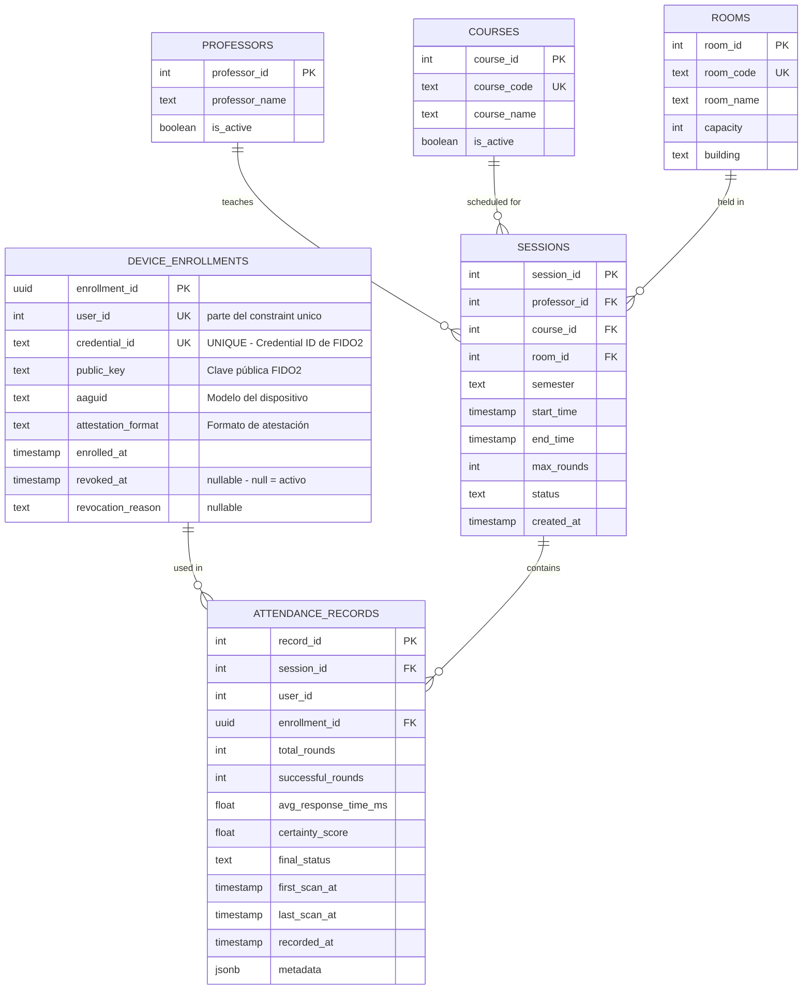

# Sistema de Enrollment FIDO2 con Control de Dispositivos

## Esquema de Base de Datos

### ER Diagram



---

## DDL - Creación de Tablas

### Tabla DEVICE_ENROLLMENTS

```sql
CREATE TABLE DEVICE_ENROLLMENTS (
    enrollment_id UUID PRIMARY KEY DEFAULT gen_random_uuid(),
    user_id INT NOT NULL,
    credential_id TEXT NOT NULL UNIQUE,
    public_key TEXT NOT NULL,
    aaguid TEXT NOT NULL,
    attestation_format TEXT NOT NULL,
    enrolled_at TIMESTAMP DEFAULT CURRENT_TIMESTAMP,
    revoked_at TIMESTAMP DEFAULT NULL,
    revocation_reason TEXT DEFAULT NULL,
    
    -- ===== CONSTRAINT CRÍTICO =====
    -- Solo un enrollment ACTIVO (revoked_at IS NULL) por usuario
    -- Permite múltiples revocados, pero solo 1 activo
    CONSTRAINT one_active_enrollment_per_user 
        UNIQUE NULLS NOT DISTINCT (user_id, (revoked_at IS NULL))
);

-- Índices para optimizar queries frecuentes
CREATE INDEX idx_device_enrollments_user_id 
    ON DEVICE_ENROLLMENTS(user_id) 
    WHERE revoked_at IS NULL;

CREATE INDEX idx_device_enrollments_credential_id 
    ON DEVICE_ENROLLMENTS(credential_id);
```

**Nota sobre el CONSTRAINT:**
- `UNIQUE NULLS NOT DISTINCT` permite que `NULL` se trate como un valor único
- Resultado: Puede haber solo UNA combinación de `(user_id, revoked_at=NULL)` por usuario
- Múltiples enrollments revocados del mismo usuario están permitidos

---

### Tablas de Datos Maestros

```sql
CREATE TABLE PROFESSORS (
    professor_id SERIAL PRIMARY KEY,
    professor_name TEXT NOT NULL,
    is_active BOOLEAN DEFAULT TRUE,
    created_at TIMESTAMP DEFAULT CURRENT_TIMESTAMP
);

CREATE TABLE COURSES (
    course_id SERIAL PRIMARY KEY,
    course_code TEXT NOT NULL UNIQUE,
    course_name TEXT NOT NULL,
    is_active BOOLEAN DEFAULT TRUE,
    created_at TIMESTAMP DEFAULT CURRENT_TIMESTAMP
);

CREATE TABLE ROOMS (
    room_id SERIAL PRIMARY KEY,
    room_code TEXT NOT NULL UNIQUE,
    room_name TEXT NOT NULL,
    capacity INT,
    building TEXT,
    created_at TIMESTAMP DEFAULT CURRENT_TIMESTAMP
);
```

### Tabla SESSIONS

```sql
CREATE TABLE SESSIONS (
    session_id SERIAL PRIMARY KEY,
    professor_id INT NOT NULL REFERENCES PROFESSORS(professor_id),
    course_id INT NOT NULL REFERENCES COURSES(course_id),
    room_id INT NOT NULL REFERENCES ROOMS(room_id),
    semester TEXT NOT NULL,
    start_time TIMESTAMP NOT NULL,
    end_time TIMESTAMP NOT NULL,
    max_rounds INT NOT NULL CHECK (max_rounds >= 1 AND max_rounds <= 10),
    status TEXT NOT NULL CHECK (status IN ('active', 'closed', 'cancelled')),
    created_at TIMESTAMP DEFAULT CURRENT_TIMESTAMP
);

CREATE INDEX idx_sessions_status 
    ON SESSIONS(status) 
    WHERE status = 'active';
```

### Tabla ATTENDANCE_RECORDS

```sql
CREATE TABLE ATTENDANCE_RECORDS (
    record_id SERIAL PRIMARY KEY,
    session_id INT NOT NULL REFERENCES SESSIONS(session_id),
    user_id INT NOT NULL,
    enrollment_id UUID NOT NULL REFERENCES DEVICE_ENROLLMENTS(enrollment_id),
    total_rounds INT NOT NULL,
    successful_rounds INT NOT NULL,
    avg_response_time_ms FLOAT,
    certainty_score FLOAT CHECK (certainty_score BETWEEN 0 AND 100),
    final_status TEXT NOT NULL CHECK (final_status IN ('PRESENT', 'DOUBTFUL')),
    first_scan_at TIMESTAMP NOT NULL,
    last_scan_at TIMESTAMP NOT NULL,
    recorded_at TIMESTAMP DEFAULT CURRENT_TIMESTAMP,
    metadata JSONB,
    
    -- Constraint: Solo un registro por usuario por sesión
    CONSTRAINT unique_user_per_session 
        UNIQUE (session_id, user_id)
);

CREATE INDEX idx_attendance_user_id 
    ON ATTENDANCE_RECORDS(user_id);
    
CREATE INDEX idx_attendance_session_id 
    ON ATTENDANCE_RECORDS(session_id);
    
CREATE INDEX idx_attendance_enrollment_id 
    ON ATTENDANCE_RECORDS(enrollment_id);
```

---

## Consultas SQL

### 1. VERIFICACIÓN DE AUTORIZACIÓN (Más Crítica)

**Uso:** Durante el login/autenticación - Valkey pregunta a PostgreSQL

```sql
-- Query: ¿Este usuario está autorizado con este dispositivo?
SELECT 
    enrollment_id,
    credential_id,
    public_key,
    aaguid,
    attestation_format
FROM DEVICE_ENROLLMENTS
WHERE user_id = $1 
    AND credential_id = $2 
    AND revoked_at IS NULL
LIMIT 1;

-- Resultado:
-- Si devuelve 1 fila: AUTORIZAR autenticación
-- Si devuelve 0 filas: RECHAZAR autenticación
--   (enrollment no existe, es inválido, o está revocado)
```

**Para qué sirve:**
- Valida que el `credential_id` del dispositivo pertenece al usuario
- Bloquea automáticamente credentials revocados (`revoked_at IS NULL`)
- Devuelve la clave pública para validar la firma de FIDO2
- Index en `user_id` hace esta query ultra-rápida

---

### 2. DETECCIÓN: ¿Tiene este usuario ya un enrollment activo?

**Uso:** Antes de permitir un nuevo enrollment

```sql
-- Query: ¿Tiene enrollment activo?
SELECT 
    enrollment_id,
    credential_id,
    aaguid,
    enrolled_at
FROM DEVICE_ENROLLMENTS
WHERE user_id = $1 
    AND revoked_at IS NULL;

-- Resultado:
-- Si devuelve 0 filas: El usuario NO tiene enrollment activo
--   → Puedes proceder con nuevo enrollment
-- Si devuelve 1 fila: El usuario YA tiene un dispositivo registrado
--   → Decidir: Rechazar o revocar el anterior y crear uno nuevo
```

**Para qué sirve:**
- Prevenir que un usuario tenga múltiples enrollments activos
- Detectar intentos de registrar un segundo dispositivo
- El constraint a nivel BD garantiza que esto nunca devuelve > 1 fila

---

### 3. BLOQUEAR ENROLLMENTS REVOCADOS

**Uso:** Después de una revocación

```sql
-- Query: Actualizar enrollment como revocado
UPDATE DEVICE_ENROLLMENTS
SET 
    revoked_at = CURRENT_TIMESTAMP,
    revocation_reason = $2  -- 'Manual revocation by user', 'Admin: Lost device', etc.
WHERE enrollment_id = $1 
    AND revoked_at IS NULL;  -- Solo si está activo

-- Verificar que se revocó correctamente
SELECT revoked_at, revocation_reason
FROM DEVICE_ENROLLMENTS
WHERE enrollment_id = $1;

-- Resultado: Después de esto, cualquier intento de autenticación con ese 
-- credential_id fallará en la Query #1 (VERIFICACIÓN DE AUTORIZACIÓN)
```

**Para qué sirve:**
- Marcar un dispositivo como no válido
- No borrar datos (mantener auditoría)
- Inmediatamente invalida todas las sesiones del usuario en Valkey
- El usuario puede re-enrollarse con un nuevo dispositivo

---

### 4. DETECTAR MÚLTIPLES ENROLLMENTS ACTIVOS (Auditoría)

**Uso:** Auditoría y detección de bugs

```sql
-- Query: ¿Hay usuarios con múltiples enrollments ACTIVOS?
-- (Esto NO debería suceder si el constraint funciona)
SELECT 
    user_id,
    COUNT(*) as active_enrollments,
    STRING_AGG(credential_id, ', ') as credential_ids
FROM DEVICE_ENROLLMENTS
WHERE revoked_at IS NULL
GROUP BY user_id
HAVING COUNT(*) > 1;

-- Resultado:
-- Si devuelve 0 filas: Sistema funcionando correctamente ✓
-- Si devuelve > 0 filas: BUG - Investigar inmediatamente
```

**Para qué sirve:**
- Health check del sistema
- Detectar corrupción de datos o bugs en la lógica
- Si encuentra resultados, hay un problema en la aplicación

---

### 5. HISTORIAL COMPLETO DE ENROLLMENTS DE UN USUARIO

**Uso:** Auditoría, investigación, soporte

```sql
-- Query: Todos los enrollments de un usuario (activos + revocados)
SELECT 
    enrollment_id,
    credential_id,
    aaguid,
    enrolled_at,
    revoked_at,
    revocation_reason,
    CASE 
        WHEN revoked_at IS NULL THEN 'ACTIVE'
        ELSE 'REVOKED'
    END as status,
    CASE 
        WHEN revoked_at IS NULL THEN NULL
        ELSE AGE(revoked_at, enrolled_at)
    END as duration_active
FROM DEVICE_ENROLLMENTS
WHERE user_id = $1
ORDER BY enrolled_at DESC;

-- Resultado: Cronología completa de enrollments del usuario
```

**Para qué sirve:**
- Ver cuándo se enrolló cada dispositivo
- Ver cuándo se revocó cada uno y por qué
- Detectar patrones sospechosos (muchas revocaciones)
- Investigar accesos de un usuario comprometido

---

### 6. REGISTROS DE ASISTENCIA CON DISPOSITIVO USADO

**Uso:** Auditoría de asistencia y análisis

```sql
-- Query: Mostrar asistencia con información del dispositivo
SELECT 
    ar.record_id,
    ar.user_id,
    ar.final_status,
    de.credential_id,
    de.aaguid,
    de.enrolled_at,
    ar.successful_rounds,
    ar.avg_response_time_ms,
    ar.certainty_score,
    ar.recorded_at
FROM ATTENDANCE_RECORDS ar
JOIN DEVICE_ENROLLMENTS de ON ar.enrollment_id = de.enrollment_id
WHERE ar.session_id = $1
ORDER BY ar.recorded_at;

-- Resultado: Quién asistió, con qué dispositivo, y qué calidad de verificación
```

**Para qué sirve:**
- Ver qué dispositivo usó cada alumno en cada sesión
- Detectar si alguien cambió de dispositivo entre sesiones
- Correlacionar asistencia con dispositivos específicos
- Investigar si hay patrones de fraude (mismo dispositivo para múltiples usuarios)

---

### 7. PREPARAR RE-ENROLAMIENTO DESPUÉS DE BORRADO LOCAL

**Uso:** Cuando el usuario borra datos locales del dispositivo

```sql
-- Query 1: Verificar si tiene enrollments previos
SELECT 
    enrollment_id,
    credential_id,
    enrolled_at,
    revoked_at
FROM DEVICE_ENROLLMENTS
WHERE user_id = $1
ORDER BY enrolled_at DESC;

-- Query 2: Permitir nuevo enrollment
-- (El credential_id será diferente porque FIDO2 genera uno nuevo)
INSERT INTO DEVICE_ENROLLMENTS (
    user_id, 
    credential_id, 
    public_key, 
    aaguid, 
    attestation_format
)
VALUES ($1, $2, $3, $4, $5)
ON CONFLICT (credential_id) DO NOTHING;

-- Resultado: Nuevo enrollment creado. 
-- El anterior queda en historial como referencia.
```

**Para qué sirve:**
- Permitir re-enrollment del mismo usuario en el mismo dispositivo
- Mantener auditoría del enrollment anterior
- Garantizar que solo el nuevo credential_id es activo

---

### 8. LIMPIAR ENROLLMENTS REVOCADOS MUY ANTIGUOS (Mantenimiento)

**Uso:** Limpieza de datos históricos (opcional)

```sql
-- Query: Listar enrollments revocados hace más de 1 año
SELECT 
    enrollment_id,
    user_id,
    credential_id,
    revoked_at,
    AGE(CURRENT_TIMESTAMP, revoked_at) as time_since_revocation
FROM DEVICE_ENROLLMENTS
WHERE revoked_at IS NOT NULL
    AND revoked_at < CURRENT_TIMESTAMP - INTERVAL '1 year'
ORDER BY revoked_at;

-- Query: Eliminar (si aplica política de retención)
DELETE FROM DEVICE_ENROLLMENTS
WHERE revoked_at IS NOT NULL
    AND revoked_at < CURRENT_TIMESTAMP - INTERVAL '2 years';

-- Resultado: Mantener BD limpia sin perder auditoría reciente
```

**Para qué sirve:**
- Mantener la BD manejable
- Cumplir con políticas de retención de datos
- Archivos automáticos si es necesario

---

## Integración con Valkey (Redis)

### Patrón de Caché

```
Durante autenticación:
1. Valkey pregunta: ¿Existe enrollment_id para user_id + credential_id?
   - Clave: enrollment:{user_id}:{credential_id}
   - TTL: 1 hora
   
2. Si NO está en caché:
   - Query #1 a PostgreSQL (VERIFICACIÓN DE AUTORIZACIÓN)
   - Si existe: Guardar en Valkey con TTL
   - Si no existe: Rechazar inmediatamente
   
3. Si SÍ está en caché:
   - Usar valor cacheado
   - Validar firma FIDO2

4. Al revocar:
   - Eliminar del caché: DEL enrollment:{user_id}:{credential_id}
   - Invalidar sesión del usuario en Valkey
```

---

## Resumen de Casos de Uso

| Caso de Uso | Query Usada | Propósito |
|------------|-------------|----------|
| Login normal | #1 | Autorizar o rechazar autenticación |
| Nuevo enrollment | #2 | Detectar si ya tiene dispositivo |
| Revocar dispositivo | #3 | Marcar como inactivo |
| Auditoría - Bugs | #4 | Validar integridad de datos |
| Investigar usuario | #5 | Ver historial de enrollments |
| Analizar asistencia | #6 | Correlacionar dispositivos con asistencia |
| Re-enrolamiento | #7 | Permitir nuevo registro tras borrado local |
| Limpieza | #8 | Mantener BD limpia |

---

## Validaciones Garantizadas

✓ **Un solo enrollment ACTIVO por usuario** (Constraint a nivel BD)
✓ **No se pueden usar credentials revocados** (WHERE revoked_at IS NULL)
✓ **Histórico completo de cambios** (revoked_at + revocation_reason)
✓ **No hay pérdida de auditoría** (Datos nunca se borran, solo se marcan revocados)
✓ **Re-enrolamiento permitido** (Nuevo credential_id genera nuevo registro)
